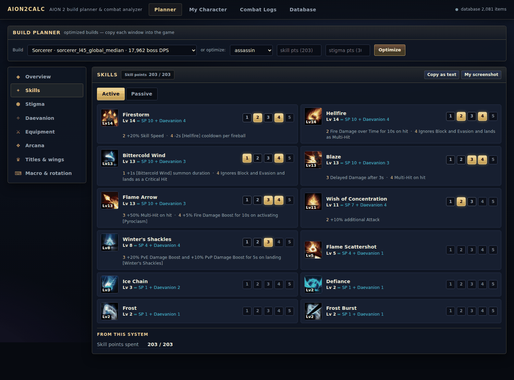
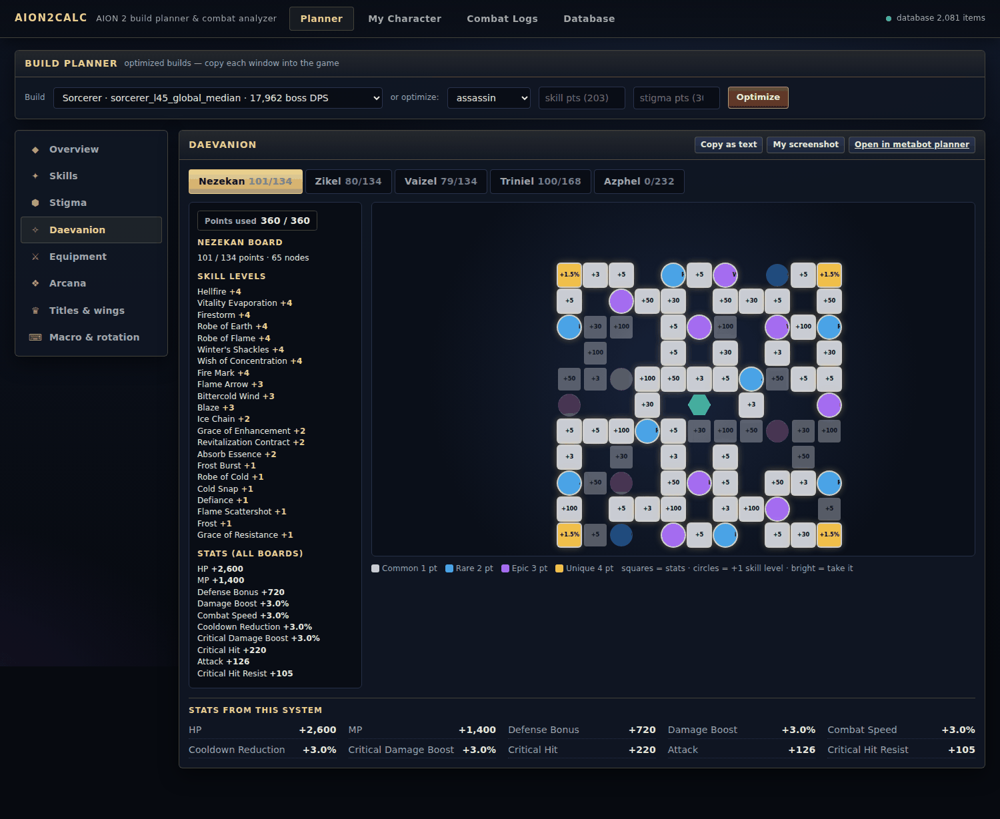
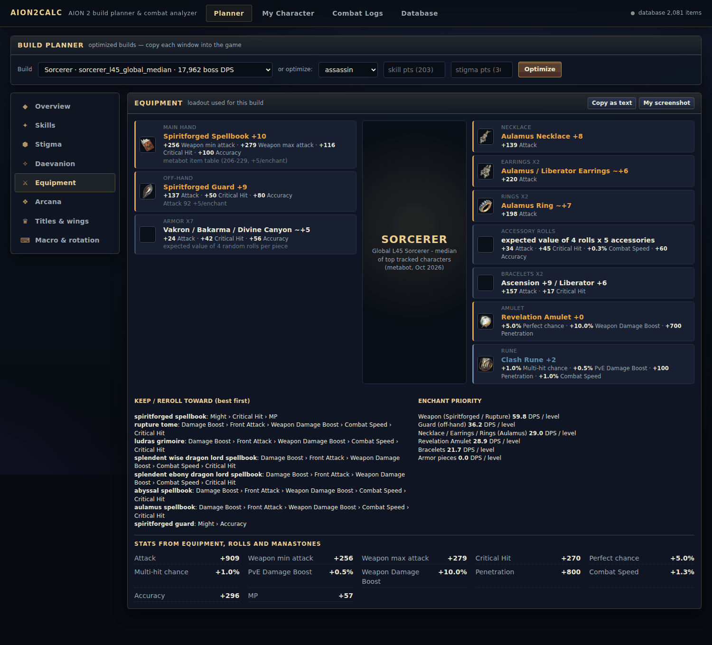
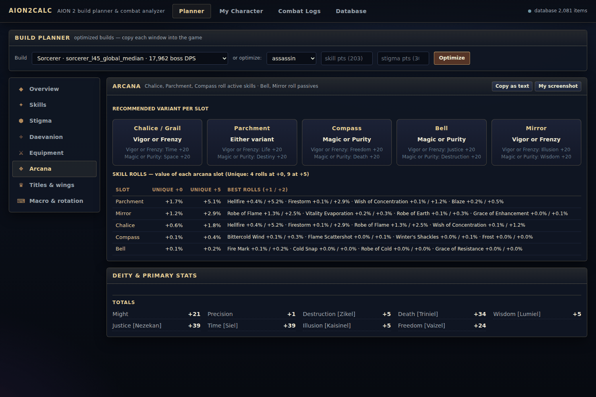
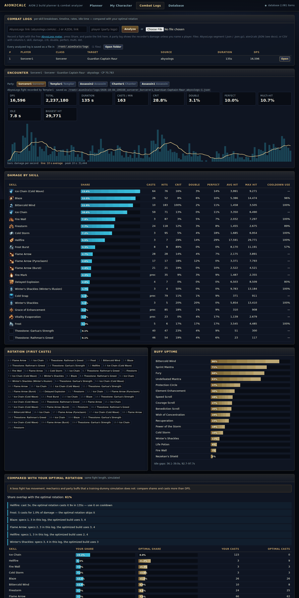
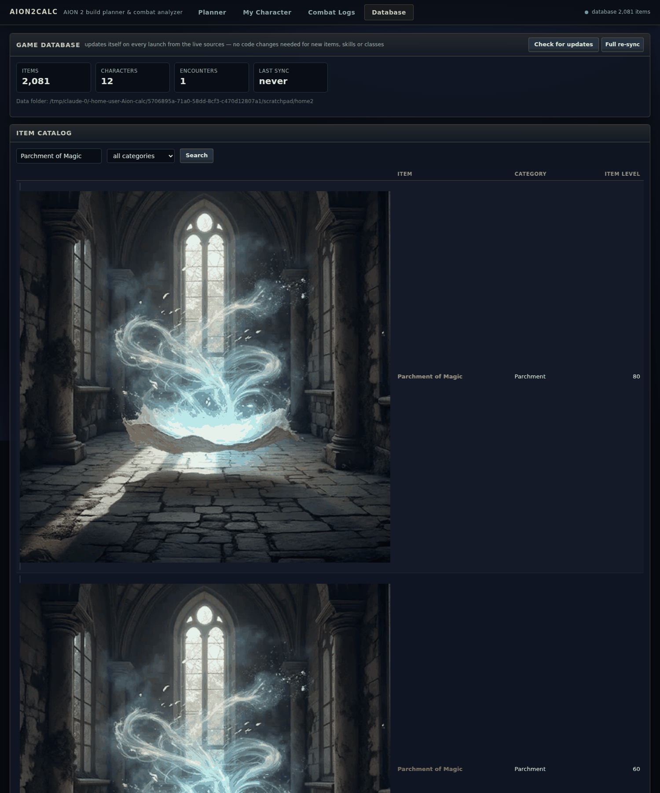

# Aion 2 Calc app guide

A task-oriented guide to the desktop app and shared review controls. Detailed comparison/privacy rules are in the [user guide](user-guide.md); formulas and assumptions are in [Methodology](methodology.md). Version history belongs in [Releases](https://github.com/sam-t-anderson/Aion-2-tools/releases).

## Contents

- [Start here](#start-here)
- [My Character](#my-character)
- [Point budgets](#point-budgets)
- [Planner and hotbar](#planner-and-hotbar)
- [Gear & Advice](#gear--advice)
- [Saved Results](#saved-results)
- [Experimental PvP optimization](#experimental-pvp-optimization)
- [Survivability and HP reserves](#survivability-and-hp-reserves)
- [Live capture](#live-capture)
- [Overlay](#overlay)
- [Automatic metadata and idle DPS](#automatic-metadata-and-idle-dps)
- [Long recordings and archive parts](#long-recordings-and-archive-parts)
- [Combat-log review](#combat-log-review)
- [Importing external logs](#importing-external-logs)
- [Pet and spirit grouping](#pet-and-spirit-grouping)
- [Sharing logs and recovering upload queues](#sharing-logs-and-recovering-upload-queues)
- [Community comparisons](#community-comparisons)
- [Editing shared raid plans](#editing-shared-raid-plans)
- [Settings](#settings)
- [Application updates](#application-updates)
- [Database and data sync](#database-and-data-sync)
- [Where your data is saved](#where-your-data-is-saved)
- [Troubleshooting and diagnostic exports](#troubleshooting-and-diagnostic-exports)
- [External services and privacy](#external-services-and-privacy)
- [Screenshots](#screenshots)
- [Log format reference](#log-format-reference)
- [Local API reference](#local-api-reference)

## Start here

Install a desktop build using the [installation guide](install.md). Start with **My Character** to import and optimize a character, **Planner** for an example class build, or **Live Meter** to record combat. Open **Saved Results** for previous optimizations and advice.

Combat Logs has separate Saved Parts, My Uploads and Community Combat Logs lists. Open a log for a focused detail page and use Back to return. Settings controls the theme, data folders, community server and game-data sync.

## My Character

1. Search a character name (global regions: North America, Europe, Asia, Latin America).
2. **Import** reads the official character page: profile stats, every equipped
   item with its rolls, manastones, theostones and skill rolls, arcana, titles,
   wings, pet, skill levels, slotted stigmas and every open Daevanion node.
3. The build is scored as it is. The official profile does not show
   specializations, so the score uses the best legal specs for your levels.
4. **Optimize PvE build** keeps your gear and uses your entered point budgets
   (Skill, Stigma and PvE Daevanion). It finds the best
   allocation and rotation, then shows the DPS gain and what to change.

What the profile does not show, and how it is handled:

| Missing | Handling |
|---|---|
| specializations | assumed best for your levels |
| bonus from owned (unequipped) titles | estimated (+4 Attack, +20 Crit, +30 Accuracy) |
| stats of uncommon wings | counted only for wings in a small table (Ultimate Daeva Wings) |

**Imported before** lists the newest eight imports. Click one to fetch its current official profile again. This refresh is separate from reopening a saved optimization snapshot.

## Point budgets

The build windows show points spent / optimization budget. Gear and Daevanion bonus skill levels do not consume purchased skill points. PvP Daevanion uses its own resource.

For **My Character**, the official profile gives allocated levels/nodes; unused points may be absent. Enter your in-game **spent + unspent** totals before optimizing. Imported budgets are observed lower bounds. Totals below points already spent are rejected. The optimizer preserves gear and uses the entered skill, stigma and PvE Daevanion budgets.

The Planner lets you set all three budgets. Bundled example budgets are 203 skill, 30 stigma and 360 PvE Daevanion; these are simulation presets, not a maximum or a guarantee about quest rewards.

## Planner and hotbar

Every optimized build is shown as a set of windows laid out like the in-game
screens, so you can copy each one into the game:

| Window | Shows |
|---|---|
| Overview | DPS, crit chance, cooldown reduction, combat speed, stat priority, damage share |
| Skills | Active and Passive tabs. Each skill shows its icon with a level badge, the level split (skill points + Daevanion + gear), and five numbered specialty rows with effect descriptions. Recommended effects are highlighted |
| Stigma | the four slots with level and which specializations are unlocked |
| Daevanion | one tab per board with the node grid (taken nodes lit), and the game's left-side summary: points used, skill levels gained, stats gained. There is also a link to the metabot planner |
| Equipment | a paper-doll layout of the loadout, the rolls to keep or reroll toward, and enchant priority |
| Arcana | the recommended variant per slot, and the value of each slot's skill rolls (Unique +0 and +5) |
| Titles & wings | equipped titles, wings, pet, and the best titles for the build |
| Skills hotbar | suggested key bindings, manual skills and macro placement |
| Macro & rotation | the in-game Skill Macro steps and the priority list |

Below each window there is a **Stats from this system** summary. **Copy as
text** puts the window's choices on the clipboard. **My screenshot** lets you
pin a screenshot of the same in-game window next to it, so you can compare them
side by side. The screenshot is kept only in your browser.

The **Optimize** button runs a new optimization for any class. Skill, Stigma and Daevanion budgets are configurable. Presets are examples, not character progression maxima.

Set up **Skills hotbar** first, then copy the numbered **Macro & rotation** steps. The macro binding suggestion is **Right-click**. Skills that require charging stay on manual keys; the app does not change game bindings.

## Gear & Advice

Pick an imported character to see its inventory: the equipped items come from the official page,
and you add the rest from the catalog, with enchant level and skill options. You also enter its
Genus Insight lines and the titles you own here. **Run advice** then plans gear (best set from
the inventory, goal gear, upgrade path), arcana, titles, pantheon, genus insight and your fights,
ranked by simulated DPS gain. The results are shown as game-style windows with the game's icons:
an equipment paper doll, the upgrade path as item cards, arcana cards, title plates, the
pantheon deities and the genus insight grids. The
model is calibrated from the character's fights when there are enough. Details:
[planner.md](planner.md).

## Saved Results

Completed character/class optimizations and advice save automatically under the app data folder's `history` directory. Open **Saved Results**, select Open to review a previous run, or Export/Import its result JSON. Import restores a snapshot; it does not run an optimization or change your equipped gear. The latest existing old build/advice files are recovered when available. Keep exported copies to move runs between installations. Advice reflects the saved run, not future game or gear changes.

Edited point totals persist per character on this installation. Enter spent + unspent resources. Anonymous totals are sent after character optimization and accumulate as highest observed resources on the community service, grouped by class/region/patch/source. Unknown patch observations stay separate, and observed totals are not verified game caps.

Recovered build titles use saved character identity and PvE/PvP mode when available. A generic class title means the older snapshot lacks character identity. Recovery entries and explicitly saved runs remain separate historical records.

## Experimental PvP optimization

My Character provides separate PvE and PvP damage actions. PvP uses the generic class kit against a stationary neutral player proxy, excludes PvE/boss stat buckets and learned PvE skill/proc/critical calibration, and assesses sustained (180 seconds) and burst (30 seconds) damage. Saved results retain this model description. It does not optimize dedicated PvP progression, defensive skill use, crowd control, movement or opponent-specific defenses, and its skill coefficients are not validated PvP coefficients. PvP output is excluded from PvE community preset submission.

The optional HP reserve below also applies to PvP. It models your manual pressure assumptions, not verified opponent builds or win probability.

## Survivability and HP reserves

My Character → **Survivability** preserves the character's imported flat **HPMax** contribution from the four optimized crystal boards by default. The existing DPS objective stays primary inside the set of allocations meeting this floor. Skill, stigma and Daevanion budgets and board connectivity remain enforced. A stricter minimum can trade some modeled DPS for more crystal HP. Disable preservation and leave the minimum/scenarios empty to use the previous damage-only objective. This is an HP-node constraint, not a full survival simulator.

Optional scenarios describe one hit followed by sustained pressure. Enter current in-game maximum HP and up to eight encounter/opponent assumptions: **hit damage after mitigation + max(0, incoming DPS − assumed sustained HPS) × seconds + positive HP reserve**. The largest requirement sets the floor. HPS never absorbs the initial hit. Estimated total HP is entered current HP plus the flat node-HP change; percentage modifiers and passive/gear changes are not modeled. Headroom is a scenario proxy, not verified effective HP, guaranteed survival or win probability. Confirm final HP in game.

Settings persist per selected character in this browser. Saved Results/build JSON/Markdown retain assumptions and the assessment. Infeasible requests report an error without publishing a lower-HP fallback. Solver limits can prevent finding an allocation even when one exists. Damage-only stat priorities, baseline comparisons and Gear & Advice do not validate survival; constrained builds are not submitted as community damage presets.

PvP supports a manual multi-opponent **incoming-pressure** envelope, not optimized opponent-build combat. Next modeling work: resolve official current/historical opponent gear with provenance; evaluate outgoing damage and adverse matchups; include verified defensive skill, CC, mobility and coefficient rules before scoring them. Those metrics are explicitly unavailable here. Mitigation and tactical coefficients are not inferred from these manual scenarios.

## Live capture

The **Live Meter** tab includes the migrated A2Tools packet engine. Choose
**Live Capture** (the default), then press the yellow **Start** button. While capture runs it becomes the red **Stop** button; click it to stop. Its built-in encoder,
automatic interface and game-host selection, and port `50349` are filled in
for the standard connection. Set a specific interface or game-host address
only when automatic selection cannot see the game traffic; the **Interfaces**
button lists the identifiers Npcap exposes on this computer. Choose the target
mode and optionally name your character to improve local-player detection.

The Windows desktop build includes Scapy. Windows setup offers an optional
**Download and install Npcap for Live Capture** choice, and Live Meter asks
again when you press Start if Npcap is still missing. After you confirm, it
finds the current installer on [npcap.com](https://npcap.com/), downloads it
to the app's `drivers` folder, and opens its normal installer. This keeps
Npcap separate from aion2calc, as required by its license. Select
WinPcap-compatible mode in the installer and grant capture permission.

Npcap is Windows-only. macOS uses its built-in packet-capture framework.
Linux needs the distribution's `libpcap` package plus permission to capture
packets; Live Meter reports that prerequisite when the operating system denies
capture access.
The meter keeps decoded combat events, not raw packet captures. **Save to
Combat Logs** sends the active fight into the existing analyzer; **Export
a2log** writes an open JSON file to the app's logs folder; **Upload** sends it
to the log server set in Settings; and **Screenshot** saves a desktop image to
the app's screenshots folder. The GitHub Pages site is a viewer, so uploads go
through the configured log-server API that backs it.

Use **Split now** for a manual encounter boundary or configure automatic splits. **Finish run** closes the current run while preserving earlier encounters. These boundaries do not establish a boss kill or verified PvP match result. Export and upload buttons show progress and completion/error feedback. Exporting during capture snapshots the retained data; it does not stop capture.

## Overlay

**Live Meter → Open overlay** opens one compact overlay that shows the live meter and plays your most
recent raid plan. On the installed Windows app it is frameless, transparent, always on top, and follows
the Aion 2 game window when it starts or moves. It closes with the desktop app. Where a native overlay
is not available it opens as a normal small window instead. From source, `python -m aion2calc.overlay`
does the same (`pip install pywebview` for the transparent window).

Use **Hide overlay** to hide it and **Open overlay** to show it again. Drag its non-interactive background to reposition it; use the opacity slider directly to change opacity. Repeated Open requests reuse the existing overlay.

## Automatic metadata and idle DPS

Live Meter reads installed build evidence from Steam library manifests, including alternate library drives, and recognized Windows/PURPLE game registrations. Installation paths are not exported. Recorded home server IDs are matched against official regional catalogs; opponents without their own server ID are not assigned your server.

Recognized map/instance IDs supply supported zone and content metadata. Difficulty is filled only when the recorded PvE instance has an explicit catalog value. Optional overrides have their source recorded. Unknown patch, difficulty and match outcomes remain unknown. Installed build IDs and executable versions do not establish the published regional patch or the patch used by a historical log. Multiple-install selection and verified difficulty-signature inference remain planned work.

Live DPS pauses after two seconds without damage while capture continues, and resumes when damage returns. Healing does not extend the live damage interval. Saved reports use the full retained event interval, so their rates can differ. This does not establish a kill.

## Long recordings and archive parts

Long captures save numbered archive parts before retained-history limits are reached. Each part shares an archive ID and appears in **Combat Logs → Saved Parts**. Capture continues with its decoder and identity context; Live Meter export/upload covers the current part. Open earlier parts separately to review or upload them.

There is no fixed total part count or automatic deletion; disk space is the practical limit. A part boundary is not a kill or completed instance. Boundary parts are conservatively unranked and are not automatically stitched together. Failed rollover saves stop capture visibly and retain memory. Recovery checkpoints are saved every 15 seconds; abrupt termination can lose newer unsaved data. See [retention limits](methodology.md#archive-boundaries-and-retention).

## Combat-log review

Combat Logs separates **Saved Parts**, **My Uploads** and **Community Combat Logs** on desktop and Pages. Desktop remembers the selected list tab while opening a focused log and returning; Pages preserves it while opening a local preview. Tabs hide their panels without resetting upload queues. Website Saved Parts means files selected from your computer, not direct access to the desktop archive directory. Arrow keys, Home and End navigate tabs.

- Open saved, analyzed and shared logs in a focused detail view with **Back to combat logs**. History, upload queues and server settings stay on the list screen. Pages local previews use a temporary focused browser view; refresh requires reopening the file.
- Reconstructed rate graphs offer live-style bars with a trailing 10-second average, player series and time inspection. Timeline adds a seconds ruler, sticky player labels, skill icons, zoom windows and navigation; hover, focus or click shows effect details. Markers represent observed effects, not inferred cast durations. Crowded markers are labeled and remain available in Events.

Skill images use the desktop icon cache or metabot.gg on the website; unavailable images retain labeled tiles. Local previews and queue state are temporary; saved files and server reports remain available.

Choose **Table**, **Timeline** or **Events** for the detailed metrics. Graph and timeline visibility controls are separate. Damage Done, Damage Taken, Healing and Death recaps describe recorded effects; unavailable telemetry is not shown as zero.

## Importing external logs

Import a log in any of these ways:

| Source | How |
|---|---|
| AbyssLogs | record the fight with the free [AbyssLogs meter](https://abysslogs.com), press **Share** in the meter, and paste the `https://abysslogs.com/e/<id>` link. Any public or unlisted fight works, yours or someone else's |
| AbyssLogs file | a segment file saved from abysslogs.com (`.json` or `.json.gz`) |
| A2DIL | a record link (Korean training-dummy logs) |
| your own tool | a JSON or CSV file in the formats below |

For AbyssLogs:

* A link to a whole dungeon run picks its biggest boss pull. A link with `?seg=` (a link to one
  pull) uses that pull.
* A party log shows the damage of whoever recorded it. Type a name in **player**, or click a party
  member above the results, to see someone else's.
* AbyssLogs records hit-by-hit timelines for boss pulls only, so trash pulls cannot be analyzed.
* Chain follow-ups are listed under their skill, for example *Ice Chain (Cold Wave)* and
  *Flame Arrow (Burst)*.
* The log includes each skill's specializations. The comparison lists the ones that differ from
  the optimized build. The official character page does not show specializations.

The analyzer shows:

* DPS, total damage, duration, casts per minute, and crit / double / perfect /
  multi-hit rates
* a per-second DPS timeline with a 10-second average
* damage by skill: share, casts, hits, rates, average and biggest hit, and how
  well each skill's cooldown was used
* the opening rotation, buff uptimes and idle gaps
* **Compared with your optimal rotation**: the same fight length simulated with
  the optimized build. It shows share and casts per skill, specializations
  that differ, and concrete tips such as "cast 21x, the optimal rotation casts
  it 27x"
* **Compared with top players**: the class's top-10 A2DIL dummy logs

Every imported log is stored in the encounter history and saved as a file in
the `logs` folder (see [Where your data is saved](#where-your-data-is-saved)),
for example
`2026-10-04_190338_sorcerer_Name_Guardian-Captain-Raur_abysslogs-12.json`.
The file uses the canonical JSON format below, so it can be kept, shared or
analyzed again (drop it back on the Combat Logs page). **Open folder** on the
Combat Logs page opens the folder.

Compare shares and casts more than DPS when:

* the log is Korean (A2DIL): those players have higher-level gear than the global simulation;
* the log is a boss fight: movement, mechanics and party buffs are not in a training-dummy
  simulation.

## Pet and spirit grouping

In desktop/website combat review, **Combine pets with owner** is checked by default above the graph. Uncheck it for separate pet rows/lanes. **Pets** controls pet effect visibility in the graph/timeline; it does not remove pet damage from the recorded table totals. Encounter insights retain separate source labels. Pet deaths are not counted as owner deaths.

Live Meter and the overlay both have **Combine pets with owner**, enabled by default and synchronized for the active capture. The overlay includes recorded linked-pet damage in the owner row. Uncheck either control to inspect separate live pet rows. Grouping requires a recorded ownership link; unknown spirits are not assigned by name, proximity or class. Saved logs keep separate pet source IDs so grouping does not destroy detail.

## Sharing logs and recovering upload queues

Upload a retained fight or saved part to the server selected in Settings. Choose **Public**, **Unlisted** or **Private** deliberately; uploads default to Unlisted. The GitHub Pages site reviews logs through that server API rather than storing uploads itself. Official desktop builds provide the community upload configuration for the default server; custom servers may require a key.

**My Uploads** uses separate ownership credentials to change visibility, rotate private links or delete uploads. Export a private credential backup before moving devices. A shared upload key or character name does not recover ownership. See [privacy and ownership](user-guide.md#my-uploads-and-privacy).

**Saved Parts** supports a sequential upload queue. Select local files, choose visibility and upload; each file becomes an independent report. Results show progress, report links and errors. **Restore saved queue** or an exported recovery file resumes local queue metadata; Pages requires you to reselect the original files. Check My Uploads before explicitly retrying an uncertain request, because the server may have accepted it already. File fingerprints verify content; recovery files do not grant ownership. See [saved-part uploads](user-guide.md#review-and-upload-saved-parts) and [queue recovery](user-guide.md#resume-uploads).

## Community comparisons

Use Combat Logs to browse public submissions by type, boss, patch, difficulty and region. Class distributions stay in separate encounter buckets and show parse counts. Search personal records using server ID plus name, or database character ID. World ranks cover this community's public submissions only. Missing classification prevents ranking; open a local saved session to add verified metadata.

Add multiple comparison logs and select matching encounters and players explicitly. Differences are recorded DPS, not gear-adjusted scores.

Completed-run speed and Boss progression require supported evidence. Boss progression excludes players, linked pets, dummies and known non-bosses; the catalog does not yet distinguish every miniboss from a major or world boss. See the [user guide](user-guide.md#run-timing-and-boss-progression) for eligibility and missing-data limits.

## Editing shared raid plans

Publish stores a unique owner credential locally. Update published plan keeps the shared link; Publish new copy creates a separate publication. Export a Private ownership backup and keep it private. Import file restores that backup on another device. Refresh published plan obtains the current revision and replaces local edits, so export those first. Old publications without a saved ownership/delete credential need a new publication; author names do not grant editing access.

## Settings

| Setting | What it does |
|---|---|
| Theme | **Follow computer** (light or dark with your system), **Light** (parchment and gold) or **Dark** (night sky and gold). The ◐ button in the top bar switches between them too. The choice is kept in this browser |
| Open as its own window | choose a desktop window or your browser; close the app with Quit |
| Your data | the data folder, with buttons to open it, the combat logs and the results |
| Log server | where **Share link** uploads fights, an optional upload key, and the default visibility. **Save** checks the server answers |
| Game database | item count, last update, and **Check now** |
| Version | the app version, and a link when a newer release is out |
| Stop the app | the same as **Quit** in the top bar |

## Application updates

**Install update** stages the new installer first. When you choose it, the app
closes its local server, then a detached helper waits for the desktop process
to exit before opening the installer. This prevents a running `aion2calc.exe`
from locking the files the installer needs to replace.

See [installation and updates](install.md) for platform-specific steps and troubleshooting. On Windows, helper logs are in the data folder's `updates` directory.

## Database and data sync

The page shows sync progress, the last sync, item, character and encounter
counts, and an item catalog with search. Each item lists its fixed stats,
enchant table, random roll pool and per-class skill-roll pools.

When the app starts, a background sync checks for new and changed data. The sync can refresh supported data without reinstalling the app; new mechanics or source-layout changes can still require code updates:

* **Discovery.** metabot's sitemaps list every class, skill, item, title and
  wing page with a last-modified date. The sync fetches a page again only when
  that date moves. The equipment universe is whatever metabot's category
  pages list (weapons, armor, accessories, arcana, theostones). Classes are
  discovered from the sitemap as well.
* **Where updates go.** Class data, titles, arcana pools and median loadouts
  are written to the `data` subfolder of the data folder (see
  [Where your data is saved](#where-your-data-is-saved)). Every reader prefers
  that copy over the bundled one. Items go into `aion2.db` in the same folder.
* **Seed.** A fresh install starts from the bundled seed catalog
  (`aion2calc/data/seed/items.json.gz`), so only the changes are fetched.
* **Limits.** The sync is time-boxed (15 minutes per launch) and resumable. A
  page whose layout changed is skipped, and the old data is kept.
* **New skills.** A skill that appears in a patch is simulated from its tooltip
  by the generic kit, even for classes with a hand-written kit.

To sync by hand, use **Settings → Game database → Check now** (or **Full re-sync**
on the Database page).

## Where your data is saved

Everything the app writes goes in one folder:

| System | Folder |
|---|---|
| Windows | `%LOCALAPPDATA%\aion2calc` (`C:\Users\<you>\AppData\Local\aion2calc`) |
| Linux, macOS | `~/.aion2calc` |
| any (override) | the folder in the `AION2CALC_HOME` environment variable |

| Inside | Holds |
|---|---|
| `logs\` | one JSON file per analyzed combat log |
| `results\` | optimizations run from the app, and your character optimizations |
| `data\` | game data the launch-time sync downloaded, model calibration (`calibration\`), log server settings |
| `inventory\` | one inventory per character for the gear planner |
| `aion2.db` | item catalog, imported characters, encounter history |
| `history\` | saved optimization/advice snapshots |
| `diagnostics\`, `updates\` | capture diagnostics and staged app updates |
| `cache\`, `icons\` | downloaded pages and icons |

Earlier versions kept this folder in `C:\Users\<you>\.aion2calc` on Windows too. The first launch
moves it to AppData. **Settings → Your data** has buttons that open the data, logs and results
folders.

## Troubleshooting and diagnostic exports

If capture sees no combat, inspect the selected interface/host/port and dependency permissions. Under **Capture diagnostics**, enable TCP recording before starting, record the problem, then stop or export diagnostics. The ZIP includes raw TCP diagnostics and metadata; ordinary app logs do not contain TCP payloads.

TCP diagnostics record the entire session to disk with no record-count or size cap. Available disk space is the limit; the UI shows recording size and write errors. Long sessions take longer to compress on Stop or export. Export during capture takes a fixed snapshot while recording continues. Raw `tcp-session-*.jsonl` files stay recoverable after a crash or failed export; successful stopped-session exports remove their raw temporary copy. ZIPs remain until you delete them. Raw traffic can contain character names and network addresses; review before sharing. This changes raw diagnostic retention, not the separate decoded combat-history limits.

Files are in the user data folder’s `diagnostics` directory (`%LOCALAPPDATA%\aion2calc\diagnostics` on Windows). Keep leftover raw files after a failed export for troubleshooting; remove them and old ZIPs manually when no longer needed. Nothing is automatically uploaded.

Driver counters show received packets and supported buffer/interface drops. Unsupported or partial coverage is labeled; zero or missing counters does not prove loss-free capture. Positive drops conservatively exclude rankings. See [capture evidence](methodology.md#capture-driver-counters).

Expand **Mapping coverage** in a reviewed log and use **Export mapping report** for unresolved NPC/map/instance IDs. A session actor ID is not a stable NPC type or official character ID. Reports contain bounded retained counts, not kill totals. See [catalog interpretation](methodology.md#encounter-catalog-and-boss-roles).

## External services and privacy

Optimization runs locally. Character import, data sync, icon retrieval and sharing contact external services:

| Service | Purpose |
|---|---|
| metabot.gg | supported game tables and icons |
| aion2.plaync.com | official character and item information |
| abysslogs.com / a2dil.com | supported external combat-log imports |
| Configured community server | uploads, shared reviews and community data |
| GitHub Releases | application update checks and downloads |

Reading a local log is separate from uploading it. Diagnostic exports are not automatically sent. See the [user guide](user-guide.md) for visibility, credentials and reporting.

## Screenshots

| Planner: skills | Planner: Daevanion |
|---|---|
|  |  |
| **Planner: equipment** | **Planner: arcana** |
|  |  |
| **Combat logs** | **Database** |
|  |  |

## Log format reference

JSON (the canonical format):

```json
{"meta": {"source": "my-tool", "player": "Name", "target": "Boss", "duration": 180},
 "hits": [{"t": 0.0, "skill_id": 15060000, "skill": "Hellfire", "damage": 12345,
           "crit": true, "double": false, "perfect": false, "multi": 2, "dot": false}],
 "buffs": [{"name": "Element Enhancement", "skill_id": 15400000, "uptime": 0.98}]}
```

Optional per hit: `front`, `back`, and `step`, the name of a chain follow-up
(`"skill_id": 15090000, "step": "Cold Wave"` is shown as *Ice Chain (Cold Wave)*).
Optional at the top level: `"specs": {"Hellfire": "2, 4"}`.

CSV needs these columns: `t, skill, damage`, plus optionally `skill_id, crit, double, perfect, multi, dot`.

## Local API reference

`GET /api/status`, `/api/classes`, `/api/results`, `/api/build?path=`,
`/api/character/search?name=&region=`, `/api/characters`, `/api/encounters`,
`/api/encounters/<id>`, `/api/logs`, `/api/logserver`, `/api/inventory?character=`,
`/api/calibration?class=`, `/api/items?search=&category=`,
`/api/items/<slug>`, `/api/jobs/<id>`, `/api/icon?u=`

`POST /api/sync`, `/api/optimize`, `/api/character/import`,
`/api/character/optimize`, `/api/encounters/import` (`{"ref": link, "player": name}`
or `{"text": file contents, "name": file name, "player": name}`), `/api/encounters/<id>/share`,
`/api/logserver`, `/api/inventory/add|remove|genus`, `/api/advice` (job), `/api/logs/open`

Long requests return a job id; poll `/api/jobs/<id>` until its status is `done`.

These endpoints belong to the local desktop app. See [CLI and development](cli.md) for source usage; the community server has its own API.
