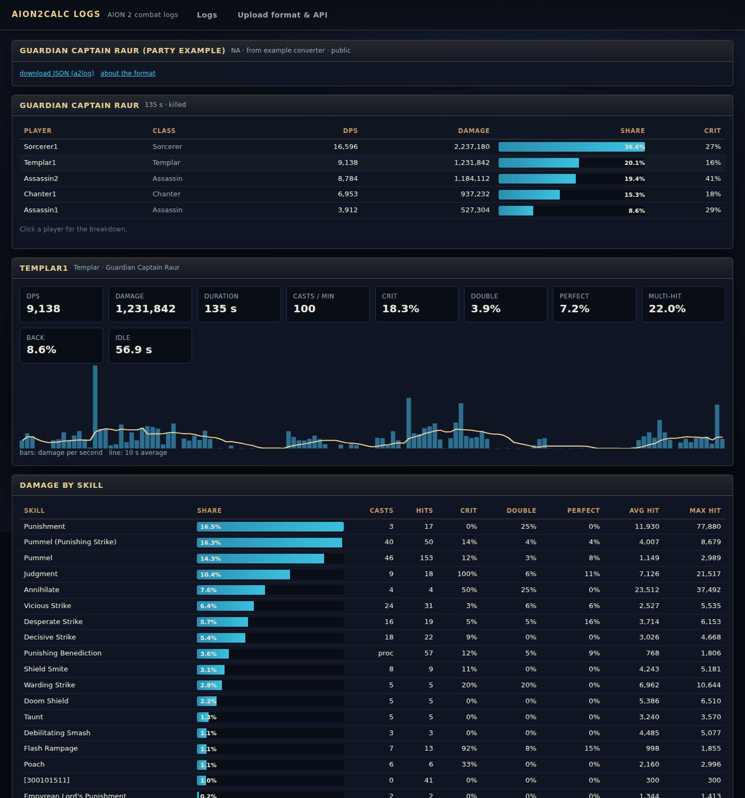

# Log server: share fights by link

`aion2calc.logserver` is a small web app you can host yourself. Any tool can upload an AION 2 fight
to it in an open JSON format (**a2log**); the server answers with a link anyone you give it to can
open. The viewer shows the party, each player's damage by skill, the DPS timeline, buffs and the
opening rotation.



## Install on Ubuntu (22.04 or 24.04)

Point a domain (for example `logs.example.com`) at the server, then:

```bash
git clone https://github.com/sam-t-anderson/Aion-calc
sudo bash Aion-calc/deploy/logserver/install.sh logs.example.com
```

The script installs Python, nginx and certbot, creates a system user `a2logs`, installs the app in
`/opt/aion2calc` (a virtualenv), and stores data in `/var/lib/aion2calc-logs`. It also sets up
the `aion2calc-logs` systemd service (listening on 127.0.0.1:8780), adds an nginx site in front of
it, and gets an HTTPS certificate.

Create an upload key for each app or person that uploads:

```bash
sudo -u a2logs A2LOGS_DATA=/var/lib/aion2calc-logs /opt/aion2calc/venv/bin/python \
  -m aion2calc.logserver keys create "my meter"
# list / revoke:  ... keys list   ... keys revoke <id>
```

The key is shown once. The server stores only its hash.

To do it by hand instead, use the two files the script uses:
[`aion2calc-logs.service`](../deploy/logserver/aion2calc-logs.service) and
[`nginx.conf`](../deploy/logserver/nginx.conf).

### Settings

Set these in the systemd unit (`sudo systemctl edit aion2calc-logs`) or pass them as flags to
`python -m aion2calc.logserver serve`:

| Variable | Flag | Default | Meaning |
|---|---|---|---|
| `A2LOGS_DATA` | `--data` | `./a2logs-data` | database and log files |
| `A2LOGS_HOST` / `A2LOGS_PORT` | `--host` / `--port` | 127.0.0.1 / 8780 | where it listens (keep it behind nginx) |
| `A2LOGS_PUBLIC_URL` | `--public-url` | from the request | base of the links it returns |
| `A2LOGS_ALLOW_ANONYMOUS` | `--allow-anonymous` | off | accept uploads without a key (rate limited per IP) |
| `A2LOGS_MAX_MB` | `--max-mb` | 25 | largest upload |
| `A2LOGS_UPLOADS_PER_HOUR` | `--uploads-per-hour` | 120 | per key (anonymous: a tenth, per IP) |
| `A2LOGS_TRUST_PROXY` | `--trust-proxy` | off | take client IP and scheme from nginx's `X-Forwarded-*` headers |
| `A2LOGS_NAME` | `--name` | aion2calc logs | site name |

Updating: `cd /opt/aion2calc && sudo git pull && sudo venv/bin/pip install . && sudo systemctl restart aion2calc-logs`.
Backups: copy `/var/lib/aion2calc-logs` (SQLite index plus one `.json.gz` per log).

## Who can see a log

| Visibility | Listed on the home page | Opens with |
|---|---|---|
| `public` | yes | the link |
| `unlisted` (default) | no | the link |
| `private` | no | the link with its secret `?t=` token, or the uploader's key |

The uploader gets a delete link with each upload. Deleting also works with the uploader's key.

## For other apps: the upload API

Advertise the server with its discovery document, which other tools can read to find everything
else:

```
GET https://logs.example.com/.well-known/a2log.json
{"format": "a2log", "versions": [1], "upload_url": ".../api/v1/logs", "method": "POST",
 "schema_url": ".../schema/a2log-v1.json", "docs_url": ".../docs",
 "auth": {"type": "bearer", "header": "Authorization", "required": true},
 "content_encodings": ["gzip"], "max_bytes": 26214400, "view_url": ".../l/{id}"}
```

Upload one document:

```bash
curl -X POST "https://logs.example.com/api/v1/logs?visibility=unlisted" \
  -H "Authorization: Bearer $KEY" -H "Content-Type: application/json" --data-binary @fight.json
# -> 201 {"id": "aB3dE5fG7h", "url": "https://logs.example.com/l/aB3dE5fG7h", "delete_url": "...", ...}
```

The format, with every field explained and more examples, is on the server's `/docs` page. The
JSON Schema is at `/schema/a2log-v1.json`, and the definition is in
[`aion2calc/logserver/format.py`](../aion2calc/logserver/format.py). In short:

```json
{"format": "a2log", "version": 1,
 "meta": {"source": "my-meter 1.2", "title": "Gatekeeper Pinopi", "region": "na", "recorded_at": "2026-10-04T19:00:00Z"},
 "players": [{"id": "p1", "name": "Name", "class": "sorcerer", "combat_power": 70000, "specs": {"Hellfire": [2, 4]}}],
 "segments": [{"label": "Gatekeeper Pinopi", "boss": "Gatekeeper Pinopi", "duration": 93.0, "killed": true,
               "hits": [{"t": 0.0, "player": "p1", "skill": "Hellfire", "skill_id": 15060000, "damage": 12345,
                         "crit": true, "multi": 2}],
               "buffs": [{"player": "p1", "name": "Element Enhancement", "start": 1.0, "end": 21.0}],
               "hp": [[0.0, 1437663]]}]}
```

Read endpoints (CORS enabled, so web pages on other sites can use them):

| Endpoint | Returns |
|---|---|
| `GET /api/v1/logs?page=&limit=&boss=` | public logs |
| `GET /api/v1/logs/<id>` | summary: title, players with DPS, segments |
| `GET /api/v1/logs/<id>/raw` | the a2log document |
| `GET /api/v1/logs/<id>/analysis?segment=0&player=p1` | one player's breakdown (skills, rates, timeline, buffs) |
| `DELETE /api/v1/logs/<id>?token=<delete token>` | delete |

## Uploading from aion2calc

Set the server once, either on the app's Combat Logs page (**Share to a log server**) or with:

```bash
python -m aion2calc share --server https://logs.example.com --key a2l_... --visibility unlisted
```

After that, **Share link** on any saved fight (or `python -m aion2calc share <encounter id>`)
uploads it and gives you the link. `--export fight.json` writes the a2log file without uploading.
