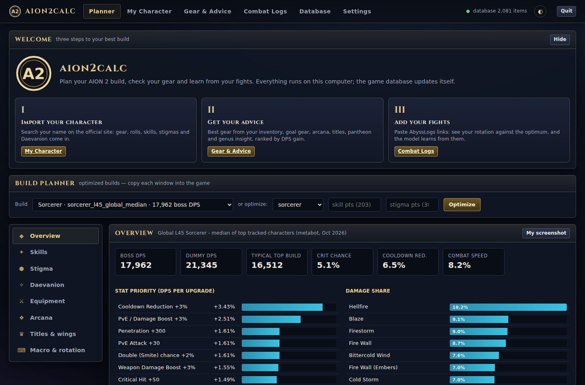
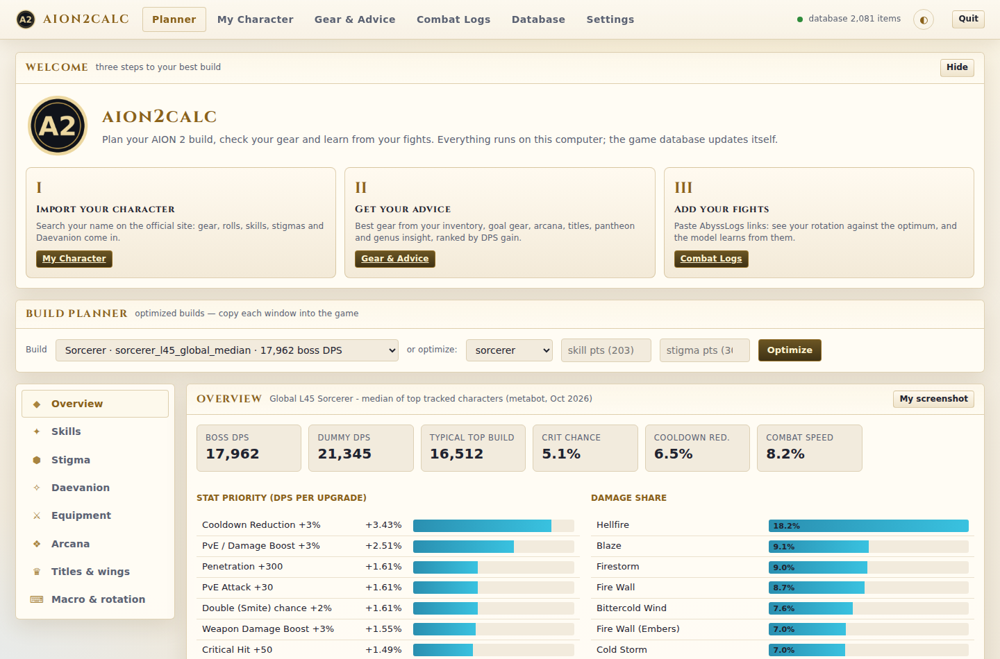

# Aion 2 Calc user guide

[Back to the project](../README.md) · [Install and update](install.md) · [App guide](app.md)

Detailed usage and limitations for the current application. Version-by-version changes belong in [Releases](https://github.com/sam-t-anderson/Aion-2-tools/releases).

## Skill specialties

**Optimize PvE build → Skills** shows recommended specialty numbers, descriptions and effect unlock levels. **Gear & Advice → Skill specialties** shows recommendations for your imported equipped build, all effect requirements and the next unlock, even without combat logs. Effective levels include training, Daevanion and gear. Stigma effects activate automatically. The official profile does not disclose selected specialties, so these are recommendations rather than confirmed current choices. Recalculate after changing gear or points. New saved advice retains its specialty snapshot; older snapshots require recalculation for this panel.

## Reporting a shared combat log

Open a shared log in Combat Logs, the website, or its server link and expand **Report this shared log**. Choose a reason, describe the concern, and keep the receipt. Reports are private requests for human review; they do not automatically hide logs or establish wrongdoing. Do not include credentials or unnecessary personal details.

If your upload is quarantined, **My uploads → Refresh** shows the moderator's reason. Shared links and visibility changes pause; your original credential still allows desktop review and deletion. A released upload stays private until you publish it again. A character name does not prove ownership of a log or character. Reporting requires a server with report support.

## Npcap installation on Windows

Choose **Install Npcap** in Live Meter to download the current official installer. Windows asks for administrator approval through its normal UAC prompt; approve it to run the installer. Cancelling or denying approval leaves Npcap uninstalled and the app explains how to retry. Npcap is installed separately, not bundled.

Checking installation reads the registered Npcap service and does not elevate the application. An installed driver does not guarantee capture access: if Npcap was installed with administrator-only access, capture may require administrator permissions. If registration cannot be read, the app reports an unknown state instead of asking you to reinstall blindly.

## My uploads and privacy

Open **Combat Logs → My uploads** on desktop or **Logs → My uploads** on the website. New desktop uploads automatically save a separate private credential. Click **Refresh** to check the original server, then change visibility, rotate a private link, or delete the uploaded copy. Your local combat file remains after server deletion.

- **Public:** listed; eligible samples contribute to community comparisons.
- **Unlisted:** anyone with the link can view; not listed or ranked publicly. Legacy anonymous calibration may contribute.
- **Private:** requires its secret view link or owner credential; excluded from public comparisons and calibration. Rotating the link revokes the previous private view link. Changing back to Private creates a new link.

Use **Export private credentials** and **Import private backup** to move management access between desktop, browsers and devices. Keep the backup private: it permits viewing private logs, privacy changes and deletion. Credentials are outside public a2log exports. Desktop stores them with your user data; website storage belongs to that browser and site. Desktop management requires selecting the upload's original share server in Settings. Importing credentials does not contact a server until you use its controls.

Older uploads can be recovered with the server address, upload ID and original delete token (the `token` in the original delete URL). A shared upload key, character name or view link cannot recover management access. If the original credential is lost, it cannot be recovered by the app. Upload ownership does not verify ownership of any recorded character. Making a log private or deleting it cannot recall previously downloaded copies or old cached responses.

## Encounter insights

In combat review, enable **Encounter insights** to see healer → recipient totals, observed ability effects and the first 20 effects per player/pet. Player and pet filters apply; pets keep their source labels. These are recorded effects, not casts or a recommended rotation. Healing totals do not establish effective healing or overheal.

Imported buff windows show merged, encounter-clipped duration and uptime; live buff coverage and buff casters remain unavailable. Boss HP milestones show the first observed sample at or below 75%, 50%, 25% and zero when boss identity and maximum HP are recorded. They do not infer named mechanics or exact transitions. Late captures may show several thresholds simultaneously.

Each section retains up to 100 rows per encounter, with omissions and missing healing attribution shown. Filters apply after those limits. Use Events for retained underlying effects. Older local files gain insights when reopened with the updated application; shared archives require an updated sharing server.

## Death recaps and character trends

Choose **Death recaps** in combat review to see recorded incoming damage, received healing and HP samples in the ten seconds before an explicit player death marker. Open a recap for relative event times and sources. The last incoming hit is an observation, not a confirmed killing blow. Equal timestamps do not establish event order; missing recipients, HP or death markers remain unavailable. Pet deaths are separate from owner deaths.

Recaps use the selected encounter's history and include every recorded incoming source regardless of enemy/graph filters. Split boundaries or a previous death can shorten the window. Sessions show up to 200 recaps, with the last 200 effects and HP samples per window; omitted counts are shown and window totals include omitted effects. No defensive, mitigation, avoidable-damage or cause-of-death conclusions are invented.

In **Combat Logs → Personal records**, search a character by server and name or database ID to open **Character consistency and trends**. Desktop and Pages show matched completed-boss public recordings, rate history, median/range, population standard deviation, median absolute deviation and relative variation. Variation requires five recordings; recent-five versus preceding-five medians require ten. Dataset caps suppress variation/trend claims. History is ordered by upload receipt, not verified fight time.

Only eligible public completed-boss captures enter these trends; private/unlisted logs and unranked wipes/partial captures are excluded. Rates match boss, class, category, patch, difficulty, party size and instance. Gear, teammates and fight length can still differ, so a rate change does not prove improved play. Healing effects are not verified effective healing; damage taken is descriptive. Missing death markers never establish a deathless run.

## Matched comparisons and percentiles

Combat review shows **Current standings (same patch)** and **At upload (reconstructed)**. Player comparisons match boss, class, category, patch, difficulty, observed party size and instance. Community browsing and Pages leaderboards include party-size filters; ranks apply within the matching cohort. Class summaries and personal bests also separate party sizes and instances.

Percentiles require at least 10 eligible public samples and five distinct characters, or five distinct parties for run speed. Smaller samples retain descriptive ranks and distributions with coverage warnings; capped datasets and unknown party/instance metadata have no formal percentile. Ties share a midrank percentile. Local/private comparisons are labeled provisional and never enter public samples. Healing depends on demand, and damage taken is not a better-performance score.

Historical standings are reconstructed from currently public retained uploads received by the viewed log's upload time. Deletions, visibility changes and policy updates can change that reconstruction. Current standings use the log's patch; they never silently compare it with a newer patch. Upload-time gear is not proof of encounter-time equipment, so gear-adjusted comparisons remain unavailable. These are community samples, not the entire game population.

## Run timing and boss progression

Desktop, Pages and shared logs show each run's recorded span, combined encounter intervals and gaps between fights. The boss tables show recorded attempts, kills, observed wipes, unknown outcomes, first recorded clear, best observed wipe HP and recovery time. Unresolved manual chunks of the same boss actor count as one recorded attempt.

Public **Completed-run speed** compares eligible elapsed times within the same instance, boss route, patch, difficulty and party size. Entry-to-final-boss timing requires capture to observe an open-world-to-instance transition and configured final-boss death, with a complete stable identified party and capture evidence. Starting inside an instance or finishing manually does not qualify. Missing deaths do not imply a wipe; missing HP is unavailable. These are community recordings, not official or authenticated game results. Encounter time measures recorded intervals, not action uptime.

## Multiple runs in one capture

Capture can stay running across encounters and runs. **Finish run** closes the current run; the next damage starts another without clearing earlier fights. Map or dungeon-ID changes separate runs and label their completion as unverified. Desktop and Pages review have a **Run** selector; a single uploaded a2log retains the run boundaries and all included encounter splits.

For automatic final-boss completion, enter verified final-boss NPC type IDs before Start and leave **Finish on configured final-boss death** enabled. Completion requires a recorded death of that boss, recorded damage against it and a matching dungeon ID. The bundled NPC tables identify bosses but do not identify which boss is final; no final-boss rule is guessed from NPC ordering. PvP arenas/battlegrounds currently use **Finish run** or map/instance transitions until match-end packets are verified.

Known open-world maps receive separate PvE/PvP open-world categories; unresolved sources use **PvE · Unverified source** or **PvP · Unverified / other** unless you supply a category. Damage involving an identified opponent outside Self/Party scope is grouped separately as PvP; unknown actors are never assumed to be opponents. Arena/battleground selection remains manual. Long captures roll over into saved archive parts before retained-history limits are reached. See [Long live sessions](#long-live-sessions) for storage boundaries and per-file limits.

## Recovered advice

Saved Results restores the same interactive Gear & Advice panels from legacy `advice.json` files, including previously recovered text entries. Reports with only an `ADVICE.md` file remain readable as text because they lack the structured data needed for equipment and other controls. No advice calculation is rerun during recovery.

## Character builds in combat logs

Click a character name in a combat log to view their saved official equipment, skills, stigmas and other available build details. This includes identified PvP opponents on desktop and GitHub Pages. Uploaded logs request fresh public profiles from the official character service; completed snapshots stay with that historical log.

The profile shows when the upload arrived and when the lookup completed. It represents gear reported around upload time, which may differ from gear used in the encounter. Missing names/server identity, ambiguous matches and unavailable official responses are shown explicitly. Older logs have no historical snapshot. Desktop can fetch a clearly labelled current profile preview without replacing the historical build.

## Example: Sorcerer, level 45 global

The optimized Sorcerer build (boss DPS 17,962 on median launch gear, 25,890 on upgrade gear), with its
arcana, stigmas, priority list, macro, stat priority, build card and Daevanion boards, is in
[`example/sorcerer_l45_global`](../example/sorcerer_l45_global/README.md).

## Install

**Players:** download the app from the
[Releases page](https://github.com/sam-t-anderson/Aion-2-tools/releases/latest). On Windows, run
`aion2calc-setup-<version>.exe` and start **Aion 2 Calc** from the Start menu; portable builds for
Windows, macOS and Linux are there too. No Python and no command line needed. The app follows your
computer's light or dark mode. Details and updating: [`docs/install.md`](install.md).

Windows may warn that the download is unrecognized until the builds are code-signed: choose **More info →
Run anyway**. [Code signing policy](code-signing.md).

| Dark | Light |
|---|---|
|  |  |

## The app

* **Planner**: each optimized build is laid out like the in-game windows (skills with numbered spec
  chips, stigma, Daevanion boards, equipment, arcana, titles and wings, macro). Below each window is
  a "stats from this system" summary, a copy-as-text button, and a slot to pin your own in-game
  screenshot next to it.
* **My Character**: import any character from the official AION 2 site. You get its gear, rolls,
  manastones, arcana skill rolls, Daevanion and skill levels, a DPS score as it is, and one click to
  optimize it with the same gear and points.
* **Combat Logs**: paste an [AbyssLogs](https://abysslogs.com) share link (or an A2DIL link, or a
  JSON/CSV file) for an AionFlex-style breakdown: per-skill share, casts, crit/double/perfect
  rates, cooldown use, timeline, buffs, idle time. It compares the log with the optimal rotation and
  specializations for that build and with top-player logs. Every log is also saved as a file in the
  logs folder.
* **Gear & Advice**: what to wear from your inventory, goal gear per slot and an upgrade path,
  arcana (variant, skill options to chase, keep or replace), titles (per slot, and which to collect),
  pantheon (deity stats by value),
  genus insight (which lines to reroll, which genus to level) and what your fights show, all ranked
  by simulated DPS gain, shown as game-style windows with the game's icons. Fights you import are
  matched to the gear you wore and calibrate the model
  ([details](planner.md)).
* **Live Meter**: capture the game connection with the included A2Tools packet engine. It starts in
  **Live Capture** mode with the built-in encoder, automatic interface and game-host detection, and
  port `50349`. Windows users can choose **Download and install Npcap** in setup or approve the
  prompt when starting Live Capture; the app fetches the current official installer, which must be
  installed in WinPcap-compatible mode. Save a fight to Combat Logs, export its open `a2log` JSON,
  upload it through the configured log server, take a screenshot, or open the transparent overlay.
  The overlay stays above and follows the Aion 2 game window when it is available.
* **Raid planner**: plan a boss fight on a visual map. Drop player, enemy, marker and AoE tokens,
  then scrub a **timelapse** slider and drag each token to where it should be at that moment — the
  planner fills in the movement in between. Lay out **party buffs** on the timeline, overlay a saved
  combat log to compare the plan with the real run, and save, export or share plans as a code.
* **Share**: upload any saved fight to a log server in the open a2log format and get a link anyone
  can open.
* **Database**: updates itself on every launch from the live sources. New items, skills or classes
  need no code changes.
* **Settings**: light, dark or follow-the-computer theme, the data folder, the log server for
  sharing, updates.

Everything the app saves (game database, synced data, combat logs, your optimizations) goes in one
folder: `%LOCALAPPDATA%\aion2calc` on Windows (`C:\Users\<you>\AppData\Local\aion2calc`), or
`~/.aion2calc` on Linux and macOS. Combat logs are in its `logs` subfolder.

Details: [`docs/app.md`](app.md).

### Live Capture, overlays and optimized presets

Windows setup selects **Download and install Npcap for Live Capture** by default. It downloads the current official installer separately; finish Npcap setup with **WinPcap API-compatible Mode** selected, then restart Aion 2 Calc. Scapy and LZ4 are included in desktop packages. Source installations need the dependencies in `pyproject.toml`; the native Windows overlay additionally requires pywebview and WebView2. macOS uses its system capture framework; Linux requires libpcap and capture permissions. The app offers capture setup when needed.

**Live Meter → Live Capture → Start** uses the built-in decoder, all available adapters in **Auto**, host **any**, and automatic game-port detection. Enter combat to establish a recognized game flow. Packet and event counters distinguish adapter/permission problems from unrecognized protocol traffic. Disable detection to use a known fixed port (initial value `50349`). Stop cancels recording and retains the last result for export; Quit closes capture and the overlay. Custom decoders are trusted Python `.py` imports whose code executes when capture starts.

The single overlay attaches to the AION 2 process on Windows, preserves its dragged offset, and remains available while waiting for the game. Tabs and the opacity slider are interactive; controls do not initiate dragging. Exclusive fullscreen behavior depends on the game and Windows compositor.

**Skills hotbar** shows suggested bindings. **Macro & rotation** shows numbered macro steps with matching keys and 10 ms delays. Charged skills are manual: hold their own key and release after charging. The optimizer fills all legally reachable skill-point allocations; points can remain only when no further purchasable level fits.

After optimization, eligible anonymous builds can improve the class presets used by the Planner. Updated presets are cached for offline use. Character identity and private equipment are not submitted with these build suggestions.

Windows **Install now** stages and validates the installer, starts a detached helper, closes the app, then opens the installer interactively after the process exits. Updates preserve user data. If the helper fails, its log is in the data folder's `updates` directory. macOS/Linux archives are staged for manual replacement.

### Raid plan publishing and playback

In **Raid Planner**, choose **Visibility** beside **Publish plan**: **Public** lists the plan in Browse plans; **Unlisted** shares it only by link; **Private** requires the secret link. The desktop uses the server and upload key from Settings. Publishing saves an owner credential on this device. **Update published plan** changes the same link; **Publish new copy** creates a separate plan. Keep a **Private ownership backup** to edit from another device. Import that backup through Import file. A revision conflict requires Refresh published plan before trying again; export local edits first. Clearing browser data without a backup loses editing access.

Combat logs containing recorded normalized positions offer **Open in Raid Planner** on desktop and Pages; the replay becomes a new local editable plan. Imported coordinates must already match the normalized arena. Live position decoding is not yet available.

Shared `/p/<id>` pages support **Play/Pause**, **Rewind**, playback speed and a timeline scrub bar with moving tokens and active buffs.

Live Meter uses one yellow **Start** / red **Stop** button. Under **Capture diagnostics**, enable TCP recording before Start, enter combat, then stop. The diagnostic ZIP saves automatically; the recorded payload count, saved path and ZIP download link remain visible. Use Export capture diagnostics for a manual archive. The Windows copy is also saved under `%LOCALAPPDATA%\aion2calc\diagnostics`; ordinary application logs do not contain TCP payloads. Export does not require decoded combat events.

TCP diagnostics record the entire session to disk with no record-count or size cap. Available disk space is the limit; the UI shows recording size and write errors. Long sessions take longer to compress on Stop or export. Export during capture takes a fixed snapshot while recording continues. Raw `tcp-session-*.jsonl` files stay recoverable after a crash or failed export; successful stopped-session exports remove their raw temporary copy. ZIPs remain until you delete them. Raw traffic can contain character names and network addresses; review before sharing. This changes raw diagnostic retention, not the separate decoded combat-history limits.

## Community combat review

Combat Logs shows recent full sessions and the public community browser. Live sessions checkpoint every 15 seconds and save again on Stop. After a forced close, open the entry marked **unfinished checkpoint** to review or export the retained data. Capture restarts as a new session; up to the last 15 seconds plus disk-write time can be lost. Check **Capture diagnostics** for save errors. Snapshots use the selected Party / Self / All filter. Filter by encounter type, boss, difficulty, patch and region. Add missing classification using **Encounter metadata for comparisons** when opening a local session. Unknown metadata remains visible but cannot produce meaningful rankings.

Class summaries show DPS distributions, median, quartiles, range and sample counts for each matching encounter. Server and region ranks require recorded identity metadata; World means public submissions to this community, not every player worldwide. Personal records search by character name and server ID, or database character ID and server ID.

**Capture quality** explains whether an encounter qualifies for community rankings. Eligibility requires an identified boss observed at full health at the start, its observed death, participating player names/classes/servers, patch and difficulty, and supported capture evidence without known loss. Older logs, partial pulls, unverified encounters and PvP matches remain viewable and uploadable but unranked. Personal history keeps those recordings; personal-best records and class statistics use eligible encounters. Passing these checks is not proof that every packet was captured or that an upload is authentic.

Matching public uploads of the same fight count once per player. Detection requires at least 20 matching outgoing damage records, player names/servers, NPC targets, and closely matching encounter timestamps and duration. Different actor IDs and packet timing can match; incomplete or ambiguous captures may remain separate. Original uploads are retained. Capture loss counters apply conservatively to the retained session, including history/telemetry limits; they can leave later encounters unranked until a fresh session is started.

Compare multiple local or public logs by choosing the encounter and each same-class player explicitly. Scores are recorded DPS, not adjusted for gear or capture completeness.

## Build points

**My Character** displays points spent and the optimization budget. Official profiles may omit unspent points. Enter the total from your in-game window (spent + unspent) for Skill, Stigma and PvE Daevanion before **Optimize PvE build**. Imported spend is a lower bound; it is not a verified character maximum. Planner budgets are configurable, including Daevanion. The bundled 203 / 30 / 360 preset describes an example simulation, not the total available to every character. Gear skill levels and PvP Daevanion points are separate from these budgets.

## Saved optimizations and advice

**Saved Results** reopens completed character/class optimizations and advice after restarting. Export a result JSON and import it on another installation. The latest older build and advice files are recovered automatically when available; overwritten historical files cannot be reconstructed. Advice is a snapshot from that run, so regenerate it when your gear or game data changes.

After character optimization, anonymous point observations update the community's highest observed totals by class, region, patch and source. View these under Combat Logs. User-entered totals and allocated profile lower bounds are labelled separately; neither establishes the game's maximum.

## PvE and PvP optimization

**My Character** offers **Optimize PvE build** and **Optimize PvP damage (experimental)**. PvP results save separately and can be reopened through Saved Results. They cannot replace community PvE presets.

The experimental PvP mode compares a 180-second sustained damage proxy and a 30-second burst assessment against a stationary neutral player target. It excludes PvE/boss bonuses and learned PvE calibration. It does not yet model verified PvP skill coefficients, opponent gear/mitigation, movement, crowd control, survivability or win chance. Existing character point budgets apply; dedicated PvP progression is not yet optimized.

Live Meter buttons show progress and completion/error feedback. Export confirmations show the saved file path; diagnostic exports also offer a download link. Buttons are disabled while their request is running.

## PvP logs and leaderboards

In Live Meter, Stop and **Clear session** before switching between PvE and PvP. Choose a PvP encounter category: battleground, arena, Abyss, rift, open world or other. Use **Self** or **Party** scope. Capture preserves observed player combat, healing and death markers; known NPC damage and unidentified opponents are excluded from PvP session grouping. Start before entering the encounter so identity packets can be observed. Opponent names/classes appear only when decoded.

Enter the game patch, arena/encounter name and difficulty/ruleset for useful comparisons. Community Combat Logs and Pages leaderboards separate PvP from PvE, with DPS, HPS and damage-taken rate selections. Damage-taken rate is a recorded amount, not a higher-is-better performance grade. Healing or deaths with no matching marker remain unavailable in community statistics. Table, timeline, events, graph, splits, pets and replay controls use the same supported event data as PvE.

Match outcomes, objective scores, kill credit, faction/team assignments outside the observed party, and movement not present in the log are not inferred. Mode selection is manual; entering a PvP area does not automatically prove a recording is PvP. A fresh PvP capture is still needed to confirm arena/battleground coverage.

Official desktop builds use the configured community upload key for the default server. You do not need to enter it manually. A custom server may require its own key in Settings; a personal key takes precedence. If an upload reports an upload-key 401, install the latest release and retry; custom servers may require their own key.

### Choosing a game installation

In Live Meter, **Game installation → Refresh installations** lists Steam library manifests and recognized Windows game registrations. Select the copy you play if several are installed. Auto chooses only when one copy is found. The choice is stored locally and takes effect at capture start. A missing selected installation stays unavailable until you choose another; a launcher installation without a recognized game registration may not appear.

Save or export retained combat, stop capture, then clear the session before changing the installation. Restarting live capture with retained combat keeps that session's installed-build evidence. Installed versions are evidence from local files, separate from the published patch used for rankings. The region dropdown is an optional recording override; Auto resolves from the recorded home-server ID and official server metadata. Other actors retain their own recorded identities.

## Long live sessions

Live capture automatically saves a numbered archive part before the current history reaches its effect, telemetry, encounter or observed-party identity budget. Each part has a shared archive ID and appears separately in **Combat Logs**. Capture continues with the same decoder and current identity context; the live meter and its export/upload buttons cover the current part. Open an earlier part from Combat Logs to review or upload it. There is no fixed total part count or automatic deletion; available disk space is the practical storage limit. The recent list shows the newest 100 files; older parts remain in the user logs folder and can be imported.

A storage boundary is not a boss kill, instance finish or arena result. Parts crossing a storage boundary are conservatively unranked, and a continued run does not inherit observed entry. Parts are not automatically stitched into a combined report or uploaded as a batch. A failed rollover save stops capture visibly and retains the in-memory history instead of clearing it. Periodic recovery is still every 15 seconds; abrupt termination can lose newer unsaved effects.

Per-file format/validation limits still apply. In unusually large All-observed rosters, a part can exceed the 64-player validation limit; the app reports a save error rather than silently clearing it. Party/Self scope is recommended. This is automatic bounded-part archival, not an unlimited single JSON document. Raw TCP diagnostics remain a separate opt-in recording.

## Review and upload saved parts

**Combat Logs → Saved parts** browses local files in pages of 25, including files older than the newest 100. Open a part to review it, filter the current page by encounter type, name or archive ID, and select up to 100 saved files across pages. Choose Public, Unlisted or Private, then **Upload selected / retry remaining**. The default is Unlisted. Each file creates an independent report; archive parts are not stitched into one timeline or combined score.

The same queue is available on the Pages **Logs** page: choose saved a2log v1 JSON files (up to 50 MiB each), review locally and select the parts to upload. Uploads use the community server configured for the site or the visitor's saved Raid Planner server settings. Reading a file does not upload it. The browser compresses uploads when CompressionStream is available; server size/rate limits still apply.

The queue shows progress, uploaded report links, errors and ownership-save warnings for each file. Cancel stops before the next upload; an in-flight request can finish. Successful entries are skipped when retrying within the same queue. Network/authentication/rate-limit failures stop the queue with remaining files pending. A lost response can be ambiguous: retry can create another upload if the server already accepted the first. Clearing the queue or leaving/reloading the page loses this queue's retry state, but saved ownership credentials remain available under My uploads. Navigating away stops before the next request, not necessarily the current one.

Active or unfinished checkpoints are excluded from batch upload; stop capture first. An unfinished crash-recovery checkpoint can still be reviewed and published individually as partial evidence. Local pagination is a live file listing: concurrent new checkpoints can shift page boundaries, so selection is tracked by filename and should be reviewed before upload. Filters apply to the current page, not every file on disk. Changing server/visibility requires clearing the queue; desktop requests reject a server change during a batch.

**Export upload results** saves a manifest of selected files, archive/part labels, statuses and report IDs. Public/unlisted links may be included, so unlisted links should be shared deliberately. Private links, upload keys and ownership credentials are excluded. Keep using My uploads → Export private credentials for an ownership backup. A manifest is a list of outcomes, not a combined combat log, permanent privacy snapshot or automatic import/resume credential.

### Reviewing a log

Open a log to see its own detail page, then use **Back to combat logs** to return to history. Switch between Table, Timeline and Events. Rate graphs offer live-style bars/average or player series; timeline windows show skill icons with hover/click details and time navigation. Only recorded effects are shown. Website local-file previews must be reopened after a refresh.

### Resume uploads

**Combat Logs → Saved parts → Restore saved queue** restores the last queue saved on this computer. On Pages, it restores the last queue in this browser/site storage; reselect the original JSON files before resuming. Recovery metadata is saved after selections and before/after each request. Keep only one active queue per computer/browser; concurrent windows are not coordinated. A local-storage or disk write failure stops further uploads.

**Export recovery file** / **Import recovery file** moves a queue checkpoint between launches or computers. It stores filenames, titles, SHA-256 fingerprints, original server/visibility, statuses and report IDs. It does not include combat documents, upload keys, owner credentials or private links. Select the same server and supply any required key through ordinary settings. Keep **My uploads → Export private credentials** as a separate ownership backup. The older results manifest is for reporting outcomes, not recovery.

The file fingerprint must match before a successful entry is skipped or another request is sent. A changed file stops the queue; remove it or clear/review a new queue. A missing file must be restored or removed. Pages can reattach uniquely named files after copying; fingerprints still verify content. Recovery files are user-editable local records, not authenticated server receipts or upload ownership.

Requests interrupted during upload restore as **unknown**. Check **My uploads**/the original server before checking the explicit uncertain-retry option. The server may already have accepted a request even if the response was lost; explicit retry can duplicate it. Known successful uploads are skipped, but this is not durable server idempotency. No automatic upload starts when restoring or importing. Private report links must be reopened through My uploads, since recovery files intentionally omit them. Clearing a queue also clears its saved checkpoint, without deleting logs or uploads.

### Preserve HP while optimizing

My Character → **Survivability** preserves current flat crystal-board HP by default. Set a higher minimum or add optional incoming-damage scenarios, then optimize for damage within that reserve. Results show the HP reserve and assumed headroom. This does not simulate defensive skills, CC, movement or PvP wins; verify HP in game. Personal constrained builds stay local, and Gear & Advice remains damage-based.

Combat Logs separates Saved Parts, My Uploads and Community Combat Logs. Previously imported characters can be refreshed from My Character, and recovered build titles retain available character identity and PvE/PvP mode. Macro instructions suggest right-click.

