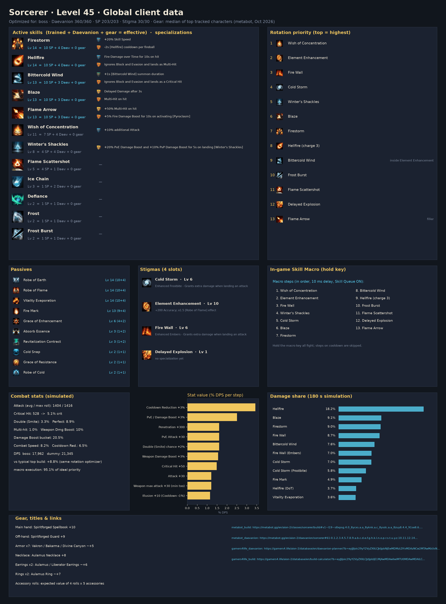
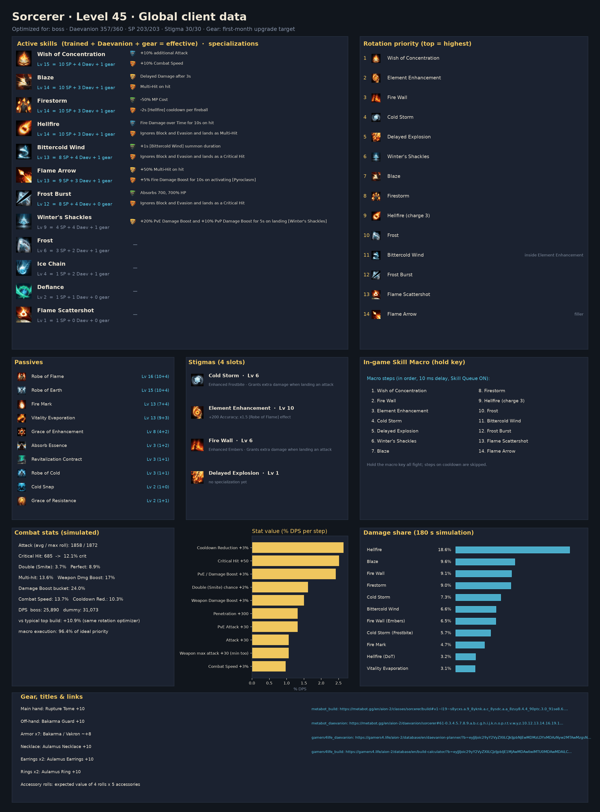

# Sorcerer, level 45 global: results at a glance

| | Median launch gear, 203 SP | Median gear, 383 SP (all Empyrean Traces) | First-month upgrade gear |
|---|---:|---:|---:|
| Optimized build, boss DPS | **17,962** | **18,342** | **25,890** |
| Typical top global build, same rotation optimizer | 16,512 | — | 23,809 |

* Full reports: [median gear](../../results/sorcerer_l45/README.md) ·
  [383 skill points](../../results/sorcerer_l45_full_sp/README.md) ([what changes](../../results/sorcerer_l45_full_sp/DIFF.md)) ·
  [upgrade gear](../../results/sorcerer_l45_geared/README.md) ([what changes](../../results/sorcerer_l45_geared/DIFF.md))
* Arcana: Parchment is the slot to chase (core fire skills); two extra Hellfire levels (Lv 16) are
  worth about +5%
* Stigmas: Element Enhancement 10, Cold Storm 6, Fire Wall 6, Delayed Explosion 1
* Priority: Wish → Element Enhancement → Fire Wall → Cold Storm → Winter's Shackles → Blaze →
  Firestorm → Hellfire (full charge) → Bittercold Wind (inside Element Enhancement) → Frost Burst →
  Flame Scattershot → Delayed Explosion → Flame Arrow (filler)
* One-button in-game Skill Macro reaches ~95% of that priority list in simulation
* Stat priority (median gear): Cooldown Reduction > Damage Boost > Penetration ≈ PvE Attack ≈ Double >
  Weapon Damage Boost > Crit > Attack; on upgrade gear Crit moves to the top



**Daevanion boards (optimized, 360 points)**


**Build card on first-month upgrade gear**



## Reproduce

```bash
python -m aion2calc optimize sorcerer                                   # median gear, 203 skill points
python -m aion2calc optimize sorcerer --skill-points 383 --out results/sorcerer_l45_full_sp
python -m aion2calc optimize sorcerer --loadout sorcerer_l45_geared --out results/sorcerer_l45_geared
```

The images in this folder are copies from those result folders. Other classes are optimized the same
way (`python -m aion2calc optimize <class>`); see the [main README](../../README.md).
