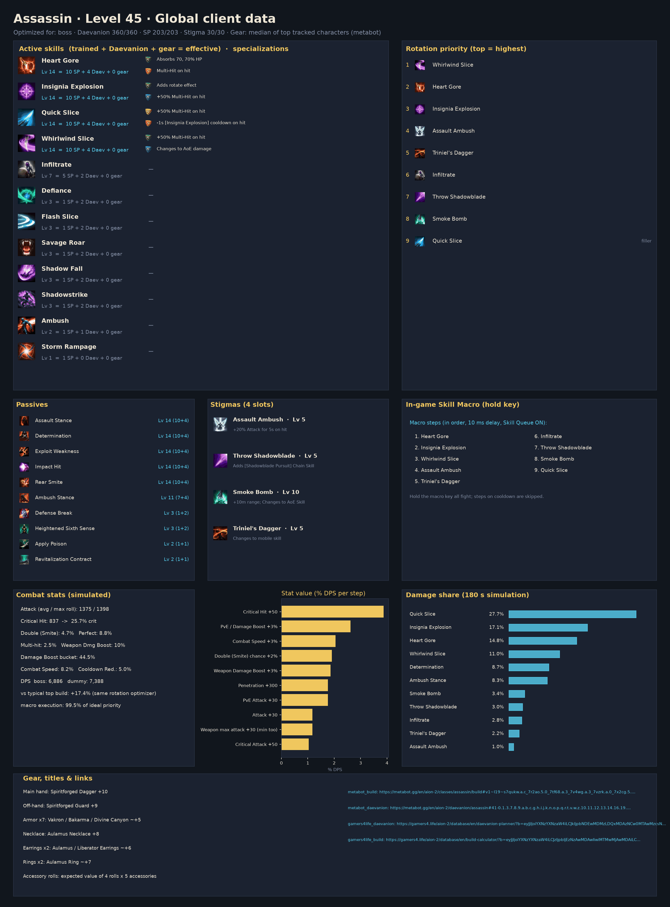
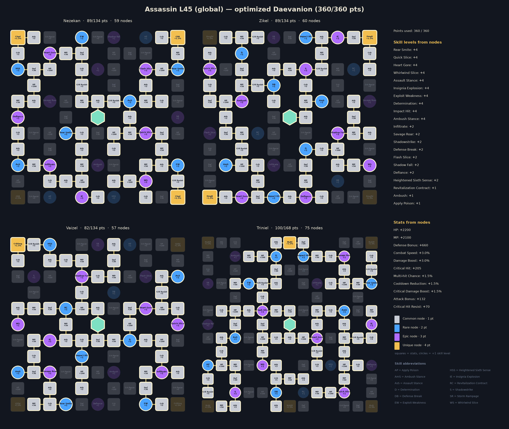
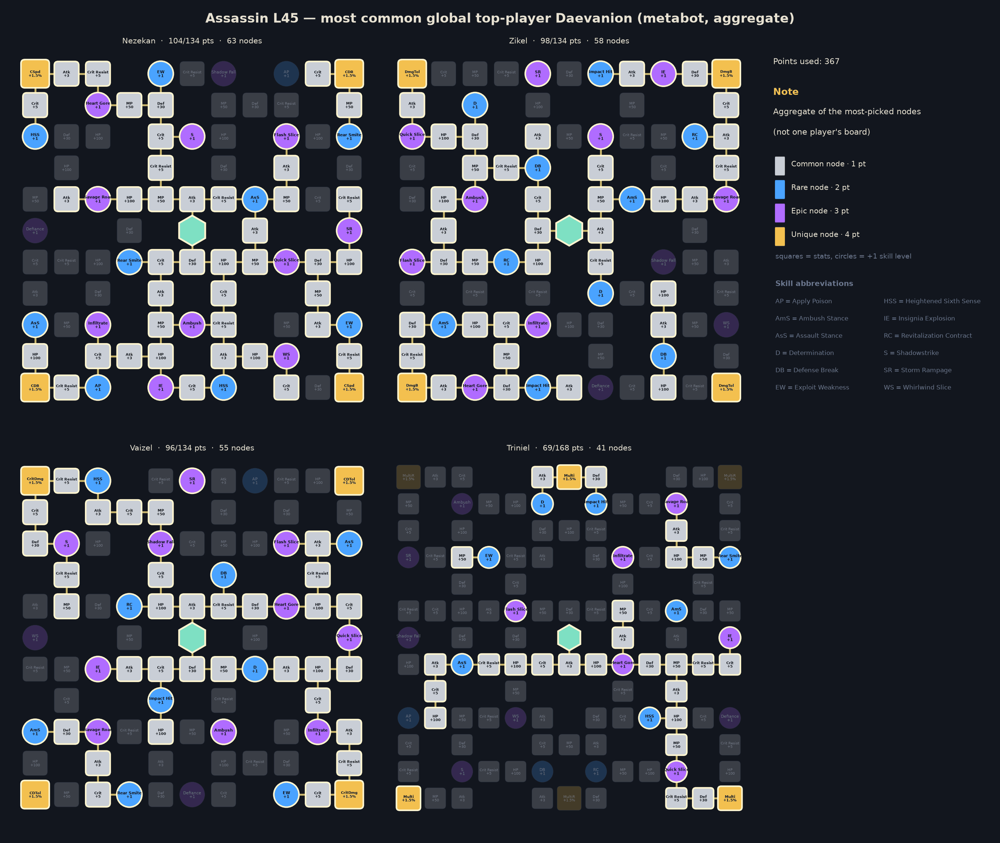

# Assassin — level 45 global build, rotation and macro

Generated by `aion2calc` from the global client data (metabot.gg) with Korean data as fallback. Objective: **boss** fight (see `docs/methodology.md`). Daevanion budget **360** points.



## Results

| Build | boss DPS | dummy DPS |
|---|---:|---:|
| **Optimized (this report)** | **6,886** | **7,388** |
| Typical top global build, optimized rotation | 5,868 | 6,266 |
| Typical top global build, default priority | 5,415 | — |

The optimized build is **+17.4%** over the typical top global build played with the same rotation optimizer, and **+27.2%** over that build played with the default priority. *Typical top global build* = average skill levels, the four most-picked damage stigmas and the most-picked Daevanion nodes of the top tracked global L45 players of this class (metabot.gg live data), given the best legal specializations for its levels (specs are not published).

## Rotation (priority list)

Use the highest skill that is ready; the last entry is the filler.

1. `whirlwind_slice`
2. `heart_gore`
3. `insignia_explosion`
4. `assault_ambush`
5. `triniel_s_dagger`
6. `infiltrate`
7. `throw_shadowblade`
8. `smoke_bomb`
9. `quick_slice`

`[sync_de]` = wait for the Delayed Explosion vulnerability window when it is about to be ready; `[in_ee]` = prefer using it inside Element Enhancement; `[mp_hi]` = only while MP is at least 60% (weave it in, keep MP for Grace of Enhancement).

### In-game Skill Macro

Settings → Key Settings → General → Skill Macro. Skill Queue (스킬 예약) **ON**, 10 ms delay on every step, hold the macro key; manual presses always take priority over the macro.

| Step | Skill |
|---:|---|
| 1 | heart_gore |
| 2 | insignia_explosion |
| 3 | whirlwind_slice |
| 4 | assault_ambush |
| 5 | triniel_s_dagger |
| 6 | infiltrate |
| 7 | throw_shadowblade |
| 8 | smoke_bomb |
| 9 | quick_slice |

Manual keys (press on cooldown, in this priority): none — hold the macro key for the whole fight

Simulated: this layout reaches **99.5%** of the ideal priority list.

**Alternative — macro with manual keys**: macro whirlwind_slice → infiltrate → insignia_explosion → heart_gore → quick_slice; manual: assault_ambush, triniel_s_dagger, throw_shadowblade, smoke_bomb. Simulated: **99.3%** of the ideal priority list.

### Opener (first 30 s of the simulated fight)

```
whirlwind_slice@0.0s → heart_gore@0.9s → insignia_explosion@1.8s → assault_ambush@2.7s → triniel_s_dagger@3.6s → infiltrate@4.5s → throw_shadowblade@5.5s → heart_gore@6.4s → smoke_bomb@7.3s → quick_slice@8.2s → quick_slice@8.9s → whirlwind_slice@9.7s → insignia_explosion@10.6s → heart_gore@11.5s → quick_slice@12.4s → quick_slice@13.2s → quick_slice@14.0s → insignia_explosion@14.8s → quick_slice@15.7s → heart_gore@16.4s → quick_slice@17.3s → quick_slice@18.1s → insignia_explosion@18.9s → whirlwind_slice@19.8s → quick_slice@20.7s → heart_gore@21.5s → quick_slice@22.4s → quick_slice@23.1s
```

## Skills, specializations and points

Skill points used **203 / 203**, stigma points **30 / 30**, Daevanion **360 / 360**.

| Skill | Trained (SP) | Effective level | Specializations |
|---|---:|---:|---|
| Exploit Weakness | 10 | 14 | — |
| Impact Hit | 10 | 14 | — |
| Whirlwind Slice | 10 | 14 | +50% Multi-Hit on hit; Changes to AoE damage |
| Quick Slice | 10 | 14 | +50% Multi-Hit on hit; -1s [Insignia Explosion] cooldown on hit |
| Heart Gore | 10 | 14 | Absorbs 70, 70% HP; Multi-Hit on hit |
| Assault Stance | 10 | 14 | — |
| Determination | 10 | 14 | — |
| Rear Smite | 10 | 14 | — |
| Insignia Explosion | 10 | 14 | Adds rotate effect; +50% Multi-Hit on hit |
| Ambush Stance | 7 | 11 | — |
| Infiltrate | 5 | 7 | — |
| Defense Break | 1 | 3 | — |
| Savage Roar | 1 | 3 | — |
| Heightened Sixth Sense | 1 | 3 | — |
| Defiance | 1 | 3 | — |
| Flash Slice | 1 | 3 | — |
| Shadowstrike | 1 | 3 | — |
| Shadow Fall | 1 | 3 | — |
| Revitalization Contract | 1 | 2 | — |
| Ambush | 1 | 2 | — |
| Apply Poison | 1 | 2 | — |

**Stigmas**: Assault Ambush Lv 5, Throw Shadowblade Lv 5, Smoke Bomb Lv 10, Triniel's Dagger Lv 5

## Daevanion (360 points)



* Open in metabot planner: https://metabot.gg/en/aion-2/daevanion/assassin#41-0.1.3.7.8.9.a.b.c.g.h.i.j.k.n.o.p.q.r.t.v.w.z.10.11.12.13.14.16.19.1b.1e.1f.1h.1i.1j.1k.1m.1o.1p.1q.1r.1s.1t.1u.1x.1y.1z.21.22.23.24.25.26.27.2b.2c.2e.2g_42-1.2.3.6.7.8.9.a.b.c.e.f.g.i.j.k.l.m.p.q.r.s.t.u.x.y.z.10.11.12.14.16.19.1a.1c.1d.1h.1i.1j.1l.1n.1o.1p.1s.1t.1u.1x.1y.1z.20.22.23.26.27.28.29.2a.2b.2c.2d_43-0.1.2.5.a.b.c.d.e.k.l.m.p.q.s.u.v.w.x.y.z.10.12.13.14.15.16.17.19.1a.1c.1d.1e.1f.1g.1h.1i.1j.1k.1m.1n.1p.1q.1r.1s.1u.1x.1y.1z.21.22.25.28.29.2a.2e.2f_44-3.4.5.b.c.d.e.f.g.h.i.l.o.p.s.t.u.v.y.z.10.11.13.17.18.19.1a.1b.1c.1e.1f.1g.1i.1k.1l.1n.1o.1p.1r.1s.1u.1v.1w.1x.1y.20.21.22.23.24.25.26.27.28.29.2b.2c.2e.2g.2h.2j.2k.2l.2m.2n.2o.2q.2r.2u.2w.2x.2y.31.32.33
* Open in gamers4.life planner (KR node values, same node IDs): https://gamers4.life/aion-2/database/en/daevanion-planner/?b=eyJjIjoiYXNzYXNzaW4iLCJkIjpbNDEwMDMzLDQxMDAzNCw0MTAwMzcsNDEwMDQyLDQxMDA0Myw0MTAwNDgsNDEwMDUwLDQxMDA1MSw0MTAwNTIsNDEwMDU4LDQxMDA2Myw0MTAwNjQsNDEwMDY1LDQxMDA2Nyw0MTAwNzEsNDEwMDcyLDQxMDA3Myw0MTAwNzksNDEwMDgyLDQxMDA4Niw0MTAwOTMsNDEwMDk0LDQxMDA5Nyw0MTAwOTgsNDEwMDk5LDQxMDEwMCw0MTAxMDEsNDEwMTAyLDQxMDEwOCw0MTAxMTUsNDEwMTIzLDQxMDEyNiw0MTAxMjcsNDEwMTI5LDQxMDEzMCw0MTAxMzEsNDEwMTMyLDQxMDEzOCw0MTAxNDIsNDEwMTQ0LDQxMDE0Nyw0MTAxNTMsNDEwMTU0LDQxMDE1NSw0MTAxNTcsNDEwMTYxLDQxMDE2Miw0MTAxNjMsNDEwMTcwLDQxMDE3MSw0MTAxNzIsNDEwMTc0LDQxMDE3NSw0MTAxNzYsNDEwMTc4LDQxMDE4Nyw0MTAxODgsNDEwMTkxLDQxMDE5Myw0MjAwMzQsNDIwMDM1LDQyMDAzNiw0MjAwMzksNDIwMDQwLDQyMDA0MSw0MjAwNDIsNDIwMDQzLDQyMDA0OCw0MjAwNTAsNDIwMDU1LDQyMDA1OCw0MjAwNjMsNDIwMDY1LDQyMDA2Nyw0MjAwNjgsNDIwMDY5LDQyMDA3MCw0MjAwNzMsNDIwMDc4LDQyMDA4MCw0MjAwODEsNDIwMDgyLDQyMDA4NCw0MjAwOTMsNDIwMDk0LDQyMDA5NSw0MjAwOTcsNDIwMDk5LDQyMDEwMCw0MjAxMDIsNDIwMTA5LDQyMDExNCw0MjAxMTcsNDIwMTI0LDQyMDEyNSw0MjAxMzEsNDIwMTMyLDQyMDEzMyw0MjAxNDAsNDIwMTQ0LDQyMDE0NSw0MjAxNDYsNDIwMTU0LDQyMDE1NSw0MjAxNTYsNDIwMTU5LDQyMDE2MSw0MjAxNjIsNDIwMTYzLDQyMDE3MSw0MjAxNzQsNDIwMTgzLDQyMDE4NCw0MjAxODUsNDIwMTg2LDQyMDE4Nyw0MjAxODgsNDIwMTg5LDQyMDE5MCw0MzAwMzMsNDMwMDM0LDQzMDAzNSw0MzAwMzksNDMwMDQ4LDQzMDA1MCw0MzAwNTEsNDMwMDUyLDQzMDA1NCw0MzAwNjcsNDMwMDY4LDQzMDA2OSw0MzAwNzIsNDMwMDczLDQzMDA4Miw0MzAwODcsNDMwMDkzLDQzMDA5NCw0MzAwOTUsNDMwMDk2LDQzMDA5Nyw0MzAwOTgsNDMwMTAwLDQzMDEwMSw0MzAxMDIsNDMwMTAzLDQzMDEwOCw0MzAxMTEsNDMwMTE1LDQzMDExOCw0MzAxMjQsNDMwMTI1LDQzMDEyNiw0MzAxMjcsNDMwMTI4LDQzMDEyOSw0MzAxMzAsNDMwMTMxLDQzMDEzMiw0MzAxMzksNDMwMTQyLDQzMDE0Nyw0MzAxNTMsNDMwMTU0LDQzMDE1NSw0MzAxNTcsNDMwMTYxLDQzMDE2Miw0MzAxNjMsNDMwMTcwLDQzMDE3Miw0MzAxNzYsNDMwMTg0LDQzMDE4NSw0MzAxODYsNDMwMTkxLDQzMDE5Miw0NDAwMjIsNDQwMDIzLDQ0MDAyNCw0NDAwMzUsNDQwMDM2LDQ0MDAzNyw0NDAwMzksNDQwMDQwLDQ0MDA0MSw0NDAwNDIsNDQwMDQ0LDQ0MDA1Miw0NDAwNTcsNDQwMDU5LDQ0MDA2NCw0NDAwNjUsNDQwMDY2LDQ0MDA2Nyw0NDAwNzEsNDQwMDcyLDQ0MDA3Myw0NDAwNzQsNDQwMDgxLDQ0MDA5Myw0NDAwOTQsNDQwMDk1LDQ0MDA5Niw0NDAwOTcsNDQwMDk4LDQ0MDEwMCw0NDAxMDEsNDQwMTAyLDQ0MDEwNCw0NDAxMDksNDQwMTExLDQ0MDExNSw0NDAxMTcsNDQwMTE5LDQ0MDEyMyw0NDAxMjQsNDQwMTI2LDQ0MDEyNyw0NDAxMjgsNDQwMTI5LDQ0MDEzMCw0NDAxMzIsNDQwMTMzLDQ0MDEzNCw0NDAxMzgsNDQwMTQxLDQ0MDE0NSw0NDAxNDcsNDQwMTUyLDQ0MDE1Myw0NDAxNTQsNDQwMTU2LDQ0MDE1Nyw0NDAxNjAsNDQwMTYyLDQ0MDE2Myw0NDAxNjcsNDQwMTY5LDQ0MDE3Miw0NDAxNzMsNDQwMTc0LDQ0MDE3Nyw0NDAxODIsNDQwMTg0LDQ0MDE4Nyw0NDAxOTAsNDQwMTkxLDQ0MDE5Miw0NDAxOTgsNDQwMTk5LDQ0MDIwMl19
* Full skill/stigma/Daevanion build in metabot planner: https://metabot.gg/en/aion-2/classes/assassin/build#v1~l19~s7qukw.a.c_7r2ao.5.0_7tf68.a.3_7v4wg.a.3_7vzrk.a.0_7x2cg.5.0_7y4xc.a.9_7ycn4.5.0_85mzk.5.0_862f4.a.0_86huo.a.0_86pkg.a.0_86xa8.a.0_87500.7.0_87s5c.a.0~g85mzk_7r2ao_7vzrk_7x2cg~d41-0.1.3.7.8.9.a.b.c.g.h.i.j.k.n.o.p.q.r.t.v.w.z.10.11.12.13.14.16.19.1b.1e.1f.1h.1i.1j.1k.1m.1o.1p.1q.1r.1s.1t.1u.1x.1y.1z.21.22.23.24.25.26.27.2b.2c.2e.2g_42-1.2.3.6.7.8.9.a.b.c.e.f.g.i.j.k.l.m.p.q.r.s.t.u.x.y.z.10.11.12.14.16.19.1a.1c.1d.1h.1i.1j.1l.1n.1o.1p.1s.1t.1u.1x.1y.1z.20.22.23.26.27.28.29.2a.2b.2c.2d_43-0.1.2.5.a.b.c.d.e.k.l.m.p.q.s.u.v.w.x.y.z.10.12.13.14.15.16.17.19.1a.1c.1d.1e.1f.1g.1h.1i.1j.1k.1m.1n.1p.1q.1r.1s.1u.1x.1y.1z.21.22.25.28.29.2a.2e.2f_44-3.4.5.b.c.d.e.f.g.h.i.l.o.p.s.t.u.v.y.z.10.11.13.17.18.19.1a.1b.1c.1e.1f.1g.1i.1k.1l.1n.1o.1p.1r.1s.1u.1v.1w.1x.1y.20.21.22.23.24.25.26.27.28.29.2b.2c.2e.2g.2h.2j.2k.2l.2m.2n.2o.2q.2r.2u.2w.2x.2y.31.32.33

For comparison, the aggregate of the most-picked nodes among top global players:



## Stat priority (simulated)

| Upgrade | DPS gain | Worth in Attack |
|---|---:|---:|
| Critical Hit +50 | +3.87% | 98 |
| PvE / Damage Boost +3% | +2.62% | 67 |
| Combat Speed +3% | +2.05% | 52 |
| Double (Smite) chance +2% | +1.91% | 49 |
| Weapon Damage Boost +3% | +1.86% | 47 |
| Penetration +300 | +1.76% | 45 |
| PvE Attack +30 | +1.76% | 45 |
| Attack +30 | +1.18% | 30 |
| Weapon max attack +30 (min too) | +1.18% | 30 |
| Critical Attack +50 | +1.04% | 26 |
| Wisdom +10 (Double +1%) | +0.94% | 24 |
| Time +10 (Combat Speed +1%) | +0.68% | 17 |
| Critical Damage Boost +3% | +0.65% | 17 |
| Death +10 (Crit +1%) | +0.57% | 14 |
| Might +10 (Attack +1%) | +0.51% | 13 |
| Destruction +10 (Attack +1%) | +0.51% | 13 |
| Multi-hit chance +3% | +0.31% | 8 |
| Cooldown Reduction +3% | +0.27% | 7 |
| Illusion +10 (Cooldown -1%) | +0.09% | 2 |
| Perfect chance +3% | +0.02% | 1 |
| Justice +10 (Perfect +1%) | +0.01% | 0 |
| MP +300 | -0.06% | -2 |

Accuracy is a threshold stat (avoid parries; back attacks ignore them) and is not ranked.

## Gear, rolls, enchanting

Loadout: **Global L45 Assassin - median of top tracked characters (metabot)**

* Main hand: Spiritforged Dagger +10
* Off-hand: Spiritforged Guard +9
* Armor x7: Vakron / Bakarma / Divine Canyon ~+5
* Necklace: Aulamus Necklace +8
* Earrings x2: Aulamus / Liberator Earrings ~+6
* Rings x2: Aulamus Ring ~+7
* Accessory rolls: expected value of 4 rolls x 5 accessories
* Bracelets x2: Ascension +9 / Liberator +6
* Amulet: Revelation Amulet +0
* Rune: Clash Rune +2
* Attack title: Guardian of Altgard / Verteron
* Other title: Through Hell and Back
* Owned titles: collection bonuses (estimate)
* Wings: Ultimate Daeva Wings
* Primary/deity stats: profile averages

**Random-roll priority per item** (keep / reroll toward the top of each list):

* **Rupture Tome**: Combat Speed (+8.8% – +10.2%), Damage Boost (+4.9% – +5.7%), Weapon Damage Boost (+6.5% – +7.6%), Front Attack (+65 – +82), Critical Hit (+46 – +60)
* **Ludras Grimoire**: Combat Speed (+11.2% – +13%), Damage Boost (+6.3% – +7.3%), Weapon Damage Boost (+8.3% – +9.6%), Front Attack (+83 – +102), Critical Hit (+59 – +75)
* **Spiritforged Guard**: Might (+10 – +10), Accuracy (+30 – +30)
* **Vakron Helm**: Critical Hit (+25 – +36), Double Chance (+1.6% – +1.9%), Attack increase (+1.6% – +1.9%), Attack (+16 – +25), Natural MP Regen (+18 – +28)
* **Bakarma Breastplate**: Damage Boost (+4.4% – +5.2%), Critical Hit (+27 – +38), Attack (+18 – +28), Perfect Chance (+3.9% – +4.6%), Natural MP Regen (+20 – +30)
* **Aulamus Necklace**: Critical Hit (+35 – +47), Combat Speed (+3.2% – +3.8%), Attack (+23 – +33), Precision (+9 – +17), Might (+9 – +17)
* **Aulamus Ring**: Critical Hit (+25 – +36), Attack (+16 – +25), Precision (+5 – +13), Might (+5 – +13), Natural MP Regen (+18 – +28)

**Enchant priority** (DPS per enchant level):

* Weapon (Spiritforged / Rupture): 22.3 DPS/level
* Guard (off-hand): 13.5 DPS/level
* Revelation Amulet: 12.1 DPS/level
* Necklace / Earrings / Rings (Aulamus): 10.8 DPS/level
* Bracelets: 8.1 DPS/level
* Armor pieces: 0.0 DPS/level

## Titles, arcana, wings, pets

**Best titles by equip bonus** (global client values):

| Title | Grade | Equip bonus | Owned bonus |
|---|---|---|---|
| Unbound by Genus (Both factions) | Unique | PvE Damage Boost +4.5%, Attack Bonus +34, Critical Hit +68 | PvE Damage Boost +1% |
| You're My Gem (Both factions) | Epic | Critical Hit +52, Critical Attack +39 | Natural MP Regen +5 |
| Saint of Ereshkigal (Both factions) | Unique | PvP Damage Boost +4%, Endurance Penetration +2.5%, Critical Hit +60 | PvP Accuracy +20 |
| Shaking Off the World's Shackles (Both factions) | Epic | Accuracy Bonus +50, Critical Hit +50 | Penetration +20 |
| Guardian of Altgard (Asmodian) | Epic | PvE Damage Boost +3%, Penetration +210 | PvE Attack +4 |
| Guardian of Verteron (Elyos) | Epic | PvE Damage Boost +3%, Penetration +210 | PvE Attack +4 |
| Activated the Trap Card (Elyos) | Epic | Critical Hit +42, Accuracy Bonus +42 | Accuracy Bonus +10 |
| Here I Am (Asmodian) | Epic | Critical Hit +42, Accuracy Bonus +42 | Accuracy Bonus +10 |
| It's Okay to Be Imperfect (Both factions) | Epic | PvE Attack +37, Critical Attack +44 | PvE Damage Boost +1% |
| Executioner of Black Warrior Aed (Asmodian) | Rare | Critical Hit +38 | Accuracy Bonus +5 |

**Arcana variant per slot** (deity stat that is worth more for this build):

* Chalice / Grail: **Vigor or Frenzy** (Time +20)
* Parchment: either variant (Life +20 / Destiny +20: no damage either way)
* Compass: **Magic or Purity** (Death +20)
* Bell: **Magic or Purity** (Destruction +20)
* Mirror: **Magic or Purity** (Wisdom +20)

**Arcana random skill option** (Unique arcana roll one option from the class pool when soul-bound, up to +4; simulated DPS gain on this build):

| Skill | +1 | +2 | +3 | +4 |
|---|---:|---:|---:|---:|
| Rear Smite | +0.87% | +1.75% | +2.62% | +3.49% |
| Exploit Weakness | +0.73% | +1.48% | +2.26% | +3.05% |
| Determination | +0.40% | +0.65% | +1.06% | +1.33% |
| Impact Hit | +0.29% | +0.57% | +0.86% | +1.14% |
| Defense Break | +0.00% | +0.00% | +0.00% | +0.00% |

The pool holds passives only, so at level 45 an active skill still stops at Lv 14 (10 from skill points + 4 Daevanion nodes); the Lv 16 specialization options are out of reach.

**Deity (pantheon) stats**, +10 points each (arcana main stats, Abyssal Bracelet rolls, Monolith rewards): Wisdom +0.94%, Time +0.68%, Death +0.57%, Might +0.51%, Destruction +0.51%, Illusion +0.09%, Justice +0.01%.

**Closet / appearance collection**: every unlocked skin and costume set adds permanent Collection Effect stats, and wings keep a Retention Effect once owned. The client tables for these are not public, so they are not itemised here; they are flat stats, so value them with the stat table above and collect the cheap ones first.

**Wings**: Ultimate Daeva Wings (Accuracy +40, Penetration +500) are the most used and the best launch option for damage among common wings. **Pets**: pet collection bonuses are mostly genus-specific (damage vs that monster genus) plus Accuracy/Crit; level the genus of the content you farm first.

## Robustness

Every animation time was randomly perturbed by up to ±25% (8 samples) and the rotation re-optimized each time. Playing the recommended priority instead of the re-optimized one lost on average **0.00%** (worst 0.00%).

**Crit curve.** The crit-chance curve is fitted to tests at Crit 1048–1326 and extrapolated down to launch values: this build sits at **25.7%** crit, and Crit +50 ranks #1 (+3.87%). If launch testing shows more crit — e.g. the curve shifted to a midpoint of 700, giving 73% — Crit +50 becomes #1 (+3.00%). Re-run with `--crit-midpoint` once real numbers exist.

## Validation against Korean logs

Simulated damage shares (training dummy) overlap **45%** with the mean of the top-10 A2DIL Korean dummy logs; 16% of the Korean damage comes from skills that are not in the global level-45 client. Korea plays above level 45 with Lv 16-20 specializations, so a perfect match is not expected; low values mean the class kit needs hand-tuning (see `kit/sorcerer.py` for a hand-written kit).

## Sources

* metabot.gg (global client): class skills, Daevanion boards, items, titles, top-player statistics
* gamers4.life (KR database): skill hit counts, build/Daevanion planners
* A2DIL (KR training-dummy logs): damage-share validation
* Inven / Bahamut damage research, aion2ssow calculator: damage formula

See `docs/methodology.md` for every formula and assumption.
