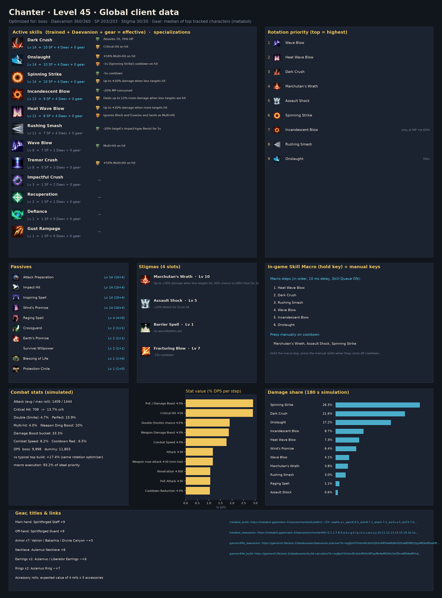
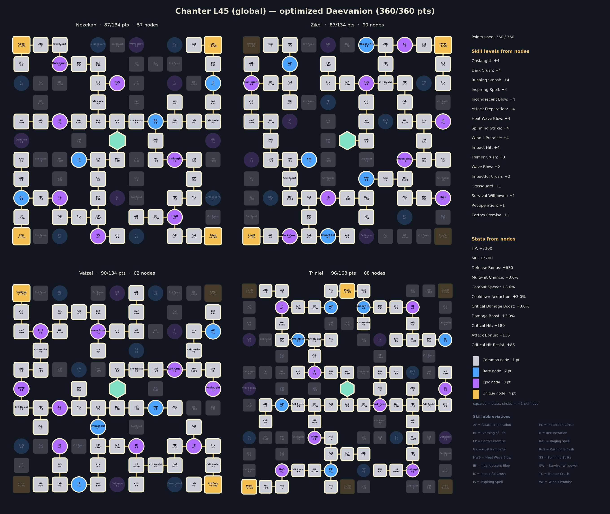
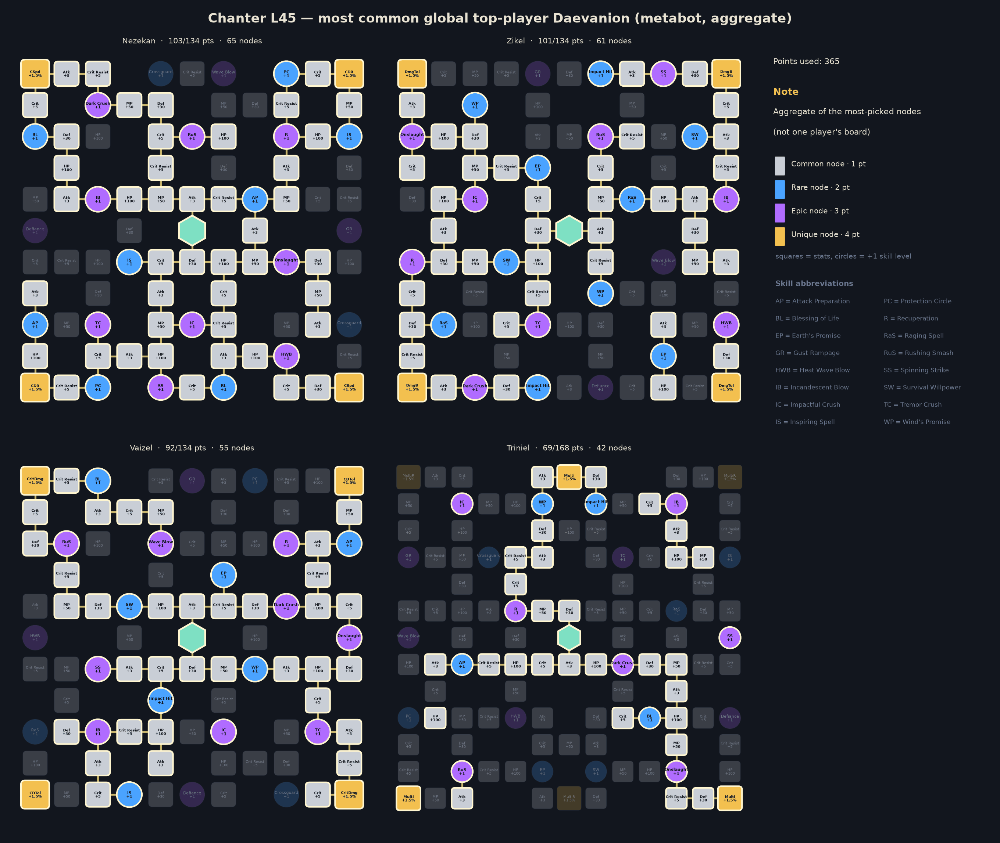

# Chanter — level 45 global build, rotation and macro

Generated by `aion2calc` from the global client data (metabot.gg) with Korean data as fallback. Objective: **boss** fight (see `docs/methodology.md`). Daevanion budget **360** points.



## Results

| Build | boss DPS | dummy DPS |
|---|---:|---:|
| **Optimized (this report)** | **9,998** | **11,803** |
| Typical top global build, optimized rotation | 8,516 | 10,024 |
| Typical top global build, default priority | 7,890 | — |

The optimized build is **+17.4%** over the typical top global build played with the same rotation optimizer, and **+26.7%** over that build played with the default priority. *Typical top global build* = average skill levels, the four most-picked damage stigmas and the most-picked Daevanion nodes of the top tracked global L45 players of this class (metabot.gg live data), given the best legal specializations for its levels (specs are not published).

## Rotation (priority list)

Use the highest skill that is ready; the last entry is the filler.

1. `wave_blow`
2. `heat_wave_blow`
3. `dark_crush`
4. `marchutan_s_wrath`
5. `assault_shock`
6. `spinning_strike`
7. `incandescent_blow [mp_hi]`
8. `rushing_smash`
9. `onslaught`

`[sync_de]` = wait for the Delayed Explosion vulnerability window when it is about to be ready; `[in_ee]` = prefer using it inside Element Enhancement; `[mp_hi]` = only while MP is at least 60% (weave it in, keep MP for Grace of Enhancement).

### In-game Skill Macro

Settings → Key Settings → General → Skill Macro. Skill Queue (스킬 예약) **ON**, 10 ms delay on every step, hold the macro key; manual presses always take priority over the macro.

| Step | Skill |
|---:|---|
| 1 | heat_wave_blow |
| 2 | dark_crush |
| 3 | rushing_smash |
| 4 | wave_blow |
| 5 | incandescent_blow |
| 6 | onslaught |

Manual keys (press on cooldown, in this priority): marchutan_s_wrath, assault_shock, spinning_strike

Simulated: this layout reaches **93.2%** of the ideal priority list.

**Alternative — one-button macro (no manual keys)**: macro wave_blow → heat_wave_blow → dark_crush → marchutan_s_wrath → assault_shock → spinning_strike → rushing_smash → incandescent_blow → onslaught. Simulated: **92.8%** of the ideal priority list.

### Opener (first 30 s of the simulated fight)

```
wave_blow@0.0s → heat_wave_blow@0.9s → dark_crush@1.8s → marchutan_s_wrath@2.7s → assault_shock@3.6s → spinning_strike@4.5s → incandescent_blow@5.5s → incandescent_blow@6.2s → dark_crush@7.0s → incandescent_blow@7.9s → incandescent_blow@8.7s → incandescent_blow@9.4s → incandescent_blow@10.2s → heat_wave_blow@11.0s → dark_crush@11.9s → incandescent_blow@12.8s → incandescent_blow@13.6s → incandescent_blow@14.3s → incandescent_blow@15.1s → incandescent_blow@15.9s → dark_crush@16.6s → incandescent_blow@17.5s → incandescent_blow@18.3s → wave_blow@19.1s → incandescent_blow@20.0s → heat_wave_blow@20.8s → dark_crush@21.7s → incandescent_blow@22.6s
```

## Skills, specializations and points

Skill points used **203 / 203**, stigma points **30 / 30**, Daevanion **360 / 360**.

| Skill | Trained (SP) | Effective level | Specializations |
|---|---:|---:|---|
| Wind's Promise | 10 | 14 | — |
| Onslaught | 10 | 14 | +50% Multi-Hit on hit; -1s [Spinning Strike] cooldown on hit |
| Inspiring Spell | 10 | 14 | — |
| Impact Hit | 10 | 14 | — |
| Spinning Strike | 10 | 14 | -5s cooldown; Up to +20% damage when less targets hit |
| Attack Preparation | 10 | 14 | — |
| Dark Crush | 10 | 14 | Absorbs 70, 70% HP; Critical Hit on hit |
| Incandescent Blow | 9 | 13 | -20% MP consumed; Deals up to 12% more damage when less targets are hit |
| Heat Wave Blow | 8 | 12 | Up to +20% damage when more targets hit; Ignores Block and Evasion and lands as Multi-Hit |
| Rushing Smash | 7 | 11 | -20% target's Impact-type Resist for 5s |
| Wave Blow | 7 | 9 | Multi-Hit on hit |
| Tremor Crush | 5 | 8 | +50% Multi-Hit on hit |
| Raging Spell | 4 | 4 | — |
| Impactful Crush | 1 | 3 | — |
| Survival Willpower | 1 | 2 | — |
| Crossguard | 1 | 2 | — |
| Recuperation | 1 | 2 | — |
| Earth's Promise | 1 | 2 | — |

**Stigmas**: Marchutan's Wrath Lv 10, Assault Shock Lv 5, Barrier Spell Lv 1, Fracturing Blow Lv 7

## Daevanion (360 points)



* Open in metabot planner: https://metabot.gg/en/aion-2/daevanion/chanter#81-0.1.2.7.8.9.a.b.c.g.k.l.p.r.t.u.v.w.x.y.z.10.11.12.13.14.15.19.1b.1e.1f.1g.1i.1j.1k.1m.1o.1q.1r.1s.1t.1u.1x.1y.20.21.22.23.24.25.26.28.2b.2c.2e.2f.2g_82-1.2.6.7.8.9.a.b.c.d.e.f.g.h.i.j.k.l.m.n.p.q.r.u.v.x.y.11.13.14.15.16.19.1a.1c.1d.1e.1h.1i.1j.1l.1n.1o.1p.1t.1u.1v.1w.1x.1y.1z.20.22.23.26.27.28.29.2a.2b_83-0.5.a.b.c.d.e.g.h.i.j.k.l.m.p.q.r.s.u.v.w.10.11.12.13.14.15.16.17.1a.1b.1c.1d.1e.1f.1g.1h.1i.1j.1m.1n.1p.1s.1u.1v.1w.1x.1y.1z.21.22.23.24.25.26.28.29.2a.2b.2d.2f.2g_84-1.2.3.4.5.a.b.c.d.e.f.g.h.k.n.o.s.t.u.v.y.z.10.11.13.19.1a.1b.1c.1e.1f.1i.1n.1o.1p.1r.1s.1t.1u.1v.1w.1x.1y.1z.20.21.22.23.24.26.2b.2c.2g.2l.2m.2n.2o.2r.2s.2t.2u.2w.2x.2y.30.31.32.33
* Open in gamers4.life planner (KR node values, same node IDs): https://gamers4.life/aion-2/database/en/daevanion-planner/?b=eyJjIjoiY2hhbnRlciIsImQiOls4MTAwMzMsODEwMDM0LDgxMDAzNSw4MTAwNDIsODEwMDQzLDgxMDA0OCw4MTAwNTAsODEwMDUxLDgxMDA1Miw4MTAwNTgsODEwMDY3LDgxMDA2OCw4MTAwNzMsODEwMDgyLDgxMDA4Niw4MTAwODgsODEwMDkzLDgxMDA5NCw4MTAwOTUsODEwMDk2LDgxMDA5Nyw4MTAwOTgsODEwMDk5LDgxMDEwMCw4MTAxMDEsODEwMTAyLDgxMDEwMyw4MTAxMTUsODEwMTIzLDgxMDEyNiw4MTAxMjcsODEwMTI4LDgxMDEzMCw4MTAxMzEsODEwMTMyLDgxMDEzOCw4MTAxNDIsODEwMTQ3LDgxMDE1Myw4MTAxNTQsODEwMTU1LDgxMDE1Nyw4MTAxNjEsODEwMTYyLDgxMDE2OCw4MTAxNzAsODEwMTcxLDgxMDE3Miw4MTAxNzQsODEwMTc1LDgxMDE3Niw4MTAxODMsODEwMTg3LDgxMDE4OCw4MTAxOTEsODEwMTkyLDgxMDE5Myw4MjAwMzQsODIwMDM1LDgyMDAzOSw4MjAwNDAsODIwMDQxLDgyMDA0Miw4MjAwNDMsODIwMDQ4LDgyMDA1MCw4MjAwNTIsODIwMDU1LDgyMDA1OCw4MjAwNjMsODIwMDY0LDgyMDA2NSw4MjAwNjcsODIwMDY4LDgyMDA2OSw4MjAwNzAsODIwMDcxLDgyMDA3Myw4MjAwNzgsODIwMDgwLDgyMDA4NCw4MjAwODYsODIwMDkzLDgyMDA5NCw4MjAwOTksODIwMTAxLDgyMDEwMiw4MjAxMDMsODIwMTA5LDgyMDExNCw4MjAxMTcsODIwMTI0LDgyMDEyNSw4MjAxMjYsODIwMTMxLDgyMDEzMiw4MjAxMzMsODIwMTQwLDgyMDE0NCw4MjAxNDUsODIwMTQ2LDgyMDE1NSw4MjAxNTYsODIwMTU3LDgyMDE1OCw4MjAxNTksODIwMTYxLDgyMDE2Miw4MjAxNjMsODIwMTcxLDgyMDE3NCw4MjAxODMsODIwMTg0LDgyMDE4NSw4MjAxODYsODIwMTg3LDgyMDE4OCw4MzAwMzMsODMwMDM5LDgzMDA0OCw4MzAwNTAsODMwMDUxLDgzMDA1Miw4MzAwNTQsODMwMDU4LDgzMDA2Myw4MzAwNjQsODMwMDY1LDgzMDA2Nyw4MzAwNjgsODMwMDY5LDgzMDA3Miw4MzAwNzMsODMwMDc5LDgzMDA4Miw4MzAwODcsODMwMDkzLDgzMDA5NCw4MzAwOTgsODMwMDk5LDgzMDEwMCw4MzAxMDEsODMwMTAyLDgzMDEwMyw4MzAxMDgsODMwMTExLDgzMDExOCw4MzAxMjMsODMwMTI0LDgzMDEyNSw4MzAxMjYsODMwMTI3LDgzMDEyOCw4MzAxMjksODMwMTMwLDgzMDEzMSw4MzAxMzksODMwMTQyLDgzMDE0Nyw4MzAxNTUsODMwMTU3LDgzMDE1OCw4MzAxNTksODMwMTYxLDgzMDE2Miw4MzAxNjMsODMwMTcwLDgzMDE3Miw4MzAxNzQsODMwMTc1LDgzMDE3Niw4MzAxNzgsODMwMTg0LDgzMDE4NSw4MzAxODYsODMwMTg3LDgzMDE4OSw4MzAxOTIsODMwMTkzLDg0MDAxOCw4NDAwMTksODQwMDIyLDg0MDAyMyw4NDAwMjQsODQwMDM0LDg0MDAzNSw4NDAwMzYsODQwMDM3LDg0MDAzOSw4NDAwNDAsODQwMDQxLDg0MDA0Miw4NDAwNDksODQwMDU0LDg0MDA1Nyw4NDAwNjQsODQwMDY1LDg0MDA2Niw4NDAwNjcsODQwMDcxLDg0MDA3Miw4NDAwNzMsODQwMDc0LDg0MDA4MSw4NDAwOTUsODQwMDk2LDg0MDA5Nyw4NDAwOTgsODQwMTAwLDg0MDEwMSw4NDAxMDQsODQwMTE1LDg0MDExNyw4NDAxMTksODQwMTIzLDg0MDEyNCw4NDAxMjUsODQwMTI2LDg0MDEyNyw4NDAxMjgsODQwMTI5LDg0MDEzMCw4NDAxMzEsODQwMTMyLDg0MDEzMyw4NDAxMzQsODQwMTM4LDg0MDE0MSw4NDAxNDcsODQwMTU2LDg0MDE1Nyw4NDAxNjIsODQwMTcyLDg0MDE3Myw4NDAxNzQsODQwMTc3LDg0MDE4NCw4NDAxODUsODQwMTg2LDg0MDE4Nyw4NDAxOTAsODQwMTkxLDg0MDE5Miw4NDAxOTcsODQwMTk4LDg0MDE5OSw4NDAyMDJdfQ
* Full skill/stigma/Daevanion build in metabot planner: https://metabot.gg/en/aion-2/classes/chanter/build#v1~l19~saq0ls.a.c_aqnr4.9.5_arim8.7.1_arqc0.7.1_ary1s.a.5_asl74.7.0_at0mo.8.c_auaxc.5.4_aw0nk.a.5_awvio.a.0_b4t0g.5.0_b5nvk.a.0_b5vlc.a.0_b63b4.a.0_b6b0w.4.0_b6y68.a.0~gawvio_b4t0g_az8e8_asl74~d81-0.1.2.7.8.9.a.b.c.g.k.l.p.r.t.u.v.w.x.y.z.10.11.12.13.14.15.19.1b.1e.1f.1g.1i.1j.1k.1m.1o.1q.1r.1s.1t.1u.1x.1y.20.21.22.23.24.25.26.28.2b.2c.2e.2f.2g_82-1.2.6.7.8.9.a.b.c.d.e.f.g.h.i.j.k.l.m.n.p.q.r.u.v.x.y.11.13.14.15.16.19.1a.1c.1d.1e.1h.1i.1j.1l.1n.1o.1p.1t.1u.1v.1w.1x.1y.1z.20.22.23.26.27.28.29.2a.2b_83-0.5.a.b.c.d.e.g.h.i.j.k.l.m.p.q.r.s.u.v.w.10.11.12.13.14.15.16.17.1a.1b.1c.1d.1e.1f.1g.1h.1i.1j.1m.1n.1p.1s.1u.1v.1w.1x.1y.1z.21.22.23.24.25.26.28.29.2a.2b.2d.2f.2g_84-1.2.3.4.5.a.b.c.d.e.f.g.h.k.n.o.s.t.u.v.y.z.10.11.13.19.1a.1b.1c.1e.1f.1i.1n.1o.1p.1r.1s.1t.1u.1v.1w.1x.1y.1z.20.21.22.23.24.26.2b.2c.2g.2l.2m.2n.2o.2r.2s.2t.2u.2w.2x.2y.30.31.32.33

For comparison, the aggregate of the most-picked nodes among top global players:



## Stat priority (simulated)

| Upgrade | DPS gain | Worth in Attack |
|---|---:|---:|
| PvE / Damage Boost +3% | +2.90% | 74 |
| Critical Hit +50 | +2.90% | 74 |
| Double (Smite) chance +2% | +1.90% | 49 |
| Weapon Damage Boost +3% | +1.86% | 48 |
| Combat Speed +3% | +1.76% | 45 |
| Attack +30 | +1.17% | 30 |
| Weapon max attack +30 (min too) | +1.17% | 30 |
| Penetration +300 | +1.06% | 27 |
| PvE Attack +30 | +1.06% | 27 |
| Cooldown Reduction +3% | +1.04% | 27 |
| Wisdom +10 (Double +1%) | +0.95% | 24 |
| Critical Damage Boost +3% | +0.68% | 17 |
| Time +10 (Combat Speed +1%) | +0.59% | 15 |
| Might +10 (Attack +1%) | +0.52% | 13 |
| Destruction +10 (Attack +1%) | +0.52% | 13 |
| Critical Attack +50 | +0.50% | 13 |
| Death +10 (Crit +1%) | +0.42% | 11 |
| Illusion +10 (Cooldown -1%) | +0.35% | 9 |
| Multi-hit chance +3% | +0.33% | 8 |
| Perfect chance +3% | +0.04% | 1 |
| Justice +10 (Perfect +1%) | +0.01% | 0 |
| MP +300 | -1.02% | -26 |

Accuracy is a threshold stat (avoid parries; back attacks ignore them) and is not ranked.

## Gear, rolls, enchanting

Loadout: **Global L45 Chanter - median of top tracked characters (metabot)**

* Main hand: Spiritforged Staff +9
* Off-hand: Spiritforged Guard +9
* Armor x7: Vakron / Bakarma / Divine Canyon ~+5
* Necklace: Aulamus Necklace +8
* Earrings x2: Aulamus / Liberator Earrings ~+6
* Rings x2: Aulamus Ring ~+7
* Accessory rolls: expected value of 4 rolls x 5 accessories
* Bracelets x2: Ascension +9 / Liberator +6
* Amulet: Revelation Amulet +0
* Rune: Clash Rune +2
* Attack title: Guardian of Altgard / Verteron
* Other title: Through Hell and Back
* Owned titles: collection bonuses (estimate)
* Wings: Ultimate Daeva Wings
* Primary/deity stats: profile averages

**Random-roll priority per item** (keep / reroll toward the top of each list):

* **Rupture Tome**: Combat Speed (+8.8% – +10.2%), Damage Boost (+4.9% – +5.7%), Weapon Damage Boost (+6.5% – +7.6%), Critical Hit (+46 – +60), Front Attack (+65 – +82)
* **Ludras Grimoire**: Combat Speed (+11.2% – +13%), Damage Boost (+6.3% – +7.3%), Weapon Damage Boost (+8.3% – +9.6%), Critical Hit (+59 – +75), Front Attack (+83 – +102)
* **Spiritforged Guard**: Might (+10 – +10), Accuracy (+30 – +30)
* **Vakron Helm**: Critical Hit (+25 – +36), Double Chance (+1.6% – +1.9%), Attack increase (+1.6% – +1.9%), Attack (+16 – +25), Natural MP Regen (+18 – +28)
* **Bakarma Breastplate**: Damage Boost (+4.4% – +5.2%), Critical Hit (+27 – +38), Attack (+18 – +28), Perfect Chance (+3.9% – +4.6%), Natural MP Regen (+20 – +30)
* **Aulamus Necklace**: Critical Hit (+35 – +47), Combat Speed (+3.2% – +3.8%), Attack (+23 – +33), Might (+9 – +17), Precision (+9 – +17)
* **Aulamus Ring**: Critical Hit (+25 – +36), Attack (+16 – +25), Might (+5 – +13), Precision (+5 – +13), Natural MP Regen (+18 – +28)

**Enchant priority** (DPS per enchant level):

* Weapon (Spiritforged / Rupture): 32.2 DPS/level
* Guard (off-hand): 19.5 DPS/level
* Necklace / Earrings / Rings (Aulamus): 15.6 DPS/level
* Bracelets: 11.7 DPS/level
* Revelation Amulet: 10.6 DPS/level
* Armor pieces: 0.0 DPS/level

## Titles, arcana, wings, pets

**Best titles by equip bonus** (global client values):

| Title | Grade | Equip bonus | Owned bonus |
|---|---|---|---|
| Unbound by Genus (Both factions) | Unique | PvE Damage Boost +4.5%, Attack Bonus +34, Critical Hit +68 | PvE Damage Boost +1% |
| Guardian of Altgard (Asmodian) | Epic | PvE Damage Boost +3%, Penetration +210 | PvE Attack +4 |
| Guardian of Verteron (Elyos) | Epic | PvE Damage Boost +3%, Penetration +210 | PvE Attack +4 |
| Saint of Ereshkigal (Both factions) | Unique | PvP Damage Boost +4%, Endurance Penetration +2.5%, Critical Hit +60 | PvP Accuracy +20 |
| You're My Gem (Both factions) | Epic | Critical Hit +52, Critical Attack +39 | Natural MP Regen +5 |
| Empty Closet (Both factions) | Unique | Combat Speed +3.5%, Natural HP Regen +42, Cooldown Reduction +3.5% | HP +120 |
| Scenery Collector (Both factions) | Epic | PvE Damage Boost +3.3%, Block Penetration +54 | Critical Hit +10 |
| Teleportation Specialist (Both factions) | Epic | PvE Accuracy +58, PvE Damage Boost +3.1% | Critical Hit +10 |
| Shaking Off the World's Shackles (Both factions) | Epic | Accuracy Bonus +50, Critical Hit +50 | Penetration +20 |
| Nice to Meet You (Both factions) | Rare | PvE Damage Boost +2.9% | PvE Defense +10 |

**Arcana variant per slot** (deity stat that is worth more for this build):

* Chalice / Grail: **Vigor or Frenzy** (Time +20)
* Parchment: either variant (Life +20 / Destiny +20: no damage either way)
* Compass: **Magic or Purity** (Death +20)
* Bell: **Magic or Purity** (Destruction +20)
* Mirror: **Magic or Purity** (Wisdom +20)

**Arcana random skill option** (Unique arcana roll one option from the class pool when soul-bound, up to +4; simulated DPS gain on this build):

| Skill | +1 | +2 | +3 | +4 |
|---|---:|---:|---:|---:|
| Wind's Promise | +0.93% | +1.86% | +2.80% | +3.74% |
| Inspiring Spell | +0.73% | +0.94% | +1.69% | +2.12% |
| Impact Hit | +0.29% | +0.57% | +0.86% | +1.14% |
| Crossguard | +0.00% | +0.00% | +0.00% | +0.00% |
| Earth's Promise | +0.00% | +0.00% | +0.00% | +0.00% |

The pool holds passives only, so at level 45 an active skill still stops at Lv 14 (10 from skill points + 4 Daevanion nodes); the Lv 16 specialization options are out of reach.

**Deity (pantheon) stats**, +10 points each (arcana main stats, Abyssal Bracelet rolls, Monolith rewards): Wisdom +0.95%, Time +0.59%, Might +0.52%, Destruction +0.52%, Death +0.42%, Illusion +0.35%, Justice +0.01%.

**Closet / appearance collection**: every unlocked skin and costume set adds permanent Collection Effect stats, and wings keep a Retention Effect once owned. The client tables for these are not public, so they are not itemised here; they are flat stats, so value them with the stat table above and collect the cheap ones first.

**Wings**: Ultimate Daeva Wings (Accuracy +40, Penetration +500) are the most used and the best launch option for damage among common wings. **Pets**: pet collection bonuses are mostly genus-specific (damage vs that monster genus) plus Accuracy/Crit; level the genus of the content you farm first.

## Robustness

Every animation time was randomly perturbed by up to ±25% (8 samples) and the rotation re-optimized each time. Playing the recommended priority instead of the re-optimized one lost on average **0.02%** (worst 0.02%).

**Crit curve.** The crit-chance curve is fitted to tests at Crit 1048–1326 and extrapolated down to launch values: this build sits at **13.7%** crit, and Crit +50 ranks #2 (+2.90%). If launch testing shows more crit — e.g. the curve shifted to a midpoint of 700, giving 54% — Crit +50 becomes #1 (+4.39%). Re-run with `--crit-midpoint` once real numbers exist.

## Validation against Korean logs

Simulated damage shares (training dummy) overlap **45%** with the mean of the top-10 A2DIL Korean dummy logs; 52% of the Korean damage comes from skills that are not in the global level-45 client. Korea plays above level 45 with Lv 16-20 specializations, so a perfect match is not expected; low values mean the class kit needs hand-tuning (see `kit/sorcerer.py` for a hand-written kit).

## Sources

* metabot.gg (global client): class skills, Daevanion boards, items, titles, top-player statistics
* gamers4.life (KR database): skill hit counts, build/Daevanion planners
* A2DIL (KR training-dummy logs): damage-share validation
* Inven / Bahamut damage research, aion2ssow calculator: damage formula

See `docs/methodology.md` for every formula and assumption.
