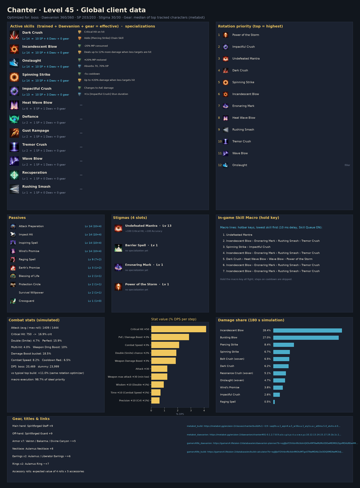
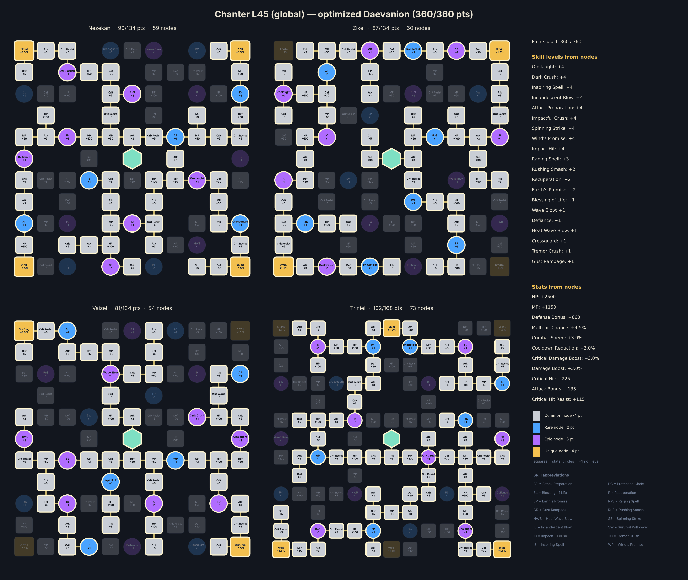
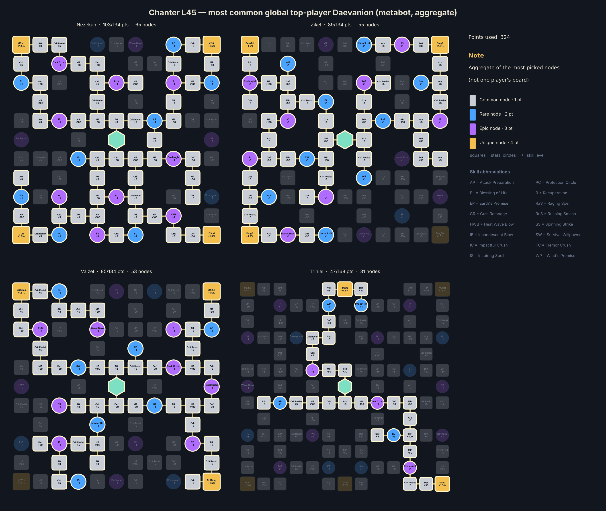

# Chanter — level 45 global build, rotation and macro

Generated by `aion2calc` from the global client data (metabot.gg) with Korean data as fallback. Primary view: **boss** fight (see `docs/methodology.md`). Daevanion budget **416** points.



## Damage objective: boss modeled DPS

Score: 37,594 modeled DPS.

boss: 100%, 180.0s, 37,594 DPS

Damage objective subject to the saved HP and trained-skill reserves. Balanced uses equal scenario weights. Stat weights follow the selected objective; skill shares, opener, macro and sensitivity remain primary-scenario views. This local search does not establish a global optimum or competitive PvP efficacy.

## Results

| Build | boss DPS | dummy DPS |
|---|---:|---:|
| **Optimized (this report)** | **37,594** | **41,947** |
| Typical top global build, optimized rotation | 35,550 | 39,190 |
| Typical top global build, default priority | 29,928 | — |

**Whole fight:** 22,668 DPS on the boss scenario, the same rotation stretched over the 40% of a recorded boss fight this class's players spend pressing nothing or dodging (the log server's public uploads). The table above is the rotation's own DPS, which the optimizer compares builds by; a parse on the log server is a whole fight's.

The optimized build is **+5.7%** over the typical top global build played with the same rotation optimizer, and **+25.6%** over that build played with the default priority. *Typical top global build* = average skill levels, the four most-picked damage stigmas and the most-picked Daevanion nodes of the top tracked global L45 players of this class (metabot.gg live data), fitted to this build's skill and stigma points (spare points raise its most-levelled skills and stigmas first) and given the best legal specializations for its levels (specs are not published), with the same bonus levels from gear rolls and arcana cards as this build.

## Rotation (priority list)

Use the highest skill that is ready; the last entry is the filler.

1. `undefeated`
2. `dark_crush`
3. `stormpower`
4. `spinning_strike`
5. `marchutan`
6. `impactful_crush`
7. `incandescent_blow`
8. `wave_blow`
9. `rushing_smash`
10. `tremor_crush`
11. `gust_rampage`
12. `heat_wave_blow`
13. `onslaught`

`[sync_de]` = wait for the Delayed Explosion vulnerability window when it is about to be ready; `[in_ee]` = prefer using it inside Element Enhancement; `[mp_hi]` = only while MP is at least 60% (weave it in, keep MP for Grace of Enhancement).

### In-game Skill Macro

**Left mouse button** is the basic auto-attack: `onslaught`. Hold it for continuous attacks; the Skill Macro below goes on the **right mouse button** (or another held key). Weave both together.

Each line is a hotbar key: put its skills on that key in the order listed, the first lowest (a key holds up to four). The macro casts a key's skills from first to last, skipping any that cannot be cast, then moves to the next line. Then Settings → Key Settings → General → Skill Macro: add the keys as macro lines from top to bottom, a key listed twice added twice. Skill Queue (스킬 예약) **ON**, 10 ms delay on every line, hold the macro key; manual presses always take priority over the macro. A skill's key presses its chain step while the chain is open, in the macro too.

| Line | Hotbar key holds (cast in this order) |
|---:|---|
| 1 | undefeated › spinning_strike › marchutan › dark_crush |
| 2 | stormpower › impactful_crush |
| 3 | the same key as line 1, pressed again: its skills are tried twice a round |
| 4 | incandescent_blow › wave_blow › gust_rampage |
| 5 | rushing_smash |
| 6 | tremor_crush › heat_wave_blow |
| 7 | the same key as line 1, pressed again: its skills are tried twice a round |
| 8 | the same key as line 2, pressed again: its skills are tried twice a round |
| 9 | the same key as line 1, pressed again: its skills are tried twice a round |
| 10 | the same key as line 2, pressed again: its skills are tried twice a round |
| 11 | the same key as line 5, pressed again: its skills are tried twice a round |

Manual keys (press on cooldown, in this priority): none — hold the macro key for the whole fight

Simulated: this layout reaches **85.5%** of the ideal priority list.

**Alternative — one skill per macro line**: macro impactful_crush → wave_blow → rushing_smash → tremor_crush → gust_rampage → heat_wave_blow → onslaught; manual: undefeated, dark_crush, stormpower, spinning_strike, marchutan, incandescent_blow. Simulated: **94.4%** of the ideal priority list.

### Opener (first 30 s of the simulated fight)

```
undefeated@0.0s → stormpower@0.6s → spinning_strike@1.6s → dark_crush@2.0s → dark_crush@2.8s → marchutan@3.7s → dark_crush@4.5s → dark_crush@5.4s → dark_crush@6.2s → impactful_crush@7.1s → dark_crush@7.4s → dark_crush@8.3s → incandescent_blow@9.2s → incandescent_blow@10.3s → incandescent_blow@11.4s → incandescent_blow@12.5s → incandescent_blow@13.6s → incandescent_blow@14.7s → incandescent_blow@15.8s → incandescent_blow@16.9s → incandescent_blow@18.0s → incandescent_blow@19.1s → incandescent_blow@20.3s → impactful_crush@21.4s → dark_crush@21.7s → dark_crush@22.7s → incandescent_blow@23.8s → spinning_strike@25.1s
```

## Skills, specializations and points

Skill points used **383 / 383**, stigma points **300 / 300**, Daevanion **416 / 416**.

Bonus skill levels from gear rolls and arcana cards **64 / 76** (at most 13 on one skill): Incandescent Blow +10, Attack Preparation +6, Dark Crush +6, Impact Hit +6, Impactful Crush +6, Inspiring Spell +6, Onslaught +6, Raging Spell +6, Spinning Strike +6, Wind's Promise +6. They count in the effective levels below; get them from your gear's skill rolls and arcana cards' skill options.

| Skill | Trained (SP) | Effective level | Specializations |
|---|---:|---:|---|
| Incandescent Blow | 10 | 24 | -20% MP consumed; Deals up to 12% more damage when less targets are hit; Ignores Block and Evasion and lands as Multi-Hit |
| Attack Preparation | 10 | 20 | — |
| Dark Crush | 10 | 20 | Critical Hit on hit; Adds [Piercing Strike] Chain Skill; Removes [Dark Crush] cooldown |
| Impact Hit | 10 | 20 | — |
| Impactful Crush | 10 | 20 | Changes to AoE damage; +1s [Impactful Crush] Stun duration; +30% Skill Speed |
| Inspiring Spell | 10 | 20 | — |
| Onslaught | 10 | 20 | +20% MP restored; Absorbs 70, 70% HP; +50% Multi-Hit on hit |
| Raging Spell | 10 | 20 | — |
| Spinning Strike | 10 | 20 | -5s cooldown; Up to +20% damage when less targets hit; Ignores Block and Evasion and lands as a Critical Hit |
| Wind's Promise | 10 | 20 | — |
| Crossguard | 10 | 13 | — |
| Earth's Promise | 10 | 13 | — |
| Blessing of Life | 10 | 12 | — |
| Gust Rampage | 10 | 12 | Absorbs 500, 500% HP; Restores 120 MP |
| Protection Circle | 10 | 12 | — |
| Tremor Crush | 10 | 12 | Restores 300 Stamina on hit; +10m [Tremor Crush] range |
| Survival Willpower | 10 | 11 | — |
| Defiance | 10 | 10 | Adds [Crushing Strike] Chain Skill |
| Heat Wave Blow | 5 | 7 | — |
| Recuperation | 1 | 4 | — |
| Rushing Smash | 1 | 3 | — |
| Wave Blow | 1 | 3 | — |

**Stigmas**: Marchutan's Wrath Lv 20, Guardian Blessing Lv 20, Undefeated Mantra Lv 20, Power of the Storm Lv 20

## Daevanion (416 points)



* Open in metabot planner: https://metabot.gg/en/aion-2/daevanion/chanter#81-0.1.2.3.4.6.7.8.9.a.b.c.d.e.f.g.h.i.j.k.m.n.o.p.q.r.s.t.u.v.w.x.y.z.10.11.12.13.14.15.17.19.1b.1c.1d.1e.1f.1g.1h.1i.1j.1k.1l.1m.1n.1o.1p.1q.1r.1s.1u.1v.1w.1x.1y.20.21.22.23.24.25.26.27.28.29.2a.2b.2c.2e.2f.2g_82-1.2.3.4.5.6.7.8.9.a.b.c.f.g.h.i.j.p.q.r.s.t.u.v.w.z.10.11.12.13.14.15.16.17.19.1c.1d.1e.1f.1g.1h.1i.1j.1k.1l.1n.1o.1p.1r.1s.1t.1u.1y.22.24.26.27.28.29.2a.2b.2d.2e_83-0.1.2.5.a.b.c.d.e.h.i.k.l.m.n.o.p.q.r.s.u.v.w.z.10.13.14.15.1a.1d.1e.1f.1g.1h.1i.1j.1m.1n.1o.1p.1q.1r.1s.1t.1u.1w.1y.1z.21.22.23.24.25.26.29.2a.2d.2e.2f.2g_84-1.2.3.4.a.d.e.g.h.i.j.k.l.n.o.p.q.r.s.t.u.v.w.x.y.z.10.11.13.14.17.18.19.1a.1b.1c.1e.1f.1g.1n.1o.1p.1r.1s.1t.1u.1v.1w.1x.1y.1z.20.21.22.23.24.25.26.29.2a.2b.2c.2d.2e.2g.2h.2j.2k.2l.2n.2o.2q.2r.2u.2y.30.31.32.33.36.37.38
* Open in gamers4.life planner (KR node values, same node IDs): https://gamers4.life/aion-2/database/en/daevanion-planner/?b=eyJjIjoiY2hhbnRlciIsImQiOls4MTAwMzMsODEwMDM0LDgxMDAzNSw4MTAwMzcsODEwMDM4LDgxMDA0MSw4MTAwNDIsODEwMDQzLDgxMDA0OCw4MTAwNTAsODEwMDUxLDgxMDA1Miw4MTAwNTQsODEwMDU1LDgxMDA1Niw4MTAwNTgsODEwMDYzLDgxMDA2NCw4MTAwNjUsODEwMDY3LDgxMDA2OSw4MTAwNzEsODEwMDcyLDgxMDA3Myw4MTAwNzksODEwMDgyLDgxMDA4NCw4MTAwODYsODEwMDg4LDgxMDA5Myw4MTAwOTQsODEwMDk1LDgxMDA5Niw4MTAwOTcsODEwMDk4LDgxMDA5OSw4MTAxMDAsODEwMTAxLDgxMDEwMiw4MTAxMDMsODEwMTExLDgxMDExNSw4MTAxMjMsODEwMTI0LDgxMDEyNSw4MTAxMjYsODEwMTI3LDgxMDEyOCw4MTAxMjksODEwMTMwLDgxMDEzMSw4MTAxMzIsODEwMTMzLDgxMDEzOCw4MTAxNDAsODEwMTQyLDgxMDE0NCw4MTAxNDcsODEwMTUzLDgxMDE1NCw4MTAxNTcsODEwMTU4LDgxMDE1OSw4MTAxNjEsODEwMTYyLDgxMDE2OCw4MTAxNzAsODEwMTcxLDgxMDE3Miw4MTAxNzQsODEwMTc1LDgxMDE3Niw4MTAxNzgsODEwMTgzLDgxMDE4NCw4MTAxODUsODEwMTg3LDgxMDE4OCw4MTAxOTEsODEwMTkyLDgxMDE5Myw4MjAwMzQsODIwMDM1LDgyMDAzNiw4MjAwMzcsODIwMDM4LDgyMDAzOSw4MjAwNDAsODIwMDQxLDgyMDA0Miw4MjAwNDMsODIwMDQ4LDgyMDA1MCw4MjAwNTgsODIwMDYzLDgyMDA2NCw4MjAwNjUsODIwMDY3LDgyMDA3Myw4MjAwNzgsODIwMDgwLDgyMDA4MSw4MjAwODIsODIwMDg0LDgyMDA4Niw4MjAwODgsODIwMDk1LDgyMDA5Nyw4MjAwOTksODIwMTAwLDgyMDEwMSw4MjAxMDIsODIwMTAzLDgyMDEwOSw4MjAxMTIsODIwMTE0LDgyMDEyNCw4MjAxMjUsODIwMTI2LDgyMDEyNyw4MjAxMjksODIwMTMxLDgyMDEzMiw4MjAxMzMsODIwMTM4LDgyMDE0MCw4MjAxNDQsODIwMTQ1LDgyMDE0Niw4MjAxNTMsODIwMTU0LDgyMDE1NSw4MjAxNTYsODIwMTYxLDgyMDE3MSw4MjAxNzYsODIwMTgzLDgyMDE4NCw4MjAxODUsODIwMTg2LDgyMDE4Nyw4MjAxODgsODIwMTkwLDgyMDE5MSw4MzAwMzMsODMwMDM0LDgzMDAzNSw4MzAwMzksODMwMDQ4LDgzMDA1MCw4MzAwNTEsODMwMDUyLDgzMDA1NCw4MzAwNjMsODMwMDY0LDgzMDA2Nyw4MzAwNjgsODMwMDY5LDgzMDA3MCw4MzAwNzEsODMwMDcyLDgzMDA3Myw4MzAwNzksODMwMDgyLDgzMDA4Nyw4MzAwOTMsODMwMDk0LDgzMDA5Nyw4MzAwOTgsODMwMTAxLDgzMDEwMiw4MzAxMDMsODMwMTE4LDgzMDEyNSw4MzAxMjYsODMwMTI3LDgzMDEyOCw4MzAxMjksODMwMTMwLDgzMDEzMSw4MzAxMzksODMwMTQyLDgzMDE0NCw4MzAxNDcsODMwMTUzLDgzMDE1NCw4MzAxNTUsODMwMTU2LDgzMDE1Nyw4MzAxNTksODMwMTYyLDgzMDE2Myw4MzAxNzAsODMwMTcyLDgzMDE3NCw4MzAxNzUsODMwMTc2LDgzMDE3OCw4MzAxODUsODMwMTg2LDgzMDE4OSw4MzAxOTEsODMwMTkyLDgzMDE5Myw4NDAwMTgsODQwMDE5LDg0MDAyMiw4NDAwMjMsODQwMDM0LDg0MDAzNyw4NDAwMzksODQwMDQxLDg0MDA0Miw4NDAwNDQsODQwMDQ3LDg0MDA0OSw4NDAwNTIsODQwMDU0LDg0MDA1Nyw4NDAwNTksODQwMDYyLDg0MDA2Myw4NDAwNjQsODQwMDY1LDg0MDA2Niw4NDAwNjcsODQwMDY5LDg0MDA3MCw4NDAwNzEsODQwMDcyLDg0MDA3Myw4NDAwNzQsODQwMDgxLDg0MDA4NSw4NDAwOTMsODQwMDk0LDg0MDA5NSw4NDAwOTYsODQwMDk3LDg0MDA5OCw4NDAxMDAsODQwMTAxLDg0MDEwMiw4NDAxMTUsODQwMTE3LDg0MDExOSw4NDAxMjMsODQwMTI0LDg0MDEyNSw4NDAxMjYsODQwMTI3LDg0MDEyOCw4NDAxMjksODQwMTMwLDg0MDEzMSw4NDAxMzIsODQwMTMzLDg0MDEzNCw4NDAxMzgsODQwMTQxLDg0MDE0NSw4NDAxNDcsODQwMTU0LDg0MDE1NSw4NDAxNTYsODQwMTU3LDg0MDE1OSw4NDAxNjAsODQwMTYyLDg0MDE2Myw4NDAxNjcsODQwMTY5LDg0MDE3Miw4NDAxNzQsODQwMTc3LDg0MDE4Miw4NDAxODQsODQwMTg3LDg0MDE5Miw4NDAxOTcsODQwMTk4LDg0MDE5OSw4NDAyMDIsODQwMjA3LDg0MDIwOCw4NDAyMDldfQ
* Full skill/stigma/Daevanion build in metabot planner: https://metabot.gg/en/aion-2/classes/chanter/build#v1~l19~saq0ls.a.7.6_aqnr4.a.l.a_ar36o.a.b.6_ary1s.a.s.6_at0mo.5.0_atvhs.k.0_au37k.a.1_auaxc.a.3_av5sg.k.0_aw0nk.a.l.6_aw8dc.a.3_awvio.k.0_aysyo.k.0_b50q8.a.0_b58g0.a.0_b5g5s.a.0_b5nvk.a.0.6_b5vlc.a.0.6_b63b4.a.0.6_b6b0w.a.0.6_b6iqo.a.0_b6qgg.a.0_b6y68.a.0.6~gawvio_aysyo_atvhs_av5sg~d81-0.1.2.3.4.6.7.8.9.a.b.c.d.e.f.g.h.i.j.k.m.n.o.p.q.r.s.t.u.v.w.x.y.z.10.11.12.13.14.15.17.19.1b.1c.1d.1e.1f.1g.1h.1i.1j.1k.1l.1m.1n.1o.1p.1q.1r.1s.1u.1v.1w.1x.1y.20.21.22.23.24.25.26.27.28.29.2a.2b.2c.2e.2f.2g_82-1.2.3.4.5.6.7.8.9.a.b.c.f.g.h.i.j.p.q.r.s.t.u.v.w.z.10.11.12.13.14.15.16.17.19.1c.1d.1e.1f.1g.1h.1i.1j.1k.1l.1n.1o.1p.1r.1s.1t.1u.1y.22.24.26.27.28.29.2a.2b.2d.2e_83-0.1.2.5.a.b.c.d.e.h.i.k.l.m.n.o.p.q.r.s.u.v.w.z.10.13.14.15.1a.1d.1e.1f.1g.1h.1i.1j.1m.1n.1o.1p.1q.1r.1s.1t.1u.1w.1y.1z.21.22.23.24.25.26.29.2a.2d.2e.2f.2g_84-1.2.3.4.a.d.e.g.h.i.j.k.l.n.o.p.q.r.s.t.u.v.w.x.y.z.10.11.13.14.17.18.19.1a.1b.1c.1e.1f.1g.1n.1o.1p.1r.1s.1t.1u.1v.1w.1x.1y.1z.20.21.22.23.24.25.26.29.2a.2b.2c.2d.2e.2g.2h.2j.2k.2l.2n.2o.2q.2r.2u.2y.30.31.32.33.36.37.38

For comparison, the aggregate of the most-picked nodes among top global players:



## Stat priority (simulated)

| Upgrade | DPS gain | Worth in Attack |
|---|---:|---:|
| Combat Speed +3% | +2.72% | 78 |
| PvE / Damage Boost +3% | +2.69% | 77 |
| Critical Hit +50 | +2.63% | 75 |
| Double (Smite) chance +2% | +1.87% | 53 |
| Weapon Damage Boost +3% | +1.86% | 53 |
| Critical Damage Boost +3% | +1.08% | 31 |
| Attack +30 | +1.05% | 30 |
| Weapon max attack +30 (min too) | +1.05% | 30 |
| Wisdom +10 (Double +1%) | +0.93% | 27 |
| Time +10 (Combat Speed +1%) | +0.91% | 26 |
| Cooldown Reduction +3% | +0.73% | 21 |
| Critical Attack +50 | +0.53% | 15 |
| Penetration +300 | +0.50% | 14 |
| PvE Attack +30 | +0.50% | 14 |
| Might +10 (Attack +1%) | +0.47% | 13 |
| Destruction +10 (Attack +1%) | +0.47% | 13 |
| Precision +10 (Crit +1%) | +0.45% | 13 |
| Death +10 (Crit +1%) | +0.45% | 13 |
| Back Attack +30 | +0.27% | 8 |
| Illusion +10 (Cooldown -1%) | +0.24% | 7 |
| Multi-hit chance +3% | +0.20% | 6 |
| Front Attack +30 | +0.11% | 3 |
| Perfect chance +3% | +0.03% | 1 |
| Justice +10 (Perfect +1%) | +0.01% | 0 |
| MP +300 | +0.00% | 0 |
| Freedom +10 (Accuracy +1%) | +0.00% | 0 |

Accuracy is a threshold stat (avoid parries; back attacks ignore them) and is not ranked.

## Gear, rolls, enchanting

Loadout: **Global L45 Chanter - median of top tracked characters (metabot)**

* Main hand: Spiritforged Staff +9
* Off-hand: Spiritforged Guard +9
* Armor x7: Vakron / Bakarma / Divine Canyon ~+5
* Necklace: Aulamus Necklace +8
* Earrings x2: Aulamus / Liberator Earrings ~+6
* Rings x2: Aulamus Ring ~+7
* Accessory rolls: expected value of 4 rolls x 5 accessories
* Bracelets x2: Ascension +9 / Liberator +6
* Amulet: Revelation Amulet +0
* Rune: Clash Rune +2
* Attack title: Guardian of Altgard / Verteron
* Other title: Through Hell and Back
* Owned titles: collection bonuses (estimate)
* Wings: Ultimate Daeva Wings
* Primary/deity stats: profile averages

**Random-roll priority per item** (keep / reroll toward the top of each list):

* **Rupture Tome**: Combat Speed (+8.8% – +10.2%), Damage Boost (+4.9% – +5.7%), Weapon Damage Boost (+6.5% – +7.6%), Critical Hit (+46 – +60), Attack (+30 – +42)
* **Ludras Grimoire**: Combat Speed (+11.2% – +13%), Damage Boost (+6.3% – +7.3%), Weapon Damage Boost (+8.3% – +9.6%), Critical Hit (+59 – +75), Attack (+38 – +51)
* **Spiritforged Guard**: Might (+10 – +10), Accuracy (+30 – +30)
* **Vakron Helm**: Double Chance (+1.6% – +1.9%), Critical Hit (+25 – +36), Attack increase (+1.6% – +1.9%), Attack (+16 – +25), MP (+76 – +94)
* **Bakarma Breastplate**: Damage Boost (+4.4% – +5.2%), Critical Hit (+27 – +38), Attack (+18 – +28), Perfect Chance (+3.9% – +4.6%), MP (+83 – +102)
* **Aulamus Necklace**: Combat Speed (+3.2% – +3.8%), Critical Hit (+35 – +47), Attack (+23 – +33), Might (+9 – +17), Precision (+9 – +17)
* **Aulamus Ring**: Critical Hit (+25 – +36), Attack (+16 – +25), Might (+5 – +13), Precision (+5 – +13), Natural MP Regen (+18 – +28)

**Enchant priority** (DPS per enchant level):

* Weapon (Spiritforged / Rupture): 108.9 DPS/level
* Guard (off-hand): 66.0 DPS/level
* Necklace / Earrings / Rings (Aulamus): 52.8 DPS/level
* Bracelets: 39.6 DPS/level
* Revelation Amulet: 18.7 DPS/level
* Armor pieces: 0.0 DPS/level

## Titles, arcana, wings, pets

**Best titles by equip bonus** (global client values):

| Title | Grade | Equip bonus | Owned bonus |
|---|---|---|---|
| Unbound by Genus (Both factions) | Unique | PvE Damage Boost +4.5%, Attack Bonus +34, Critical Hit +68 | PvE Damage Boost +1% |
| Empty Closet (Both factions) | Unique | Combat Speed +3.5%, Natural HP Regen +42, Cooldown Reduction +3.5% | HP +120 |
| Saint of Ereshkigal (Both factions) | Unique | PvP Damage Boost +4%, Endurance Penetration +2.5%, Critical Hit +60 | PvP Accuracy +20 |
| You're My Gem (Both factions) | Epic | Critical Hit +52, Critical Attack +39 | Natural MP Regen +5 |
| Guardian of Altgard (Asmodian) | Epic | PvE Damage Boost +3%, Penetration +210 | PvE Attack +4 |
| Guardian of Verteron (Elyos) | Epic | PvE Damage Boost +3%, Penetration +210 | PvE Attack +4 |
| Scenery Collector (Both factions) | Epic | PvE Damage Boost +3.3%, Block Penetration +54 | Critical Hit +10 |
| Teleportation Specialist (Both factions) | Epic | PvE Accuracy +58, PvE Damage Boost +3.1% | Critical Hit +10 |
| Steps on the Journey (Both factions) | Unique | Combat Speed +3%, Natural Stamina Regen +28, HP +900 | Accuracy Bonus +10 |
| Shaking Off the World's Shackles (Both factions) | Epic | Accuracy Bonus +50, Critical Hit +50 | Penetration +20 |

**Arcana variant per slot** (deity stat that is worth more for this build):

* Chalice / Grail: **Vigor or Frenzy** (Time +20)
* Parchment: either variant (Life +20 / Destiny +20: no damage either way)
* Compass: **Magic or Purity** (Death +20)
* Bell: **Magic or Purity** (Destruction +20)
* Mirror: **Magic or Purity** (Wisdom +20)

**Arcana skill rolls.** Each arcana gives (grade base + enhancement level) random skill levels from its slot's pool — Rare 2, Legend 3, Unique 4 base rolls, +1 per enhancement level (so a Unique +5 gives 9); a skill rolled again gains another level, up to the cap. Chalice, Parchment and Compass roll active skills; Bell and Mirror roll passives.

| Arcana slot | Expected DPS, Unique +0 (4 rolls) | Expected DPS, Unique +5 (9 rolls) | Best rolls (+1 / +2) |
|---|---:|---:|---|
| Mirror | +0.9% | +2.0% | Inspiring Spell +0.5% / +1.0%, Wind's Promise +0.3% / +0.7%, Impact Hit +0.3% / +0.6% |
| Chalice | +0.6% | +1.2% | Incandescent Blow +0.6% / +1.2%, Inspiring Spell +0.5% / +1.0%, Dark Crush +0.5% / +1.0% |
| Parchment | +0.5% | +1.1% | Dark Crush +0.5% / +1.0%, Onslaught +0.2% / +0.3%, Spinning Strike +0.1% / +0.2% |
| Compass | +0.4% | +1.0% | Incandescent Blow +0.6% / +1.2%, Impactful Crush +0.0% / +0.1%, Tremor Crush +0.0% / +0.0% |
| Bell | +0.3% | +0.7% | Attack Preparation +0.4% / +0.9%, Raging Spell +0.0% / +0.0%, Blessing of Life +0.0% / +0.0% |

Biggest single-level jumps (usually a specialization unlocking at Lv 16): Inspiring Spell +0.7%, Incandescent Blow +0.6%, Dark Crush +0.5%, Attack Preparation +0.4%.

**Deity (pantheon) stats**, +10 points each (arcana main stats, Abyssal Bracelet rolls, Monolith rewards): Wisdom +0.93%, Time +0.91%, Might +0.47%, Destruction +0.47%, Death +0.45%, Illusion +0.24%, Justice +0.01%.

**Closet / appearance collection**: every unlocked skin and costume set adds permanent Collection Effect stats, and wings keep a Retention Effect once owned. The client tables for these are not public, so they are not itemised here; they are flat stats, so value them with the stat table above and collect the cheap ones first.

**Wings**: Ultimate Daeva Wings (Accuracy +40, Penetration +500) are the most used and the best launch option for damage among common wings. **Pets**: pet collection bonuses are mostly genus-specific (damage vs that monster genus) plus Accuracy/Crit; level the genus of the content you farm first.

## Robustness

Samples with no modeled damage are excluded from percentage losses.

Every animation time was randomly perturbed by up to ±25% (8 samples) and the rotation re-optimized each time. Playing the recommended priority instead of the re-optimized one lost on average **0.32%** (worst 0.91%).

**Crit curve.** The crit-chance curve is fitted to tests at Crit 1048–1326 and extrapolated down to launch values: this build sits at **24.0%** crit, and Crit +50 ranks #3 (+2.63%). If launch testing shows more crit — e.g. the curve shifted to a midpoint of 700, giving 71% — Crit +50 becomes #3 (+2.21%). Re-run with `--crit-midpoint` once real numbers exist.

## Validation against Korean logs

Simulated damage shares (training dummy) overlap **40%** with the mean of the top-10 A2DIL Korean dummy logs; 52% of the Korean damage comes from skills that are not in the global level-45 client. Korea plays above level 45 with Lv 16-20 specializations, so a perfect match is not expected; low values mean the class kit needs hand-tuning (see `kit/sorcerer.py` for a hand-written kit).

## Sources

* metabot.gg (global client): class skills, Daevanion boards, items, titles, top-player statistics
* gamers4.life (KR database): skill hit counts, build/Daevanion planners
* A2DIL (KR training-dummy logs): damage-share validation
* Inven / Bahamut damage research, aion2ssow calculator: damage formula

See `docs/methodology.md` for every formula and assumption.
