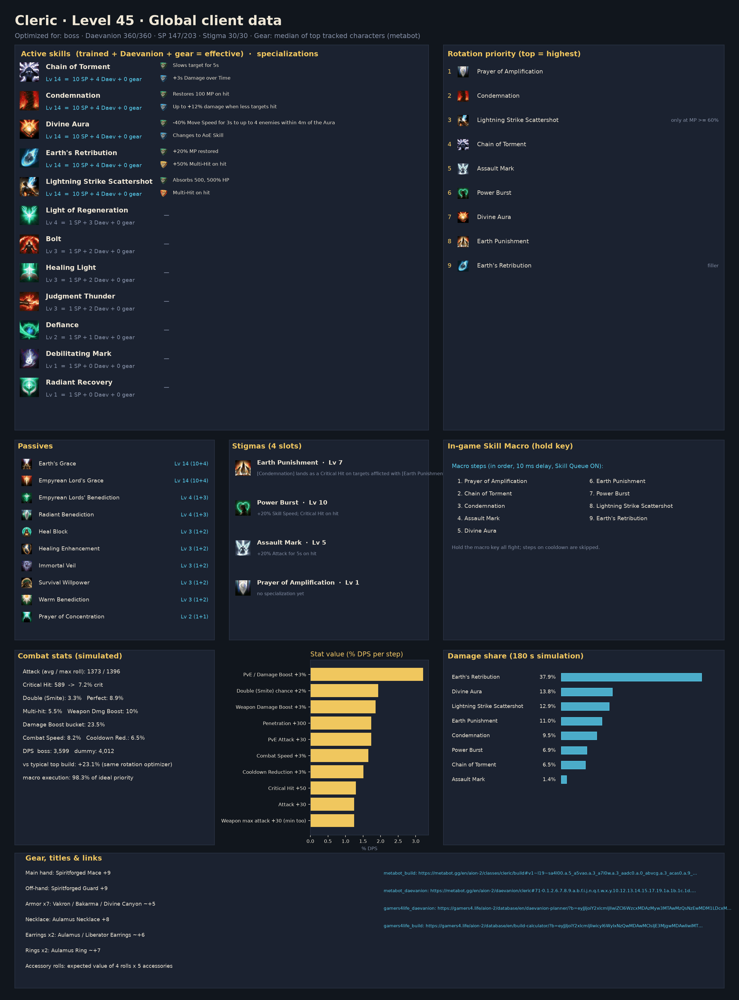
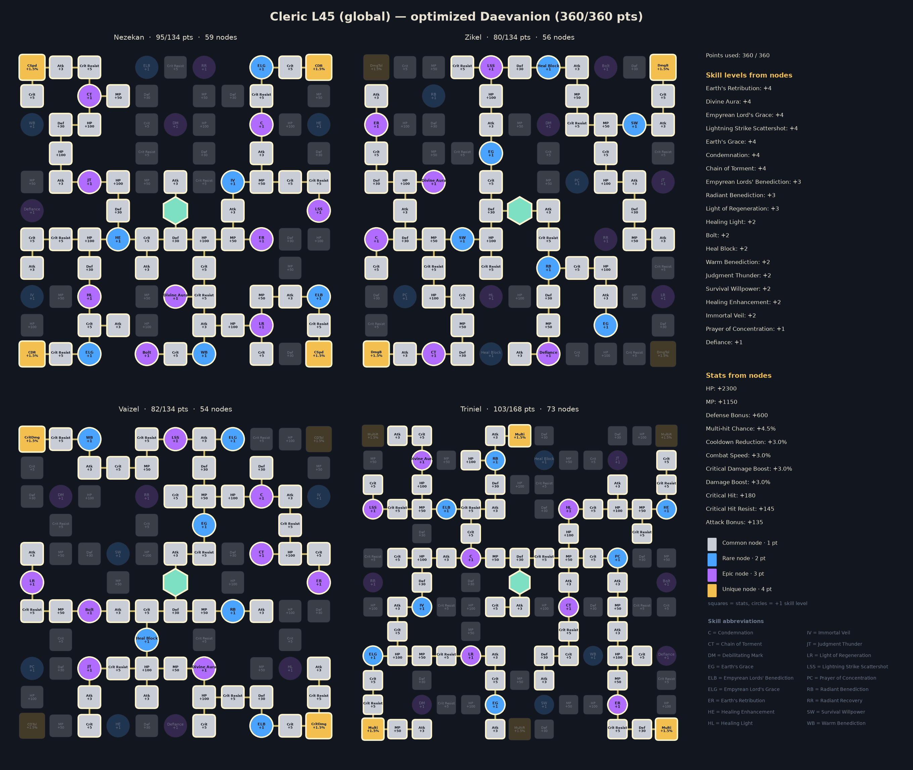
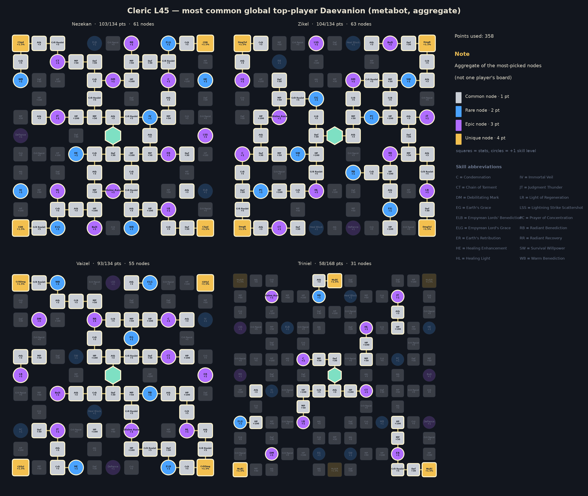

# Cleric — level 45 global build, rotation and macro

Generated by `aion2calc` from the global client data (metabot.gg) with Korean data as fallback. Objective: **boss** fight (see `docs/methodology.md`). Daevanion budget **360** points.



## Results

| Build | boss DPS | dummy DPS |
|---|---:|---:|
| **Optimized (this report)** | **3,599** | **4,012** |
| Typical top global build, optimized rotation | 2,923 | 3,467 |
| Typical top global build, default priority | 2,566 | — |

The optimized build is **+23.1%** over the typical top global build played with the same rotation optimizer, and **+40.2%** over that build played with the default priority. *Typical top global build* = average skill levels, the four most-picked damage stigmas and the most-picked Daevanion nodes of the top tracked global L45 players of this class (metabot.gg live data), given the best legal specializations for its levels (specs are not published).

## Rotation (priority list)

Use the highest skill that is ready; the last entry is the filler.

1. `prayer_of_amplification`
2. `condemnation`
3. `lightning_strike_scattershot [mp_hi]`
4. `chain_of_torment`
5. `assault_mark`
6. `power_burst`
7. `divine_aura`
8. `earth_punishment`
9. `earth_s_retribution`

`[sync_de]` = wait for the Delayed Explosion vulnerability window when it is about to be ready; `[in_ee]` = prefer using it inside Element Enhancement; `[mp_hi]` = only while MP is at least 60% (weave it in, keep MP for Grace of Enhancement).

### In-game Skill Macro

Settings → Key Settings → General → Skill Macro. Skill Queue (스킬 예약) **ON**, 10 ms delay on every step, hold the macro key; manual presses always take priority over the macro.

| Step | Skill |
|---:|---|
| 1 | prayer_of_amplification |
| 2 | chain_of_torment |
| 3 | condemnation |
| 4 | assault_mark |
| 5 | divine_aura |
| 6 | earth_punishment |
| 7 | power_burst |
| 8 | lightning_strike_scattershot |
| 9 | earth_s_retribution |

Manual keys (press on cooldown, in this priority): none — hold the macro key for the whole fight

Simulated: this layout reaches **98.3%** of the ideal priority list.

**Alternative — macro with manual keys**: macro chain_of_torment → condemnation → lightning_strike_scattershot → earth_s_retribution; manual: prayer_of_amplification, assault_mark, power_burst, divine_aura, earth_punishment. Simulated: **98.2%** of the ideal priority list.

### Opener (first 30 s of the simulated fight)

```
prayer_of_amplification@0.0s → chain_of_torment@0.6s → condemnation@1.5s → assault_mark@2.4s → power_burst@3.3s → divine_aura@4.1s → earth_punishment@5.0s → earth_s_retribution@5.9s → earth_s_retribution@6.7s → earth_s_retribution@7.4s → earth_s_retribution@8.2s → earth_s_retribution@9.0s → earth_s_retribution@9.7s → earth_s_retribution@10.5s → earth_s_retribution@11.3s → earth_s_retribution@12.1s → earth_s_retribution@12.8s → earth_s_retribution@13.6s → earth_s_retribution@14.4s → earth_s_retribution@15.1s → earth_s_retribution@15.9s → earth_s_retribution@16.7s → earth_s_retribution@17.4s → earth_s_retribution@18.2s → earth_s_retribution@19.0s → chain_of_torment@19.7s → condemnation@20.6s → earth_s_retribution@21.6s
```

## Skills, specializations and points

Skill points used **147 / 203**, stigma points **30 / 30**, Daevanion **360 / 360**.

| Skill | Trained (SP) | Effective level | Specializations |
|---|---:|---:|---|
| Lightning Strike Scattershot | 10 | 14 | Absorbs 500, 500% HP; Multi-Hit on hit |
| Chain of Torment | 10 | 14 | Slows target for 5s; +3s Damage over Time |
| Empyrean Lord's Grace | 10 | 14 | — |
| Divine Aura | 10 | 14 | -40% Move Speed for 3s to up to 4 enemies within 4m of the Aura; Changes to AoE Skill |
| Condemnation | 10 | 14 | Restores 100 MP on hit; Up to +12% damage when less targets hit |
| Earth's Grace | 10 | 14 | — |
| Earth's Retribution | 10 | 14 | +20% MP restored; +50% Multi-Hit on hit |
| Light of Regeneration | 1 | 4 | — |
| Empyrean Lords' Benediction | 1 | 4 | — |
| Radiant Benediction | 1 | 4 | — |
| Survival Willpower | 1 | 3 | — |
| Judgment Thunder | 1 | 3 | — |
| Warm Benediction | 1 | 3 | — |
| Heal Block | 1 | 3 | — |
| Healing Enhancement | 1 | 3 | — |
| Bolt | 1 | 3 | — |
| Healing Light | 1 | 3 | — |
| Immortal Veil | 1 | 3 | — |
| Defiance | 1 | 2 | — |
| Prayer of Concentration | 1 | 2 | — |

**Stigmas**: Earth Punishment Lv 7, Power Burst Lv 10, Assault Mark Lv 5, Prayer of Amplification Lv 1

## Daevanion (360 points)



* Open in metabot planner: https://metabot.gg/en/aion-2/daevanion/cleric#71-0.1.2.6.7.8.9.a.b.f.i.j.n.q.t.w.x.y.10.12.13.14.15.17.19.1a.1b.1c.1d.1e.1f.1g.1h.1i.1j.1m.1n.1o.1p.1t.1v.1w.1x.1y.1z.21.22.24.25.26.27.28.29.2a.2b.2c.2d.2e.2g_72-3.4.5.6.7.a.b.d.e.f.g.j.m.n.o.p.q.t.v.x.y.z.10.13.14.16.17.19.1a.1b.1c.1d.1e.1f.1g.1i.1j.1k.1l.1m.1n.1o.1p.1t.1u.1x.1y.22.23.24.26.27.28.29.2b.2c_73-0.1.2.3.4.5.6.b.c.d.e.f.l.m.n.o.p.t.u.v.10.11.13.14.15.16.1a.1b.1c.1d.1e.1f.1g.1h.1i.1j.1n.1s.1t.1u.1v.1w.1z.21.22.23.24.25.26.29.2d.2e.2f.2g_74-1.2.3.4.a.c.d.i.j.k.l.o.p.q.r.s.t.u.v.x.y.z.10.11.13.14.15.17.18.19.1a.1b.1c.1d.1e.1f.1g.1k.1n.1o.1r.1s.1v.1w.1y.20.23.25.26.27.28.29.2a.2b.2c.2d.2e.2g.2h.2j.2l.2n.2o.2q.2u.2y.30.31.32.33.36.37.38
* Open in gamers4.life planner (KR node values, same node IDs): https://gamers4.life/aion-2/database/en/daevanion-planner/?b=eyJjIjoiY2xlcmljIiwiZCI6WzcxMDAzMyw3MTAwMzQsNzEwMDM1LDcxMDA0MSw3MTAwNDIsNzEwMDQzLDcxMDA0OCw3MTAwNTAsNzEwMDUxLDcxMDA1Niw3MTAwNjQsNzEwMDY1LDcxMDA3MSw3MTAwNzksNzEwMDg2LDcxMDA5NCw3MTAwOTUsNzEwMDk2LDcxMDA5OCw3MTAxMDAsNzEwMTAxLDcxMDEwMiw3MTAxMDMsNzEwMTExLDcxMDExNSw3MTAxMTgsNzEwMTIzLDcxMDEyNCw3MTAxMjUsNzEwMTI2LDcxMDEyNyw3MTAxMjgsNzEwMTI5LDcxMDEzMCw3MTAxMzEsNzEwMTM4LDcxMDE0MCw3MTAxNDIsNzEwMTQ0LDcxMDE1NSw3MTAxNTgsNzEwMTU5LDcxMDE2MSw3MTAxNjIsNzEwMTYzLDcxMDE3MCw3MTAxNzEsNzEwMTc0LDcxMDE3NSw3MTAxNzYsNzEwMTc4LDcxMDE4Myw3MTAxODQsNzEwMTg1LDcxMDE4Nyw3MTAxODgsNzEwMTg5LDcxMDE5MSw3MTAxOTMsNzIwMDM2LDcyMDAzNyw3MjAwMzgsNzIwMDM5LDcyMDA0MCw3MjAwNDMsNzIwMDQ4LDcyMDA1Miw3MjAwNTUsNzIwMDU4LDcyMDA2Myw3MjAwNjcsNzIwMDcwLDcyMDA3MSw3MjAwNzIsNzIwMDczLDcyMDA3OCw3MjAwODIsNzIwMDg2LDcyMDA5Myw3MjAwOTQsNzIwMDk1LDcyMDA5Nyw3MjAxMDEsNzIwMTAyLDcyMDEwOSw3MjAxMTIsNzIwMTE0LDcyMDExNyw3MjAxMjMsNzIwMTI0LDcyMDEyNSw3MjAxMjYsNzIwMTI3LDcyMDEyOSw3MjAxMzIsNzIwMTMzLDcyMDEzOCw3MjAxNDAsNzIwMTQyLDcyMDE0NCw3MjAxNDUsNzIwMTQ2LDcyMDE1NSw3MjAxNTYsNzIwMTU5LDcyMDE2MSw3MjAxNzEsNzIwMTc0LDcyMDE3Niw3MjAxODMsNzIwMTg0LDcyMDE4NSw3MjAxODYsNzIwMTg4LDcyMDE4OSw3MzAwMzMsNzMwMDM0LDczMDAzNSw3MzAwMzcsNzMwMDM4LDczMDAzOSw3MzAwNDAsNzMwMDUwLDczMDA1MSw3MzAwNTIsNzMwMDU0LDczMDA1Niw3MzAwNjgsNzMwMDY5LDczMDA3MCw3MzAwNzEsNzMwMDcyLDczMDA4NCw3MzAwODcsNzMwMDkzLDczMDA5OCw3MzAwOTksNzMwMTAxLDczMDEwMiw3MzAxMDMsNzMwMTA4LDczMDExOCw3MzAxMjMsNzMwMTI0LDczMDEyNSw3MzAxMjYsNzMwMTI3LDczMDEyOCw3MzAxMjksNzMwMTMwLDczMDEzMSw3MzAxNDIsNzMwMTU1LDczMDE1Niw3MzAxNTcsNzMwMTU4LDczMDE1OSw3MzAxNjMsNzMwMTcwLDczMDE3Miw3MzAxNzQsNzMwMTc1LDczMDE3Niw3MzAxNzgsNzMwMTg1LDczMDE4OSw3MzAxOTEsNzMwMTkyLDczMDE5Myw3NDAwMTgsNzQwMDE5LDc0MDAyMiw3NDAwMjMsNzQwMDM0LDc0MDAzNiw3NDAwMzcsNzQwMDQ0LDc0MDA0Nyw3NDAwNDksNzQwMDUyLDc0MDA1Nyw3NDAwNTksNzQwMDYyLDc0MDA2Myw3NDAwNjQsNzQwMDY1LDc0MDA2Niw3NDAwNjcsNzQwMDcwLDc0MDA3MSw3NDAwNzIsNzQwMDczLDc0MDA3NCw3NDAwODEsNzQwMDg1LDc0MDA4OCw3NDAwOTMsNzQwMDk0LDc0MDA5NSw3NDAwOTYsNzQwMDk3LDc0MDA5OCw3NDAwOTksNzQwMTAwLDc0MDEwMSw3NDAxMDIsNzQwMTA5LDc0MDExNSw3NDAxMTcsNzQwMTIzLDc0MDEyNCw3NDAxMjcsNzQwMTI4LDc0MDEzMCw3NDAxMzIsNzQwMTM4LDc0MDE0NSw3NDAxNDcsNzQwMTUyLDc0MDE1Myw3NDAxNTQsNzQwMTU1LDc0MDE1Niw3NDAxNTcsNzQwMTU5LDc0MDE2MCw3NDAxNjIsNzQwMTYzLDc0MDE2Nyw3NDAxNzIsNzQwMTc0LDc0MDE3Nyw3NDAxODIsNzQwMTg3LDc0MDE5Miw3NDAxOTcsNzQwMTk4LDc0MDE5OSw3NDAyMDIsNzQwMjA3LDc0MDIwOCw3NDAyMDldfQ
* Full skill/stigma/Daevanion build in metabot planner: https://metabot.gg/en/aion-2/classes/cleric/build#v1~l19~sa4l00.a.5_a5vao.a.3_a7l0w.a.3_aadc0.a.0_abvcg.a.3_acas0.a.9_acxxc.7.0_ajdeo.5.0_ak0k0.a.0_al34w.a.0~gacxxc_aadc0_ajdeo_adl2o~d71-0.1.2.6.7.8.9.a.b.f.i.j.n.q.t.w.x.y.10.12.13.14.15.17.19.1a.1b.1c.1d.1e.1f.1g.1h.1i.1j.1m.1n.1o.1p.1t.1v.1w.1x.1y.1z.21.22.24.25.26.27.28.29.2a.2b.2c.2d.2e.2g_72-3.4.5.6.7.a.b.d.e.f.g.j.m.n.o.p.q.t.v.x.y.z.10.13.14.16.17.19.1a.1b.1c.1d.1e.1f.1g.1i.1j.1k.1l.1m.1n.1o.1p.1t.1u.1x.1y.22.23.24.26.27.28.29.2b.2c_73-0.1.2.3.4.5.6.b.c.d.e.f.l.m.n.o.p.t.u.v.10.11.13.14.15.16.1a.1b.1c.1d.1e.1f.1g.1h.1i.1j.1n.1s.1t.1u.1v.1w.1z.21.22.23.24.25.26.29.2d.2e.2f.2g_74-1.2.3.4.a.c.d.i.j.k.l.o.p.q.r.s.t.u.v.x.y.z.10.11.13.14.15.17.18.19.1a.1b.1c.1d.1e.1f.1g.1k.1n.1o.1r.1s.1v.1w.1y.20.23.25.26.27.28.29.2a.2b.2c.2d.2e.2g.2h.2j.2l.2n.2o.2q.2u.2y.30.31.32.33.36.37.38

For comparison, the aggregate of the most-picked nodes among top global players:



## Stat priority (simulated)

| Upgrade | DPS gain | Worth in Attack |
|---|---:|---:|
| PvE / Damage Boost +3% | +3.21% | 77 |
| Double (Smite) chance +2% | +1.93% | 47 |
| Weapon Damage Boost +3% | +1.86% | 45 |
| Penetration +300 | +1.73% | 42 |
| PvE Attack +30 | +1.73% | 42 |
| Combat Speed +3% | +1.65% | 40 |
| Cooldown Reduction +3% | +1.51% | 36 |
| Critical Hit +50 | +1.30% | 31 |
| Attack +30 | +1.24% | 30 |
| Weapon max attack +30 (min too) | +1.24% | 30 |
| Wisdom +10 (Double +1%) | +0.97% | 23 |
| Time +10 (Combat Speed +1%) | +0.55% | 13 |
| Illusion +10 (Cooldown -1%) | +0.50% | 12 |
| Might +10 (Attack +1%) | +0.49% | 12 |
| Destruction +10 (Attack +1%) | +0.49% | 12 |
| Critical Damage Boost +3% | +0.48% | 12 |
| Critical Attack +50 | +0.45% | 11 |
| Multi-hit chance +3% | +0.32% | 8 |
| Death +10 (Crit +1%) | +0.13% | 3 |
| Perfect chance +3% | +0.03% | 1 |
| Justice +10 (Perfect +1%) | +0.01% | 0 |
| MP +300 | +0.00% | 0 |

Accuracy is a threshold stat (avoid parries; back attacks ignore them) and is not ranked.

## Gear, rolls, enchanting

Loadout: **Global L45 Cleric - median of top tracked characters (metabot)**

* Main hand: Spiritforged Mace +9
* Off-hand: Spiritforged Guard +9
* Armor x7: Vakron / Bakarma / Divine Canyon ~+5
* Necklace: Aulamus Necklace +8
* Earrings x2: Aulamus / Liberator Earrings ~+6
* Rings x2: Aulamus Ring ~+7
* Accessory rolls: expected value of 4 rolls x 5 accessories
* Bracelets x2: Ascension +9 / Liberator +6
* Amulet: Revelation Amulet +0
* Rune: Clash Rune +2
* Attack title: Guardian of Altgard / Verteron
* Other title: Through Hell and Back
* Owned titles: collection bonuses (estimate)
* Wings: Ultimate Daeva Wings
* Primary/deity stats: profile averages

**Random-roll priority per item** (keep / reroll toward the top of each list):

* **Rupture Tome**: Damage Boost (+4.9% – +5.7%), Combat Speed (+8.8% – +10.2%), Weapon Damage Boost (+6.5% – +7.6%), Front Attack (+65 – +82), Attack (+30 – +42)
* **Ludras Grimoire**: Damage Boost (+6.3% – +7.3%), Combat Speed (+11.2% – +13%), Weapon Damage Boost (+8.3% – +9.6%), Front Attack (+83 – +102), Attack (+38 – +51)
* **Spiritforged Guard**: Might (+10 – +10), Accuracy (+30 – +30)
* **Vakron Helm**: Double Chance (+1.6% – +1.9%), Attack increase (+1.6% – +1.9%), Attack (+16 – +25), Critical Hit (+25 – +36), MP (+76 – +94)
* **Bakarma Breastplate**: Damage Boost (+4.4% – +5.2%), Attack (+18 – +28), Critical Hit (+27 – +38), Perfect Chance (+3.9% – +4.6%), MP (+83 – +102)
* **Aulamus Necklace**: Combat Speed (+3.2% – +3.8%), Attack (+23 – +33), Critical Hit (+35 – +47), Might (+9 – +17), Precision (+9 – +17)
* **Aulamus Ring**: Attack (+16 – +25), Critical Hit (+25 – +36), Might (+5 – +13), Precision (+5 – +13), Natural MP Regen (+18 – +28)

**Enchant priority** (DPS per enchant level):

* Weapon (Spiritforged / Rupture): 12.3 DPS/level
* Guard (off-hand): 7.5 DPS/level
* Revelation Amulet: 6.2 DPS/level
* Necklace / Earrings / Rings (Aulamus): 6.0 DPS/level
* Bracelets: 4.5 DPS/level
* Armor pieces: 0.0 DPS/level

## Titles, arcana, wings, pets

**Best titles by equip bonus** (global client values):

| Title | Grade | Equip bonus | Owned bonus |
|---|---|---|---|
| Unbound by Genus (Both factions) | Unique | PvE Damage Boost +4.5%, Attack Bonus +34, Critical Hit +68 | PvE Damage Boost +1% |
| Guardian of Altgard (Asmodian) | Epic | PvE Damage Boost +3%, Penetration +210 | PvE Attack +4 |
| Guardian of Verteron (Elyos) | Epic | PvE Damage Boost +3%, Penetration +210 | PvE Attack +4 |
| Empty Closet (Both factions) | Unique | Combat Speed +3.5%, Natural HP Regen +42, Cooldown Reduction +3.5% | HP +120 |
| Scenery Collector (Both factions) | Epic | PvE Damage Boost +3.3%, Block Penetration +54 | Critical Hit +10 |
| Teleportation Specialist (Both factions) | Epic | PvE Accuracy +58, PvE Damage Boost +3.1% | Critical Hit +10 |
| Nice to Meet You (Both factions) | Rare | PvE Damage Boost +2.9% | PvE Defense +10 |
| Verteron Seal Breaker (Both factions) | Rare | Boss Damage Boost +2.7% | PvE Accuracy +10 |
| It's Okay to Be Imperfect (Both factions) | Epic | PvE Attack +37, Critical Attack +44 | PvE Damage Boost +1% |
| The Beacons Are Lit! (Elyos) | Rare | PvE Damage Boost +2.3% | Evasion Bonus +5 |

**Arcana variant per slot** (deity stat that is worth more for this build):

* Chalice / Grail: **Vigor or Frenzy** (Time +20)
* Parchment: either variant (Life +20 / Destiny +20: no damage either way)
* Compass: **Magic or Purity** (Death +20)
* Bell: **Magic or Purity** (Destruction +20)
* Mirror: **Magic or Purity** (Wisdom +20)

**Arcana random skill option** (Unique arcana roll one option from the class pool when soul-bound, up to +4; simulated DPS gain on this build):

| Skill | +1 | +2 | +3 | +4 |
|---|---:|---:|---:|---:|
| Earth's Grace | +0.62% | +1.23% | +1.85% | +2.47% |
| Empyrean Lords' Benediction | +0.00% | +0.00% | +0.00% | +0.00% |
| Healing Enhancement | +0.00% | +0.00% | +0.00% | +0.00% |
| Heal Block | +0.00% | +0.00% | +0.00% | +0.00% |
| Radiant Benediction | +0.00% | +0.00% | +0.00% | +0.00% |

The pool holds passives only, so at level 45 an active skill still stops at Lv 14 (10 from skill points + 4 Daevanion nodes); the Lv 16 specialization options are out of reach.

**Deity (pantheon) stats**, +10 points each (arcana main stats, Abyssal Bracelet rolls, Monolith rewards): Wisdom +0.97%, Time +0.55%, Illusion +0.50%, Might +0.49%, Destruction +0.49%, Death +0.13%, Justice +0.01%.

**Closet / appearance collection**: every unlocked skin and costume set adds permanent Collection Effect stats, and wings keep a Retention Effect once owned. The client tables for these are not public, so they are not itemised here; they are flat stats, so value them with the stat table above and collect the cheap ones first.

**Wings**: Ultimate Daeva Wings (Accuracy +40, Penetration +500) are the most used and the best launch option for damage among common wings. **Pets**: pet collection bonuses are mostly genus-specific (damage vs that monster genus) plus Accuracy/Crit; level the genus of the content you farm first.

## Robustness

Every animation time was randomly perturbed by up to ±25% (8 samples) and the rotation re-optimized each time. Playing the recommended priority instead of the re-optimized one lost on average **0.00%** (worst 0.00%).

**Crit curve.** The crit-chance curve is fitted to tests at Crit 1048–1326 and extrapolated down to launch values: this build sits at **7.2%** crit, and Crit +50 ranks #8 (+1.30%). If launch testing shows more crit — e.g. the curve shifted to a midpoint of 700, giving 36% — Crit +50 becomes #1 (+3.60%). Re-run with `--crit-midpoint` once real numbers exist.

## Validation against Korean logs

Simulated damage shares (training dummy) overlap **25%** with the mean of the top-10 A2DIL Korean dummy logs; 11% of the Korean damage comes from skills that are not in the global level-45 client. Korea plays above level 45 with Lv 16-20 specializations, so a perfect match is not expected; low values mean the class kit needs hand-tuning (see `kit/sorcerer.py` for a hand-written kit).

## Sources

* metabot.gg (global client): class skills, Daevanion boards, items, titles, top-player statistics
* gamers4.life (KR database): skill hit counts, build/Daevanion planners
* A2DIL (KR training-dummy logs): damage-share validation
* Inven / Bahamut damage research, aion2ssow calculator: damage formula

See `docs/methodology.md` for every formula and assumption.
