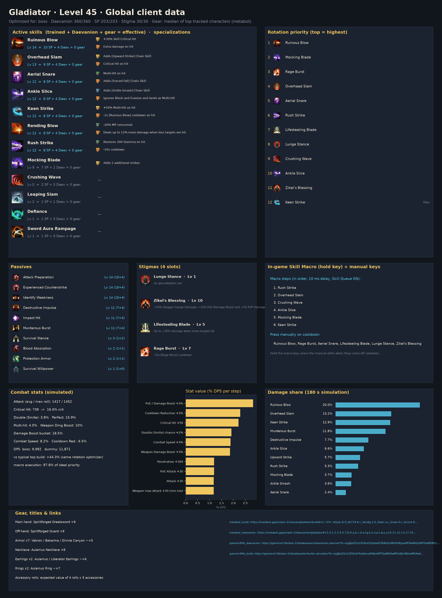
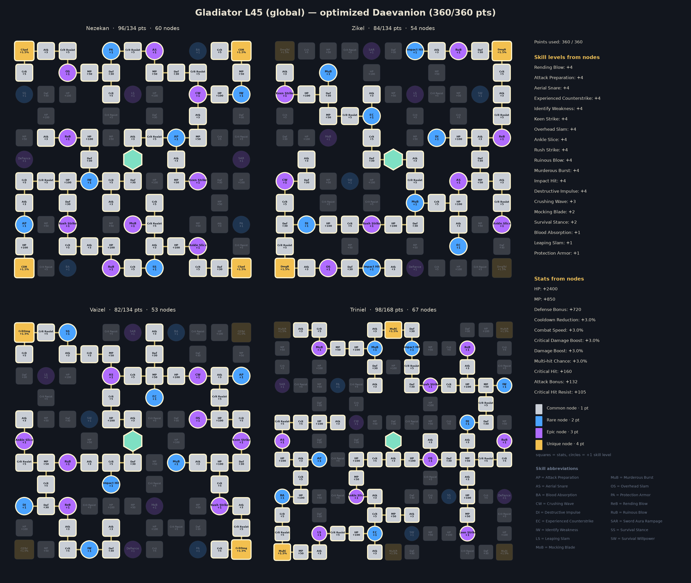
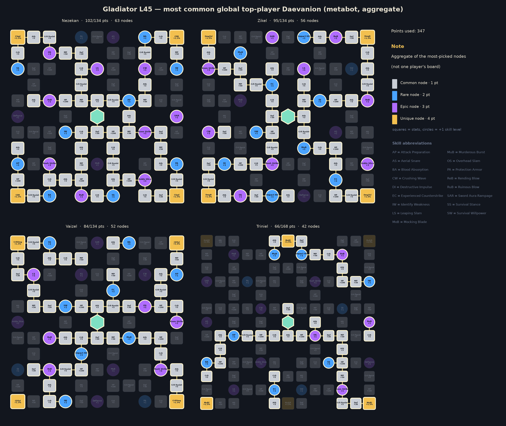

# Gladiator — level 45 global build, rotation and macro

Generated by `aion2calc` from the global client data (metabot.gg) with Korean data as fallback. Primary view: **boss** fight (see `docs/methodology.md`). Daevanion budget **360** points.



## Damage objective: boss modeled DPS

Score: 9,992 modeled DPS.

boss: 100%, 180.0s, 9,992 DPS

Damage objective subject to the saved HP and trained-skill reserves. Balanced uses equal scenario weights. Stat weights follow the selected objective; skill shares, opener, macro and sensitivity remain primary-scenario views. This local search does not establish a global optimum or competitive PvP efficacy.

## Results

| Build | boss DPS | dummy DPS |
|---|---:|---:|
| **Optimized (this report)** | **9,992** | **11,871** |
| Typical top global build, optimized rotation | 6,926 | 8,301 |
| Typical top global build, default priority | 5,189 | — |

The optimized build is **+44.3%** over the typical top global build played with the same rotation optimizer, and **+92.6%** over that build played with the default priority. *Typical top global build* = average skill levels, the four most-picked damage stigmas and the most-picked Daevanion nodes of the top tracked global L45 players of this class (metabot.gg live data), given the best legal specializations for its levels (specs are not published).

## Rotation (priority list)

Use the highest skill that is ready; the last entry is the filler.

1. `ruinous_blow`
2. `mocking_blade`
3. `rage`
4. `overhead_slam`
5. `aerial_snare`
6. `rush_strike`
7. `lifesteal`
8. `lunge`
9. `crushing_wave`
10. `ankle_slice`
11. `zikel`
12. `keen_strike`

`[sync_de]` = wait for the Delayed Explosion vulnerability window when it is about to be ready; `[in_ee]` = prefer using it inside Element Enhancement; `[mp_hi]` = only while MP is at least 60% (weave it in, keep MP for Grace of Enhancement).

### In-game Skill Macro

Settings → Key Settings → General → Skill Macro. Skill Queue (스킬 예약) **ON**, 10 ms delay on every step, hold the macro key; manual presses always take priority over the macro.

| Step | Skill |
|---:|---|
| 1 | rush_strike |
| 2 | overhead_slam |
| 3 | crushing_wave |
| 4 | ankle_slice |
| 5 | mocking_blade |
| 6 | keen_strike |

Manual keys (press on cooldown, in this priority): ruinous_blow, rage, aerial_snare, lifesteal, lunge, zikel

Simulated: this layout reaches **97.8%** of the ideal priority list.

**Alternative — one-button macro (no manual keys)**: macro ruinous_blow → mocking_blade → rage → overhead_slam → aerial_snare → rush_strike → lifesteal → crushing_wave → lunge → ankle_slice → keen_strike → zikel. Simulated: **97.6%** of the ideal priority list.

### Opener (first 30 s of the simulated fight)

```
ruinous_blow@0.0s → mocking_blade@1.1s → rage@2.2s → overhead_slam@3.1s → aerial_snare@3.8s → rush_strike@4.8s → lifesteal@5.6s → lunge@6.6s → crushing_wave@7.5s → ankle_slice@8.3s → zikel@9.1s → keen_strike@9.9s → keen_strike@10.5s → keen_strike@11.2s → keen_strike@11.8s → keen_strike@12.5s → keen_strike@13.1s → keen_strike@13.8s → rush_strike@14.4s → overhead_slam@15.2s → keen_strike@15.7s → keen_strike@16.4s → keen_strike@17.1s → ankle_slice@17.7s → keen_strike@18.4s → keen_strike@19.1s → keen_strike@19.8s → mocking_blade@20.4s
```

## Skills, specializations and points

Skill points used **203 / 203**, stigma points **30 / 30**, Daevanion **360 / 360**.

| Skill | Trained (SP) | Effective level | Specializations |
|---|---:|---:|---|
| Attack Preparation | 10 | 14 | — |
| Ruinous Blow | 10 | 14 | +30% Skill Critical Hit; Extra damage on hit |
| Experienced Counterstrike | 10 | 14 | — |
| Identify Weakness | 10 | 14 | — |
| Overhead Slam | 9 | 13 | Adds [Upward Strike] Chain Skill; Critical Hit on hit |
| Rending Blow | 8 | 12 | -20% MP consumed; Deals up to 12% more damage when less targets are hit |
| Rush Strike | 8 | 12 | Restores 300 Stamina on hit; -10s cooldown |
| Ankle Slice | 8 | 12 | Adds [Ankle Smash] Chain Skill; Ignores Block and Evasion and lands as Multi-Hit |
| Aerial Snare | 8 | 12 | Multi-Hit on hit; Adds [Forced Fall] Chain Skill |
| Keen Strike | 8 | 12 | +50% Multi-Hit on hit; -1s [Ruinous Blow] cooldown on hit |
| Destructive Impulse | 7 | 11 | — |
| Murderous Burst | 7 | 11 | — |
| Impact Hit | 7 | 11 | — |
| Mocking Blade | 7 | 9 | Adds 2 additional strikes |
| Crushing Wave | 2 | 5 | — |
| Survival Stance | 1 | 3 | — |
| Leaping Slam | 1 | 2 | — |
| Blood Absorption | 1 | 2 | — |
| Protection Armor | 1 | 2 | — |

**Stigmas**: Lunge Stance Lv 1, Zikel's Blessing Lv 10, Lifestealing Blade Lv 5, Rage Burst Lv 7

## Daevanion (360 points)



* Open in metabot planner: https://metabot.gg/en/aion-2/daevanion/gladiator#11-0.1.2.3.4.5.7.8.9.a.b.c.d.e.f.g.k.n.o.p.t.w.x.y.10.11.12.13.17.19.1b.1c.1d.1e.1f.1g.1i.1j.1m.1n.1o.1p.1r.1t.1v.1w.20.21.22.23.24.25.26.28.2b.2c.2d.2e.2f.2g_12-6.7.8.9.a.b.c.f.g.h.i.j.p.r.s.t.w.10.12.13.14.15.16.17.19.1a.1b.1c.1g.1h.1i.1j.1k.1n.1o.1p.1q.1r.1s.1t.1u.1v.1w.1x.1y.20.21.24.26.27.28.29.2a.2b_13-0.1.2.5.a.b.c.d.e.k.l.m.n.o.p.q.s.t.u.v.z.10.13.14.15.16.1a.1b.1c.1d.1e.1f.1g.1i.1j.1k.1l.1m.1n.1p.1q.1r.1s.1y.1z.21.22.26.29.2a.2b.2f.2g_14-1.2.3.4.5.a.b.c.d.e.h.l.n.o.v.w.x.y.z.10.11.15.16.17.18.19.1g.1h.1j.1n.1o.1p.1q.1r.1s.1u.1v.1w.1x.1y.1z.20.21.22.23.24.26.27.28.2b.2c.2g.2j.2l.2m.2n.2o.2q.2r.2s.2t.2u.2y.30.31.32.33
* Open in gamers4.life planner (KR node values, same node IDs): https://gamers4.life/aion-2/database/en/daevanion-planner/?b=eyJjIjoiZ2xhZGlhdG9yIiwiZCI6WzExMDAzMywxMTAwMzQsMTEwMDM1LDExMDAzNywxMTAwMzgsMTEwMDM5LDExMDA0MiwxMTAwNDMsMTEwMDQ4LDExMDA1MCwxMTAwNTEsMTEwMDUyLDExMDA1NCwxMTAwNTUsMTEwMDU2LDExMDA1OCwxMTAwNjcsMTEwMDcxLDExMDA3MiwxMTAwNzMsMTEwMDg2LDExMDA5NCwxMTAwOTUsMTEwMDk2LDExMDA5OCwxMTAwOTksMTEwMTAwLDExMDEwMSwxMTAxMTEsMTEwMTE1LDExMDEyMywxMTAxMjQsMTEwMTI1LDExMDEyNiwxMTAxMjcsMTEwMTI4LDExMDEzMCwxMTAxMzEsMTEwMTM4LDExMDE0MCwxMTAxNDIsMTEwMTQ0LDExMDE1MywxMTAxNTUsMTEwMTU4LDExMDE1OSwxMTAxNjgsMTEwMTcwLDExMDE3MSwxMTAxNzIsMTEwMTc0LDExMDE3NSwxMTAxNzYsMTEwMTgzLDExMDE4NywxMTAxODgsMTEwMTg5LDExMDE5MSwxMTAxOTIsMTEwMTkzLDEyMDAzOSwxMjAwNDAsMTIwMDQxLDEyMDA0MiwxMjAwNDMsMTIwMDQ4LDEyMDA1MCwxMjAwNTgsMTIwMDYzLDEyMDA2NCwxMjAwNjUsMTIwMDY3LDEyMDA3MywxMjAwODAsMTIwMDgxLDEyMDA4MiwxMjAwODgsMTIwMDk3LDEyMDEwMCwxMjAxMDEsMTIwMTAyLDEyMDEwMywxMjAxMDksMTIwMTEyLDEyMDExNCwxMjAxMTcsMTIwMTIzLDEyMDEyNCwxMjAxMjksMTIwMTMxLDEyMDEzMiwxMjAxMzMsMTIwMTM4LDEyMDE0NCwxMjAxNDUsMTIwMTQ2LDEyMDE0OCwxMjAxNTMsMTIwMTU0LDEyMDE1NSwxMjAxNTYsMTIwMTU3LDEyMDE1OCwxMjAxNTksMTIwMTYxLDEyMDE2MywxMjAxNjgsMTIwMTc2LDEyMDE4MywxMjAxODQsMTIwMTg1LDEyMDE4NiwxMjAxODcsMTIwMTg4LDEzMDAzMywxMzAwMzQsMTMwMDM1LDEzMDAzOSwxMzAwNDgsMTMwMDUwLDEzMDA1MSwxMzAwNTIsMTMwMDU0LDEzMDA2NywxMzAwNjgsMTMwMDY5LDEzMDA3MCwxMzAwNzEsMTMwMDcyLDEzMDA3MywxMzAwODIsMTMwMDg0LDEzMDA4NywxMzAwOTMsMTMwMDk3LDEzMDA5OCwxMzAxMDEsMTMwMTAyLDEzMDEwMywxMzAxMDgsMTMwMTE4LDEzMDEyMywxMzAxMjQsMTMwMTI1LDEzMDEyNiwxMzAxMjcsMTMwMTI4LDEzMDEzMCwxMzAxMzEsMTMwMTMyLDEzMDEzMywxMzAxMzksMTMwMTQyLDEzMDE0NywxMzAxNTMsMTMwMTU0LDEzMDE1NSwxMzAxNjIsMTMwMTYzLDEzMDE3MCwxMzAxNzIsMTMwMTc4LDEzMDE4NSwxMzAxODYsMTMwMTg3LDEzMDE5MiwxMzAxOTMsMTQwMDE4LDE0MDAxOSwxNDAwMjIsMTQwMDIzLDE0MDAyNCwxNDAwMzQsMTQwMDM1LDE0MDAzNiwxNDAwMzcsMTQwMDM5LDE0MDA0MiwxNDAwNTIsMTQwMDU0LDE0MDA1NywxNDAwNjcsMTQwMDY5LDE0MDA3MCwxNDAwNzEsMTQwMDcyLDE0MDA3MywxNDAwNzQsMTQwMDg4LDE0MDA5MiwxNDAwOTMsMTQwMDk0LDE0MDA5NSwxNDAxMDIsMTQwMTAzLDE0MDEwNywxNDAxMTUsMTQwMTE3LDE0MDExOSwxNDAxMjIsMTQwMTIzLDE0MDEyNCwxNDAxMjYsMTQwMTI3LDE0MDEyOCwxNDAxMjksMTQwMTMwLDE0MDEzMSwxNDAxMzIsMTQwMTMzLDE0MDEzNCwxNDAxMzgsMTQwMTQxLDE0MDE0NywxNDAxNTIsMTQwMTUzLDE0MDE1NiwxNDAxNTcsMTQwMTYyLDE0MDE2NywxNDAxNzIsMTQwMTczLDE0MDE3NCwxNDAxNzcsMTQwMTgyLDE0MDE4NCwxNDAxODUsMTQwMTg2LDE0MDE4NywxNDAxOTIsMTQwMTk3LDE0MDE5OCwxNDAxOTksMTQwMjAyXX0
* Full skill/stigma/Daevanion build in metabot planner: https://metabot.gg/en/aion-2/classes/gladiator/build#v1~l19~s6jzdc.8.9_6k734.8.c_6ku8g.2.0_6lwtc.a.c_6nets.9.c_6o1z4.8.a_6p4k0.a.0_6pzf4.7.4_6q74w.8.9_6r200.5.0_6rhfk.8.9_6s4kw.7.0_6zmn4.a.0_6zucw.a.0_7022o.7.0_709sg.7.0_70hi8.a.0_70wxs.7.0~g6scao_6p4k0_6r200_6s4kw~d11-0.1.2.3.4.5.7.8.9.a.b.c.d.e.f.g.k.n.o.p.t.w.x.y.10.11.12.13.17.19.1b.1c.1d.1e.1f.1g.1i.1j.1m.1n.1o.1p.1r.1t.1v.1w.20.21.22.23.24.25.26.28.2b.2c.2d.2e.2f.2g_12-6.7.8.9.a.b.c.f.g.h.i.j.p.r.s.t.w.10.12.13.14.15.16.17.19.1a.1b.1c.1g.1h.1i.1j.1k.1n.1o.1p.1q.1r.1s.1t.1u.1v.1w.1x.1y.20.21.24.26.27.28.29.2a.2b_13-0.1.2.5.a.b.c.d.e.k.l.m.n.o.p.q.s.t.u.v.z.10.13.14.15.16.1a.1b.1c.1d.1e.1f.1g.1i.1j.1k.1l.1m.1n.1p.1q.1r.1s.1y.1z.21.22.26.29.2a.2b.2f.2g_14-1.2.3.4.5.a.b.c.d.e.h.l.n.o.v.w.x.y.z.10.11.15.16.17.18.19.1g.1h.1j.1n.1o.1p.1q.1r.1s.1u.1v.1w.1x.1y.1z.20.21.22.23.24.26.27.28.2b.2c.2g.2j.2l.2m.2n.2o.2q.2r.2s.2t.2u.2y.30.31.32.33

For comparison, the aggregate of the most-picked nodes among top global players:



## Stat priority (simulated)

| Upgrade | DPS gain | Worth in Attack |
|---|---:|---:|
| PvE / Damage Boost +3% | +2.82% | 72 |
| Cooldown Reduction +3% | +2.29% | 59 |
| Critical Hit +50 | +2.21% | 57 |
| Double (Smite) chance +2% | +1.92% | 49 |
| Combat Speed +3% | +1.88% | 48 |
| Weapon Damage Boost +3% | +1.86% | 47 |
| Penetration +300 | +1.19% | 30 |
| PvE Attack +30 | +1.19% | 30 |
| Attack +30 | +1.17% | 30 |
| Weapon max attack +30 (min too) | +1.17% | 30 |
| Critical Damage Boost +3% | +1.04% | 27 |
| Wisdom +10 (Double +1%) | +0.96% | 25 |
| Critical Attack +50 | +0.78% | 20 |
| Illusion +10 (Cooldown -1%) | +0.76% | 20 |
| Time +10 (Combat Speed +1%) | +0.63% | 16 |
| Might +10 (Attack +1%) | +0.50% | 13 |
| Destruction +10 (Attack +1%) | +0.50% | 13 |
| Multi-hit chance +3% | +0.34% | 9 |
| Death +10 (Crit +1%) | +0.29% | 7 |
| Perfect chance +3% | +0.04% | 1 |
| Justice +10 (Perfect +1%) | +0.01% | 0 |
| MP +300 | +0.00% | 0 |

Accuracy is a threshold stat (avoid parries; back attacks ignore them) and is not ranked.

## Gear, rolls, enchanting

Loadout: **Global L45 Gladiator - median of top tracked characters (metabot)**

* Main hand: Spiritforged Greatsword +9
* Off-hand: Spiritforged Guard +9
* Armor x7: Vakron / Bakarma / Divine Canyon ~+5
* Necklace: Aulamus Necklace +8
* Earrings x2: Aulamus / Liberator Earrings ~+6
* Rings x2: Aulamus Ring ~+7
* Accessory rolls: expected value of 4 rolls x 5 accessories
* Bracelets x2: Ascension +9 / Liberator +6
* Amulet: Revelation Amulet +0
* Rune: Clash Rune +2
* Attack title: Guardian of Altgard / Verteron
* Other title: Through Hell and Back
* Owned titles: collection bonuses (estimate)
* Wings: Ultimate Daeva Wings
* Primary/deity stats: profile averages

**Random-roll priority per item** (keep / reroll toward the top of each list):

* **Rupture Tome**: Combat Speed (+8.8% – +10.2%), Damage Boost (+4.9% – +5.7%), Weapon Damage Boost (+6.5% – +7.6%), Front Attack (+65 – +82), Critical Hit (+46 – +60)
* **Ludras Grimoire**: Combat Speed (+11.2% – +13%), Damage Boost (+6.3% – +7.3%), Weapon Damage Boost (+8.3% – +9.6%), Front Attack (+83 – +102), Critical Hit (+59 – +75)
* **Spiritforged Guard**: Might (+10 – +10), Accuracy (+30 – +30)
* **Vakron Helm**: Double Chance (+1.6% – +1.9%), Critical Hit (+25 – +36), Attack increase (+1.6% – +1.9%), Attack (+16 – +25), MP (+76 – +94)
* **Bakarma Breastplate**: Damage Boost (+4.4% – +5.2%), Critical Hit (+27 – +38), Attack (+18 – +28), Perfect Chance (+3.9% – +4.6%), MP (+83 – +102)
* **Aulamus Necklace**: Combat Speed (+3.2% – +3.8%), Critical Hit (+35 – +47), Attack (+23 – +33), Might (+9 – +17), Precision (+9 – +17)
* **Aulamus Ring**: Critical Hit (+25 – +36), Attack (+16 – +25), Might (+5 – +13), Precision (+5 – +13), Natural MP Regen (+18 – +28)

**Enchant priority** (DPS per enchant level):

* Weapon (Spiritforged / Rupture): 32.3 DPS/level
* Guard (off-hand): 19.6 DPS/level
* Necklace / Earrings / Rings (Aulamus): 15.6 DPS/level
* Revelation Amulet: 11.9 DPS/level
* Bracelets: 11.7 DPS/level
* Armor pieces: 0.0 DPS/level

## Titles, arcana, wings, pets

**Best titles by equip bonus** (global client values):

| Title | Grade | Equip bonus | Owned bonus |
|---|---|---|---|
| Unbound by Genus (Both factions) | Unique | PvE Damage Boost +4.5%, Attack Bonus +34, Critical Hit +68 | PvE Damage Boost +1% |
| Empty Closet (Both factions) | Unique | Combat Speed +3.5%, Natural HP Regen +42, Cooldown Reduction +3.5% | HP +120 |
| Guardian of Altgard (Asmodian) | Epic | PvE Damage Boost +3%, Penetration +210 | PvE Attack +4 |
| Guardian of Verteron (Elyos) | Epic | PvE Damage Boost +3%, Penetration +210 | PvE Attack +4 |
| Scenery Collector (Both factions) | Epic | PvE Damage Boost +3.3%, Block Penetration +54 | Critical Hit +10 |
| Teleportation Specialist (Both factions) | Epic | PvE Accuracy +58, PvE Damage Boost +3.1% | Critical Hit +10 |
| You're My Gem (Both factions) | Epic | Critical Hit +52, Critical Attack +39 | Natural MP Regen +5 |
| Nice to Meet You (Both factions) | Rare | PvE Damage Boost +2.9% | PvE Defense +10 |
| Saint of Ereshkigal (Both factions) | Unique | PvP Damage Boost +4%, Endurance Penetration +2.5%, Critical Hit +60 | PvP Accuracy +20 |
| Verteron Seal Breaker (Both factions) | Rare | Boss Damage Boost +2.7% | PvE Accuracy +10 |

**Arcana variant per slot** (deity stat that is worth more for this build):

* Chalice / Grail: **Vigor or Frenzy** (Time +20)
* Parchment: either variant (Life +20 / Destiny +20: no damage either way)
* Compass: **Magic or Purity** (Death +20)
* Bell: **Magic or Purity** (Destruction +20)
* Mirror: **Magic or Purity** (Wisdom +20)

**Arcana skill rolls.** Each arcana gives (grade base + enhancement level) random skill levels from its slot's pool — Rare 2, Legend 3, Unique 4 base rolls, +1 per enhancement level (so a Unique +5 gives 9); a skill rolled again gains another level, up to the cap. Chalice, Parchment and Compass roll active skills; Bell and Mirror roll passives.

| Arcana slot | Expected DPS, Unique +0 (4 rolls) | Expected DPS, Unique +5 (9 rolls) | Best rolls (+1 / +2) |
|---|---:|---:|---|
| Parchment | +1.4% | +7.8% | Keen Strike +0.4% / +0.6%, Overhead Slam +0.3% / +0.8%, Ruinous Blow +0.3% / +0.6% |
| Mirror | +1.1% | +2.5% | Identify Weakness +0.4% / +0.9%, Experienced Counterstrike +0.4% / +0.8%, Murderous Burst +0.3% / +0.6% |
| Chalice | +0.7% | +1.6% | Attack Preparation +0.5% / +0.9%, Identify Weakness +0.4% / +0.9%, Experienced Counterstrike +0.4% / +0.8% |
| Bell | +0.5% | +1.1% | Attack Preparation +0.5% / +0.9%, Destructive Impulse +0.1% / +0.3%, Survival Stance +0.0% / +0.0% |
| Compass | +0.2% | +0.5% | Mocking Blade +0.1% / +0.3%, Rush Strike +0.1% / +0.2%, Crushing Wave +0.1% / +0.1% |

Biggest single-level jumps (usually a specialization unlocking at Lv 16): Overhead Slam +27.2%, Keen Strike +13.6%, Attack Preparation +0.5%, Identify Weakness +0.5%.

**Deity (pantheon) stats**, +10 points each (arcana main stats, Abyssal Bracelet rolls, Monolith rewards): Wisdom +0.96%, Illusion +0.76%, Time +0.63%, Might +0.50%, Destruction +0.50%, Death +0.29%, Justice +0.01%.

**Closet / appearance collection**: every unlocked skin and costume set adds permanent Collection Effect stats, and wings keep a Retention Effect once owned. The client tables for these are not public, so they are not itemised here; they are flat stats, so value them with the stat table above and collect the cheap ones first.

**Wings**: Ultimate Daeva Wings (Accuracy +40, Penetration +500) are the most used and the best launch option for damage among common wings. **Pets**: pet collection bonuses are mostly genus-specific (damage vs that monster genus) plus Accuracy/Crit; level the genus of the content you farm first.

## Robustness

Samples with no modeled damage are excluded from percentage losses.

Every animation time was randomly perturbed by up to ±25% (8 samples) and the rotation re-optimized each time. Playing the recommended priority instead of the re-optimized one lost on average **3.95%** (worst 6.68%).

**Crit curve.** The crit-chance curve is fitted to tests at Crit 1048–1326 and extrapolated down to launch values: this build sits at **16.0%** crit, and Crit +50 ranks #3 (+2.21%). If launch testing shows more crit — e.g. the curve shifted to a midpoint of 700, giving 58% — Crit +50 becomes #3 (+2.03%). Re-run with `--crit-midpoint` once real numbers exist.

## Validation against Korean logs

Simulated damage shares (training dummy) overlap **28%** with the mean of the top-10 A2DIL Korean dummy logs; 37% of the Korean damage comes from skills that are not in the global level-45 client. Korea plays above level 45 with Lv 16-20 specializations, so a perfect match is not expected; low values mean the class kit needs hand-tuning (see `kit/sorcerer.py` for a hand-written kit).

## Sources

* metabot.gg (global client): class skills, Daevanion boards, items, titles, top-player statistics
* gamers4.life (KR database): skill hit counts, build/Daevanion planners
* A2DIL (KR training-dummy logs): damage-share validation
* Inven / Bahamut damage research, aion2ssow calculator: damage formula

See `docs/methodology.md` for every formula and assumption.
