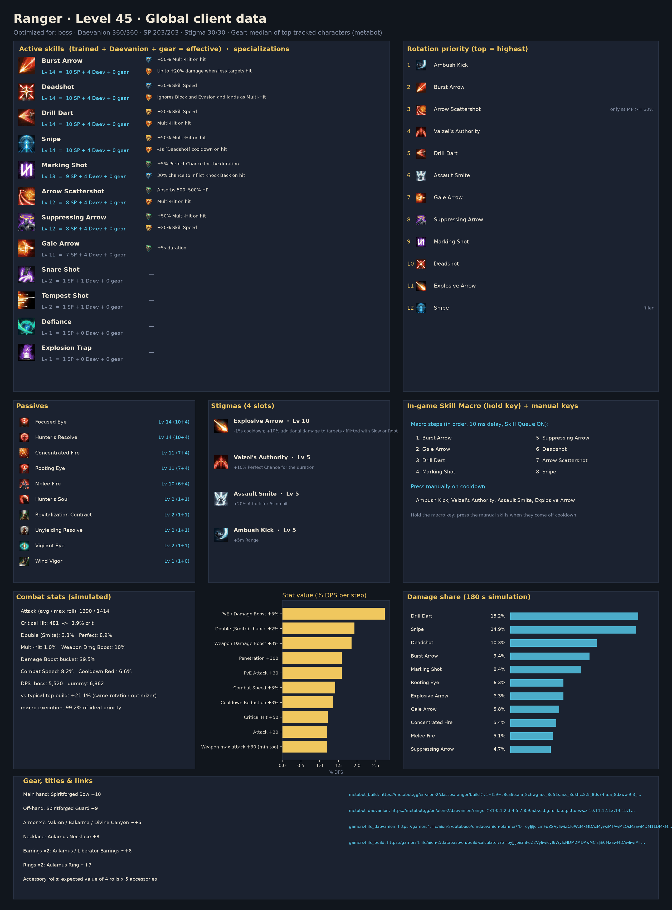
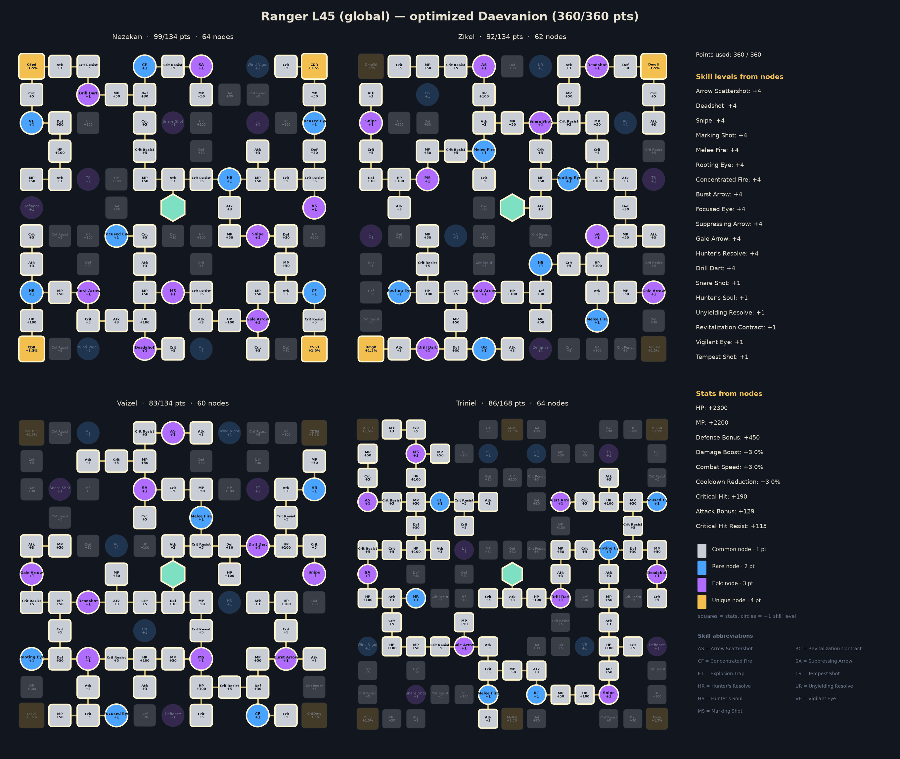
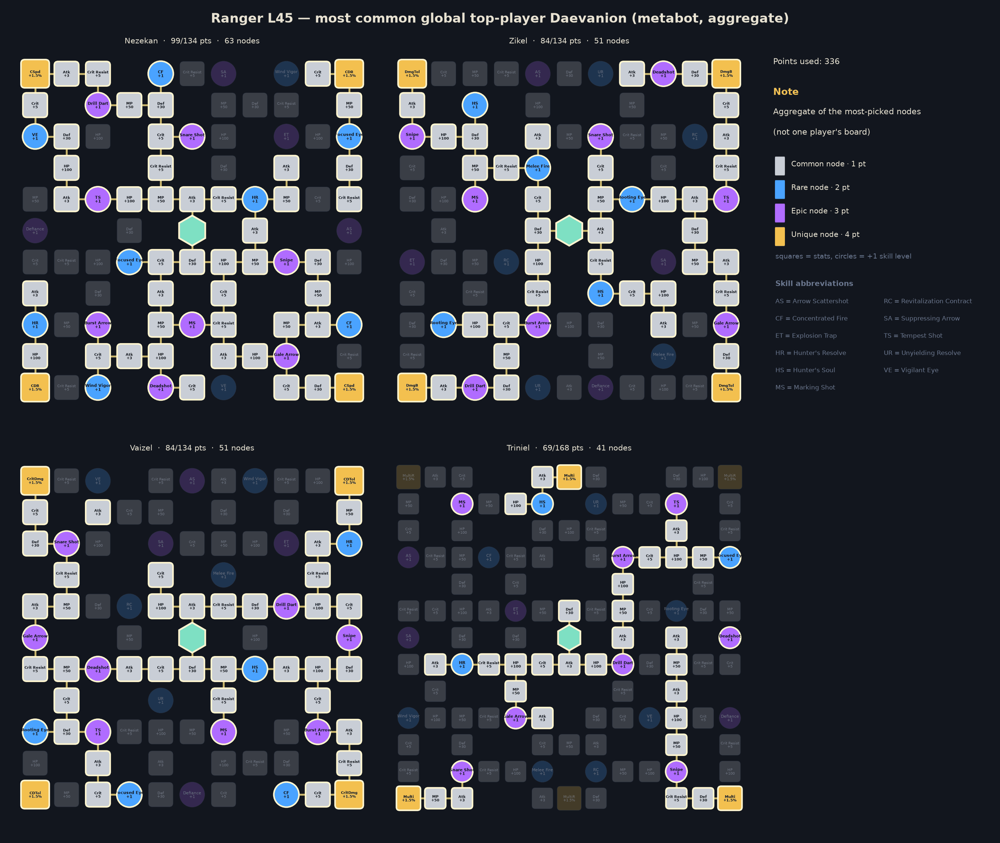

# Ranger — level 45 global build, rotation and macro

Generated by `aion2calc` from the global client data (metabot.gg) with Korean data as fallback. Objective: **boss** fight (see `docs/methodology.md`). Daevanion budget **360** points.



## Results

| Build | boss DPS | dummy DPS |
|---|---:|---:|
| **Optimized (this report)** | **5,520** | **6,362** |
| Typical top global build, optimized rotation | 4,557 | 5,257 |
| Typical top global build, default priority | 4,254 | — |

The optimized build is **+21.1%** over the typical top global build played with the same rotation optimizer, and **+29.7%** over that build played with the default priority. *Typical top global build* = average skill levels, the four most-picked damage stigmas and the most-picked Daevanion nodes of the top tracked global L45 players of this class (metabot.gg live data), given the best legal specializations for its levels (specs are not published).

## Rotation (priority list)

Use the highest skill that is ready; the last entry is the filler.

1. `ambush_kick`
2. `burst_arrow`
3. `arrow_scattershot [mp_hi]`
4. `vaizel_s_authority`
5. `drill_dart`
6. `assault_smite`
7. `gale_arrow`
8. `suppressing_arrow`
9. `marking_shot`
10. `deadshot`
11. `explosive_arrow`
12. `snipe`

`[sync_de]` = wait for the Delayed Explosion vulnerability window when it is about to be ready; `[in_ee]` = prefer using it inside Element Enhancement; `[mp_hi]` = only while MP is at least 60% (weave it in, keep MP for Grace of Enhancement).

### In-game Skill Macro

Settings → Key Settings → General → Skill Macro. Skill Queue (스킬 예약) **ON**, 10 ms delay on every step, hold the macro key; manual presses always take priority over the macro.

| Step | Skill |
|---:|---|
| 1 | burst_arrow |
| 2 | gale_arrow |
| 3 | drill_dart |
| 4 | marking_shot |
| 5 | suppressing_arrow |
| 6 | deadshot |
| 7 | arrow_scattershot |
| 8 | snipe |

Manual keys (press on cooldown, in this priority): ambush_kick, vaizel_s_authority, assault_smite, explosive_arrow

Simulated: this layout reaches **99.2%** of the ideal priority list.

**Alternative — one-button macro (no manual keys)**: macro burst_arrow → vaizel_s_authority → drill_dart → ambush_kick → gale_arrow → suppressing_arrow → assault_smite → marking_shot → deadshot → explosive_arrow → arrow_scattershot → snipe. Simulated: **98.8%** of the ideal priority list.

### Opener (first 30 s of the simulated fight)

```
ambush_kick@0.0s → burst_arrow@0.9s → vaizel_s_authority@1.8s → drill_dart@2.4s → assault_smite@3.2s → gale_arrow@4.1s → suppressing_arrow@5.0s → marking_shot@5.8s → deadshot@6.7s → drill_dart@7.4s → explosive_arrow@8.2s → snipe@9.1s → snipe@9.8s → snipe@10.6s → snipe@11.4s → drill_dart@12.1s → snipe@12.9s → snipe@13.7s → snipe@14.4s → marking_shot@15.2s → snipe@16.1s → drill_dart@16.9s → deadshot@17.7s → snipe@18.4s → snipe@19.1s → burst_arrow@19.9s → snipe@20.8s → drill_dart@21.6s
```

## Skills, specializations and points

Skill points used **203 / 203**, stigma points **30 / 30**, Daevanion **360 / 360**.

| Skill | Trained (SP) | Effective level | Specializations |
|---|---:|---:|---|
| Snipe | 10 | 14 | +50% Multi-Hit on hit; -1s [Deadshot] cooldown on hit |
| Focused Eye | 10 | 14 | — |
| Hunter's Resolve | 10 | 14 | — |
| Deadshot | 10 | 14 | +30% Skill Speed; Ignores Block and Evasion and lands as Multi-Hit |
| Burst Arrow | 10 | 14 | +50% Multi-Hit on hit; Up to +20% damage when less targets hit |
| Drill Dart | 10 | 14 | +20% Skill Speed; Multi-Hit on hit |
| Marking Shot | 9 | 13 | +5% Perfect Chance for the duration; 30% chance to inflict Knock Back on hit |
| Arrow Scattershot | 8 | 12 | Absorbs 500, 500% HP; Multi-Hit on hit |
| Suppressing Arrow | 8 | 12 | +50% Multi-Hit on hit; +20% Skill Speed |
| Rooting Eye | 7 | 11 | — |
| Gale Arrow | 7 | 11 | +5s duration |
| Concentrated Fire | 7 | 11 | — |
| Melee Fire | 6 | 10 | — |
| Snare Shot | 1 | 2 | — |
| Revitalization Contract | 1 | 2 | — |
| Hunter's Soul | 1 | 2 | — |
| Unyielding Resolve | 1 | 2 | — |
| Tempest Shot | 1 | 2 | — |
| Vigilant Eye | 1 | 2 | — |

**Stigmas**: Explosive Arrow Lv 10, Vaizel's Authority Lv 5, Assault Smite Lv 5, Ambush Kick Lv 5

## Daevanion (360 points)



* Open in metabot planner: https://metabot.gg/en/aion-2/daevanion/ranger#31-0.1.2.3.4.5.7.8.9.a.b.c.d.g.h.i.k.p.q.r.t.u.v.w.z.10.11.12.13.14.15.19.1a.1b.1e.1f.1i.1j.1k.1m.1o.1q.1r.1s.1t.1u.1v.1w.1x.1y.1z.20.21.22.23.24.25.26.27.28.2b.2c.2e.2g_32-1.2.3.4.7.8.9.a.b.d.e.f.g.j.k.l.m.n.p.q.r.s.t.u.v.x.y.z.10.11.12.13.14.16.19.1a.1d.1h.1i.1j.1l.1n.1o.1p.1s.1t.1u.1v.1w.1x.1y.1z.20.22.23.24.26.27.28.29.2a.2b_33-3.4.5.b.c.d.g.k.l.m.p.q.s.t.u.v.w.10.11.12.13.14.15.16.17.19.1a.1b.1c.1d.1e.1f.1g.1h.1j.1k.1m.1o.1p.1q.1r.1s.1t.1u.1v.1w.1x.1y.1z.21.22.23.24.25.28.29.2a.2d.2e.2f_34-1.2.9.a.b.j.k.o.q.r.s.t.u.v.x.y.z.10.11.12.13.15.16.17.18.19.1e.1f.1g.1h.1i.1j.1n.1o.1p.1q.1r.1s.1v.1w.1x.1y.20.22.23.24.26.28.29.2a.2b.2c.2g.2h.2l.2m.2n.2o.2u.2v.2w.2x.2y.33
* Open in gamers4.life planner (KR node values, same node IDs): https://gamers4.life/aion-2/database/en/daevanion-planner/?b=eyJjIjoicmFuZ2VyIiwiZCI6WzMxMDAzMywzMTAwMzQsMzEwMDM1LDMxMDAzNywzMTAwMzgsMzEwMDM5LDMxMDA0MiwzMTAwNDMsMzEwMDQ4LDMxMDA1MCwzMTAwNTEsMzEwMDUyLDMxMDA1NCwzMTAwNTgsMzEwMDYzLDMxMDA2NCwzMTAwNjcsMzEwMDczLDMxMDA3OSwzMTAwODIsMzEwMDg2LDMxMDA4OCwzMTAwOTMsMzEwMDk0LDMxMDA5NywzMTAwOTgsMzEwMDk5LDMxMDEwMCwzMTAxMDEsMzEwMTAyLDMxMDEwMywzMTAxMTUsMzEwMTE4LDMxMDEyMywzMTAxMjYsMzEwMTI3LDMxMDEzMCwzMTAxMzEsMzEwMTMyLDMxMDEzOCwzMTAxNDIsMzEwMTQ3LDMxMDE1MywzMTAxNTQsMzEwMTU1LDMxMDE1NywzMTAxNTgsMzEwMTU5LDMxMDE2MSwzMTAxNjIsMzEwMTYzLDMxMDE2OCwzMTAxNzAsMzEwMTcxLDMxMDE3MiwzMTAxNzQsMzEwMTc1LDMxMDE3NiwzMTAxNzgsMzEwMTgzLDMxMDE4NywzMTAxODgsMzEwMTkxLDMxMDE5MywzMjAwMzQsMzIwMDM1LDMyMDAzNiwzMjAwMzcsMzIwMDQwLDMyMDA0MSwzMjAwNDIsMzIwMDQzLDMyMDA0OCwzMjAwNTIsMzIwMDU1LDMyMDA1OCwzMjAwNjMsMzIwMDY3LDMyMDA2OCwzMjAwNjksMzIwMDcwLDMyMDA3MSwzMjAwNzMsMzIwMDc4LDMyMDA4MCwzMjAwODEsMzIwMDgyLDMyMDA4NCwzMjAwODYsMzIwMDkzLDMyMDA5NCwzMjAwOTUsMzIwMDk3LDMyMDA5OSwzMjAxMDAsMzIwMTAxLDMyMDEwMiwzMjAxMDksMzIwMTE0LDMyMDExNywzMjAxMjUsMzIwMTMxLDMyMDEzMiwzMjAxMzMsMzIwMTQwLDMyMDE0NCwzMjAxNDUsMzIwMTQ2LDMyMDE1NCwzMjAxNTUsMzIwMTU2LDMyMDE1NywzMjAxNTgsMzIwMTU5LDMyMDE2MSwzMjAxNjIsMzIwMTYzLDMyMDE3MSwzMjAxNzQsMzIwMTc2LDMyMDE4MywzMjAxODQsMzIwMTg1LDMyMDE4NiwzMjAxODcsMzIwMTg4LDMzMDAzNywzMzAwMzgsMzMwMDM5LDMzMDA1MCwzMzAwNTEsMzMwMDUyLDMzMDA1OCwzMzAwNjcsMzMwMDY4LDMzMDA2OSwzMzAwNzIsMzMwMDczLDMzMDA4MiwzMzAwODQsMzMwMDg3LDMzMDA5MywzMzAwOTQsMzMwMDk4LDMzMDA5OSwzMzAxMDAsMzMwMTAxLDMzMDEwMiwzMzAxMDMsMzMwMTA4LDMzMDExMSwzMzAxMTUsMzMwMTE4LDMzMDEyMywzMzAxMjQsMzMwMTI1LDMzMDEyNiwzMzAxMjcsMzMwMTI4LDMzMDEyOSwzMzAxMzEsMzMwMTMyLDMzMDEzOSwzMzAxNDQsMzMwMTQ3LDMzMDE1MywzMzAxNTQsMzMwMTU1LDMzMDE1NiwzMzAxNTcsMzMwMTU4LDMzMDE1OSwzMzAxNjEsMzMwMTYyLDMzMDE2MywzMzAxNzAsMzMwMTcyLDMzMDE3NCwzMzAxNzUsMzMwMTc2LDMzMDE4NCwzMzAxODUsMzMwMTg2LDMzMDE4OSwzMzAxOTEsMzMwMTkyLDM0MDAxOCwzNDAwMTksMzQwMDMyLDM0MDAzNCwzNDAwMzUsMzQwMDQ3LDM0MDA0OSwzNDAwNTcsMzQwMDYyLDM0MDA2MywzNDAwNjQsMzQwMDY1LDM0MDA2NiwzNDAwNjcsMzQwMDcwLDM0MDA3MSwzNDAwNzIsMzQwMDczLDM0MDA3NCwzNDAwNzksMzQwMDgxLDM0MDA4OCwzNDAwOTIsMzQwMDkzLDM0MDA5NCwzNDAwOTUsMzQwMTAwLDM0MDEwMSwzNDAxMDIsMzQwMTAzLDM0MDEwNCwzNDAxMDcsMzQwMTE1LDM0MDExNywzNDAxMTksMzQwMTIyLDM0MDEyMywzNDAxMjQsMzQwMTI3LDM0MDEyOCwzNDAxMjksMzQwMTMwLDM0MDEzMiwzNDAxMzQsMzQwMTM4LDM0MDE0MSwzNDAxNDcsMzQwMTUzLDM0MDE1NCwzNDAxNTUsMzQwMTU2LDM0MDE1NywzNDAxNjIsMzQwMTYzLDM0MDE3MiwzNDAxNzMsMzQwMTc0LDM0MDE3NywzNDAxODcsMzQwMTg5LDM0MDE5MCwzNDAxOTEsMzQwMTkyLDM0MDIwMl19
* Full skill/stigma/Daevanion build in metabot planner: https://metabot.gg/en/aion-2/classes/ranger/build#v1~l19~s8ca6o.a.a_8chwg.a.c_8d51s.a.c_8dkhc.8.5_8ds74.a.a_8dzww.9.3_8efcg.7.1_8en28.5.0_8ipo0.5.0_8j53k.8.9_8js8w.a.0_8r2lc.5.0_8ri0w.7.0_8rxgg.a.0_8s568.a.0_8skls.7.0_8ssbk.6.0~g8js8w_8ipo0_8r2lc_8en28~d31-0.1.2.3.4.5.7.8.9.a.b.c.d.g.h.i.k.p.q.r.t.u.v.w.z.10.11.12.13.14.15.19.1a.1b.1e.1f.1i.1j.1k.1m.1o.1q.1r.1s.1t.1u.1v.1w.1x.1y.1z.20.21.22.23.24.25.26.27.28.2b.2c.2e.2g_32-1.2.3.4.7.8.9.a.b.d.e.f.g.j.k.l.m.n.p.q.r.s.t.u.v.x.y.z.10.11.12.13.14.16.19.1a.1d.1h.1i.1j.1l.1n.1o.1p.1s.1t.1u.1v.1w.1x.1y.1z.20.22.23.24.26.27.28.29.2a.2b_33-3.4.5.b.c.d.g.k.l.m.p.q.s.t.u.v.w.10.11.12.13.14.15.16.17.19.1a.1b.1c.1d.1e.1f.1g.1h.1j.1k.1m.1o.1p.1q.1r.1s.1t.1u.1v.1w.1x.1y.1z.21.22.23.24.25.28.29.2a.2d.2e.2f_34-1.2.9.a.b.j.k.o.q.r.s.t.u.v.x.y.z.10.11.12.13.15.16.17.18.19.1e.1f.1g.1h.1i.1j.1n.1o.1p.1q.1r.1s.1v.1w.1x.1y.20.22.23.24.26.28.29.2a.2b.2c.2g.2h.2l.2m.2n.2o.2u.2v.2w.2x.2y.33

For comparison, the aggregate of the most-picked nodes among top global players:



## Stat priority (simulated)

| Upgrade | DPS gain | Worth in Attack |
|---|---:|---:|
| PvE / Damage Boost +3% | +2.74% | 69 |
| Double (Smite) chance +2% | +1.93% | 48 |
| Weapon Damage Boost +3% | +1.86% | 47 |
| Penetration +300 | +1.59% | 40 |
| PvE Attack +30 | +1.59% | 40 |
| Combat Speed +3% | +1.42% | 36 |
| Cooldown Reduction +3% | +1.36% | 34 |
| Critical Hit +50 | +1.22% | 31 |
| Attack +30 | +1.20% | 30 |
| Weapon max attack +30 (min too) | +1.20% | 30 |
| Wisdom +10 (Double +1%) | +0.97% | 24 |
| Might +10 (Attack +1%) | +0.50% | 12 |
| Destruction +10 (Attack +1%) | +0.50% | 12 |
| Time +10 (Combat Speed +1%) | +0.47% | 12 |
| Illusion +10 (Cooldown -1%) | +0.45% | 11 |
| Multi-hit chance +3% | +0.26% | 7 |
| Critical Attack +50 | +0.16% | 4 |
| Critical Damage Boost +3% | +0.11% | 3 |
| Death +10 (Crit +1%) | +0.05% | 1 |
| Perfect chance +3% | +0.03% | 1 |
| Justice +10 (Perfect +1%) | +0.01% | 0 |
| MP +300 | +0.00% | 0 |

Accuracy is a threshold stat (avoid parries; back attacks ignore them) and is not ranked.

## Gear, rolls, enchanting

Loadout: **Global L45 Ranger - median of top tracked characters (metabot)**

* Main hand: Spiritforged Bow +10
* Off-hand: Spiritforged Guard +9
* Armor x7: Vakron / Bakarma / Divine Canyon ~+5
* Necklace: Aulamus Necklace +8
* Earrings x2: Aulamus / Liberator Earrings ~+6
* Rings x2: Aulamus Ring ~+7
* Accessory rolls: expected value of 4 rolls x 5 accessories
* Bracelets x2: Ascension +9 / Liberator +6
* Amulet: Revelation Amulet +0
* Rune: Clash Rune +2
* Attack title: Guardian of Altgard / Verteron
* Other title: Through Hell and Back
* Owned titles: collection bonuses (estimate)
* Wings: Ultimate Daeva Wings
* Primary/deity stats: profile averages

**Random-roll priority per item** (keep / reroll toward the top of each list):

* **Rupture Tome**: Damage Boost (+4.9% – +5.7%), Combat Speed (+8.8% – +10.2%), Weapon Damage Boost (+6.5% – +7.6%), Front Attack (+65 – +82), Attack (+30 – +42)
* **Ludras Grimoire**: Damage Boost (+6.3% – +7.3%), Combat Speed (+11.2% – +13%), Weapon Damage Boost (+8.3% – +9.6%), Front Attack (+83 – +102), Attack (+38 – +51)
* **Spiritforged Guard**: Might (+10 – +10), Accuracy (+30 – +30)
* **Vakron Helm**: Double Chance (+1.6% – +1.9%), Attack increase (+1.6% – +1.9%), Attack (+16 – +25), Critical Hit (+25 – +36), MP (+76 – +94)
* **Bakarma Breastplate**: Damage Boost (+4.4% – +5.2%), Attack (+18 – +28), Critical Hit (+27 – +38), Perfect Chance (+3.9% – +4.6%), MP (+83 – +102)
* **Aulamus Necklace**: Combat Speed (+3.2% – +3.8%), Attack (+23 – +33), Critical Hit (+35 – +47), Might (+9 – +17), Precision (+9 – +17)
* **Aulamus Ring**: Attack (+16 – +25), Critical Hit (+25 – +36), Might (+5 – +13), Precision (+5 – +13), Natural MP Regen (+18 – +28)

**Enchant priority** (DPS per enchant level):

* Weapon (Spiritforged / Rupture): 18.2 DPS/level
* Guard (off-hand): 11.0 DPS/level
* Necklace / Earrings / Rings (Aulamus): 8.8 DPS/level
* Revelation Amulet: 8.8 DPS/level
* Bracelets: 6.6 DPS/level
* Armor pieces: 0.0 DPS/level

## Titles, arcana, wings, pets

**Best titles by equip bonus** (global client values):

| Title | Grade | Equip bonus | Owned bonus |
|---|---|---|---|
| Unbound by Genus (Both factions) | Unique | PvE Damage Boost +4.5%, Attack Bonus +34, Critical Hit +68 | PvE Damage Boost +1% |
| Guardian of Altgard (Asmodian) | Epic | PvE Damage Boost +3%, Penetration +210 | PvE Attack +4 |
| Guardian of Verteron (Elyos) | Epic | PvE Damage Boost +3%, Penetration +210 | PvE Attack +4 |
| Empty Closet (Both factions) | Unique | Combat Speed +3.5%, Natural HP Regen +42, Cooldown Reduction +3.5% | HP +120 |
| Scenery Collector (Both factions) | Epic | PvE Damage Boost +3.3%, Block Penetration +54 | Critical Hit +10 |
| Teleportation Specialist (Both factions) | Epic | PvE Accuracy +58, PvE Damage Boost +3.1% | Critical Hit +10 |
| Nice to Meet You (Both factions) | Rare | PvE Damage Boost +2.9% | PvE Defense +10 |
| Verteron Seal Breaker (Both factions) | Rare | Boss Damage Boost +2.7% | PvE Accuracy +10 |
| Failed Entrepreneur (Elyos) | Epic | PvE Attack +25, Attack Bonus +20 | Accuracy Bonus +10 |
| Lifeguard (Asmodian) | Epic | PvE Attack +25, Attack Bonus +20 | Accuracy Bonus +10 |

**Arcana variant per slot** (deity stat that is worth more for this build):

* Chalice / Grail: **Vigor or Frenzy** (Time +20)
* Parchment: either variant (Life +20 / Destiny +20: no damage either way)
* Compass: **Magic or Purity** (Death +20)
* Bell: **Magic or Purity** (Destruction +20)
* Mirror: **Magic or Purity** (Wisdom +20)

**Arcana random skill option** (Unique arcana roll one option from the class pool when soul-bound, up to +4; simulated DPS gain on this build):

| Skill | +1 | +2 | +3 | +4 |
|---|---:|---:|---:|---:|
| Focused Eye | +1.11% | +2.22% | +3.34% | +4.45% |
| Concentrated Fire | +0.08% | +0.18% | +0.29% | +0.39% |
| Melee Fire | +0.09% | +0.16% | +0.22% | +0.28% |
| Hunter's Soul | +0.02% | +0.04% | +0.06% | +0.07% |
| Unyielding Resolve | +0.00% | +0.00% | +0.00% | +0.00% |

The pool holds passives only, so at level 45 an active skill still stops at Lv 14 (10 from skill points + 4 Daevanion nodes); the Lv 16 specialization options are out of reach.

**Deity (pantheon) stats**, +10 points each (arcana main stats, Abyssal Bracelet rolls, Monolith rewards): Wisdom +0.97%, Might +0.50%, Destruction +0.50%, Time +0.47%, Illusion +0.45%, Death +0.05%, Justice +0.01%.

**Closet / appearance collection**: every unlocked skin and costume set adds permanent Collection Effect stats, and wings keep a Retention Effect once owned. The client tables for these are not public, so they are not itemised here; they are flat stats, so value them with the stat table above and collect the cheap ones first.

**Wings**: Ultimate Daeva Wings (Accuracy +40, Penetration +500) are the most used and the best launch option for damage among common wings. **Pets**: pet collection bonuses are mostly genus-specific (damage vs that monster genus) plus Accuracy/Crit; level the genus of the content you farm first.

## Robustness

Every animation time was randomly perturbed by up to ±25% (8 samples) and the rotation re-optimized each time. Playing the recommended priority instead of the re-optimized one lost on average **0.18%** (worst 0.18%).

**Crit curve.** The crit-chance curve is fitted to tests at Crit 1048–1326 and extrapolated down to launch values: this build sits at **3.9%** crit, and Crit +50 ranks #8 (+1.22%). If launch testing shows more crit — e.g. the curve shifted to a midpoint of 700, giving 22% — Crit +50 becomes #1 (+4.55%). Re-run with `--crit-midpoint` once real numbers exist.

## Validation against Korean logs

Simulated damage shares (training dummy) overlap **49%** with the mean of the top-10 A2DIL Korean dummy logs; 4% of the Korean damage comes from skills that are not in the global level-45 client. Korea plays above level 45 with Lv 16-20 specializations, so a perfect match is not expected; low values mean the class kit needs hand-tuning (see `kit/sorcerer.py` for a hand-written kit).

## Sources

* metabot.gg (global client): class skills, Daevanion boards, items, titles, top-player statistics
* gamers4.life (KR database): skill hit counts, build/Daevanion planners
* A2DIL (KR training-dummy logs): damage-share validation
* Inven / Bahamut damage research, aion2ssow calculator: damage formula

See `docs/methodology.md` for every formula and assumption.
