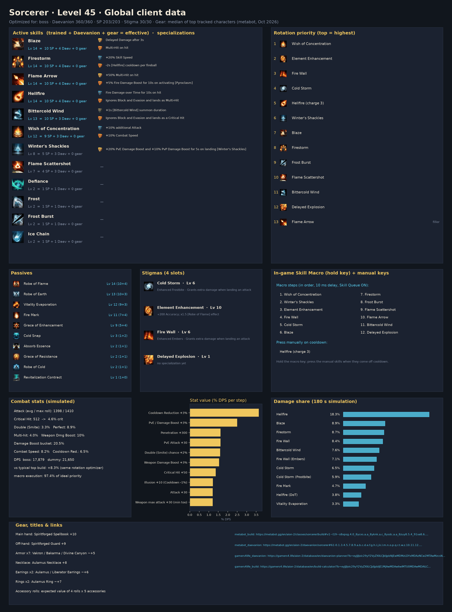
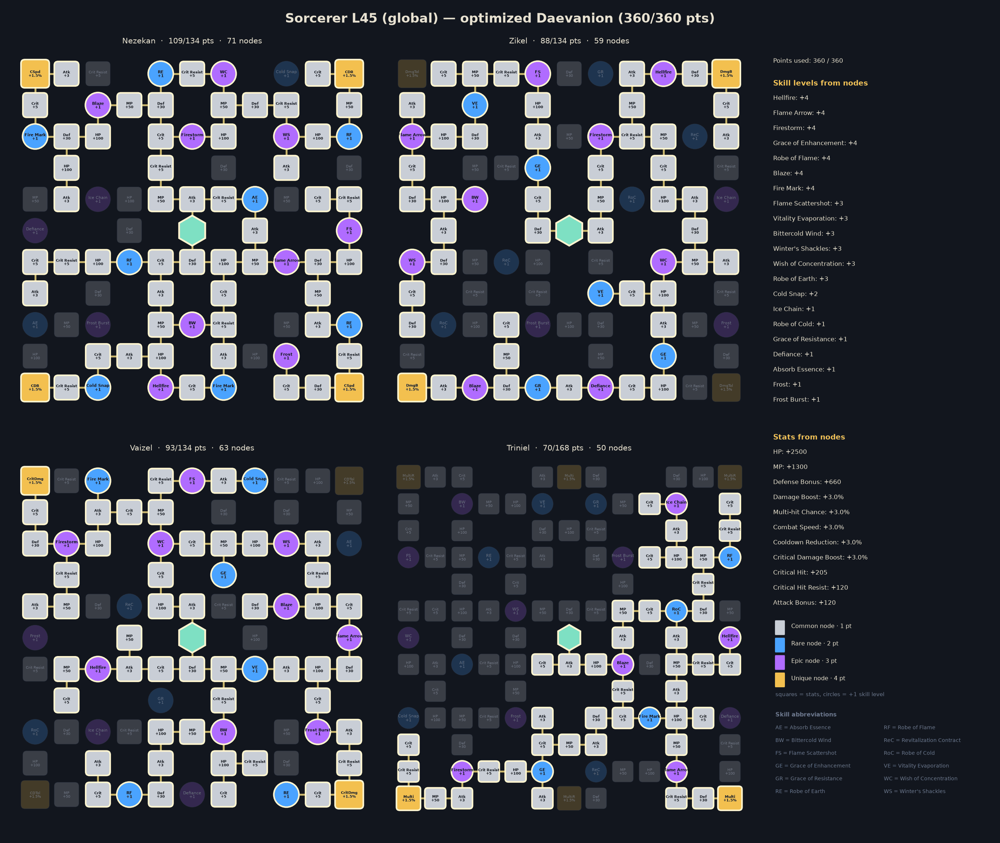
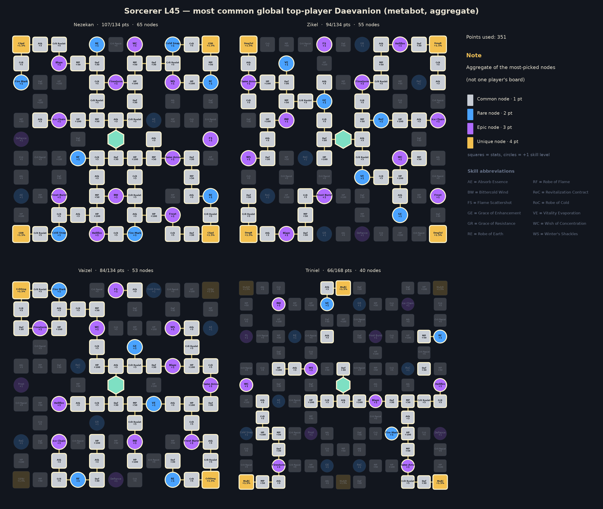

# Sorcerer — level 45 global build, rotation and macro

Generated by `aion2calc` from the global client data (metabot.gg) with Korean data as fallback. Primary view: **boss** fight (see `docs/methodology.md`). Daevanion budget **360** points.



## Damage objective: boss modeled DPS

Score: 17,879 modeled DPS.

boss: 100%, 180.0s, 17,879 DPS

Damage objective subject to the saved HP and trained-skill reserves. Balanced uses equal scenario weights. Stat weights follow the selected objective; skill shares, opener, macro and sensitivity remain primary-scenario views. This local search does not establish a global optimum or competitive PvP efficacy.

## Results

| Build | boss DPS | dummy DPS |
|---|---:|---:|
| **Optimized (this report)** | **17,879** | **21,650** |
| Typical top global build, optimized rotation | 16,512 | 20,121 |
| Typical top global build, default priority | 14,050 | — |

The optimized build is **+8.3%** over the typical top global build played with the same rotation optimizer, and **+27.3%** over that build played with the default priority. *Typical top global build* = average skill levels, the four most-picked damage stigmas and the most-picked Daevanion nodes of the top tracked global L45 players of this class (metabot.gg live data), given the best legal specializations for its levels (specs are not published).

## Rotation (priority list)

Use the highest skill that is ready; the last entry is the filler.

1. `wish`
2. `element_enhancement`
3. `fire_wall`
4. `cold_storm`
5. `hellfire_c3`
6. `winters_shackles`
7. `blaze`
8. `firestorm`
9. `frost_burst`
10. `flame_scattershot`
11. `bittercold_wind`
12. `delayed_explosion`
13. `flame_arrow`

`[sync_de]` = wait for the Delayed Explosion vulnerability window when it is about to be ready; `[in_ee]` = prefer using it inside Element Enhancement; `[mp_hi]` = only while MP is at least 60% (weave it in, keep MP for Grace of Enhancement).

### In-game Skill Macro

Settings → Key Settings → General → Skill Macro. Skill Queue (스킬 예약) **ON**, 10 ms delay on every step, hold the macro key; manual presses always take priority over the macro.

| Step | Skill |
|---:|---|
| 1 | wish |
| 2 | winters_shackles |
| 3 | element_enhancement |
| 4 | fire_wall |
| 5 | cold_storm |
| 6 | blaze |
| 7 | firestorm |
| 8 | frost_burst |
| 9 | flame_scattershot |
| 10 | flame_arrow |
| 11 | bittercold_wind |
| 12 | delayed_explosion |

Manual keys (press on cooldown, in this priority): hellfire_c3

Simulated: this layout reaches **97.4%** of the ideal priority list.

**Alternative — macro with manual keys**: macro firestorm → blaze → frost_burst → bittercold_wind → flame_arrow; manual: wish, element_enhancement, fire_wall, cold_storm, hellfire_c3, winters_shackles, flame_scattershot, delayed_explosion. Simulated: **94.1%** of the ideal priority list.

### Opener (first 30 s of the simulated fight)

```
wish@0.0s → element_enhancement@0.6s → fire_wall@1.1s → cold_storm@2.0s → hellfire_c3@2.9s → winters_shackles@4.7s → blaze@5.6s → firestorm@6.2s → bittercold_wind@7.2s → delayed_explosion@8.0s → flame_arrow@8.8s → flame_arrow@9.5s → blaze@10.2s → firestorm@10.9s → flame_arrow@11.8s → flame_arrow@12.6s → flame_arrow@13.2s → flame_arrow@14.0s → flame_arrow@14.7s → blaze@15.4s → firestorm@16.0s → hellfire_c3@17.0s → flame_arrow@19.0s → flame_arrow@19.8s → blaze@20.6s → firestorm@21.3s → bittercold_wind@22.3s → flame_arrow@23.2s
```

## Skills, specializations and points

Skill points used **203 / 203**, stigma points **30 / 30**, Daevanion **360 / 360**.

| Skill | Trained (SP) | Effective level | Specializations |
|---|---:|---:|---|
| Blaze | 10 | 14 | Delayed Damage after 3s; Multi-Hit on hit |
| Hellfire | 10 | 14 | Fire Damage over Time for 10s on hit; Ignores Block and Evasion and lands as Multi-Hit |
| Firestorm | 10 | 14 | +20% Skill Speed; -2s [Hellfire] cooldown per fireball |
| Robe of Flame | 10 | 14 | — |
| Flame Arrow | 10 | 14 | +50% Multi-Hit on hit; +5% Fire Damage Boost for 10s on activating [Pyroclasm] |
| Bittercold Wind | 10 | 13 | +1s [Bittercold Wind] summon duration; Ignores Block and Evasion and lands as a Critical Hit |
| Robe of Earth | 10 | 13 | — |
| Wish of Concentration | 9 | 12 | +10% additional Attack; +10% Combat Speed |
| Vitality Evaporation | 9 | 12 | — |
| Fire Mark | 7 | 11 | — |
| Grace of Enhancement | 5 | 9 | — |
| Winter's Shackles | 5 | 8 | +20% PvE Damage Boost and +10% PvP Damage Boost for 5s on landing [Winter's Shackles] |
| Flame Scattershot | 4 | 7 | — |
| Cold Snap | 1 | 3 | — |
| Frost Burst | 1 | 2 | — |
| Defiance | 1 | 2 | — |
| Robe of Cold | 1 | 2 | — |
| Absorb Essence | 1 | 2 | — |
| Ice Chain | 1 | 2 | — |
| Grace of Resistance | 1 | 2 | — |
| Frost | 1 | 2 | — |

**Stigmas**: Cold Storm Lv 6, Element Enhancement Lv 10, Fire Wall Lv 6, Delayed Explosion Lv 1

## Daevanion (360 points)



* Open in metabot planner: https://metabot.gg/en/aion-2/daevanion/sorcerer#61-0.1.3.4.5.7.8.9.a.b.c.d.e.f.g.h.i.j.k.l.m.n.o.p.q.r.t.w.z.10.11.12.14.15.19.1a.1b.1c.1d.1e.1f.1g.1h.1i.1j.1k.1l.1m.1o.1p.1q.1u.1v.1w.1y.1z.21.22.23.24.26.27.28.29.2a.2b.2c.2d.2e.2f.2g_62-1.2.3.4.7.8.9.a.b.c.d.e.f.g.h.i.j.l.m.n.p.q.t.u.v.x.y.z.10.11.13.14.16.17.19.1a.1b.1c.1h.1i.1j.1k.1n.1o.1p.1r.1u.1y.22.24.26.27.28.29.2a.2b.2c.2d.2e_63-0.2.3.4.5.6.a.b.c.d.h.i.j.k.l.m.n.o.p.r.s.t.u.v.w.z.10.12.13.14.15.17.1a.1c.1d.1e.1f.1g.1h.1i.1j.1k.1l.1m.1o.1p.1u.1v.1w.1y.1z.21.22.23.24.26.29.2a.2b.2d.2e.2f.2g_64-g.h.i.o.p.y.z.10.11.15.1e.1f.1g.1h.1n.1o.1p.1v.1w.1x.1y.20.21.22.25.26.2c.2d.2e.2f.2g.2h.2j.2l.2m.2n.2o.2q.2r.2s.2t.2u.2y.30.31.32.33.36.37.38
* Open in gamers4.life planner (KR node values, same node IDs): https://gamers4.life/aion-2/database/en/daevanion-planner/?b=eyJjIjoic29yY2VyZXIiLCJkIjpbNjEwMDMzLDYxMDAzNCw2MTAwMzcsNjEwMDM4LDYxMDAzOSw2MTAwNDIsNjEwMDQzLDYxMDA0OCw2MTAwNTAsNjEwMDUxLDYxMDA1Miw2MTAwNTQsNjEwMDU1LDYxMDA1Niw2MTAwNTgsNjEwMDYzLDYxMDA2NCw2MTAwNjUsNjEwMDY3LDYxMDA2OCw2MTAwNjksNjEwMDcxLDYxMDA3Miw2MTAwNzMsNjEwMDc5LDYxMDA4Miw2MTAwODYsNjEwMDk0LDYxMDA5Nyw2MTAwOTgsNjEwMDk5LDYxMDEwMCw2MTAxMDIsNjEwMTAzLDYxMDExNSw2MTAxMTgsNjEwMTIzLDYxMDEyNCw2MTAxMjUsNjEwMTI2LDYxMDEyNyw2MTAxMjgsNjEwMTI5LDYxMDEzMCw2MTAxMzEsNjEwMTMyLDYxMDEzMyw2MTAxMzgsNjEwMTQyLDYxMDE0NCw2MTAxNDcsNjEwMTU3LDYxMDE1OCw2MTAxNTksNjEwMTYyLDYxMDE2Myw2MTAxNzAsNjEwMTcxLDYxMDE3Miw2MTAxNzQsNjEwMTc2LDYxMDE3OCw2MTAxODMsNjEwMTg0LDYxMDE4NSw2MTAxODcsNjEwMTg4LDYxMDE4OSw2MTAxOTEsNjEwMTkyLDYxMDE5Myw2MjAwMzQsNjIwMDM1LDYyMDAzNiw2MjAwMzcsNjIwMDQwLDYyMDA0MSw2MjAwNDIsNjIwMDQzLDYyMDA0OCw2MjAwNTAsNjIwMDUyLDYyMDA1NSw2MjAwNTgsNjIwMDYzLDYyMDA2NCw2MjAwNjUsNjIwMDY3LDYyMDA2OSw2MjAwNzAsNjIwMDcxLDYyMDA3Myw2MjAwNzgsNjIwMDgyLDYyMDA4NCw2MjAwODYsNjIwMDkzLDYyMDA5NCw2MjAwOTUsNjIwMDk3LDYyMDA5OSw2MjAxMDEsNjIwMTAyLDYyMDEwOSw2MjAxMTIsNjIwMTE0LDYyMDExNyw2MjAxMjMsNjIwMTI0LDYyMDEzMSw2MjAxMzIsNjIwMTMzLDYyMDEzOCw2MjAxNDQsNjIwMTQ1LDYyMDE0Niw2MjAxNTMsNjIwMTU2LDYyMDE2MSw2MjAxNzEsNjIwMTc2LDYyMDE4Myw2MjAxODQsNjIwMTg1LDYyMDE4Niw2MjAxODcsNjIwMTg4LDYyMDE4OSw2MjAxOTAsNjIwMTkxLDYzMDAzMyw2MzAwMzUsNjMwMDM3LDYzMDAzOCw2MzAwMzksNjMwMDQwLDYzMDA0OCw2MzAwNTAsNjMwMDUxLDYzMDA1Miw2MzAwNjMsNjMwMDY0LDYzMDA2NSw2MzAwNjcsNjMwMDY4LDYzMDA2OSw2MzAwNzAsNjMwMDcxLDYzMDA3Miw2MzAwNzksNjMwMDgyLDYzMDA4NCw2MzAwODcsNjMwMDkzLDYzMDA5NCw2MzAwOTcsNjMwMDk4LDYzMDEwMCw2MzAxMDEsNjMwMTAyLDYzMDEwMyw2MzAxMTEsNjMwMTE4LDYzMDEyNCw2MzAxMjUsNjMwMTI2LDYzMDEyNyw2MzAxMjgsNjMwMTI5LDYzMDEzMCw2MzAxMzEsNjMwMTMyLDYzMDEzMyw2MzAxMzksNjMwMTQ0LDYzMDE0Nyw2MzAxNTcsNjMwMTU4LDYzMDE1OSw2MzAxNjIsNjMwMTYzLDYzMDE3MCw2MzAxNzIsNjMwMTc0LDYzMDE3NSw2MzAxNzgsNjMwMTg1LDYzMDE4Niw2MzAxODcsNjMwMTg5LDYzMDE5MSw2MzAxOTIsNjMwMTkzLDY0MDA0MSw2NDAwNDIsNjQwMDQ0LDY0MDA1Nyw2NDAwNTksNjQwMDcxLDY0MDA3Miw2NDAwNzMsNjQwMDc0LDY0MDA4OCw2NDAxMDAsNjQwMTAxLDY0MDEwMiw2NDAxMDMsNjQwMTE1LDY0MDExNyw2NDAxMTksNjQwMTI3LDY0MDEyOCw2NDAxMjksNjQwMTMwLDY0MDEzMiw2NDAxMzMsNjQwMTM0LDY0MDE0NSw2NDAxNDcsNjQwMTU3LDY0MDE1OSw2NDAxNjAsNjQwMTYxLDY0MDE2Miw2NDAxNjMsNjQwMTY3LDY0MDE3Miw2NDAxNzMsNjQwMTc0LDY0MDE3Nyw2NDAxODIsNjQwMTg0LDY0MDE4NSw2NDAxODYsNjQwMTg3LDY0MDE5Miw2NDAxOTcsNjQwMTk4LDY0MDE5OSw2NDAyMDIsNjQwMjA3LDY0MDIwOCw2NDAyMDldfQ
* Full skill/stigma/Daevanion build in metabot planner: https://metabot.gg/en/aion-2/classes/sorcerer/build#v1~l19~s8xpsg.4.0_8ycxs.a.a_8yknk.a.c_8ysdc.a.a_8zuy8.5.4_91se8.6.0_92040.a.c_93i4g.a.9_9459s.9.a_95v00.6.0_962ps.a.0_9cpww.7.0_9cxmo.a.0_9dd28.a.0_9e7xc.5.0_9encw.9.0~g91se8_962ps_95v00_94czk~d61-0.1.3.4.5.7.8.9.a.b.c.d.e.f.g.h.i.j.k.l.m.n.o.p.q.r.t.w.z.10.11.12.14.15.19.1a.1b.1c.1d.1e.1f.1g.1h.1i.1j.1k.1l.1m.1o.1p.1q.1u.1v.1w.1y.1z.21.22.23.24.26.27.28.29.2a.2b.2c.2d.2e.2f.2g_62-1.2.3.4.7.8.9.a.b.c.d.e.f.g.h.i.j.l.m.n.p.q.t.u.v.x.y.z.10.11.13.14.16.17.19.1a.1b.1c.1h.1i.1j.1k.1n.1o.1p.1r.1u.1y.22.24.26.27.28.29.2a.2b.2c.2d.2e_63-0.2.3.4.5.6.a.b.c.d.h.i.j.k.l.m.n.o.p.r.s.t.u.v.w.z.10.12.13.14.15.17.1a.1c.1d.1e.1f.1g.1h.1i.1j.1k.1l.1m.1o.1p.1u.1v.1w.1y.1z.21.22.23.24.26.29.2a.2b.2d.2e.2f.2g_64-g.h.i.o.p.y.z.10.11.15.1e.1f.1g.1h.1n.1o.1p.1v.1w.1x.1y.20.21.22.25.26.2c.2d.2e.2f.2g.2h.2j.2l.2m.2n.2o.2q.2r.2s.2t.2u.2y.30.31.32.33.36.37.38

For comparison, the aggregate of the most-picked nodes among top global players:



## Stat priority (simulated)

| Upgrade | DPS gain | Worth in Attack |
|---|---:|---:|
| Cooldown Reduction +3% | +3.64% | 90 |
| PvE / Damage Boost +3% | +2.50% | 62 |
| Penetration +300 | +1.62% | 40 |
| PvE Attack +30 | +1.62% | 40 |
| Double (Smite) chance +2% | +1.60% | 40 |
| Weapon Damage Boost +3% | +1.55% | 38 |
| Critical Hit +50 | +1.36% | 34 |
| Illusion +10 (Cooldown -1%) | +1.21% | 30 |
| Attack +30 | +1.21% | 30 |
| Weapon max attack +30 (min too) | +1.21% | 30 |
| Combat Speed +3% | +0.81% | 20 |
| Wisdom +10 (Double +1%) | +0.80% | 20 |
| Critical Attack +50 | +0.66% | 16 |
| Might +10 (Attack +1%) | +0.48% | 12 |
| Destruction +10 (Attack +1%) | +0.48% | 12 |
| Critical Damage Boost +3% | +0.40% | 10 |
| Time +10 (Combat Speed +1%) | +0.27% | 7 |
| Multi-hit chance +3% | +0.21% | 5 |
| Death +10 (Crit +1%) | +0.12% | 3 |
| Perfect chance +3% | +0.01% | 0 |
| Justice +10 (Perfect +1%) | +0.00% | 0 |
| MP +300 | +0.00% | 0 |

Accuracy is a threshold stat (avoid parries; back attacks ignore them) and is not ranked.

## Gear, rolls, enchanting

Loadout: **Global L45 Sorcerer - median of top tracked characters (metabot, Oct 2026)**

* Main hand: Spiritforged Spellbook +10
* Off-hand: Spiritforged Guard +9
* Armor x7: Vakron / Bakarma / Divine Canyon ~+5
* Necklace: Aulamus Necklace +8
* Earrings x2: Aulamus / Liberator Earrings ~+6
* Rings x2: Aulamus Ring ~+7
* Accessory rolls: expected value of 4 rolls x 5 accessories
* Bracelets x2: Ascension +9 / Liberator +6
* Amulet: Revelation Amulet +0
* Rune: Clash Rune +2
* Attack title: Guardian of Altgard / Verteron
* Other title: Through Hell and Back
* Owned titles: collection bonuses (estimate)
* Wings: Ultimate Daeva Wings
* Primary/deity stats: profile averages

**Weapon comparison (same build & rotation):**

| Weapon | DPS | vs baseline |
|---|---:|---:|
| Spiritforged Spellbook +10 (this loadout) | 17,879 | +0.0% |
| Rupture Tome +10, average rolls | 18,596 | +4.0% |
| Rupture Tome +10, 3 best rolls | 20,337 | +13.8% |
| Ludra's Grimoire +10, average rolls | 20,633 | +15.4% |
| Ludra's Grimoire +10, 3 best rolls | 23,232 | +29.9% |

**Random-roll priority per item** (keep / reroll toward the top of each list):

* **Rupture Tome**: Damage Boost (+4.9% – +5.7%), Front Attack (+65 – +82), Weapon Damage Boost (+6.5% – +7.6%), Combat Speed (+8.8% – +10.2%), Attack (+30 – +42)
* **Ludras Grimoire**: Damage Boost (+6.3% – +7.3%), Front Attack (+83 – +102), Weapon Damage Boost (+8.3% – +9.6%), Combat Speed (+11.2% – +13%), Critical Hit (+59 – +75)
* **Spiritforged Guard**: Might (+10 – +10), Accuracy (+30 – +30)
* **Vakron Helm**: Double Chance (+1.6% – +1.9%), Attack increase (+1.6% – +1.9%), Critical Hit (+25 – +36), Attack (+16 – +25), MP (+76 – +94)
* **Bakarma Breastplate**: Damage Boost (+4.4% – +5.2%), Attack (+18 – +28), Critical Hit (+27 – +38), Perfect Chance (+3.9% – +4.6%), MP (+83 – +102)
* **Aulamus Necklace**: Attack (+23 – +33), Critical Hit (+35 – +47), Combat Speed (+3.2% – +3.8%), Might (+9 – +17), Precision (+9 – +17)
* **Aulamus Ring**: Critical Hit (+25 – +36), Attack (+16 – +25), Might (+5 – +13), Precision (+5 – +13), Natural MP Regen (+18 – +28)

**Enchant priority** (DPS per enchant level):

* Weapon (Spiritforged / Rupture): 59.5 DPS/level
* Guard (off-hand): 36.1 DPS/level
* Revelation Amulet: 29.0 DPS/level
* Necklace / Earrings / Rings (Aulamus): 28.9 DPS/level
* Bracelets: 21.6 DPS/level
* Armor pieces: 0.0 DPS/level

## Titles, arcana, wings, pets

**Best titles by equip bonus** (global client values):

| Title | Grade | Equip bonus | Owned bonus |
|---|---|---|---|
| Unbound by Genus (Both factions) | Unique | PvE Damage Boost +4.5%, Attack Bonus +34, Critical Hit +68 | PvE Damage Boost +1% |
| Empty Closet (Both factions) | Unique | Combat Speed +3.5%, Natural HP Regen +42, Cooldown Reduction +3.5% | HP +120 |
| Guardian of Altgard (Asmodian) | Epic | PvE Damage Boost +3%, Penetration +210 | PvE Attack +4 |
| Guardian of Verteron (Elyos) | Epic | PvE Damage Boost +3%, Penetration +210 | PvE Attack +4 |
| Through Hell and Back (Both factions) | Unique | Cooldown Reduction +3%, HP +900, Stamina +225 | Block +10 |
| Scenery Collector (Both factions) | Epic | PvE Damage Boost +3.3%, Block Penetration +54 | Critical Hit +10 |
| Teleportation Specialist (Both factions) | Epic | PvE Accuracy +58, PvE Damage Boost +3.1% | Critical Hit +10 |
| It's Okay to Be Imperfect (Both factions) | Epic | PvE Attack +37, Critical Attack +44 | PvE Damage Boost +1% |
| A Whale in a Shrimp Fight (Elyos) | Epic | Cooldown Reduction +2%, Out-of-Combat Natural MP Regen +62 | Attack Bonus +2 |
| Open Up (Asmodian) | Epic | Cooldown Reduction +2%, Out-of-Combat Natural MP Regen +62 | Attack Bonus +2 |

**Arcana variant per slot** (deity stat that is worth more for this build):

* Chalice / Grail: **Vigor or Frenzy** (Time +20)
* Parchment: either variant (Life +20 / Destiny +20: no damage either way)
* Compass: **Magic or Purity** (Death +20)
* Bell: **Magic or Purity** (Destruction +20)
* Mirror: **Vigor or Frenzy** (Illusion +20)

**Arcana skill rolls.** Each arcana gives (grade base + enhancement level) random skill levels from its slot's pool — Rare 2, Legend 3, Unique 4 base rolls, +1 per enhancement level (so a Unique +5 gives 9); a skill rolled again gains another level, up to the cap. Chalice, Parchment and Compass roll active skills; Bell and Mirror roll passives.

| Arcana slot | Expected DPS, Unique +0 (4 rolls) | Expected DPS, Unique +5 (9 rolls) | Best rolls (+1 / +2) |
|---|---:|---:|---|
| Parchment | +1.8% | +4.8% | Hellfire +0.6% / +5.5%, Wish of Concentration +0.5% / +0.6%, Blaze +0.3% / +0.5% |
| Mirror | +1.2% | +2.8% | Robe of Flame +1.3% / +2.5%, Robe of Earth +0.1% / +0.2%, Vitality Evaporation +0.1% / +0.2% |
| Chalice | +0.7% | +1.8% | Robe of Flame +1.3% / +2.5%, Hellfire +0.6% / +5.5%, Wish of Concentration +0.5% / +0.6% |
| Compass | +0.1% | +0.4% | Bittercold Wind +0.1% / +0.3%, Flame Scattershot +0.0% / +0.1%, Winter's Shackles +0.0% / +0.1% |
| Bell | +0.1% | +0.2% | Fire Mark +0.1% / +0.2%, Cold Snap +0.0% / +0.0%, Robe of Cold +0.0% / +0.0% |

Biggest single-level jumps (usually a specialization unlocking at Lv 16): Hellfire +4.9%, Firestorm +1.6%, Robe of Flame +1.3%, Wish of Concentration +0.9%.

**Deity (pantheon) stats**, +10 points each (arcana main stats, Abyssal Bracelet rolls, Monolith rewards): Illusion +1.21%, Wisdom +0.80%, Might +0.48%, Destruction +0.48%, Time +0.27%, Death +0.12%, Justice +0.00%.

**Closet / appearance collection**: every unlocked skin and costume set adds permanent Collection Effect stats, and wings keep a Retention Effect once owned. The client tables for these are not public, so they are not itemised here; they are flat stats, so value them with the stat table above and collect the cheap ones first.

**Wings**: Ultimate Daeva Wings (Accuracy +40, Penetration +500) are the most used and the best launch option for damage among common wings. **Pets**: pet collection bonuses are mostly genus-specific (damage vs that monster genus) plus Accuracy/Crit; level the genus of the content you farm first.

## Robustness

Samples with no modeled damage are excluded from percentage losses.

Every animation time was randomly perturbed by up to ±25% (8 samples) and the rotation re-optimized each time. Playing the recommended priority instead of the re-optimized one lost on average **2.65%** (worst 4.78%).

**Crit curve.** The crit-chance curve is fitted to tests at Crit 1048–1326 and extrapolated down to launch values: this build sits at **4.6%** crit, and Crit +50 ranks #7 (+1.36%). If launch testing shows more crit — e.g. the curve shifted to a midpoint of 700, giving 26% — Crit +50 becomes #2 (+2.68%). Re-run with `--crit-midpoint` once real numbers exist.

## Validation against Korean logs

Simulated damage shares (training dummy) overlap **80%** with the mean of the top-10 A2DIL Korean dummy logs; 5% of the Korean damage comes from skills that are not in the global level-45 client. Korea plays above level 45 with Lv 16-20 specializations, so a perfect match is not expected; low values mean the class kit needs hand-tuning (see `kit/sorcerer.py` for a hand-written kit).

## Sources

* metabot.gg (global client): class skills, Daevanion boards, items, titles, top-player statistics
* gamers4.life (KR database): skill hit counts, build/Daevanion planners
* A2DIL (KR training-dummy logs): damage-share validation
* Inven / Bahamut damage research, aion2ssow calculator: damage formula

See `docs/methodology.md` for every formula and assumption.
