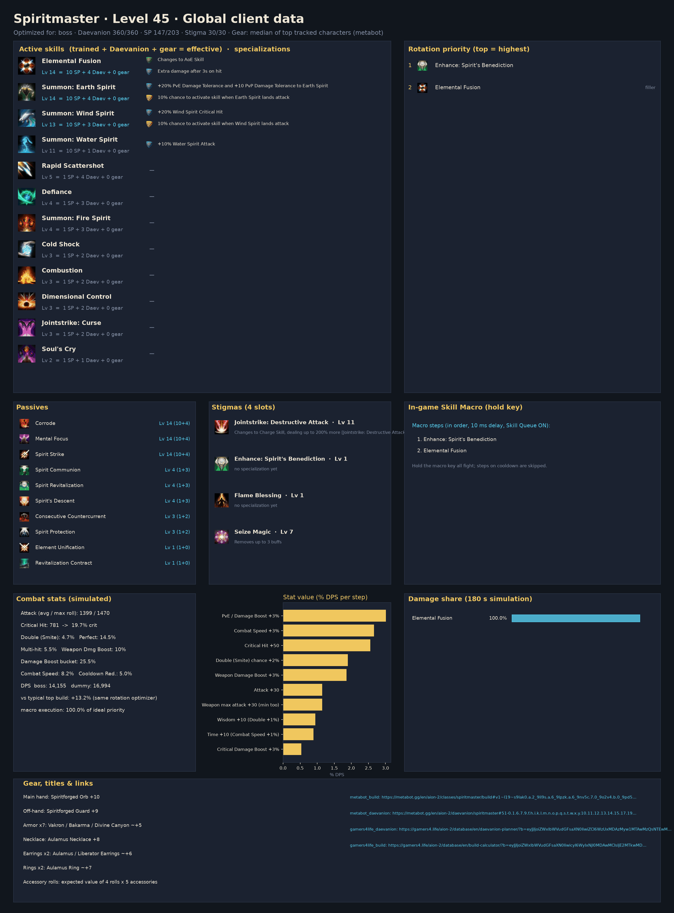
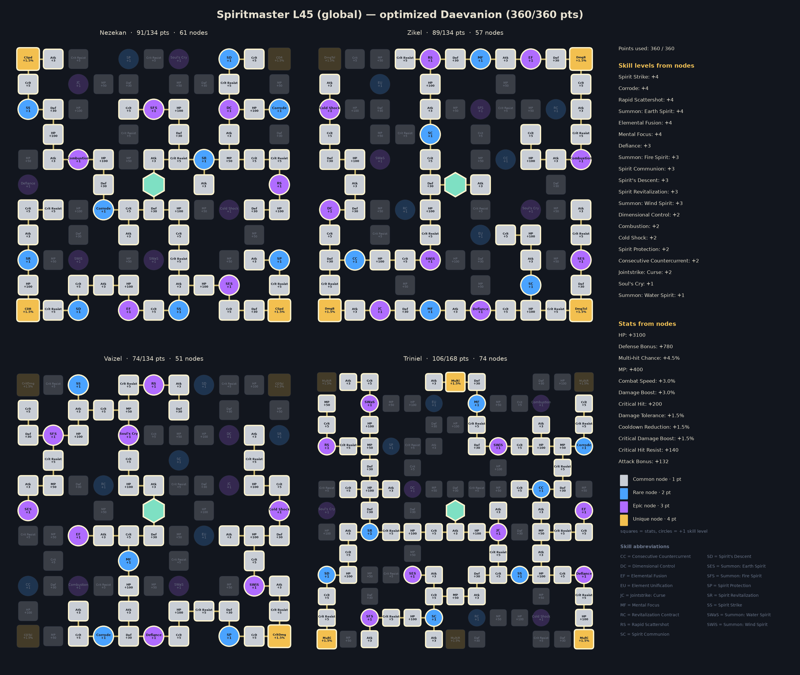
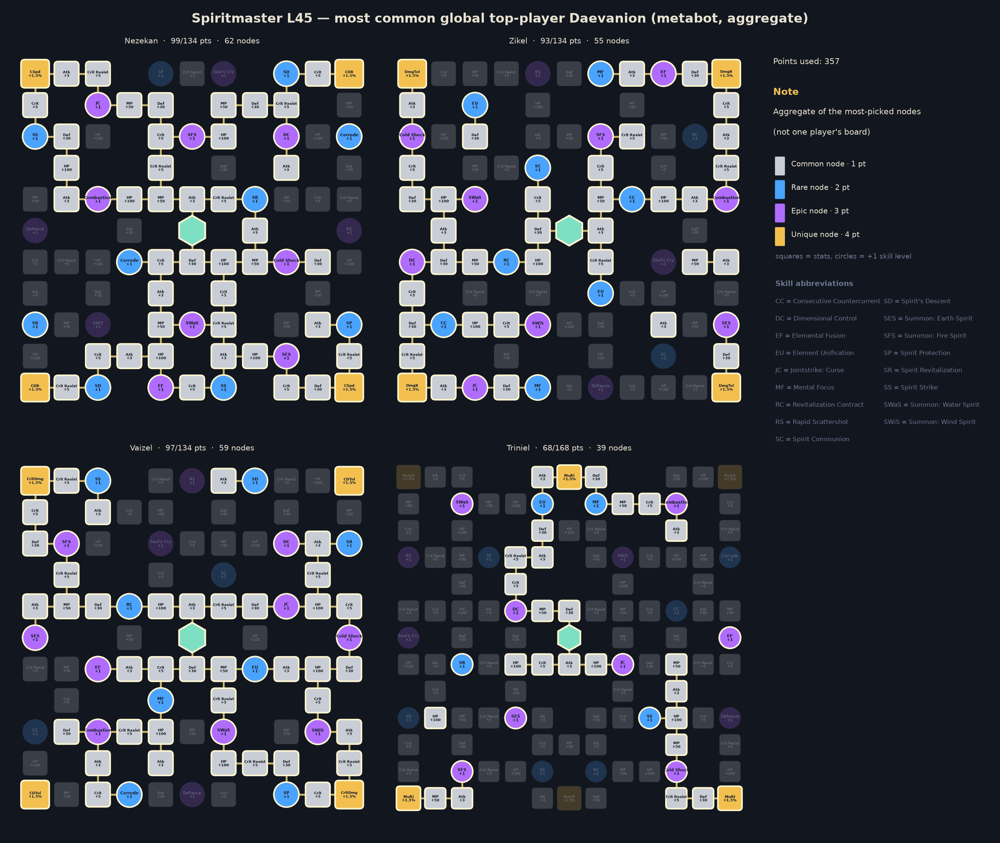

# Spiritmaster — level 45 global build, rotation and macro

Generated by `aion2calc` from the global client data (metabot.gg) with Korean data as fallback. Objective: **boss** fight (see `docs/methodology.md`). Daevanion budget **360** points.



## Results

| Build | boss DPS | dummy DPS |
|---|---:|---:|
| **Optimized (this report)** | **14,155** | **16,994** |
| Typical top global build, optimized rotation | 12,500 | 15,007 |
| Typical top global build, default priority | 2,543 | — |

The optimized build is **+13.2%** over the typical top global build played with the same rotation optimizer, and **+456.6%** over that build played with the default priority. *Typical top global build* = average skill levels, the four most-picked damage stigmas and the most-picked Daevanion nodes of the top tracked global L45 players of this class (metabot.gg live data), given the best legal specializations for its levels (specs are not published).

## Rotation (priority list)

Use the highest skill that is ready; the last entry is the filler.

1. `enhance_spirit_s_benediction`
2. `elemental_fusion`

`[sync_de]` = wait for the Delayed Explosion vulnerability window when it is about to be ready; `[in_ee]` = prefer using it inside Element Enhancement; `[mp_hi]` = only while MP is at least 60% (weave it in, keep MP for Grace of Enhancement).

### In-game Skill Macro

Settings → Key Settings → General → Skill Macro. Skill Queue (스킬 예약) **ON**, 10 ms delay on every step, hold the macro key; manual presses always take priority over the macro.

| Step | Skill |
|---:|---|
| 1 | enhance_spirit_s_benediction |
| 2 | elemental_fusion |

Manual keys (press on cooldown, in this priority): none — hold the macro key for the whole fight

Simulated: this layout reaches **100.0%** of the ideal priority list.

**Alternative — macro with manual keys**: macro elemental_fusion; manual: enhance_spirit_s_benediction. Simulated: **100.0%** of the ideal priority list.

### Opener (first 30 s of the simulated fight)

```
enhance_spirit_s_benediction@0.0s → elemental_fusion@0.6s → elemental_fusion@1.4s → elemental_fusion@2.1s → elemental_fusion@2.9s → elemental_fusion@3.7s → elemental_fusion@4.4s → elemental_fusion@5.2s → elemental_fusion@6.0s → elemental_fusion@6.7s → elemental_fusion@7.5s → elemental_fusion@8.3s → elemental_fusion@9.0s → elemental_fusion@9.8s → elemental_fusion@10.6s → elemental_fusion@11.3s → elemental_fusion@12.1s → elemental_fusion@12.9s → elemental_fusion@13.7s → elemental_fusion@14.4s → elemental_fusion@15.2s → elemental_fusion@16.0s → elemental_fusion@16.7s → elemental_fusion@17.5s → elemental_fusion@18.3s → elemental_fusion@19.0s → elemental_fusion@19.8s → elemental_fusion@20.6s
```

## Skills, specializations and points

Skill points used **147 / 203**, stigma points **30 / 30**, Daevanion **360 / 360**.

| Skill | Trained (SP) | Effective level | Specializations |
|---|---:|---:|---|
| Elemental Fusion | 10 | 14 | Changes to AoE Skill; Extra damage after 3s on hit |
| Spirit Strike | 10 | 14 | — |
| Mental Focus | 10 | 14 | — |
| Summon: Earth Spirit | 10 | 14 | +20% PvE Damage Tolerance and +10 PvP Damage Tolerance to Earth Spirit; 10% chance to activate skill when Earth Spirit lands attack |
| Corrode | 10 | 14 | — |
| Summon: Wind Spirit | 10 | 13 | +20% Wind Spirit Critical Hit; 10% chance to activate skill when Wind Spirit lands attack |
| Summon: Water Spirit | 10 | 11 | +10% Water Spirit Attack |
| Rapid Scattershot | 1 | 5 | — |
| Spirit's Descent | 1 | 4 | — |
| Spirit Communion | 1 | 4 | — |
| Spirit Revitalization | 1 | 4 | — |
| Defiance | 1 | 4 | — |
| Summon: Fire Spirit | 1 | 4 | — |
| Cold Shock | 1 | 3 | — |
| Dimensional Control | 1 | 3 | — |
| Combustion | 1 | 3 | — |
| Spirit Protection | 1 | 3 | — |
| Jointstrike: Curse | 1 | 3 | — |
| Consecutive Countercurrent | 1 | 3 | — |
| Soul's Cry | 1 | 2 | — |

**Stigmas**: Jointstrike: Destructive Attack Lv 11, Enhance: Spirit's Benediction Lv 1, Flame Blessing Lv 1, Seize Magic Lv 7

## Daevanion (360 points)



* Open in metabot planner: https://metabot.gg/en/aion-2/daevanion/spiritmaster#51-0.1.6.7.9.f.h.i.k.l.m.n.o.p.q.s.t.w.x.y.10.11.12.13.14.15.17.19.1a.1b.1c.1e.1f.1g.1h.1k.1l.1m.1o.1p.1r.1w.1y.1z.20.21.22.23.24.25.26.27.28.29.2a.2b.2c.2d.2e.2f.2g_52-3.4.5.6.7.8.9.a.b.d.f.g.j.p.q.t.v.w.x.y.10.13.14.15.16.17.19.1b.1c.1f.1j.1k.1m.1o.1p.1q.1r.1s.1t.1u.1v.1y.20.21.24.25.26.27.28.29.2a.2b.2c.2d.2e.2f.2g_53-2.3.4.5.a.b.c.d.e.h.i.j.k.p.r.s.u.v.w.z.10.14.15.16.1a.1d.1e.1f.1g.1j.1k.1l.1n.1p.1u.1y.1z.21.22.23.24.25.26.29.2a.2b.2c.2d.2e.2f.2g_54-1.2.3.4.5.9.a.e.i.j.k.n.o.p.q.r.s.w.x.y.z.10.11.12.15.17.18.19.1f.1g.1h.1k.1n.1o.1p.1r.1s.1t.1u.1v.1w.1x.1y.20.21.22.23.25.26.27.28.2b.2c.2d.2e.2f.2g.2h.2i.2j.2l.2m.2n.2p.2q.2r.2s.2t.2u.2z.30.32.33.38
* Open in gamers4.life planner (KR node values, same node IDs): https://gamers4.life/aion-2/database/en/daevanion-planner/?b=eyJjIjoiZWxlbWVudGFsaXN0IiwiZCI6WzUxMDAzMyw1MTAwMzQsNTEwMDQxLDUxMDA0Miw1MTAwNDgsNTEwMDU2LDUxMDA2Myw1MTAwNjQsNTEwMDY3LDUxMDA2OCw1MTAwNjksNTEwMDcxLDUxMDA3Miw1MTAwNzMsNTEwMDc5LDUxMDA4NCw1MTAwODYsNTEwMDk0LDUxMDA5NSw1MTAwOTYsNTEwMDk4LDUxMDA5OSw1MTAxMDAsNTEwMTAxLDUxMDEwMiw1MTAxMDMsNTEwMTExLDUxMDExNSw1MTAxMTgsNTEwMTIzLDUxMDEyNCw1MTAxMjYsNTEwMTI3LDUxMDEyOCw1MTAxMjksNTEwMTMyLDUxMDEzMyw1MTAxMzgsNTEwMTQyLDUxMDE0NCw1MTAxNTMsNTEwMTU5LDUxMDE2Miw1MTAxNjMsNTEwMTY4LDUxMDE3MCw1MTAxNzEsNTEwMTcyLDUxMDE3NCw1MTAxNzUsNTEwMTc2LDUxMDE3OCw1MTAxODMsNTEwMTg0LDUxMDE4NSw1MTAxODcsNTEwMTg4LDUxMDE4OSw1MTAxOTEsNTEwMTkyLDUxMDE5Myw1MjAwMzYsNTIwMDM3LDUyMDAzOCw1MjAwMzksNTIwMDQwLDUyMDA0MSw1MjAwNDIsNTIwMDQzLDUyMDA0OCw1MjAwNTIsNTIwMDU4LDUyMDA2Myw1MjAwNjcsNTIwMDczLDUyMDA3OCw1MjAwODIsNTIwMDg2LDUyMDA4OCw1MjAwOTMsNTIwMDk0LDUyMDA5Nyw1MjAxMDEsNTIwMTAyLDUyMDEwMyw1MjAxMDksNTIwMTEyLDUyMDExNCw1MjAxMjMsNTIwMTI0LDUyMDEyNyw1MjAxMzMsNTIwMTM4LDUyMDE0Miw1MjAxNDUsNTIwMTQ2LDUyMDE0OCw1MjAxNTMsNTIwMTU0LDUyMDE1NSw1MjAxNTYsNTIwMTU3LDUyMDE2MSw1MjAxNjMsNTIwMTY4LDUyMDE3Niw1MjAxNzgsNTIwMTgzLDUyMDE4NCw1MjAxODUsNTIwMTg2LDUyMDE4Nyw1MjAxODgsNTIwMTg5LDUyMDE5MCw1MjAxOTEsNTIwMTkyLDUyMDE5Myw1MzAwMzUsNTMwMDM3LDUzMDAzOCw1MzAwMzksNTMwMDQ4LDUzMDA1MCw1MzAwNTEsNTMwMDUyLDUzMDA1NCw1MzAwNjMsNTMwMDY0LDUzMDA2NSw1MzAwNjcsNTMwMDcyLDUzMDA3OSw1MzAwODIsNTMwMDg3LDUzMDA5Myw1MzAwOTQsNTMwMDk3LDUzMDA5OCw1MzAxMDIsNTMwMTAzLDUzMDEwOCw1MzAxMTgsNTMwMTI1LDUzMDEyNiw1MzAxMjcsNTMwMTI4LDUzMDEzMSw1MzAxMzIsNTMwMTMzLDUzMDE0Miw1MzAxNDcsNTMwMTU3LDUzMDE2Miw1MzAxNjMsNTMwMTcwLDUzMDE3Miw1MzAxNzQsNTMwMTc1LDUzMDE3Niw1MzAxNzgsNTMwMTg1LDUzMDE4Niw1MzAxODcsNTMwMTg4LDUzMDE4OSw1MzAxOTEsNTMwMTkyLDUzMDE5Myw1NDAwMTgsNTQwMDE5LDU0MDAyMiw1NDAwMjMsNTQwMDI0LDU0MDAzMiw1NDAwMzQsNTQwMDM5LDU0MDA0NCw1NDAwNDcsNTQwMDQ5LDU0MDA1NCw1NDAwNTcsNTQwMDU5LDU0MDA2Miw1NDAwNjMsNTQwMDY0LDU0MDA2OSw1NDAwNzAsNTQwMDcxLDU0MDA3Miw1NDAwNzMsNTQwMDc0LDU0MDA3OSw1NDAwODgsNTQwMDkzLDU0MDA5NCw1NDAwOTUsNTQwMTAxLDU0MDEwMiw1NDAxMDMsNTQwMTA5LDU0MDExNSw1NDAxMTcsNTQwMTE5LDU0MDEyMyw1NDAxMjQsNTQwMTI1LDU0MDEyNiw1NDAxMjcsNTQwMTI4LDU0MDEyOSw1NDAxMzAsNTQwMTMyLDU0MDEzMyw1NDAxMzQsNTQwMTM4LDU0MDE0NSw1NDAxNDcsNTQwMTUyLDU0MDE1Myw1NDAxNTYsNTQwMTU3LDU0MDE1OSw1NDAxNjAsNTQwMTYxLDU0MDE2Miw1NDAxNjMsNTQwMTY0LDU0MDE2Nyw1NDAxNzIsNTQwMTczLDU0MDE3NCw1NDAxNzksNTQwMTgyLDU0MDE4NCw1NDAxODUsNTQwMTg2LDU0MDE4Nyw1NDAxOTQsNTQwMTk3LDU0MDE5OSw1NDAyMDIsNTQwMjA5XX0
* Full skill/stigma/Daevanion build in metabot planner: https://metabot.gg/en/aion-2/classes/spiritmaster/build#v1~l19~s9lak0.a.2_9li9s.a.6_9lpzk.a.6_9nv5c.7.0_9o2v4.b.0_9pd5s.a.3_9y5io.a.0_9yso0.a.0_9z83k.a.0~g9o2v4_9n0a8_9qv68_9nv5c~d51-0.1.6.7.9.f.h.i.k.l.m.n.o.p.q.s.t.w.x.y.10.11.12.13.14.15.17.19.1a.1b.1c.1e.1f.1g.1h.1k.1l.1m.1o.1p.1r.1w.1y.1z.20.21.22.23.24.25.26.27.28.29.2a.2b.2c.2d.2e.2f.2g_52-3.4.5.6.7.8.9.a.b.d.f.g.j.p.q.t.v.w.x.y.10.13.14.15.16.17.19.1b.1c.1f.1j.1k.1m.1o.1p.1q.1r.1s.1t.1u.1v.1y.20.21.24.25.26.27.28.29.2a.2b.2c.2d.2e.2f.2g_53-2.3.4.5.a.b.c.d.e.h.i.j.k.p.r.s.u.v.w.z.10.14.15.16.1a.1d.1e.1f.1g.1j.1k.1l.1n.1p.1u.1y.1z.21.22.23.24.25.26.29.2a.2b.2c.2d.2e.2f.2g_54-1.2.3.4.5.9.a.e.i.j.k.n.o.p.q.r.s.w.x.y.z.10.11.12.15.17.18.19.1f.1g.1h.1k.1n.1o.1p.1r.1s.1t.1u.1v.1w.1x.1y.20.21.22.23.25.26.27.28.2b.2c.2d.2e.2f.2g.2h.2i.2j.2l.2m.2n.2p.2q.2r.2s.2t.2u.2z.30.32.33.38

For comparison, the aggregate of the most-picked nodes among top global players:



## Stat priority (simulated)

| Upgrade | DPS gain | Worth in Attack |
|---|---:|---:|
| PvE / Damage Boost +3% | +3.01% | 79 |
| Combat Speed +3% | +2.67% | 70 |
| Critical Hit +50 | +2.55% | 67 |
| Double (Smite) chance +2% | +1.90% | 49 |
| Weapon Damage Boost +3% | +1.86% | 48 |
| Attack +30 | +1.15% | 30 |
| Weapon max attack +30 (min too) | +1.15% | 30 |
| Wisdom +10 (Double +1%) | +0.95% | 25 |
| Time +10 (Combat Speed +1%) | +0.89% | 23 |
| Critical Damage Boost +3% | +0.54% | 14 |
| Might +10 (Attack +1%) | +0.51% | 13 |
| Destruction +10 (Attack +1%) | +0.51% | 13 |
| Multi-hit chance +3% | +0.37% | 10 |
| Death +10 (Crit +1%) | +0.34% | 9 |
| Penetration +300 | +0.34% | 9 |
| PvE Attack +30 | +0.34% | 9 |
| Cooldown Reduction +3% | +0.28% | 7 |
| Critical Attack +50 | +0.15% | 4 |
| Illusion +10 (Cooldown -1%) | +0.09% | 2 |
| Perfect chance +3% | +0.07% | 2 |
| Justice +10 (Perfect +1%) | +0.02% | 1 |
| MP +300 | +0.00% | 0 |

Accuracy is a threshold stat (avoid parries; back attacks ignore them) and is not ranked.

## Gear, rolls, enchanting

Loadout: **Global L45 Spiritmaster - median of top tracked characters (metabot)**

* Main hand: Spiritforged Orb +10
* Off-hand: Spiritforged Guard +9
* Armor x7: Vakron / Bakarma / Divine Canyon ~+5
* Necklace: Aulamus Necklace +8
* Earrings x2: Aulamus / Liberator Earrings ~+6
* Rings x2: Aulamus Ring ~+7
* Accessory rolls: expected value of 4 rolls x 5 accessories
* Bracelets x2: Ascension +9 / Liberator +6
* Amulet: Revelation Amulet +0
* Rune: Clash Rune +2
* Attack title: Guardian of Altgard / Verteron
* Other title: Through Hell and Back
* Owned titles: collection bonuses (estimate)
* Wings: Ultimate Daeva Wings
* Primary/deity stats: profile averages

**Random-roll priority per item** (keep / reroll toward the top of each list):

* **Rupture Tome**: Combat Speed (+8.8% – +10.2%), Damage Boost (+4.9% – +5.7%), Weapon Damage Boost (+6.5% – +7.6%), Critical Hit (+46 – +60), Attack (+30 – +42)
* **Ludras Grimoire**: Combat Speed (+11.2% – +13%), Damage Boost (+6.3% – +7.3%), Weapon Damage Boost (+8.3% – +9.6%), Critical Hit (+59 – +75), Attack (+38 – +51)
* **Spiritforged Guard**: Might (+10 – +10), Accuracy (+30 – +30)
* **Vakron Helm**: Double Chance (+1.6% – +1.9%), Critical Hit (+25 – +36), Attack increase (+1.6% – +1.9%), Attack (+16 – +25), MP (+76 – +94)
* **Bakarma Breastplate**: Damage Boost (+4.4% – +5.2%), Critical Hit (+27 – +38), Attack (+18 – +28), Perfect Chance (+3.9% – +4.6%), MP (+83 – +102)
* **Aulamus Necklace**: Combat Speed (+3.2% – +3.8%), Critical Hit (+35 – +47), Attack (+23 – +33), Might (+9 – +17), Precision (+9 – +17)
* **Aulamus Ring**: Critical Hit (+25 – +36), Attack (+16 – +25), Might (+5 – +13), Precision (+5 – +13), Natural MP Regen (+18 – +28)

**Enchant priority** (DPS per enchant level):

* Weapon (Spiritforged / Rupture): 44.7 DPS/level
* Guard (off-hand): 27.1 DPS/level
* Necklace / Earrings / Rings (Aulamus): 21.7 DPS/level
* Bracelets: 16.3 DPS/level
* Revelation Amulet: 4.8 DPS/level
* Armor pieces: 0.0 DPS/level

## Titles, arcana, wings, pets

**Best titles by equip bonus** (global client values):

| Title | Grade | Equip bonus | Owned bonus |
|---|---|---|---|
| Unbound by Genus (Both factions) | Unique | PvE Damage Boost +4.5%, Attack Bonus +34, Critical Hit +68 | PvE Damage Boost +1% |
| Empty Closet (Both factions) | Unique | Combat Speed +3.5%, Natural HP Regen +42, Cooldown Reduction +3.5% | HP +120 |
| Scenery Collector (Both factions) | Epic | PvE Damage Boost +3.3%, Block Penetration +54 | Critical Hit +10 |
| Guardian of Altgard (Asmodian) | Epic | PvE Damage Boost +3%, Penetration +210 | PvE Attack +4 |
| Guardian of Verteron (Elyos) | Epic | PvE Damage Boost +3%, Penetration +210 | PvE Attack +4 |
| Teleportation Specialist (Both factions) | Epic | PvE Accuracy +58, PvE Damage Boost +3.1% | Critical Hit +10 |
| Saint of Ereshkigal (Both factions) | Unique | PvP Damage Boost +4%, Endurance Penetration +2.5%, Critical Hit +60 | PvP Accuracy +20 |
| Nice to Meet You (Both factions) | Rare | PvE Damage Boost +2.9% | PvE Defense +10 |
| You're My Gem (Both factions) | Epic | Critical Hit +52, Critical Attack +39 | Natural MP Regen +5 |
| Verteron Seal Breaker (Both factions) | Rare | Boss Damage Boost +2.7% | PvE Accuracy +10 |

**Arcana variant per slot** (deity stat that is worth more for this build):

* Chalice / Grail: **Vigor or Frenzy** (Time +20)
* Parchment: either variant (Life +20 / Destiny +20: no damage either way)
* Compass: **Magic or Purity** (Death +20)
* Bell: **Magic or Purity** (Destruction +20)
* Mirror: **Magic or Purity** (Wisdom +20)

**Arcana random skill option** (Unique arcana roll one option from the class pool when soul-bound, up to +4; simulated DPS gain on this build):

| Skill | +1 | +2 | +3 | +4 |
|---|---:|---:|---:|---:|
| Corrode | +0.47% | +0.97% | +1.48% | +2.01% |
| Mental Focus | +0.28% | +0.57% | +0.85% | +1.14% |
| Spirit Protection | +0.00% | +0.00% | +0.00% | +0.00% |
| Consecutive Countercurrent | +0.00% | +0.00% | +0.00% | +0.00% |
| Revitalization Contract | +0.00% | +0.00% | +0.00% | +0.00% |

The pool holds passives only, so at level 45 an active skill still stops at Lv 14 (10 from skill points + 4 Daevanion nodes); the Lv 16 specialization options are out of reach.

**Deity (pantheon) stats**, +10 points each (arcana main stats, Abyssal Bracelet rolls, Monolith rewards): Wisdom +0.95%, Time +0.89%, Might +0.51%, Destruction +0.51%, Death +0.34%, Illusion +0.09%, Justice +0.02%.

**Closet / appearance collection**: every unlocked skin and costume set adds permanent Collection Effect stats, and wings keep a Retention Effect once owned. The client tables for these are not public, so they are not itemised here; they are flat stats, so value them with the stat table above and collect the cheap ones first.

**Wings**: Ultimate Daeva Wings (Accuracy +40, Penetration +500) are the most used and the best launch option for damage among common wings. **Pets**: pet collection bonuses are mostly genus-specific (damage vs that monster genus) plus Accuracy/Crit; level the genus of the content you farm first.

## Robustness

Every animation time was randomly perturbed by up to ±25% (8 samples) and the rotation re-optimized each time. Playing the recommended priority instead of the re-optimized one lost on average **0.00%** (worst 0.00%).

**Crit curve.** The crit-chance curve is fitted to tests at Crit 1048–1326 and extrapolated down to launch values: this build sits at **19.7%** crit, and Crit +50 ranks #3 (+2.55%). If launch testing shows more crit — e.g. the curve shifted to a midpoint of 700, giving 65% — Crit +50 becomes #2 (+2.83%). Re-run with `--crit-midpoint` once real numbers exist.

## Validation against Korean logs

Simulated damage shares (training dummy) overlap **19%** with the mean of the top-10 A2DIL Korean dummy logs; 37% of the Korean damage comes from skills that are not in the global level-45 client. Korea plays above level 45 with Lv 16-20 specializations, so a perfect match is not expected; low values mean the class kit needs hand-tuning (see `kit/sorcerer.py` for a hand-written kit).

## Sources

* metabot.gg (global client): class skills, Daevanion boards, items, titles, top-player statistics
* gamers4.life (KR database): skill hit counts, build/Daevanion planners
* A2DIL (KR training-dummy logs): damage-share validation
* Inven / Bahamut damage research, aion2ssow calculator: damage formula

See `docs/methodology.md` for every formula and assumption.
