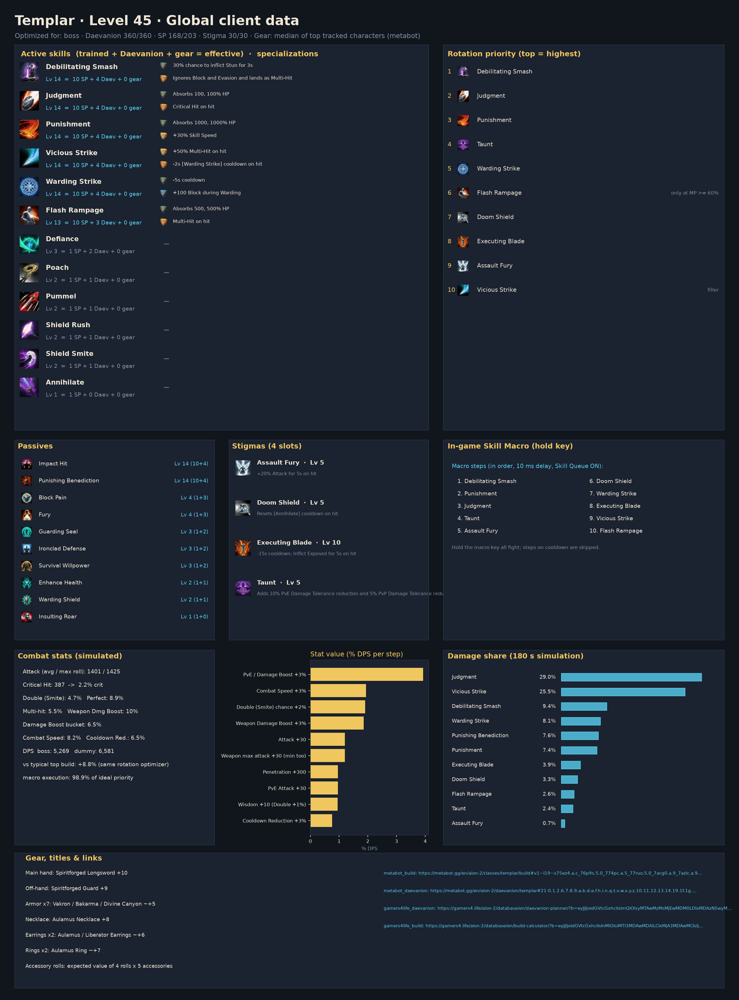
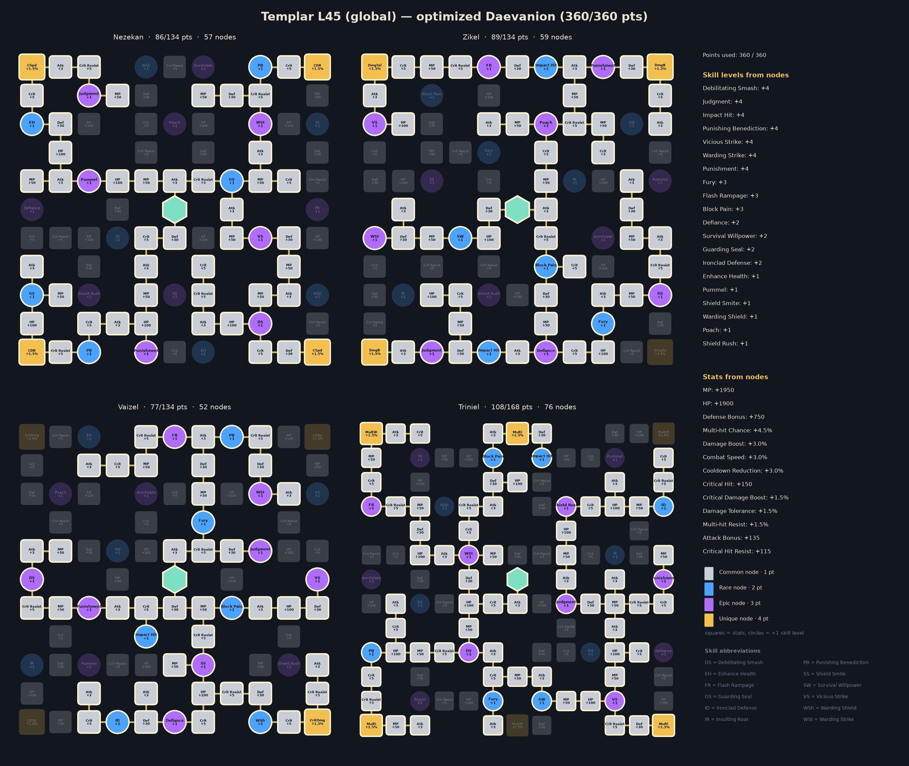
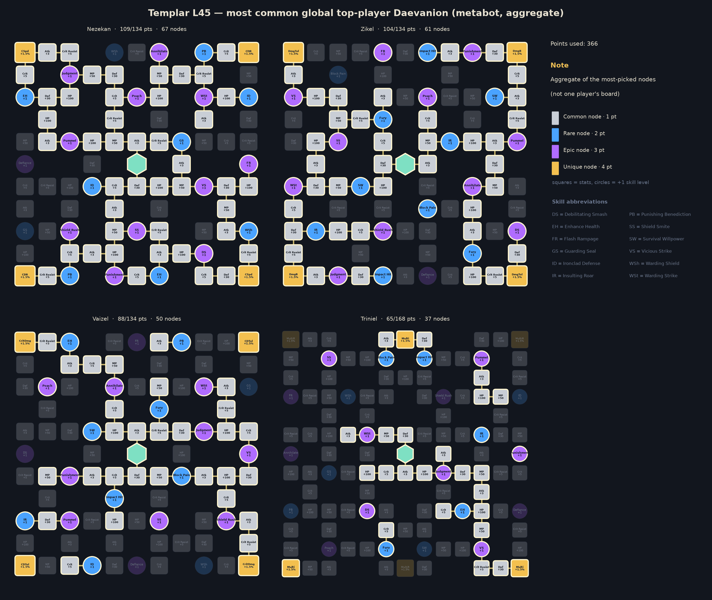

# Templar — level 45 global build, rotation and macro

Generated by `aion2calc` from the global client data (metabot.gg) with Korean data as fallback. Objective: **boss** fight (see `docs/methodology.md`). Daevanion budget **360** points.



## Results

| Build | boss DPS | dummy DPS |
|---|---:|---:|
| **Optimized (this report)** | **5,269** | **6,581** |
| Typical top global build, optimized rotation | 4,842 | 6,103 |
| Typical top global build, default priority | 4,357 | — |

The optimized build is **+8.8%** over the typical top global build played with the same rotation optimizer, and **+20.9%** over that build played with the default priority. *Typical top global build* = average skill levels, the four most-picked damage stigmas and the most-picked Daevanion nodes of the top tracked global L45 players of this class (metabot.gg live data), given the best legal specializations for its levels (specs are not published).

## Rotation (priority list)

Use the highest skill that is ready; the last entry is the filler.

1. `debilitating_smash`
2. `judgment`
3. `punishment`
4. `taunt`
5. `warding_strike`
6. `flash_rampage [mp_hi]`
7. `doom_shield`
8. `executing_blade`
9. `assault_fury`
10. `vicious_strike`

`[sync_de]` = wait for the Delayed Explosion vulnerability window when it is about to be ready; `[in_ee]` = prefer using it inside Element Enhancement; `[mp_hi]` = only while MP is at least 60% (weave it in, keep MP for Grace of Enhancement).

### In-game Skill Macro

Settings → Key Settings → General → Skill Macro. Skill Queue (스킬 예약) **ON**, 10 ms delay on every step, hold the macro key; manual presses always take priority over the macro.

| Step | Skill |
|---:|---|
| 1 | debilitating_smash |
| 2 | punishment |
| 3 | judgment |
| 4 | taunt |
| 5 | assault_fury |
| 6 | doom_shield |
| 7 | warding_strike |
| 8 | executing_blade |
| 9 | vicious_strike |
| 10 | flash_rampage |

Manual keys (press on cooldown, in this priority): none — hold the macro key for the whole fight

Simulated: this layout reaches **98.9%** of the ideal priority list.

**Alternative — macro with manual keys**: macro judgment → debilitating_smash → flash_rampage → vicious_strike; manual: punishment, taunt, warding_strike, doom_shield, executing_blade, assault_fury. Simulated: **98.5%** of the ideal priority list.

### Opener (first 30 s of the simulated fight)

```
debilitating_smash@0.0s → judgment@0.9s → punishment@1.8s → taunt@2.5s → warding_strike@3.4s → doom_shield@4.3s → executing_blade@5.3s → judgment@6.2s → assault_fury@7.1s → vicious_strike@8.0s → vicious_strike@8.8s → debilitating_smash@9.5s → vicious_strike@10.4s → judgment@11.2s → vicious_strike@12.1s → vicious_strike@12.9s → vicious_strike@13.6s → vicious_strike@14.4s → warding_strike@15.2s → judgment@16.1s → vicious_strike@17.0s → vicious_strike@17.8s → vicious_strike@18.5s → debilitating_smash@19.3s → vicious_strike@20.2s → judgment@21.0s → vicious_strike@21.9s → vicious_strike@22.7s
```

## Skills, specializations and points

Skill points used **168 / 203**, stigma points **30 / 30**, Daevanion **360 / 360**.

| Skill | Trained (SP) | Effective level | Specializations |
|---|---:|---:|---|
| Judgment | 10 | 14 | Absorbs 100, 100% HP; Critical Hit on hit |
| Vicious Strike | 10 | 14 | +50% Multi-Hit on hit; -2s [Warding Strike] cooldown on hit |
| Punishment | 10 | 14 | Absorbs 1000, 1000% HP; +30% Skill Speed |
| Punishing Benediction | 10 | 14 | — |
| Debilitating Smash | 10 | 14 | 30% chance to inflict Stun for 3s; Ignores Block and Evasion and lands as Multi-Hit |
| Warding Strike | 10 | 14 | -5s cooldown; +100 Block during Warding |
| Impact Hit | 10 | 14 | — |
| Flash Rampage | 10 | 13 | Absorbs 500, 500% HP; Multi-Hit on hit |
| Block Pain | 1 | 4 | — |
| Fury | 1 | 4 | — |
| Ironclad Defense | 1 | 3 | — |
| Survival Willpower | 1 | 3 | — |
| Defiance | 1 | 3 | — |
| Guarding Seal | 1 | 3 | — |
| Enhance Health | 1 | 2 | — |
| Shield Smite | 1 | 2 | — |
| Warding Shield | 1 | 2 | — |
| Poach | 1 | 2 | — |
| Shield Rush | 1 | 2 | — |
| Pummel | 1 | 2 | — |

**Stigmas**: Assault Fury Lv 5, Doom Shield Lv 5, Executing Blade Lv 10, Taunt Lv 5

## Daevanion (360 points)



* Open in metabot planner: https://metabot.gg/en/aion-2/daevanion/templar#21-0.1.2.6.7.8.9.a.b.d.e.f.h.i.n.q.t.v.w.x.y.z.10.11.12.13.14.19.1f.1g.1i.1j.1k.1m.1o.1p.1q.1r.1s.1u.1w.1x.1y.20.21.22.23.24.25.26.28.29.2a.2b.2e.2f.2g_22-0.1.2.3.4.5.6.7.8.9.a.b.e.f.g.h.j.k.l.m.n.p.u.v.11.14.16.17.19.1a.1b.1c.1d.1e.1f.1g.1i.1j.1n.1o.1q.1t.1u.1x.1y.1z.20.22.23.24.26.27.28.29.2a.2b.2c.2d.2e_23-3.4.5.6.7.b.c.d.e.f.m.o.p.t.v.w.10.11.12.13.16.1a.1b.1c.1d.1e.1f.1g.1h.1i.1j.1k.1l.1n.1o.1v.1w.1z.21.22.23.24.25.26.29.2a.2b.2c.2d.2e.2f.2g_24-0.1.2.3.4.5.9.d.e.i.j.l.m.o.p.q.r.s.u.v.x.y.z.10.11.12.13.14.18.19.1a.1b.1e.1i.1l.1n.1o.1p.1r.1u.1v.1w.1y.1z.20.21.22.23.24.26.27.28.29.2a.2b.2c.2g.2h.2j.2l.2m.2n.2o.2q.2u.2v.2w.2x.2y.30.31.32.33.36.37.38
* Open in gamers4.life planner (KR node values, same node IDs): https://gamers4.life/aion-2/database/en/daevanion-planner/?b=eyJjIjoidGVtcGxhciIsImQiOlsyMTAwMzMsMjEwMDM0LDIxMDAzNSwyMTAwNDEsMjEwMDQyLDIxMDA0MywyMTAwNDgsMjEwMDUwLDIxMDA1MSwyMTAwNTQsMjEwMDU1LDIxMDA1NiwyMTAwNjMsMjEwMDY0LDIxMDA3MSwyMTAwNzksMjEwMDg2LDIxMDA5MywyMTAwOTQsMjEwMDk1LDIxMDA5NiwyMTAwOTcsMjEwMDk4LDIxMDA5OSwyMTAxMDAsMjEwMTAxLDIxMDEwMiwyMTAxMTUsMjEwMTI3LDIxMDEyOCwyMTAxMzAsMjEwMTMxLDIxMDEzMiwyMTAxMzgsMjEwMTQyLDIxMDE0NCwyMTAxNDcsMjEwMTUzLDIxMDE1NCwyMTAxNTcsMjEwMTU5LDIxMDE2MSwyMTAxNjIsMjEwMTY4LDIxMDE3MCwyMTAxNzEsMjEwMTcyLDIxMDE3NCwyMTAxNzUsMjEwMTc2LDIxMDE4MywyMTAxODQsMjEwMTg1LDIxMDE4NywyMTAxOTEsMjEwMTkyLDIxMDE5MywyMjAwMzMsMjIwMDM0LDIyMDAzNSwyMjAwMzYsMjIwMDM3LDIyMDAzOCwyMjAwMzksMjIwMDQwLDIyMDA0MSwyMjAwNDIsMjIwMDQzLDIyMDA0OCwyMjAwNTUsMjIwMDU4LDIyMDA2MywyMjAwNjQsMjIwMDY3LDIyMDA2OCwyMjAwNjksMjIwMDcwLDIyMDA3MSwyMjAwNzMsMjIwMDg0LDIyMDA4NiwyMjAwOTksMjIwMTAyLDIyMDEwOSwyMjAxMTIsMjIwMTE0LDIyMDExNywyMjAxMjMsMjIwMTI0LDIyMDEyNSwyMjAxMjYsMjIwMTI3LDIyMDEyOSwyMjAxMzIsMjIwMTMzLDIyMDE0NCwyMjAxNDUsMjIwMTQ4LDIyMDE1NSwyMjAxNTYsMjIwMTU5LDIyMDE2MSwyMjAxNjIsMjIwMTYzLDIyMDE3MSwyMjAxNzQsMjIwMTc2LDIyMDE4MywyMjAxODQsMjIwMTg1LDIyMDE4NiwyMjAxODcsMjIwMTg4LDIyMDE4OSwyMjAxOTAsMjIwMTkxLDIzMDAzNywyMzAwMzgsMjMwMDM5LDIzMDA0MCwyMzAwNDEsMjMwMDUwLDIzMDA1MSwyMzAwNTIsMjMwMDU0LDIzMDA1NiwyMzAwNjksMjMwMDcxLDIzMDA3MiwyMzAwODQsMjMwMDkzLDIzMDA5NCwyMzAwOTgsMjMwMDk5LDIzMDEwMCwyMzAxMDEsMjMwMTA4LDIzMDExOCwyMzAxMjMsMjMwMTI0LDIzMDEyNSwyMzAxMjYsMjMwMTI3LDIzMDEyOCwyMzAxMjksMjMwMTMwLDIzMDEzMSwyMzAxMzIsMjMwMTMzLDIzMDE0MiwyMzAxNDQsMjMwMTU4LDIzMDE1OSwyMzAxNjMsMjMwMTcwLDIzMDE3MiwyMzAxNzQsMjMwMTc1LDIzMDE3NiwyMzAxNzgsMjMwMTg1LDIzMDE4NiwyMzAxODcsMjMwMTg4LDIzMDE4OSwyMzAxOTEsMjMwMTkyLDIzMDE5MywyNDAwMTcsMjQwMDE4LDI0MDAxOSwyNDAwMjIsMjQwMDIzLDI0MDAyNCwyNDAwMzIsMjQwMDM3LDI0MDAzOSwyNDAwNDQsMjQwMDQ3LDI0MDA1MiwyNDAwNTMsMjQwMDU3LDI0MDA1OSwyNDAwNjIsMjQwMDYzLDI0MDA2NCwyNDAwNjYsMjQwMDY3LDI0MDA3MCwyNDAwNzEsMjQwMDcyLDI0MDA3MywyNDAwNzQsMjQwMDc5LDI0MDA4MSwyNDAwODUsMjQwMDk0LDI0MDA5NSwyNDAwOTYsMjQwMDk3LDI0MDEwMCwyNDAxMDQsMjQwMTExLDI0MDExNSwyNDAxMTcsMjQwMTE5LDI0MDEyMywyNDAxMjYsMjQwMTI3LDI0MDEyOCwyNDAxMzAsMjQwMTMxLDI0MDEzMiwyNDAxMzMsMjQwMTM0LDI0MDEzOCwyNDAxNDEsMjQwMTQ3LDI0MDE1MiwyNDAxNTMsMjQwMTU0LDI0MDE1NSwyNDAxNTYsMjQwMTU3LDI0MDE2MiwyNDAxNjMsMjQwMTY3LDI0MDE3MiwyNDAxNzMsMjQwMTc0LDI0MDE3NywyNDAxODIsMjQwMTg3LDI0MDE4OSwyNDAxOTAsMjQwMTkxLDI0MDE5MiwyNDAxOTcsMjQwMTk4LDI0MDE5OSwyNDAyMDIsMjQwMjA3LDI0MDIwOCwyNDAyMDldfQ
* Full skill/stigma/Daevanion build in metabot planner: https://metabot.gg/en/aion-2/classes/templar/build#v1~l19~s75ez4.a.c_76p9s.5.0_774pc.a.5_77ruo.5.0_7acg0.a.9_7azlc.a.9_7chls.a.9_7cpbk.a.3_7dzm8.a.0_7k7ds.5.0_7kuj4.a.0_7lhog.a.0~g7k7ds_76p9s_7dzm8_77ruo~d21-0.1.2.6.7.8.9.a.b.d.e.f.h.i.n.q.t.v.w.x.y.z.10.11.12.13.14.19.1f.1g.1i.1j.1k.1m.1o.1p.1q.1r.1s.1u.1w.1x.1y.20.21.22.23.24.25.26.28.29.2a.2b.2e.2f.2g_22-0.1.2.3.4.5.6.7.8.9.a.b.e.f.g.h.j.k.l.m.n.p.u.v.11.14.16.17.19.1a.1b.1c.1d.1e.1f.1g.1i.1j.1n.1o.1q.1t.1u.1x.1y.1z.20.22.23.24.26.27.28.29.2a.2b.2c.2d.2e_23-3.4.5.6.7.b.c.d.e.f.m.o.p.t.v.w.10.11.12.13.16.1a.1b.1c.1d.1e.1f.1g.1h.1i.1j.1k.1l.1n.1o.1v.1w.1z.21.22.23.24.25.26.29.2a.2b.2c.2d.2e.2f.2g_24-0.1.2.3.4.5.9.d.e.i.j.l.m.o.p.q.r.s.u.v.x.y.z.10.11.12.13.14.18.19.1a.1b.1e.1i.1l.1n.1o.1p.1r.1u.1v.1w.1y.1z.20.21.22.23.24.26.27.28.29.2a.2b.2c.2g.2h.2j.2l.2m.2n.2o.2q.2u.2v.2w.2x.2y.30.31.32.33.36.37.38

For comparison, the aggregate of the most-picked nodes among top global players:



## Stat priority (simulated)

| Upgrade | DPS gain | Worth in Attack |
|---|---:|---:|
| PvE / Damage Boost +3% | +3.92% | 98 |
| Combat Speed +3% | +1.94% | 48 |
| Double (Smite) chance +2% | +1.91% | 47 |
| Weapon Damage Boost +3% | +1.86% | 46 |
| Attack +30 | +1.21% | 30 |
| Weapon max attack +30 (min too) | +1.21% | 30 |
| Penetration +300 | +0.96% | 24 |
| PvE Attack +30 | +0.96% | 24 |
| Wisdom +10 (Double +1%) | +0.95% | 24 |
| Cooldown Reduction +3% | +0.76% | 19 |
| Time +10 (Combat Speed +1%) | +0.65% | 16 |
| Critical Damage Boost +3% | +0.62% | 15 |
| Might +10 (Attack +1%) | +0.53% | 13 |
| Destruction +10 (Attack +1%) | +0.53% | 13 |
| Multi-hit chance +3% | +0.32% | 8 |
| Critical Attack +50 | +0.29% | 7 |
| Critical Hit +50 | +0.29% | 7 |
| Illusion +10 (Cooldown -1%) | +0.25% | 6 |
| Perfect chance +3% | +0.03% | 1 |
| Death +10 (Crit +1%) | +0.02% | 0 |
| Justice +10 (Perfect +1%) | +0.01% | 0 |
| MP +300 | +0.00% | 0 |

Accuracy is a threshold stat (avoid parries; back attacks ignore them) and is not ranked.

## Gear, rolls, enchanting

Loadout: **Global L45 Templar - median of top tracked characters (metabot)**

* Main hand: Spiritforged Longsword +10
* Off-hand: Spiritforged Guard +9
* Armor x7: Vakron / Bakarma / Divine Canyon ~+5
* Necklace: Aulamus Necklace +8
* Earrings x2: Aulamus / Liberator Earrings ~+6
* Rings x2: Aulamus Ring ~+7
* Accessory rolls: expected value of 4 rolls x 5 accessories
* Bracelets x2: Ascension +9 / Liberator +6
* Amulet: Revelation Amulet +0
* Rune: Clash Rune +2
* Attack title: Guardian of Altgard / Verteron
* Other title: Through Hell and Back
* Owned titles: collection bonuses (estimate)
* Wings: Ultimate Daeva Wings
* Primary/deity stats: profile averages

**Random-roll priority per item** (keep / reroll toward the top of each list):

* **Rupture Tome**: Damage Boost (+4.9% – +5.7%), Combat Speed (+8.8% – +10.2%), Weapon Damage Boost (+6.5% – +7.6%), Front Attack (+65 – +82), Attack (+30 – +42)
* **Ludras Grimoire**: Damage Boost (+6.3% – +7.3%), Combat Speed (+11.2% – +13%), Weapon Damage Boost (+8.3% – +9.6%), Front Attack (+83 – +102), Attack (+38 – +51)
* **Spiritforged Guard**: Might (+10 – +10), Accuracy (+30 – +30)
* **Vakron Helm**: Double Chance (+1.6% – +1.9%), Attack increase (+1.6% – +1.9%), Attack (+16 – +25), Critical Hit (+25 – +36), MP (+76 – +94)
* **Bakarma Breastplate**: Damage Boost (+4.4% – +5.2%), Attack (+18 – +28), Critical Hit (+27 – +38), Perfect Chance (+3.9% – +4.6%), MP (+83 – +102)
* **Aulamus Necklace**: Combat Speed (+3.2% – +3.8%), Attack (+23 – +33), Might (+9 – +17), Critical Hit (+35 – +47), Precision (+9 – +17)
* **Aulamus Ring**: Attack (+16 – +25), Might (+5 – +13), Critical Hit (+25 – +36), Precision (+5 – +13), Natural MP Regen (+18 – +28)

**Enchant priority** (DPS per enchant level):

* Weapon (Spiritforged / Rupture): 17.5 DPS/level
* Guard (off-hand): 10.6 DPS/level
* Necklace / Earrings / Rings (Aulamus): 8.5 DPS/level
* Bracelets: 6.3 DPS/level
* Revelation Amulet: 5.0 DPS/level
* Armor pieces: 0.0 DPS/level

## Titles, arcana, wings, pets

**Best titles by equip bonus** (global client values):

| Title | Grade | Equip bonus | Owned bonus |
|---|---|---|---|
| Unbound by Genus (Both factions) | Unique | PvE Damage Boost +4.5%, Attack Bonus +34, Critical Hit +68 | PvE Damage Boost +1% |
| Guardian of Altgard (Asmodian) | Epic | PvE Damage Boost +3%, Penetration +210 | PvE Attack +4 |
| Guardian of Verteron (Elyos) | Epic | PvE Damage Boost +3%, Penetration +210 | PvE Attack +4 |
| Scenery Collector (Both factions) | Epic | PvE Damage Boost +3.3%, Block Penetration +54 | Critical Hit +10 |
| Teleportation Specialist (Both factions) | Epic | PvE Accuracy +58, PvE Damage Boost +3.1% | Critical Hit +10 |
| Nice to Meet You (Both factions) | Rare | PvE Damage Boost +2.9% | PvE Defense +10 |
| Verteron Seal Breaker (Both factions) | Rare | Boss Damage Boost +2.7% | PvE Accuracy +10 |
| Empty Closet (Both factions) | Unique | Combat Speed +3.5%, Natural HP Regen +42, Cooldown Reduction +3.5% | HP +120 |
| The Beacons Are Lit! (Elyos) | Rare | PvE Damage Boost +2.3% | Evasion Bonus +5 |
| Wasting Hard Work (Asmodian) | Rare | PvE Damage Boost +2.3% | Evasion Bonus +5 |

**Arcana variant per slot** (deity stat that is worth more for this build):

* Chalice / Grail: **Vigor or Frenzy** (Time +20)
* Parchment: either variant (Life +20 / Destiny +20: no damage either way)
* Compass: **Magic or Purity** (Death +20)
* Bell: **Magic or Purity** (Destruction +20)
* Mirror: **Magic or Purity** (Wisdom +20)

**Arcana random skill option** (Unique arcana roll one option from the class pool when soul-bound, up to +4; simulated DPS gain on this build):

| Skill | +1 | +2 | +3 | +4 |
|---|---:|---:|---:|---:|
| Impact Hit | +0.29% | +0.57% | +0.86% | +1.14% |
| Warding Shield | +0.00% | +0.00% | +0.00% | +0.00% |
| Ironclad Defense | +0.00% | +0.00% | +0.00% | +0.00% |
| Survival Willpower | +0.00% | +0.00% | +0.00% | +0.00% |
| Block Pain | +0.00% | +0.00% | +0.00% | +0.00% |

The pool holds passives only, so at level 45 an active skill still stops at Lv 14 (10 from skill points + 4 Daevanion nodes); the Lv 16 specialization options are out of reach.

**Deity (pantheon) stats**, +10 points each (arcana main stats, Abyssal Bracelet rolls, Monolith rewards): Wisdom +0.95%, Time +0.65%, Might +0.53%, Destruction +0.53%, Illusion +0.25%, Death +0.02%, Justice +0.01%.

**Closet / appearance collection**: every unlocked skin and costume set adds permanent Collection Effect stats, and wings keep a Retention Effect once owned. The client tables for these are not public, so they are not itemised here; they are flat stats, so value them with the stat table above and collect the cheap ones first.

**Wings**: Ultimate Daeva Wings (Accuracy +40, Penetration +500) are the most used and the best launch option for damage among common wings. **Pets**: pet collection bonuses are mostly genus-specific (damage vs that monster genus) plus Accuracy/Crit; level the genus of the content you farm first.

## Robustness

Every animation time was randomly perturbed by up to ±25% (8 samples) and the rotation re-optimized each time. Playing the recommended priority instead of the re-optimized one lost on average **0.00%** (worst 0.00%).

**Crit curve.** The crit-chance curve is fitted to tests at Crit 1048–1326 and extrapolated down to launch values: this build sits at **2.2%** crit, and Crit +50 ranks #17 (+0.29%). If launch testing shows more crit — e.g. the curve shifted to a midpoint of 700, giving 14% — Crit +50 becomes #5 (+1.45%). Re-run with `--crit-midpoint` once real numbers exist.

## Validation against Korean logs

Simulated damage shares (training dummy) overlap **44%** with the mean of the top-10 A2DIL Korean dummy logs; 28% of the Korean damage comes from skills that are not in the global level-45 client. Korea plays above level 45 with Lv 16-20 specializations, so a perfect match is not expected; low values mean the class kit needs hand-tuning (see `kit/sorcerer.py` for a hand-written kit).

## Sources

* metabot.gg (global client): class skills, Daevanion boards, items, titles, top-player statistics
* gamers4.life (KR database): skill hit counts, build/Daevanion planners
* A2DIL (KR training-dummy logs): damage-share validation
* Inven / Bahamut damage research, aion2ssow calculator: damage formula

See `docs/methodology.md` for every formula and assumption.
