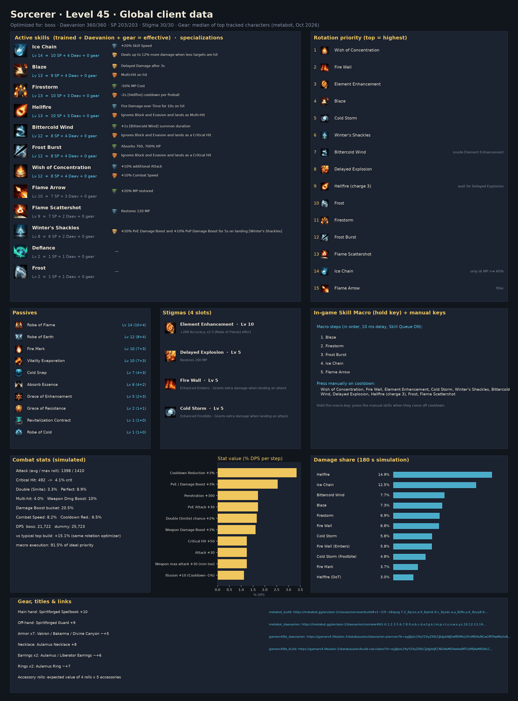

# Sorcerer — level 45 global build, rotation and macro

Generated by `aion2calc` from the global client data (metabot.gg) with Korean data as fallback. Primary view: **boss** fight (see `docs/methodology.md`). Daevanion budget **360** points.



## Damage objective: boss modeled DPS

Score: 21,722 modeled DPS.

boss: 100%, 180.0s, 21,722 DPS

Damage objective subject to the saved HP and trained-skill reserves. Balanced uses equal scenario weights. Stat weights follow the selected objective; skill shares, opener, macro and sensitivity remain primary-scenario views. This local search does not establish a global optimum or competitive PvP efficacy.

## Results

| Build | boss DPS | dummy DPS |
|---|---:|---:|
| **Optimized (this report)** | **21,722** | **25,723** |
| Typical top global build, optimized rotation | 18,873 | 22,521 |
| Typical top global build, default priority | 16,199 | — |

The optimized build is **+15.1%** over the typical top global build played with the same rotation optimizer, and **+34.1%** over that build played with the default priority. *Typical top global build* = average skill levels, the four most-picked damage stigmas and the most-picked Daevanion nodes of the top tracked global L45 players of this class (metabot.gg live data), given the best legal specializations for its levels (specs are not published).

## Rotation (priority list)

Use the highest skill that is ready; the last entry is the filler.

1. `wish`
2. `fire_wall`
3. `element_enhancement`
4. `blaze`
5. `cold_storm`
6. `winters_shackles`
7. `bittercold_wind [in_ee]`
8. `delayed_explosion`
9. `hellfire_c3 [sync_de]`
10. `frost`
11. `firestorm`
12. `frost_burst`
13. `flame_scattershot`
14. `ice_chain [mp_hi]`
15. `flame_arrow`

`[sync_de]` = wait for the Delayed Explosion vulnerability window when it is about to be ready; `[in_ee]` = prefer using it inside Element Enhancement; `[mp_hi]` = only while MP is at least 60% (weave it in, keep MP for Grace of Enhancement).

### In-game Skill Macro

**Left mouse button** is the basic auto-attack: `flame_arrow`. Hold it for continuous attacks; the Skill Macro below goes on the **right mouse button** (or another held key). Weave both together.

Settings → Key Settings → General → Skill Macro. Skill Queue (스킬 예약) **ON**, 10 ms delay on every step, hold the macro key; manual presses always take priority over the macro.

| Step | Skill |
|---:|---|
| 1 | blaze |
| 2 | firestorm |
| 3 | frost_burst |
| 4 | ice_chain |
| 5 | flame_arrow |

Manual keys (press on cooldown, in this priority): wish, fire_wall, element_enhancement, cold_storm, winters_shackles, bittercold_wind [in_ee], delayed_explosion, hellfire_c3 [sync_de], frost, flame_scattershot

Simulated: this layout reaches **91.5%** of the ideal priority list.

**Alternative — macro with manual keys**: macro fire_wall → wish → element_enhancement → cold_storm → blaze → bittercold_wind → winters_shackles → delayed_explosion → frost → firestorm → ice_chain → frost_burst → flame_arrow → flame_scattershot; manual: hellfire_c3 [sync_de]. Simulated: **89.9%** of the ideal priority list.

### Opener (first 30 s of the simulated fight)

```
wish@0.0s → fire_wall@0.6s → element_enhancement@1.5s → blaze@2.0s → cold_storm@2.3s → winters_shackles@3.2s → bittercold_wind@3.5s → delayed_explosion@3.9s → hellfire_c3@4.7s → frost@6.4s → blaze@6.9s → firestorm@7.2s → frost_burst@7.7s → ice_chain@8.2s → ice_chain@8.8s → ice_chain@9.4s → ice_chain@10.0s → ice_chain@10.7s → ice_chain@11.3s → blaze@11.9s → firestorm@12.2s → ice_chain@12.7s → ice_chain@13.4s → ice_chain@14.0s → ice_chain@14.6s → ice_chain@15.3s → ice_chain@15.9s → ice_chain@16.6s
```

## Skills, specializations and points

Skill points used **203 / 203**, stigma points **30 / 30**, Daevanion **360 / 360**.

| Skill | Trained (SP) | Effective level | Specializations |
|---|---:|---:|---|
| Ice Chain | 10 | 14 | +20% Skill Speed; Deals up to 12% more damage when less targets are hit |
| Robe of Flame | 10 | 14 | — |
| Blaze | 9 | 13 | Delayed Damage after 3s; Multi-Hit on hit |
| Hellfire | 10 | 13 | Fire Damage over Time for 10s on hit; Ignores Block and Evasion and lands as Multi-Hit |
| Firestorm | 10 | 13 | -50% MP Cost; -2s [Hellfire] cooldown per fireball |
| Frost Burst | 8 | 12 | Absorbs 700, 700% HP; Ignores Block and Evasion and lands as a Critical Hit |
| Robe of Earth | 8 | 12 | — |
| Bittercold Wind | 8 | 12 | +1s [Bittercold Wind] summon duration; Ignores Block and Evasion and lands as a Critical Hit |
| Wish of Concentration | 8 | 12 | +10% additional Attack; +10% Combat Speed |
| Vitality Evaporation | 7 | 10 | — |
| Flame Arrow | 7 | 10 | +20% MP restored |
| Fire Mark | 7 | 10 | — |
| Flame Scattershot | 7 | 9 | Restores 120 MP |
| Winter's Shackles | 6 | 8 | +20% PvE Damage Boost and +10% PvP Damage Boost for 5s on landing [Winter's Shackles] |
| Cold Snap | 4 | 7 | — |
| Absorb Essence | 4 | 6 | — |
| Grace of Enhancement | 2 | 5 | — |
| Frost | 1 | 2 | — |
| Grace of Resistance | 1 | 2 | — |
| Defiance | 1 | 2 | — |

**Stigmas**: Element Enhancement Lv 10, Delayed Explosion Lv 5, Fire Wall Lv 5, Cold Storm Lv 5

## Daevanion (360 points)


* Open in metabot planner: https://metabot.gg/en/aion-2/daevanion/sorcerer#61-0.1.2.3.5.6.7.8.9.a.b.c.d.e.f.g.k.l.m.p.r.t.u.v.w.x.y.z.10.12.13.14.15.16.19.1b.1e.1f.1i.1j.1k.1m.1o.1q.1r.1s.1t.1u.1v.1w.1y.1z.20.21.22.23.24.27.28.2b.2c.2d.2e.2f.2g_62-2.3.4.5.6.7.8.a.c.e.f.g.h.i.j.m.n.p.q.r.t.v.w.z.10.13.14.15.17.19.1a.1f.1g.1h.1i.1j.1m.1n.1o.1p.1u.1v.1y.22.24.26.27.28.29.2d.2e_63-0.1.2.5.6.7.a.b.c.d.f.h.i.k.l.m.n.o.p.r.s.u.w.z.10.13.14.15.1a.1c.1d.1e.1f.1j.1k.1l.1m.1p.1r.1s.1t.1u.1v.1w.1y.1z.21.22.23.24.25.26.29.2a.2e.2f.2g_64-1.2.3.4.a.d.g.h.j.k.l.o.q.r.s.t.u.v.x.y.z.10.11.13.14.16.17.18.19.1a.1b.1c.1d.1e.1j.1n.1q.1r.1v.1w.1y.23.26.27.28.29.2a.2b.2c.2d.2e.2f.2g.2j.2l.2m.2n.2q.2r.2u.30.31.32.33
* Open in gamers4.life planner (KR node values, same node IDs): https://gamers4.life/aion-2/database/en/daevanion-planner/?b=eyJjIjoic29yY2VyZXIiLCJkIjpbNjEwMDMzLDYxMDAzNCw2MTAwMzUsNjEwMDM3LDYxMDAzOSw2MTAwNDEsNjEwMDQyLDYxMDA0Myw2MTAwNDgsNjEwMDUwLDYxMDA1MSw2MTAwNTIsNjEwMDU0LDYxMDA1NSw2MTAwNTYsNjEwMDU4LDYxMDA2Nyw2MTAwNjgsNjEwMDY5LDYxMDA3Myw2MTAwODIsNjEwMDg2LDYxMDA4OCw2MTAwOTMsNjEwMDk0LDYxMDA5NSw2MTAwOTYsNjEwMDk3LDYxMDA5OCw2MTAxMDAsNjEwMTAxLDYxMDEwMiw2MTAxMDMsNjEwMTA4LDYxMDExNSw2MTAxMjMsNjEwMTI2LDYxMDEyNyw2MTAxMzAsNjEwMTMxLDYxMDEzMiw2MTAxMzgsNjEwMTQyLDYxMDE0Nyw2MTAxNTMsNjEwMTU0LDYxMDE1NSw2MTAxNTcsNjEwMTU4LDYxMDE1OSw2MTAxNjIsNjEwMTYzLDYxMDE2OCw2MTAxNzAsNjEwMTcxLDYxMDE3Miw2MTAxNzQsNjEwMTc4LDYxMDE4Myw2MTAxODcsNjEwMTg4LDYxMDE4OSw2MTAxOTEsNjEwMTkyLDYxMDE5Myw2MjAwMzUsNjIwMDM2LDYyMDAzNyw2MjAwMzgsNjIwMDM5LDYyMDA0MCw2MjAwNDEsNjIwMDQzLDYyMDA1MCw2MjAwNTUsNjIwMDU4LDYyMDA2Myw2MjAwNjQsNjIwMDY1LDYyMDA2Nyw2MjAwNzAsNjIwMDcxLDYyMDA3Myw2MjAwNzgsNjIwMDgwLDYyMDA4Miw2MjAwODYsNjIwMDg4LDYyMDA5NSw2MjAwOTcsNjIwMTAxLDYyMDEwMiw2MjAxMDMsNjIwMTEyLDYyMDExNCw2MjAxMTcsNjIwMTI3LDYyMDEyOSw2MjAxMzEsNjIwMTMyLDYyMDEzMyw2MjAxNDIsNjIwMTQ0LDYyMDE0NSw2MjAxNDYsNjIwMTU2LDYyMDE1Nyw2MjAxNjEsNjIwMTcxLDYyMDE3Niw2MjAxODMsNjIwMTg0LDYyMDE4NSw2MjAxODYsNjIwMTkwLDYyMDE5MSw2MzAwMzMsNjMwMDM0LDYzMDAzNSw2MzAwMzksNjMwMDQwLDYzMDA0MSw2MzAwNDgsNjMwMDUwLDYzMDA1MSw2MzAwNTIsNjMwMDU2LDYzMDA2Myw2MzAwNjQsNjMwMDY3LDYzMDA2OCw2MzAwNjksNjMwMDcwLDYzMDA3MSw2MzAwNzIsNjMwMDc5LDYzMDA4Miw2MzAwODcsNjMwMDk0LDYzMDA5Nyw2MzAwOTgsNjMwMTAxLDYzMDEwMiw2MzAxMDMsNjMwMTE4LDYzMDEyNCw2MzAxMjUsNjMwMTI2LDYzMDEyNyw2MzAxMzEsNjMwMTMyLDYzMDEzMyw2MzAxMzksNjMwMTQ3LDYzMDE1NCw2MzAxNTUsNjMwMTU2LDYzMDE1Nyw2MzAxNTgsNjMwMTU5LDYzMDE2Miw2MzAxNjMsNjMwMTcwLDYzMDE3Miw2MzAxNzQsNjMwMTc1LDYzMDE3Niw2MzAxNzgsNjMwMTg1LDYzMDE4Niw2MzAxOTEsNjMwMTkyLDYzMDE5Myw2NDAwMTgsNjQwMDE5LDY0MDAyMiw2NDAwMjMsNjQwMDM0LDY0MDAzNyw2NDAwNDEsNjQwMDQyLDY0MDA0Nyw2NDAwNDksNjQwMDUyLDY0MDA1Nyw2NDAwNjIsNjQwMDYzLDY0MDA2NCw2NDAwNjUsNjQwMDY2LDY0MDA2Nyw2NDAwNzAsNjQwMDcxLDY0MDA3Miw2NDAwNzMsNjQwMDc0LDY0MDA4MSw2NDAwODUsNjQwMDkyLDY0MDA5Myw2NDAwOTQsNjQwMDk1LDY0MDA5Niw2NDAwOTcsNjQwMDk4LDY0MDA5OSw2NDAxMDAsNjQwMTA3LDY0MDExNSw2NDAxMjIsNjQwMTIzLDY0MDEyNyw2NDAxMjgsNjQwMTMwLDY0MDEzOCw2NDAxNDcsNjQwMTUyLDY0MDE1Myw2NDAxNTQsNjQwMTU1LDY0MDE1Niw2NDAxNTcsNjQwMTU5LDY0MDE2MCw2NDAxNjEsNjQwMTYyLDY0MDE2Nyw2NDAxNzIsNjQwMTczLDY0MDE3NCw2NDAxODIsNjQwMTg0LDY0MDE4Nyw2NDAxOTcsNjQwMTk4LDY0MDE5OSw2NDAyMDJdfQ
* Full skill/stigma/Daevanion build in metabot planner: https://metabot.gg/en/aion-2/classes/sorcerer/build#v1~l19~s8xpsg.7.2_8ycxs.a.9_8yknk.9.c_8ysdc.a.a_8zfio.a.6_8zuy8.6.4_91se8.5.0_92040.7.1_927ts.8.9_93i4g.8.9_9459s.8.a_94czk.5.0_95v00.5.0_962ps.a.0_9cpww.7.0_9cxmo.8.0_9d5cg.4.0_9dd28.a.0_9dshs.4.0_9e7xc.2.0_9encw.7.0~g962ps_94czk_95v00_91se8~d61-0.1.2.3.5.6.7.8.9.a.b.c.d.e.f.g.k.l.m.p.r.t.u.v.w.x.y.z.10.12.13.14.15.16.19.1b.1e.1f.1i.1j.1k.1m.1o.1q.1r.1s.1t.1u.1v.1w.1y.1z.20.21.22.23.24.27.28.2b.2c.2d.2e.2f.2g_62-2.3.4.5.6.7.8.a.c.e.f.g.h.i.j.m.n.p.q.r.t.v.w.z.10.13.14.15.17.19.1a.1f.1g.1h.1i.1j.1m.1n.1o.1p.1u.1v.1y.22.24.26.27.28.29.2d.2e_63-0.1.2.5.6.7.a.b.c.d.f.h.i.k.l.m.n.o.p.r.s.u.w.z.10.13.14.15.1a.1c.1d.1e.1f.1j.1k.1l.1m.1p.1r.1s.1t.1u.1v.1w.1y.1z.21.22.23.24.25.26.29.2a.2e.2f.2g_64-1.2.3.4.a.d.g.h.j.k.l.o.q.r.s.t.u.v.x.y.z.10.11.13.14.16.17.18.19.1a.1b.1c.1d.1e.1j.1n.1q.1r.1v.1w.1y.23.26.27.28.29.2a.2b.2c.2d.2e.2f.2g.2j.2l.2m.2n.2q.2r.2u.30.31.32.33

For comparison, the aggregate of the most-picked nodes among top global players:


## Stat priority (simulated)

| Upgrade | DPS gain | Worth in Attack |
|---|---:|---:|
| Cooldown Reduction +3% | +3.34% | 81 |
| PvE / Damage Boost +3% | +2.55% | 62 |
| Penetration +300 | +1.71% | 42 |
| PvE Attack +30 | +1.71% | 42 |
| Double (Smite) chance +2% | +1.66% | 40 |
| Weapon Damage Boost +3% | +1.61% | 39 |
| Critical Hit +50 | +1.24% | 30 |
| Attack +30 | +1.24% | 30 |
| Weapon max attack +30 (min too) | +1.24% | 30 |
| Illusion +10 (Cooldown -1%) | +1.11% | 27 |
| Combat Speed +3% | +1.10% | 27 |
| Wisdom +10 (Double +1%) | +0.83% | 20 |
| Critical Attack +50 | +0.68% | 17 |
| Front Attack +30 | +0.64% | 15 |
| Might +10 (Attack +1%) | +0.50% | 12 |
| Destruction +10 (Attack +1%) | +0.50% | 12 |
| Back Attack +30 | +0.44% | 11 |
| Critical Damage Boost +3% | +0.41% | 10 |
| Time +10 (Combat Speed +1%) | +0.37% | 9 |
| Multi-hit chance +3% | +0.24% | 6 |
| Precision +10 (Crit +1%) | +0.10% | 2 |
| Death +10 (Crit +1%) | +0.10% | 2 |
| Perfect chance +3% | +0.01% | 0 |
| Justice +10 (Perfect +1%) | +0.00% | 0 |
| MP +300 | +0.00% | 0 |
| Freedom +10 (Accuracy +1%) | +0.00% | 0 |

Accuracy is a threshold stat (avoid parries; back attacks ignore them) and is not ranked.

## Gear, rolls, enchanting

Loadout: **Global L45 Sorcerer - median of top tracked characters (metabot, Oct 2026)**

* Main hand: Spiritforged Spellbook +10
* Off-hand: Spiritforged Guard +9
* Armor x7: Vakron / Bakarma / Divine Canyon ~+5
* Necklace: Aulamus Necklace +8
* Earrings x2: Aulamus / Liberator Earrings ~+6
* Rings x2: Aulamus Ring ~+7
* Accessory rolls: expected value of 4 rolls x 5 accessories
* Bracelets x2: Ascension +9 / Liberator +6
* Amulet: Revelation Amulet +0
* Rune: Clash Rune +2
* Attack title: Guardian of Altgard / Verteron
* Other title: Through Hell and Back
* Owned titles: collection bonuses (estimate)
* Wings: Ultimate Daeva Wings
* Primary/deity stats: profile averages

**Weapon comparison (same build & rotation):**

| Weapon | DPS | vs baseline |
|---|---:|---:|
| Spiritforged Spellbook +10 (this loadout) | 21,722 | +0.0% |
| Rupture Tome +10, average rolls | 22,320 | +2.8% |
| Rupture Tome +10, 3 best rolls | 24,204 | +11.4% |
| Ludra's Grimoire +10, average rolls | 24,954 | +14.9% |
| Ludra's Grimoire +10, 3 best rolls | 27,996 | +28.9% |

**Random-roll priority per item** (keep / reroll toward the top of each list):

* **Rupture Tome**: Damage Boost (+4.9% – +5.7%), Weapon Damage Boost (+6.5% – +7.6%), Combat Speed (+8.8% – +10.2%), Front Attack (+65 – +82), Attack (+30 – +42)
* **Ludras Grimoire**: Damage Boost (+6.3% – +7.3%), Weapon Damage Boost (+8.3% – +9.6%), Combat Speed (+11.2% – +13%), Front Attack (+83 – +102), Attack (+38 – +51)
* **Spiritforged Guard**: Might (+10 – +10), Accuracy (+30 – +30)
* **Vakron Helm**: Double Chance (+1.6% – +1.9%), Attack increase (+1.6% – +1.9%), Attack (+16 – +25), Critical Hit (+25 – +36), MP (+76 – +94)
* **Bakarma Breastplate**: Damage Boost (+4.4% – +5.2%), Attack (+18 – +28), Critical Hit (+27 – +38), Perfect Chance (+3.9% – +4.6%), MP (+83 – +102)
* **Aulamus Necklace**: Combat Speed (+3.2% – +3.8%), Attack (+23 – +33), Critical Hit (+35 – +47), Might (+9 – +17), Precision (+9 – +17)
* **Aulamus Ring**: Attack (+16 – +25), Critical Hit (+25 – +36), Might (+5 – +13), Precision (+5 – +13), Natural MP Regen (+18 – +28)

**Enchant priority** (DPS per enchant level):

* Weapon (Spiritforged / Rupture): 73.9 DPS/level
* Guard (off-hand): 44.8 DPS/level
* Revelation Amulet: 37.2 DPS/level
* Necklace / Earrings / Rings (Aulamus): 35.8 DPS/level
* Bracelets: 26.9 DPS/level
* Armor pieces: 0.0 DPS/level

## Titles, arcana, wings, pets

**Best titles by equip bonus** (global client values):

| Title | Grade | Equip bonus | Owned bonus |
|---|---|---|---|
| Unbound by Genus (Both factions) | Unique | PvE Damage Boost +4.5%, Attack Bonus +34, Critical Hit +68 | PvE Damage Boost +1% |
| Empty Closet (Both factions) | Unique | Combat Speed +3.5%, Natural HP Regen +42, Cooldown Reduction +3.5% | HP +120 |
| Guardian of Altgard (Asmodian) | Epic | PvE Damage Boost +3%, Penetration +210 | PvE Attack +4 |
| Guardian of Verteron (Elyos) | Epic | PvE Damage Boost +3%, Penetration +210 | PvE Attack +4 |
| Through Hell and Back (Both factions) | Unique | Cooldown Reduction +3%, HP +900, Stamina +225 | Block +10 |
| Scenery Collector (Both factions) | Epic | PvE Damage Boost +3.3%, Block Penetration +54 | Critical Hit +10 |
| It's Okay to Be Imperfect (Both factions) | Epic | PvE Attack +37, Critical Attack +44 | PvE Damage Boost +1% |
| Teleportation Specialist (Both factions) | Epic | PvE Accuracy +58, PvE Damage Boost +3.1% | Critical Hit +10 |
| Nice to Meet You (Both factions) | Rare | PvE Damage Boost +2.9% | PvE Defense +10 |
| Verteron Seal Breaker (Both factions) | Rare | Boss Damage Boost +2.7% | PvE Accuracy +10 |

**Arcana variant per slot** (deity stat that is worth more for this build):

* Chalice / Grail: **Vigor or Frenzy** (Time +20)
* Parchment: either variant (Life +20 / Destiny +20: no damage either way)
* Compass: **Magic or Purity** (Death +20)
* Bell: **Magic or Purity** (Destruction +20)
* Mirror: **Vigor or Frenzy** (Illusion +20)

**Arcana skill rolls.** Each arcana gives (grade base + enhancement level) random skill levels from its slot's pool — Rare 2, Legend 3, Unique 4 base rolls, +1 per enhancement level (so a Unique +5 gives 9); a skill rolled again gains another level, up to the cap. Chalice, Parchment and Compass roll active skills; Bell and Mirror roll passives.

| Arcana slot | Expected DPS, Unique +0 (4 rolls) | Expected DPS, Unique +5 (9 rolls) | Best rolls (+1 / +2) |
|---|---:|---:|---|
| Mirror | +1.2% | +2.8% | Robe of Flame +1.3% / +2.5%, Robe of Earth +0.1% / +0.2%, Vitality Evaporation +0.1% / +0.2% |
| Chalice | +0.5% | +1.1% | Robe of Flame +1.3% / +2.5%, Hellfire +0.4% / +0.6%, Ice Chain +0.2% / +0.5% |
| Parchment | +0.3% | +0.9% | Hellfire +0.4% / +0.6%, Blaze +0.2% / +0.4%, Firestorm +0.1% / +0.3% |
| Compass | +0.3% | +0.8% | Ice Chain +0.2% / +0.5%, Bittercold Wind +0.2% / +0.3%, Flame Scattershot +0.1% / +0.2% |
| Bell | +0.1% | +0.3% | Fire Mark +0.1% / +0.2%, Cold Snap +0.1% / +0.2%, Robe of Cold +0.0% / +0.0% |

Biggest single-level jumps (usually a specialization unlocking at Lv 16): Hellfire +1.3%, Robe of Flame +1.3%, Wish of Concentration +0.6%, Flame Scattershot +0.4%.

**Deity (pantheon) stats**, +10 points each (arcana main stats, Abyssal Bracelet rolls, Monolith rewards): Illusion +1.11%, Wisdom +0.83%, Might +0.50%, Destruction +0.50%, Time +0.37%, Death +0.10%, Justice +0.00%.

**Closet / appearance collection**: every unlocked skin and costume set adds permanent Collection Effect stats, and wings keep a Retention Effect once owned. The client tables for these are not public, so they are not itemised here; they are flat stats, so value them with the stat table above and collect the cheap ones first.

**Wings**: Ultimate Daeva Wings (Accuracy +40, Penetration +500) are the most used and the best launch option for damage among common wings. **Pets**: pet collection bonuses are mostly genus-specific (damage vs that monster genus) plus Accuracy/Crit; level the genus of the content you farm first.

## Robustness

Samples with no modeled damage are excluded from percentage losses.

Every animation time was randomly perturbed by up to ±25% (8 samples) and the rotation re-optimized each time. Playing the recommended priority instead of the re-optimized one lost on average **1.16%** (worst 2.30%).

**Crit curve.** The crit-chance curve is fitted to tests at Crit 1048–1326 and extrapolated down to launch values: this build sits at **4.1%** crit, and Crit +50 ranks #7 (+1.24%). If launch testing shows more crit — e.g. the curve shifted to a midpoint of 700, giving 23% — Crit +50 becomes #2 (+2.75%). Re-run with `--crit-midpoint` once real numbers exist.

## Validation against Korean logs

Simulated damage shares (training dummy) overlap **73%** with the mean of the top-10 A2DIL Korean dummy logs; 5% of the Korean damage comes from skills that are not in the global level-45 client. Korea plays above level 45 with Lv 16-20 specializations, so a perfect match is not expected; low values mean the class kit needs hand-tuning (see `kit/sorcerer.py` for a hand-written kit).

## Sources

* metabot.gg (global client): class skills, Daevanion boards, items, titles, top-player statistics
* gamers4.life (KR database): skill hit counts, build/Daevanion planners
* A2DIL (KR training-dummy logs): damage-share validation
* Inven / Bahamut damage research, aion2ssow calculator: damage formula

See `docs/methodology.md` for every formula and assumption.
