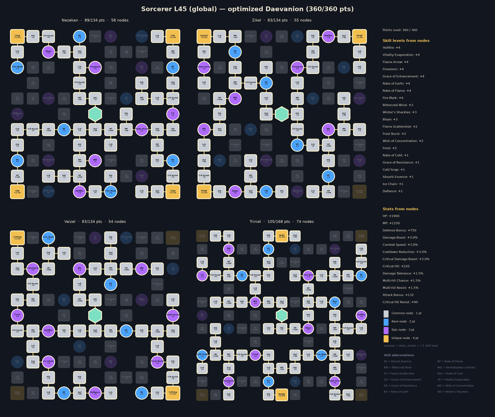

# Sorcerer · sorcerer_l45_global_median  vs  Sorcerer · sorcerer_l45_global_median

| | A | B | B vs A |
|---|---:|---:|---:|
| boss DPS | 17,962 | 18,342 | +2.1% |
| dummy DPS | 21,345 | 21,890 | +2.6% |
| Crit chance | 5.1% | 5.1% | |
| Cooldown reduction | 6.5% | 6.5% | |
| Combat Speed | 8.2% | 8.2% | |
| Attack (avg) | 1,404 | 1,410 | |
| Damage Boost bucket | 20.5% | 20.5% | |

## Build changes

| Skill | What | A | B |
|---|---|---|---|
| Cold Snap | SP level | 1 | 10 |
| Fire Mark | SP level | 9 | 10 |
| Flame Scattershot | SP level | 4 | 10 |
| Frost | SP level | 1 | 10 |
| Frost Burst | SP level | 1 | 10 |
| Grace of Enhancement | SP level | 4 | 10 |
| Winter's Shackles | SP level | 4 | 10 |
| Wish of Concentration | SP level | 7 | 10 |
| Absorb Essence | effective level | 3 | 2 |
| Cold Snap | effective level | 2 | 11 |
| Fire Mark | effective level | 13 | 14 |
| Flame Arrow | effective level | 13 | 14 |
| Flame Scattershot | effective level | 5 | 12 |
| Frost | effective level | 2 | 12 |
| Frost Burst | effective level | 2 | 12 |
| Grace of Enhancement | effective level | 6 | 14 |
| Ice Chain | effective level | 3 | 2 |
| Revitalization Contract | effective level | 3 | 1 |
| Winter's Shackles | effective level | 8 | 13 |
| Wish of Concentration | effective level | 11 | 12 |
| Flame Scattershot | specializations | — | Absorbs 500, 500% HP; Multi-Hit on hit |
| Frost | specializations | — | Restores 200 MP; -5s cooldown |
| Frost Burst | specializations | — | Absorbs 700, 700% HP; Ignores Block and Evasion and lands as a Critical Hit |
| Winter's Shackles | specializations | +20% PvE Damage Boost and +10% PvP Damage Boost for 5s on landing [Winter's Shackles] | Changes to mobile skill; +20% PvE Damage Boost and +10% PvP Damage Boost for 5s on landing [Winter's Shackles] |
| Wish of Concentration | specializations | +10% additional Attack | +10% additional Attack; +10% Combat Speed |

Daevanion: 199 nodes shared, 50 only in A, 42 only in B.

## Daevanion boards

A:

B:

## Rotation

| # | A | B |
|---:|---|---|
| 1 | `wish` | `wish` |
| 2 | `element_enhancement` | `cold_storm` |
| 3 | `fire_wall` | `element_enhancement` |
| 4 | `cold_storm` | `blaze` |
| 5 | `winters_shackles` | `winters_shackles` |
| 6 | `blaze` | `fire_wall` |
| 7 | `firestorm` | `frost_burst [sync_de]` |
| 8 | `hellfire_c3` | `firestorm` |
| 9 | `bittercold_wind [in_ee]` | `hellfire_c3` |
| 10 | `frost_burst` | `bittercold_wind` |
| 11 | `flame_scattershot` | `frost` |
| 12 | `delayed_explosion` | `flame_scattershot` |
| 13 | `flame_arrow` | `delayed_explosion` |
| 14 |  | `flame_arrow` |

## Stat weights (DPS gain per step)

| Upgrade | A | B |
|---|---:|---:|
| Cooldown Reduction +3% | +3.43% | +3.58% |
| PvE / Damage Boost +3% | +2.51% | +2.51% |
| Double (Smite) chance +2% | +1.61% | +1.61% |
| Penetration +300 | +1.61% | +1.58% |
| PvE Attack +30 | +1.61% | +1.58% |
| Weapon Damage Boost +3% | +1.55% | +1.56% |
| Critical Hit +50 | +1.49% | +1.46% |
| Attack +30 | +1.21% | +1.20% |
| Weapon max attack +30 (min too) | +1.21% | +1.20% |
| Illusion +10 (Cooldown -1%) | +1.14% | +1.19% |
| Combat Speed +3% | +1.07% | +0.90% |
| Wisdom +10 (Double +1%) | +0.80% | +0.80% |
| Critical Attack +50 | +0.69% | +0.71% |
| Might +10 (Attack +1%) | +0.49% | +0.48% |
| Destruction +10 (Attack +1%) | +0.49% | +0.48% |
| Critical Damage Boost +3% | +0.43% | +0.46% |
| Time +10 (Combat Speed +1%) | +0.36% | +0.30% |
| Multi-hit chance +3% | +0.21% | +0.21% |
| Death +10 (Crit +1%) | +0.13% | +0.13% |
| Perfect chance +3% | +0.01% | +0.01% |
| Justice +10 (Perfect +1%) | +0.00% | +0.00% |
| MP +300 | +0.00% | +0.00% |

## Damage shares

| Source | A | B |
|---|---:|---:|
| Hellfire | 18.2% | 18.0% |
| Blaze | 9.1% | 8.9% |
| Firestorm | 9.0% | 8.8% |
| Fire Wall | 8.7% | 7.9% |
| Bittercold Wind | 7.6% | 7.9% |
| Fire Wall (Embers) | 7.0% | 6.6% |
| Cold Storm | 7.0% | 6.2% |
| Cold Storm (Frostbite) | 5.8% | 6.0% |
| Fire Mark | 4.9% | 4.6% |
| Hellfire (DoT) | 3.7% | 3.6% |
| Vitality Evaporation | 3.6% | 3.4% |
| Grace of Enhancement | 2.8% | 2.9% |
| Flame Arrow | 2.5% | 2.3% |
| Blaze (delayed) | 2.5% | 2.5% |
| Flame Arrow (Burst) | 2.4% | 1.9% |
| Flame Arrow (Pyroclasm) | 1.9% | 1.9% |
