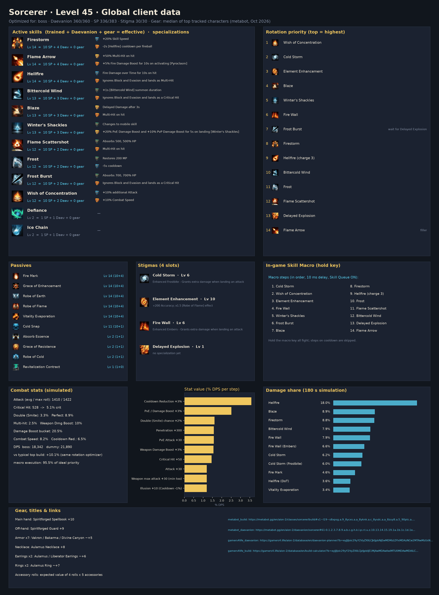

# Sorcerer — level 45 global build, rotation and macro

Generated by `aion2calc` from the global client data (metabot.gg) with Korean data as fallback. Objective: **boss** fight (see `docs/methodology.md`). Daevanion budget **360** points.



## Results

| Build | boss DPS | dummy DPS |
|---|---:|---:|
| **Optimized (this report)** | **18,342** | **21,890** |
| Typical top global build, optimized rotation | 16,666 | 20,304 |
| Typical top global build, default priority | 14,482 | — |

The optimized build is **+10.1%** over the typical top global build played with the same rotation optimizer, and **+26.7%** over that build played with the default priority. *Typical top global build* = average skill levels, the four most-picked damage stigmas and the most-picked Daevanion nodes of the top tracked global L45 players of this class (metabot.gg live data), given the best legal specializations for its levels (specs are not published).

## Rotation (priority list)

Use the highest skill that is ready; the last entry is the filler.

1. `wish`
2. `cold_storm`
3. `element_enhancement`
4. `blaze`
5. `winters_shackles`
6. `fire_wall`
7. `frost_burst [sync_de]`
8. `firestorm`
9. `hellfire_c3`
10. `bittercold_wind`
11. `frost`
12. `flame_scattershot`
13. `delayed_explosion`
14. `flame_arrow`

`[sync_de]` = wait for the Delayed Explosion vulnerability window when it is about to be ready; `[in_ee]` = prefer using it inside Element Enhancement; `[mp_hi]` = only while MP is at least 60% (weave it in, keep MP for Grace of Enhancement).

### In-game Skill Macro

Settings → Key Settings → General → Skill Macro. Skill Queue (스킬 예약) **ON**, 10 ms delay on every step, hold the macro key; manual presses always take priority over the macro.

| Step | Skill |
|---:|---|
| 1 | cold_storm |
| 2 | wish |
| 3 | element_enhancement |
| 4 | fire_wall |
| 5 | winters_shackles |
| 6 | frost_burst |
| 7 | blaze |
| 8 | firestorm |
| 9 | hellfire_c3 |
| 10 | frost |
| 11 | flame_scattershot |
| 12 | bittercold_wind |
| 13 | delayed_explosion |
| 14 | flame_arrow |

Manual keys (press on cooldown, in this priority): none — hold the macro key for the whole fight

Simulated: this layout reaches **95.5%** of the ideal priority list.

**Alternative — macro with manual keys**: macro blaze → firestorm → bittercold_wind → flame_arrow; manual: wish, cold_storm, element_enhancement, winters_shackles, fire_wall, frost_burst [sync_de], hellfire_c3, frost, flame_scattershot, delayed_explosion. Simulated: **93.0%** of the ideal priority list.

### Opener (first 30 s of the simulated fight)

```
wish@0.0s → cold_storm@0.6s → element_enhancement@1.5s → winters_shackles@2.0s → fire_wall@2.9s → blaze@3.8s → firestorm@4.4s → hellfire_c3@5.3s → bittercold_wind@7.2s → frost@8.0s → blaze@8.9s → firestorm@9.6s → delayed_explosion@10.5s → flame_arrow@11.3s → flame_arrow@12.0s → flame_arrow@12.7s → flame_arrow@13.4s → blaze@14.1s → firestorm@14.8s → flame_arrow@15.7s → flame_arrow@16.5s → flame_arrow@17.3s → flame_arrow@18.0s → blaze@18.8s → firestorm@19.5s → hellfire_c3@20.5s → bittercold_wind@22.5s → flame_arrow@23.5s
```

## Skills, specializations and points

Skill points used **336 / 383**, stigma points **30 / 30**, Daevanion **360 / 360**.

| Skill | Trained (SP) | Effective level | Specializations |
|---|---:|---:|---|
| Firestorm | 10 | 14 | +20% Skill Speed; -2s [Hellfire] cooldown per fireball |
| Fire Mark | 10 | 14 | — |
| Robe of Earth | 10 | 14 | — |
| Flame Arrow | 10 | 14 | +50% Multi-Hit on hit; +5% Fire Damage Boost for 10s on activating [Pyroclasm] |
| Robe of Flame | 10 | 14 | — |
| Grace of Enhancement | 10 | 14 | — |
| Hellfire | 10 | 14 | Fire Damage over Time for 10s on hit; Ignores Block and Evasion and lands as Multi-Hit |
| Vitality Evaporation | 10 | 14 | — |
| Bittercold Wind | 10 | 13 | +1s [Bittercold Wind] summon duration; Ignores Block and Evasion and lands as a Critical Hit |
| Winter's Shackles | 10 | 13 | Changes to mobile skill; +20% PvE Damage Boost and +10% PvP Damage Boost for 5s on landing [Winter's Shackles] |
| Blaze | 10 | 13 | Delayed Damage after 3s; Multi-Hit on hit |
| Frost Burst | 10 | 12 | Absorbs 700, 700% HP; Ignores Block and Evasion and lands as a Critical Hit |
| Flame Scattershot | 10 | 12 | Absorbs 500, 500% HP; Multi-Hit on hit |
| Frost | 10 | 12 | Restores 200 MP; -5s cooldown |
| Wish of Concentration | 10 | 12 | +10% additional Attack; +10% Combat Speed |
| Cold Snap | 10 | 11 | — |
| Robe of Cold | 1 | 2 | — |
| Ice Chain | 1 | 2 | — |
| Absorb Essence | 1 | 2 | — |
| Grace of Resistance | 1 | 2 | — |
| Defiance | 1 | 2 | — |

**Stigmas**: Cold Storm Lv 6, Element Enhancement Lv 10, Fire Wall Lv 6, Delayed Explosion Lv 1

## Daevanion (360 points)


* Open in metabot planner: https://metabot.gg/en/aion-2/daevanion/sorcerer#61-0.1.2.3.7.8.9.a.b.c.g.h.k.l.p.r.t.u.z.10.13.14.15.19.1a.1b.1c.1d.1e.1f.1g.1h.1i.1j.1k.1l.1m.1o.1p.1q.1r.1u.1v.1y.1z.20.21.22.23.24.27.28.2b.2c.2d.2e.2f.2g_62-0.1.2.7.8.9.a.b.c.e.f.g.i.j.l.m.p.q.r.s.t.u.y.z.10.11.14.16.17.19.1a.1b.1c.1g.1h.1i.1j.1k.1n.1o.1p.1r.1u.1y.21.22.24.26.27.28.29.2a.2b.2d.2e_63-0.2.5.a.b.c.e.h.i.j.k.l.m.n.o.p.r.s.t.v.w.z.10.15.16.1a.1b.1c.1d.1e.1f.1g.1h.1i.1j.1k.1l.1m.1p.1r.1s.1y.1z.21.22.26.29.2a.2b.2c.2d.2e.2f.2g_64-1.2.3.4.5.a.d.i.j.k.l.o.p.q.r.s.t.u.v.w.x.y.z.10.11.13.14.17.18.19.1a.1b.1c.1e.1f.1g.1n.1o.1p.1r.1v.1w.1x.1y.20.21.22.23.26.27.28.29.2a.2b.2c.2d.2e.2f.2g.2h.2j.2k.2l.2m.2n.2o.2r.2u.2y.32.33.34.36.37
* Open in gamers4.life planner (KR node values, same node IDs): https://gamers4.life/aion-2/database/en/daevanion-planner/?b=eyJjIjoic29yY2VyZXIiLCJkIjpbNjEwMDMzLDYxMDAzNCw2MTAwMzUsNjEwMDM3LDYxMDA0Miw2MTAwNDMsNjEwMDQ4LDYxMDA1MCw2MTAwNTEsNjEwMDUyLDYxMDA1OCw2MTAwNjMsNjEwMDY3LDYxMDA2OCw2MTAwNzMsNjEwMDgyLDYxMDA4Niw2MTAwODgsNjEwMDk3LDYxMDA5OCw2MTAxMDEsNjEwMTAyLDYxMDEwMyw2MTAxMTUsNjEwMTE4LDYxMDEyMyw2MTAxMjQsNjEwMTI1LDYxMDEyNiw2MTAxMjcsNjEwMTI4LDYxMDEyOSw2MTAxMzAsNjEwMTMxLDYxMDEzMiw2MTAxMzMsNjEwMTM4LDYxMDE0Miw2MTAxNDQsNjEwMTQ3LDYxMDE1Myw2MTAxNTcsNjEwMTU4LDYxMDE2Miw2MTAxNjMsNjEwMTY4LDYxMDE3MCw2MTAxNzEsNjEwMTcyLDYxMDE3NCw2MTAxNzgsNjEwMTgzLDYxMDE4Nyw2MTAxODgsNjEwMTg5LDYxMDE5MSw2MTAxOTIsNjEwMTkzLDYyMDAzMyw2MjAwMzQsNjIwMDM1LDYyMDA0MCw2MjAwNDEsNjIwMDQyLDYyMDA0Myw2MjAwNDgsNjIwMDUwLDYyMDA1NSw2MjAwNTgsNjIwMDYzLDYyMDA2NSw2MjAwNjcsNjIwMDY5LDYyMDA3MCw2MjAwNzMsNjIwMDc4LDYyMDA4MCw2MjAwODEsNjIwMDgyLDYyMDA4NCw2MjAwOTQsNjIwMDk1LDYyMDA5Nyw2MjAwOTksNjIwMTAyLDYyMDEwOSw2MjAxMTIsNjIwMTE0LDYyMDExNyw2MjAxMjMsNjIwMTI0LDYyMDEyOSw2MjAxMzEsNjIwMTMyLDYyMDEzMyw2MjAxMzgsNjIwMTQ0LDYyMDE0NSw2MjAxNDYsNjIwMTUzLDYyMDE1Niw2MjAxNjEsNjIwMTY4LDYyMDE3MSw2MjAxNzYsNjIwMTgzLDYyMDE4NCw2MjAxODUsNjIwMTg2LDYyMDE4Nyw2MjAxODgsNjIwMTkwLDYyMDE5MSw2MzAwMzMsNjMwMDM1LDYzMDAzOSw2MzAwNDgsNjMwMDUwLDYzMDA1MSw2MzAwNTQsNjMwMDYzLDYzMDA2NCw2MzAwNjUsNjMwMDY3LDYzMDA2OCw2MzAwNjksNjMwMDcwLDYzMDA3MSw2MzAwNzIsNjMwMDc5LDYzMDA4Miw2MzAwODQsNjMwMDkzLDYzMDA5NCw2MzAwOTcsNjMwMDk4LDYzMDEwMyw2MzAxMDgsNjMwMTE4LDYzMDEyMyw2MzAxMjQsNjMwMTI1LDYzMDEyNiw2MzAxMjcsNjMwMTI4LDYzMDEyOSw2MzAxMzAsNjMwMTMxLDYzMDEzMiw2MzAxMzMsNjMwMTM5LDYzMDE0Nyw2MzAxNTQsNjMwMTU1LDYzMDE2Miw2MzAxNjMsNjMwMTcwLDYzMDE3Miw2MzAxNzgsNjMwMTg1LDYzMDE4Niw2MzAxODcsNjMwMTg4LDYzMDE4OSw2MzAxOTEsNjMwMTkyLDYzMDE5Myw2NDAwMTgsNjQwMDE5LDY0MDAyMiw2NDAwMjMsNjQwMDI0LDY0MDAzNCw2NDAwMzcsNjQwMDQ0LDY0MDA0Nyw2NDAwNDksNjQwMDUyLDY0MDA1Nyw2NDAwNTksNjQwMDYyLDY0MDA2Myw2NDAwNjQsNjQwMDY1LDY0MDA2Niw2NDAwNjcsNjQwMDY5LDY0MDA3MCw2NDAwNzEsNjQwMDcyLDY0MDA3Myw2NDAwNzQsNjQwMDgxLDY0MDA4NSw2NDAwOTMsNjQwMDk0LDY0MDA5NSw2NDAwOTYsNjQwMDk3LDY0MDA5OCw2NDAxMDAsNjQwMTAxLDY0MDEwMiw2NDAxMTUsNjQwMTE3LDY0MDExOSw2NDAxMjMsNjQwMTI3LDY0MDEyOCw2NDAxMjksNjQwMTMwLDY0MDEzMiw2NDAxMzMsNjQwMTM0LDY0MDEzOCw2NDAxNDcsNjQwMTUyLDY0MDE1Myw2NDAxNTQsNjQwMTU1LDY0MDE1Niw2NDAxNTcsNjQwMTU5LDY0MDE2MCw2NDAxNjEsNjQwMTYyLDY0MDE2Myw2NDAxNjcsNjQwMTY5LDY0MDE3Miw2NDAxNzMsNjQwMTc0LDY0MDE3Nyw2NDAxODQsNjQwMTg3LDY0MDE5Miw2NDAxOTksNjQwMjAyLDY0MDIwMyw2NDAyMDcsNjQwMjA4XX0
* Full skill/stigma/Daevanion build in metabot planner: https://metabot.gg/en/aion-2/classes/sorcerer/build#v1~l19~s8xpsg.a.9_8ycxs.a.a_8yknk.a.c_8ysdc.a.a_8zuy8.a.5_90ptc.a.3_91se8.6.0_92040.a.c_927ts.a.9_93i4g.a.9_9459s.a.a_95v00.6.0_962ps.a.0_9cpww.a.0_9cxmo.a.0_9d5cg.a.0_9dd28.a.0_9e7xc.a.0_9encw.a.0~g91se8_962ps_95v00_94czk~d61-0.1.2.3.7.8.9.a.b.c.g.h.k.l.p.r.t.u.z.10.13.14.15.19.1a.1b.1c.1d.1e.1f.1g.1h.1i.1j.1k.1l.1m.1o.1p.1q.1r.1u.1v.1y.1z.20.21.22.23.24.27.28.2b.2c.2d.2e.2f.2g_62-0.1.2.7.8.9.a.b.c.e.f.g.i.j.l.m.p.q.r.s.t.u.y.z.10.11.14.16.17.19.1a.1b.1c.1g.1h.1i.1j.1k.1n.1o.1p.1r.1u.1y.21.22.24.26.27.28.29.2a.2b.2d.2e_63-0.2.5.a.b.c.e.h.i.j.k.l.m.n.o.p.r.s.t.v.w.z.10.15.16.1a.1b.1c.1d.1e.1f.1g.1h.1i.1j.1k.1l.1m.1p.1r.1s.1y.1z.21.22.26.29.2a.2b.2c.2d.2e.2f.2g_64-1.2.3.4.5.a.d.i.j.k.l.o.p.q.r.s.t.u.v.w.x.y.z.10.11.13.14.17.18.19.1a.1b.1c.1e.1f.1g.1n.1o.1p.1r.1v.1w.1x.1y.20.21.22.23.26.27.28.29.2a.2b.2c.2d.2e.2f.2g.2h.2j.2k.2l.2m.2n.2o.2r.2u.2y.32.33.34.36.37

For comparison, the aggregate of the most-picked nodes among top global players:


## Stat priority (simulated)

| Upgrade | DPS gain | Worth in Attack |
|---|---:|---:|
| Cooldown Reduction +3% | +3.58% | 90 |
| PvE / Damage Boost +3% | +2.51% | 63 |
| Double (Smite) chance +2% | +1.61% | 40 |
| Penetration +300 | +1.58% | 40 |
| PvE Attack +30 | +1.58% | 40 |
| Weapon Damage Boost +3% | +1.56% | 39 |
| Critical Hit +50 | +1.46% | 37 |
| Attack +30 | +1.20% | 30 |
| Weapon max attack +30 (min too) | +1.20% | 30 |
| Illusion +10 (Cooldown -1%) | +1.19% | 30 |
| Combat Speed +3% | +0.90% | 23 |
| Wisdom +10 (Double +1%) | +0.80% | 20 |
| Critical Attack +50 | +0.71% | 18 |
| Might +10 (Attack +1%) | +0.48% | 12 |
| Destruction +10 (Attack +1%) | +0.48% | 12 |
| Critical Damage Boost +3% | +0.46% | 11 |
| Time +10 (Combat Speed +1%) | +0.30% | 8 |
| Multi-hit chance +3% | +0.21% | 5 |
| Death +10 (Crit +1%) | +0.13% | 3 |
| Perfect chance +3% | +0.01% | 0 |
| Justice +10 (Perfect +1%) | +0.00% | 0 |
| MP +300 | +0.00% | 0 |

Accuracy is a threshold stat (avoid parries; back attacks ignore them) and is not ranked.

## Gear, rolls, enchanting

Loadout: **Global L45 Sorcerer - median of top tracked characters (metabot, Oct 2026)**

* Main hand: Spiritforged Spellbook +10
* Off-hand: Spiritforged Guard +9
* Armor x7: Vakron / Bakarma / Divine Canyon ~+5
* Necklace: Aulamus Necklace +8
* Earrings x2: Aulamus / Liberator Earrings ~+6
* Rings x2: Aulamus Ring ~+7
* Accessory rolls: expected value of 4 rolls x 5 accessories
* Bracelets x2: Ascension +9 / Liberator +6
* Amulet: Revelation Amulet +0
* Rune: Clash Rune +2
* Attack title: Guardian of Altgard / Verteron
* Other title: Through Hell and Back
* Owned titles: collection bonuses (estimate)
* Wings: Ultimate Daeva Wings
* Primary/deity stats: profile averages

**Weapon comparison (same build & rotation):**

| Weapon | DPS | vs baseline |
|---|---:|---:|
| Spiritforged Spellbook +10 (this loadout) | 18,342 | +0.0% |
| Rupture Tome +10, average rolls | 18,354 | +0.1% |
| Rupture Tome +10, 3 best rolls | 20,844 | +13.6% |
| Ludra's Grimoire +10, average rolls | 20,341 | +10.9% |
| Ludra's Grimoire +10, 3 best rolls | 23,783 | +29.7% |

**Random-roll priority per item** (keep / reroll toward the top of each list):

* **Rupture Tome**: Damage Boost (+4.9% – +5.7%), Front Attack (+65 – +82), Weapon Damage Boost (+6.5% – +7.6%), Combat Speed (+8.8% – +10.2%), Critical Hit (+46 – +60)
* **Ludras Grimoire**: Damage Boost (+6.3% – +7.3%), Front Attack (+83 – +102), Weapon Damage Boost (+8.3% – +9.6%), Combat Speed (+11.2% – +13%), Critical Hit (+59 – +75)
* **Spiritforged Guard**: Might (+10 – +10), Accuracy (+30 – +30)
* **Vakron Helm**: Double Chance (+1.6% – +1.9%), Critical Hit (+25 – +36), Attack increase (+1.6% – +1.9%), Attack (+16 – +25), MP (+76 – +94)
* **Bakarma Breastplate**: Damage Boost (+4.4% – +5.2%), Critical Hit (+27 – +38), Attack (+18 – +28), Perfect Chance (+3.9% – +4.6%), MP (+83 – +102)
* **Aulamus Necklace**: Critical Hit (+35 – +47), Attack (+23 – +33), Combat Speed (+3.2% – +3.8%), Might (+9 – +17), Precision (+9 – +17)
* **Aulamus Ring**: Critical Hit (+25 – +36), Attack (+16 – +25), Might (+5 – +13), Precision (+5 – +13), Natural MP Regen (+18 – +28)

**Enchant priority** (DPS per enchant level):

* Weapon (Spiritforged / Rupture): 60.3 DPS/level
* Guard (off-hand): 36.6 DPS/level
* Necklace / Earrings / Rings (Aulamus): 29.2 DPS/level
* Revelation Amulet: 28.9 DPS/level
* Bracelets: 21.9 DPS/level
* Armor pieces: 0.0 DPS/level

## Titles, arcana, wings, pets

**Best titles by equip bonus** (global client values):

| Title | Grade | Equip bonus | Owned bonus |
|---|---|---|---|
| Unbound by Genus (Both factions) | Unique | PvE Damage Boost +4.5%, Attack Bonus +34, Critical Hit +68 | PvE Damage Boost +1% |
| Empty Closet (Both factions) | Unique | Combat Speed +3.5%, Natural HP Regen +42, Cooldown Reduction +3.5% | HP +120 |
| Guardian of Altgard (Asmodian) | Epic | PvE Damage Boost +3%, Penetration +210 | PvE Attack +4 |
| Guardian of Verteron (Elyos) | Epic | PvE Damage Boost +3%, Penetration +210 | PvE Attack +4 |
| Through Hell and Back (Both factions) | Unique | Cooldown Reduction +3%, HP +900, Stamina +225 | Block +10 |
| Scenery Collector (Both factions) | Epic | PvE Damage Boost +3.3%, Block Penetration +54 | Critical Hit +10 |
| Teleportation Specialist (Both factions) | Epic | PvE Accuracy +58, PvE Damage Boost +3.1% | Critical Hit +10 |
| It's Okay to Be Imperfect (Both factions) | Epic | PvE Attack +37, Critical Attack +44 | PvE Damage Boost +1% |
| Nice to Meet You (Both factions) | Rare | PvE Damage Boost +2.9% | PvE Defense +10 |
| A Whale in a Shrimp Fight (Elyos) | Epic | Cooldown Reduction +2%, Out-of-Combat Natural MP Regen +62 | Attack Bonus +2 |

**Arcana variant per slot** (deity stat that is worth more for this build):

* Chalice / Grail: **Vigor or Frenzy** (Time +20)
* Parchment: either variant (Life +20 / Destiny +20: no damage either way)
* Compass: **Magic or Purity** (Death +20)
* Bell: **Magic or Purity** (Destruction +20)
* Mirror: **Vigor or Frenzy** (Illusion +20)

**Arcana skill rolls.** Each arcana gives (grade base + enhancement level) random skill levels from its slot's pool — Rare 2, Legend 3, Unique 4 base rolls, +1 per enhancement level (so a Unique +5 gives 9); a skill rolled again gains another level, up to the cap. Chalice, Parchment and Compass roll active skills; Bell and Mirror roll passives.

| Arcana slot | Expected DPS, Unique +0 (4 rolls) | Expected DPS, Unique +5 (9 rolls) | Best rolls (+1 / +2) |
|---|---:|---:|---|
| Mirror | +1.2% | +2.8% | Robe of Flame +1.3% / +2.5%, Vitality Evaporation +0.1% / +0.2%, Robe of Earth +0.1% / +0.3% |
| Parchment | -0.4% | +1.0% | Hellfire +0.3% / +3.1%, Blaze +0.2% / +0.4%, Firestorm +0.1% / +0.3% |
| Compass | +0.1% | +0.5% | Bittercold Wind +0.1% / +0.3%, Frost +0.0% / +0.0%, Winter's Shackles +0.0% / +0.0% |
| Chalice | +0.0% | +0.3% | Robe of Flame +1.3% / +2.5%, Hellfire +0.3% / +3.1%, Blaze +0.2% / +0.4% |
| Bell | +0.1% | +0.2% | Fire Mark +0.1% / +0.2%, Cold Snap +0.0% / +0.0%, Robe of Cold +0.0% / +0.0% |

Biggest single-level jumps (usually a specialization unlocking at Lv 16): Flame Scattershot +4.6%, Hellfire +2.8%, Wish of Concentration +2.4%, Robe of Flame +1.3%.

**Deity (pantheon) stats**, +10 points each (arcana main stats, Abyssal Bracelet rolls, Monolith rewards): Illusion +1.19%, Wisdom +0.80%, Might +0.48%, Destruction +0.48%, Time +0.30%, Death +0.13%, Justice +0.00%.

**Closet / appearance collection**: every unlocked skin and costume set adds permanent Collection Effect stats, and wings keep a Retention Effect once owned. The client tables for these are not public, so they are not itemised here; they are flat stats, so value them with the stat table above and collect the cheap ones first.

**Wings**: Ultimate Daeva Wings (Accuracy +40, Penetration +500) are the most used and the best launch option for damage among common wings. **Pets**: pet collection bonuses are mostly genus-specific (damage vs that monster genus) plus Accuracy/Crit; level the genus of the content you farm first.

## Robustness

Every animation time was randomly perturbed by up to ±25% (8 samples) and the rotation re-optimized each time. Playing the recommended priority instead of the re-optimized one lost on average **2.83%** (worst 5.11%).

**Crit curve.** The crit-chance curve is fitted to tests at Crit 1048–1326 and extrapolated down to launch values: this build sits at **5.1%** crit, and Crit +50 ranks #7 (+1.46%). If launch testing shows more crit — e.g. the curve shifted to a midpoint of 700, giving 27% — Crit +50 becomes #2 (+2.60%). Re-run with `--crit-midpoint` once real numbers exist.

## Validation against Korean logs

Simulated damage shares (training dummy) overlap **80%** with the mean of the top-10 A2DIL Korean dummy logs; 5% of the Korean damage comes from skills that are not in the global level-45 client. Korea plays above level 45 with Lv 16-20 specializations, so a perfect match is not expected; low values mean the class kit needs hand-tuning (see `kit/sorcerer.py` for a hand-written kit).

## Sources

* metabot.gg (global client): class skills, Daevanion boards, items, titles, top-player statistics
* gamers4.life (KR database): skill hit counts, build/Daevanion planners
* A2DIL (KR training-dummy logs): damage-share validation
* Inven / Bahamut damage research, aion2ssow calculator: damage formula

See `docs/methodology.md` for every formula and assumption.
