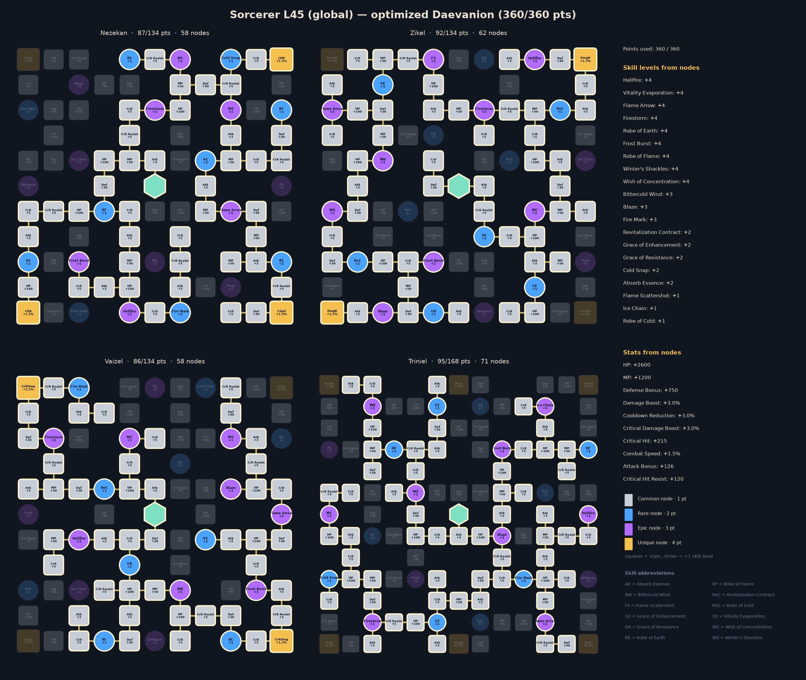

# Sorcerer · sorcerer_l45_global_median  vs  Sorcerer · sorcerer_l45_geared

| | A | B | B vs A |
|---|---:|---:|---:|
| boss DPS | 17,962 | 26,801 | +49.2% |
| dummy DPS | 21,345 | 32,000 | +49.9% |
| Crit chance | 5.1% | 11.9% | |
| Cooldown reduction | 6.5% | 10.8% | |
| Combat Speed | 8.2% | 12.7% | |
| Attack (avg) | 1,404 | 1,876 | |
| Damage Boost bucket | 20.5% | 26.0% | |

## Build changes

| Skill | What | A | B |
|---|---|---|---|
| Bittercold Wind | SP level | 10 | 9 |
| Fire Mark | SP level | 9 | 7 |
| Flame Arrow | SP level | 10 | 9 |
| Flame Scattershot | SP level | 4 | 1 |
| Frost Burst | SP level | 1 | 8 |
| Grace of Enhancement | SP level | 4 | 5 |
| Vitality Evaporation | SP level | 10 | 8 |
| Wish of Concentration | SP level | 7 | 10 |
| Absorb Essence | effective level | 3 | 4 |
| Bittercold Wind | effective level | 13 | 12 |
| Cold Snap | effective level | 2 | 3 |
| Defiance | effective level | 2 | 1 |
| Fire Mark | effective level | 13 | 10 |
| Flame Scattershot | effective level | 5 | 2 |
| Frost | effective level | 2 | 1 |
| Frost Burst | effective level | 2 | 12 |
| Grace of Enhancement | effective level | 6 | 9 |
| Grace of Resistance | effective level | 2 | 3 |
| Ice Chain | effective level | 3 | 2 |
| Robe of Earth | effective level | 14 | 17 |
| Robe of Flame | effective level | 14 | 18 |
| Vitality Evaporation | effective level | 14 | 15 |
| Wish of Concentration | effective level | 11 | 14 |
| Firestorm | specializations | +20% Skill Speed; -2s [Hellfire] cooldown per fireball | -50% MP Cost; -2s [Hellfire] cooldown per fireball |
| Frost Burst | specializations | — | Absorbs 700, 700% HP; Ignores Block and Evasion and lands as a Critical Hit |
| Hellfire | specializations | Fire Damage over Time for 10s on hit; Ignores Block and Evasion and lands as Multi-Hit | +30% Skill Speed; Fire Damage over Time for 10s on hit |
| Wish of Concentration | specializations | +10% additional Attack | +10% additional Attack; +10% Combat Speed |

Daevanion: 199 nodes shared, 50 only in A, 50 only in B.

## Daevanion boards

A:

B:

## Rotation

| # | A | B |
|---:|---|---|
| 1 | `wish` | `wish` |
| 2 | `element_enhancement` | `firestorm` |
| 3 | `fire_wall` | `cold_storm` |
| 4 | `cold_storm` | `element_enhancement` |
| 5 | `winters_shackles` | `fire_wall` |
| 6 | `blaze` | `blaze` |
| 7 | `firestorm` | `hellfire_c3` |
| 8 | `hellfire_c3` | `bittercold_wind [sync_de]` |
| 9 | `bittercold_wind [in_ee]` | `delayed_explosion` |
| 10 | `frost_burst` | `winters_shackles` |
| 11 | `flame_scattershot` | `frost` |
| 12 | `delayed_explosion` | `frost_burst` |
| 13 | `flame_arrow` | `flame_scattershot` |
| 14 |  | `flame_arrow` |

## Stat weights (DPS gain per step)

| Upgrade | A | B |
|---|---:|---:|
| Cooldown Reduction +3% | +3.43% | +2.33% |
| Critical Hit +50 | +1.49% | +2.51% |
| PvE / Damage Boost +3% | +2.51% | +2.37% |
| PvE Attack +30 | +1.61% | +1.34% |
| Penetration +300 | +1.61% | +1.34% |
| Double (Smite) chance +2% | +1.61% | +1.60% |
| Weapon Damage Boost +3% | +1.55% | +1.50% |
| Combat Speed +3% | +1.07% | +1.55% |
| Weapon max attack +30 (min too) | +1.21% | +1.07% |
| Attack +30 | +1.21% | +1.07% |
| Illusion +10 (Cooldown -1%) | +1.14% | +0.78% |
| Critical Attack +50 | +0.69% | +0.88% |
| Wisdom +10 (Double +1%) | +0.80% | +0.80% |
| Critical Damage Boost +3% | +0.43% | +0.75% |
| Destruction +10 (Attack +1%) | +0.49% | +0.54% |
| Might +10 (Attack +1%) | +0.49% | +0.54% |
| Time +10 (Combat Speed +1%) | +0.36% | +0.52% |
| Death +10 (Crit +1%) | +0.13% | +0.28% |
| Multi-hit chance +3% | +0.21% | +0.28% |
| Perfect chance +3% | +0.01% | +0.01% |
| Justice +10 (Perfect +1%) | +0.00% | +0.00% |
| MP +300 | +0.00% | +0.00% |

## Damage shares

| Source | A | B |
|---|---:|---:|
| Hellfire | 18.2% | 17.8% |
| Blaze | 9.1% | 9.4% |
| Firestorm | 9.0% | 9.3% |
| Fire Wall | 8.7% | 8.8% |
| Bittercold Wind | 7.6% | 7.3% |
| Fire Wall (Embers) | 7.0% | 6.5% |
| Cold Storm | 7.0% | 7.0% |
| Cold Storm (Frostbite) | 5.8% | 5.8% |
| Fire Mark | 4.9% | 4.5% |
| Hellfire (DoT) | 3.7% | 3.4% |
| Vitality Evaporation | 3.6% | 3.4% |
| Grace of Enhancement | 2.8% | 2.7% |
| Blaze (delayed) | 2.5% | 2.6% |
| Flame Arrow | 2.5% | 2.2% |
| Flame Arrow (Burst) | 2.4% | 1.9% |
| Flame Arrow (Pyroclasm) | 1.9% | 1.6% |
