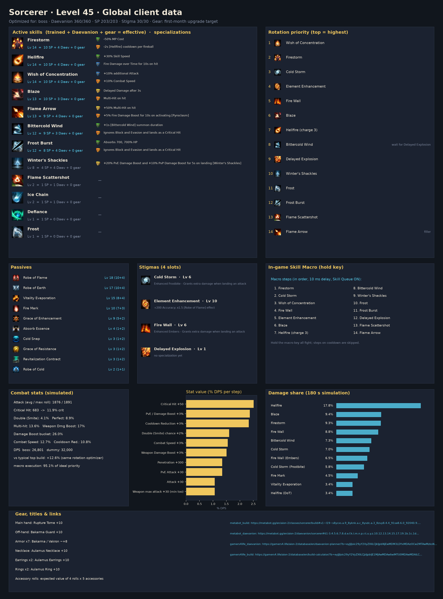

# Sorcerer — level 45 global build, rotation and macro

Generated by `aion2calc` from the global client data (metabot.gg) with Korean data as fallback. Objective: **boss** fight (see `docs/methodology.md`). Daevanion budget **360** points.



## Results

| Build | boss DPS | dummy DPS |
|---|---:|---:|
| **Optimized (this report)** | **26,801** | **32,000** |
| Typical top global build, optimized rotation | 23,809 | 28,443 |
| Typical top global build, default priority | 20,188 | — |

The optimized build is **+12.6%** over the typical top global build played with the same rotation optimizer, and **+32.8%** over that build played with the default priority. *Typical top global build* = average skill levels, the four most-picked damage stigmas and the most-picked Daevanion nodes of the top tracked global L45 players of this class (metabot.gg live data), given the best legal specializations for its levels (specs are not published).

## Rotation (priority list)

Use the highest skill that is ready; the last entry is the filler.

1. `wish`
2. `firestorm`
3. `cold_storm`
4. `element_enhancement`
5. `fire_wall`
6. `blaze`
7. `hellfire_c3`
8. `bittercold_wind [sync_de]`
9. `delayed_explosion`
10. `winters_shackles`
11. `frost`
12. `frost_burst`
13. `flame_scattershot`
14. `flame_arrow`

`[sync_de]` = wait for the Delayed Explosion vulnerability window when it is about to be ready; `[in_ee]` = prefer using it inside Element Enhancement; `[mp_hi]` = only while MP is at least 60% (weave it in, keep MP for Grace of Enhancement).

### In-game Skill Macro

Settings → Key Settings → General → Skill Macro. Skill Queue (스킬 예약) **ON**, 10 ms delay on every step, hold the macro key; manual presses always take priority over the macro.

| Step | Skill |
|---:|---|
| 1 | firestorm |
| 2 | cold_storm |
| 3 | wish |
| 4 | fire_wall |
| 5 | element_enhancement |
| 6 | blaze |
| 7 | hellfire_c3 |
| 8 | bittercold_wind |
| 9 | winters_shackles |
| 10 | frost |
| 11 | frost_burst |
| 12 | delayed_explosion |
| 13 | flame_scattershot |
| 14 | flame_arrow |

Manual keys (press on cooldown, in this priority): none — hold the macro key for the whole fight

Simulated: this layout reaches **95.1%** of the ideal priority list.

**Alternative — macro with manual keys**: macro blaze → firestorm → frost_burst → flame_arrow; manual: wish, cold_storm, element_enhancement, fire_wall, hellfire_c3, bittercold_wind [sync_de], delayed_explosion, winters_shackles, frost, flame_scattershot. Simulated: **94.6%** of the ideal priority list.

### Opener (first 30 s of the simulated fight)

```
wish@0.0s → firestorm@0.6s → cold_storm@1.6s → element_enhancement@2.5s → fire_wall@3.0s → blaze@3.8s → hellfire_c3@4.5s → firestorm@5.9s → delayed_explosion@6.9s → bittercold_wind@7.7s → blaze@8.5s → winters_shackles@9.2s → frost@10.0s → firestorm@10.9s → frost_burst@11.9s → flame_arrow@12.6s → blaze@13.3s → flame_arrow@13.9s → flame_arrow@14.6s → firestorm@15.3s → hellfire_c3@16.4s → blaze@17.8s → flame_arrow@18.5s → flame_arrow@19.2s → firestorm@19.9s → bittercold_wind@21.1s → flame_arrow@22.0s → blaze@22.7s
```

## Skills, specializations and points

Skill points used **203 / 203**, stigma points **30 / 30**, Daevanion **360 / 360**.

| Skill | Trained (SP) | Effective level | Specializations |
|---|---:|---:|---|
| Robe of Flame | 10 | 18 | — |
| Robe of Earth | 10 | 17 | — |
| Vitality Evaporation | 8 | 15 | — |
| Firestorm | 10 | 14 | -50% MP Cost; -2s [Hellfire] cooldown per fireball |
| Hellfire | 10 | 14 | +30% Skill Speed; Fire Damage over Time for 10s on hit |
| Wish of Concentration | 10 | 14 | +10% additional Attack; +10% Combat Speed |
| Flame Arrow | 9 | 13 | +50% Multi-Hit on hit; +5% Fire Damage Boost for 10s on activating [Pyroclasm] |
| Blaze | 10 | 13 | Delayed Damage after 3s; Multi-Hit on hit |
| Frost Burst | 8 | 12 | Absorbs 700, 700% HP; Ignores Block and Evasion and lands as a Critical Hit |
| Bittercold Wind | 9 | 12 | +1s [Bittercold Wind] summon duration; Ignores Block and Evasion and lands as a Critical Hit |
| Fire Mark | 7 | 10 | — |
| Grace of Enhancement | 5 | 9 | — |
| Winter's Shackles | 4 | 8 | +20% PvE Damage Boost and +10% PvP Damage Boost for 5s on landing [Winter's Shackles] |
| Absorb Essence | 1 | 4 | — |
| Grace of Resistance | 1 | 3 | — |
| Cold Snap | 1 | 3 | — |
| Revitalization Contract | 1 | 3 | — |
| Ice Chain | 1 | 2 | — |
| Robe of Cold | 1 | 2 | — |
| Flame Scattershot | 1 | 2 | — |

**Stigmas**: Cold Storm Lv 6, Element Enhancement Lv 10, Fire Wall Lv 6, Delayed Explosion Lv 1

## Daevanion (360 points)


* Open in metabot planner: https://metabot.gg/en/aion-2/daevanion/sorcerer#61-3.4.5.6.7.8.d.e.f.k.l.m.n.p.r.t.u.y.z.10.12.13.14.15.17.19.1b.1c.1d.1e.1f.1i.1j.1k.1m.1o.1p.1q.1r.1t.1u.1w.1x.1y.1z.20.21.22.23.24.27.28.2b.2c.2d.2e.2f.2g_62-1.2.3.4.7.8.9.a.b.c.d.f.g.h.i.j.k.l.m.n.o.p.q.r.u.v.y.z.10.13.14.16.17.19.1a.1b.1c.1g.1h.1i.1j.1k.1n.1o.1p.1r.1s.1t.1u.1v.1y.1z.22.24.26.27.28.29.2a.2b.2d.2e_63-0.1.2.7.a.b.c.f.h.i.k.l.o.p.r.s.u.v.w.x.y.z.10.13.14.15.1a.1c.1d.1e.1f.1g.1i.1j.1k.1l.1m.1n.1p.1t.1u.1v.1w.1y.1z.21.22.23.24.25.26.29.2a.2b.2d.2e.2f.2g_64-1.2.3.a.d.g.h.k.l.o.s.t.u.v.x.y.z.10.11.12.13.14.15.16.17.19.1a.1e.1f.1j.1l.1n.1o.1p.1q.1r.1u.1v.1w.1x.1y.20.21.22.23.25.26.27.28.29.2c.2d.2e.2f.2g.2h.2j.2k.2l.2m.2n.2o.2r.2s.2t.2u.2y.32.33.36.37
* Open in gamers4.life planner (KR node values, same node IDs): https://gamers4.life/aion-2/database/en/daevanion-planner/?b=eyJjIjoic29yY2VyZXIiLCJkIjpbNjEwMDM3LDYxMDAzOCw2MTAwMzksNjEwMDQxLDYxMDA0Miw2MTAwNDMsNjEwMDU0LDYxMDA1NSw2MTAwNTYsNjEwMDY3LDYxMDA2OCw2MTAwNjksNjEwMDcxLDYxMDA3Myw2MTAwODIsNjEwMDg2LDYxMDA4OCw2MTAwOTYsNjEwMDk3LDYxMDA5OCw2MTAxMDAsNjEwMTAxLDYxMDEwMiw2MTAxMDMsNjEwMTExLDYxMDExNSw2MTAxMjMsNjEwMTI0LDYxMDEyNSw2MTAxMjYsNjEwMTI3LDYxMDEzMCw2MTAxMzEsNjEwMTMyLDYxMDEzOCw2MTAxNDIsNjEwMTQ0LDYxMDE0Nyw2MTAxNTMsNjEwMTU1LDYxMDE1Nyw2MTAxNTksNjEwMTYxLDYxMDE2Miw2MTAxNjMsNjEwMTY4LDYxMDE3MCw2MTAxNzEsNjEwMTcyLDYxMDE3NCw2MTAxNzgsNjEwMTgzLDYxMDE4Nyw2MTAxODgsNjEwMTg5LDYxMDE5MSw2MTAxOTIsNjEwMTkzLDYyMDAzNCw2MjAwMzUsNjIwMDM2LDYyMDAzNyw2MjAwNDAsNjIwMDQxLDYyMDA0Miw2MjAwNDMsNjIwMDQ4LDYyMDA1MCw2MjAwNTIsNjIwMDU4LDYyMDA2Myw2MjAwNjQsNjIwMDY1LDYyMDA2Nyw2MjAwNjgsNjIwMDY5LDYyMDA3MCw2MjAwNzEsNjIwMDcyLDYyMDA3Myw2MjAwNzgsNjIwMDgwLDYyMDA4NCw2MjAwODYsNjIwMDk0LDYyMDA5NSw2MjAwOTcsNjIwMTAxLDYyMDEwMiw2MjAxMDksNjIwMTEyLDYyMDExNCw2MjAxMTcsNjIwMTIzLDYyMDEyNCw2MjAxMjksNjIwMTMxLDYyMDEzMiw2MjAxMzMsNjIwMTM4LDYyMDE0NCw2MjAxNDUsNjIwMTQ2LDYyMDE1Myw2MjAxNTQsNjIwMTU1LDYyMDE1Niw2MjAxNTcsNjIwMTYxLDYyMDE2Miw2MjAxNzEsNjIwMTc2LDYyMDE4Myw2MjAxODQsNjIwMTg1LDYyMDE4Niw2MjAxODcsNjIwMTg4LDYyMDE5MCw2MjAxOTEsNjMwMDMzLDYzMDAzNCw2MzAwMzUsNjMwMDQxLDYzMDA0OCw2MzAwNTAsNjMwMDUxLDYzMDA1Niw2MzAwNjMsNjMwMDY0LDYzMDA2Nyw2MzAwNjgsNjMwMDcxLDYzMDA3Miw2MzAwNzksNjMwMDgyLDYzMDA4Nyw2MzAwOTMsNjMwMDk0LDYzMDA5NSw2MzAwOTYsNjMwMDk3LDYzMDA5OCw2MzAxMDEsNjMwMTAyLDYzMDEwMyw2MzAxMTgsNjMwMTI0LDYzMDEyNSw2MzAxMjYsNjMwMTI3LDYzMDEyOCw2MzAxMzAsNjMwMTMxLDYzMDEzMiw2MzAxMzMsNjMwMTM5LDYzMDE0Miw2MzAxNDcsNjMwMTU2LDYzMDE1Nyw2MzAxNTgsNjMwMTU5LDYzMDE2Miw2MzAxNjMsNjMwMTcwLDYzMDE3Miw2MzAxNzQsNjMwMTc1LDYzMDE3Niw2MzAxNzgsNjMwMTg1LDYzMDE4Niw2MzAxODcsNjMwMTg5LDYzMDE5MSw2MzAxOTIsNjMwMTkzLDY0MDAxOCw2NDAwMTksNjQwMDIyLDY0MDAzNCw2NDAwMzcsNjQwMDQxLDY0MDA0Miw2NDAwNDksNjQwMDUyLDY0MDA1Nyw2NDAwNjQsNjQwMDY1LDY0MDA2Niw2NDAwNjcsNjQwMDcwLDY0MDA3MSw2NDAwNzIsNjQwMDczLDY0MDA3NCw2NDAwNzksNjQwMDgxLDY0MDA4NSw2NDAwODgsNjQwMDkyLDY0MDA5Myw2NDAwOTUsNjQwMDk2LDY0MDEwMCw2NDAxMDEsNjQwMTA3LDY0MDExMSw2NDAxMTUsNjQwMTE3LDY0MDExOSw2NDAxMjIsNjQwMTIzLDY0MDEyNiw2NDAxMjcsNjQwMTI4LDY0MDEyOSw2NDAxMzAsNjQwMTMyLDY0MDEzMyw2NDAxMzQsNjQwMTM4LDY0MDE0NSw2NDAxNDcsNjQwMTUyLDY0MDE1Myw2NDAxNTQsNjQwMTU3LDY0MDE1OSw2NDAxNjAsNjQwMTYxLDY0MDE2Miw2NDAxNjMsNjQwMTY3LDY0MDE2OSw2NDAxNzIsNjQwMTczLDY0MDE3NCw2NDAxNzcsNjQwMTg0LDY0MDE4NSw2NDAxODYsNjQwMTg3LDY0MDE5Miw2NDAxOTksNjQwMjAyLDY0MDIwNyw2NDAyMDhdfQ
* Full skill/stigma/Daevanion build in metabot planner: https://metabot.gg/en/aion-2/classes/sorcerer/build#v1~l19~s8ycxs.a.9_8yknk.a.c_8ysdc.a.3_8zuy8.4.4_91se8.6.0_92040.9.c_927ts.8.9_93i4g.9.9_9459s.a.a_95v00.6.0_962ps.a.0_9cpww.7.0_9cxmo.a.0_9dd28.a.0_9e7xc.5.0_9encw.8.0~g91se8_962ps_95v00_94czk~d61-3.4.5.6.7.8.d.e.f.k.l.m.n.p.r.t.u.y.z.10.12.13.14.15.17.19.1b.1c.1d.1e.1f.1i.1j.1k.1m.1o.1p.1q.1r.1t.1u.1w.1x.1y.1z.20.21.22.23.24.27.28.2b.2c.2d.2e.2f.2g_62-1.2.3.4.7.8.9.a.b.c.d.f.g.h.i.j.k.l.m.n.o.p.q.r.u.v.y.z.10.13.14.16.17.19.1a.1b.1c.1g.1h.1i.1j.1k.1n.1o.1p.1r.1s.1t.1u.1v.1y.1z.22.24.26.27.28.29.2a.2b.2d.2e_63-0.1.2.7.a.b.c.f.h.i.k.l.o.p.r.s.u.v.w.x.y.z.10.13.14.15.1a.1c.1d.1e.1f.1g.1i.1j.1k.1l.1m.1n.1p.1t.1u.1v.1w.1y.1z.21.22.23.24.25.26.29.2a.2b.2d.2e.2f.2g_64-1.2.3.a.d.g.h.k.l.o.s.t.u.v.x.y.z.10.11.12.13.14.15.16.17.19.1a.1e.1f.1j.1l.1n.1o.1p.1q.1r.1u.1v.1w.1x.1y.20.21.22.23.25.26.27.28.29.2c.2d.2e.2f.2g.2h.2j.2k.2l.2m.2n.2o.2r.2s.2t.2u.2y.32.33.36.37

For comparison, the aggregate of the most-picked nodes among top global players:


## Stat priority (simulated)

| Upgrade | DPS gain | Worth in Attack |
|---|---:|---:|
| Critical Hit +50 | +2.51% | 71 |
| PvE / Damage Boost +3% | +2.37% | 67 |
| Cooldown Reduction +3% | +2.33% | 66 |
| Double (Smite) chance +2% | +1.60% | 45 |
| Combat Speed +3% | +1.55% | 44 |
| Weapon Damage Boost +3% | +1.50% | 42 |
| Penetration +300 | +1.34% | 38 |
| PvE Attack +30 | +1.34% | 38 |
| Attack +30 | +1.07% | 30 |
| Weapon max attack +30 (min too) | +1.07% | 30 |
| Critical Attack +50 | +0.88% | 25 |
| Wisdom +10 (Double +1%) | +0.80% | 23 |
| Illusion +10 (Cooldown -1%) | +0.78% | 22 |
| Critical Damage Boost +3% | +0.75% | 21 |
| Might +10 (Attack +1%) | +0.54% | 15 |
| Destruction +10 (Attack +1%) | +0.54% | 15 |
| Time +10 (Combat Speed +1%) | +0.52% | 15 |
| Death +10 (Crit +1%) | +0.28% | 8 |
| Multi-hit chance +3% | +0.28% | 8 |
| Perfect chance +3% | +0.01% | 0 |
| Justice +10 (Perfect +1%) | +0.00% | 0 |
| MP +300 | +0.00% | 0 |

Accuracy is a threshold stat (avoid parries; back attacks ignore them) and is not ranked.

## Gear, rolls, enchanting

Loadout: **Global L45 Sorcerer - first-month upgrade target**

* Main hand: Rupture Tome +10
* Off-hand: Bakarma Guard +10
* Armor x7: Bakarma / Vakron ~+8
* Necklace: Aulamus Necklace +10
* Earrings x2: Aulamus Earrings +10
* Rings x2: Aulamus Ring +10
* Accessory rolls: expected value of 4 rolls x 5 accessories
* Bracelets x2: Abyssal Bracelet +10
* Amulet: Revelation Amulet +0
* Rune: Clash Rune +2
* Attack title: Unbound by Genus
* Defense title: Empty Closet
* Owned titles: collection bonuses (estimate)
* Wings: Ultimate Daeva Wings
* Arcana x5: Unique arcana +5 (Chalice of Vigor, Parchment, Compass of Magic, Bell of Magic, Mirror of Vigor)
* Primary/deity stats: profile averages + arcana + Abyssal rolls

**Weapon comparison (same build & rotation):**

| Weapon | DPS | vs baseline |
|---|---:|---:|
| Rupture Tome +10 (this loadout) | 26,801 | +0.0% |
| Rupture Tome +10, average rolls | 24,739 | -7.7% |
| Rupture Tome +10, 3 best rolls | 26,884 | +0.3% |
| Ludra's Grimoire +10, average rolls | 27,064 | +1.0% |
| Ludra's Grimoire +10, 3 best rolls | 30,592 | +14.1% |

**Random-roll priority per item** (keep / reroll toward the top of each list):

* **Rupture Tome**: Combat Speed (+8.8% – +10.2%), Damage Boost (+4.9% – +5.7%), Weapon Damage Boost (+6.5% – +7.6%), Front Attack (+65 – +82), Critical Hit (+46 – +60)
* **Ludras Grimoire**: Combat Speed (+11.2% – +13%), Damage Boost (+6.3% – +7.3%), Weapon Damage Boost (+8.3% – +9.6%), Front Attack (+83 – +102), Critical Hit (+59 – +75)
* **Spiritforged Guard**: Might (+10 – +10), Accuracy (+30 – +30)
* **Vakron Helm**: Critical Hit (+25 – +36), Double Chance (+1.6% – +1.9%), Attack increase (+1.6% – +1.9%), Attack (+16 – +25), MP (+76 – +94)
* **Bakarma Breastplate**: Damage Boost (+4.4% – +5.2%), Critical Hit (+27 – +38), Attack (+18 – +28), Perfect Chance (+3.9% – +4.6%), MP (+83 – +102)
* **Aulamus Necklace**: Critical Hit (+35 – +47), Combat Speed (+3.2% – +3.8%), Attack (+23 – +33), Might (+9 – +17), Precision (+9 – +17)
* **Aulamus Ring**: Critical Hit (+25 – +36), Attack (+16 – +25), Might (+5 – +13), Precision (+5 – +13), Natural MP Regen (+18 – +28)

**Enchant priority** (DPS per enchant level):

* Weapon (Spiritforged / Rupture): 78.6 DPS/level
* Guard (off-hand): 47.6 DPS/level
* Necklace / Earrings / Rings (Aulamus): 38.1 DPS/level
* Revelation Amulet: 36.0 DPS/level
* Bracelets: 28.6 DPS/level
* Armor pieces: 0.0 DPS/level

## Titles, arcana, wings, pets

**Best titles by equip bonus** (global client values):

| Title | Grade | Equip bonus | Owned bonus |
|---|---|---|---|
| Unbound by Genus (Both factions) | Unique | PvE Damage Boost +4.5%, Attack Bonus +34, Critical Hit +68 | PvE Damage Boost +1% |
| Empty Closet (Both factions) | Unique | Combat Speed +3.5%, Natural HP Regen +42, Cooldown Reduction +3.5% | HP +120 |
| Guardian of Altgard (Asmodian) | Epic | PvE Damage Boost +3%, Penetration +210 | PvE Attack +4 |
| Guardian of Verteron (Elyos) | Epic | PvE Damage Boost +3%, Penetration +210 | PvE Attack +4 |
| You're My Gem (Both factions) | Epic | Critical Hit +52, Critical Attack +39 | Natural MP Regen +5 |
| Saint of Ereshkigal (Both factions) | Unique | PvP Damage Boost +4%, Endurance Penetration +2.5%, Critical Hit +60 | PvP Accuracy +20 |
| Scenery Collector (Both factions) | Epic | PvE Damage Boost +3.3%, Block Penetration +54 | Critical Hit +10 |
| Shaking Off the World's Shackles (Both factions) | Epic | Accuracy Bonus +50, Critical Hit +50 | Penetration +20 |
| Teleportation Specialist (Both factions) | Epic | PvE Accuracy +58, PvE Damage Boost +3.1% | Critical Hit +10 |
| It's Okay to Be Imperfect (Both factions) | Epic | PvE Attack +37, Critical Attack +44 | PvE Damage Boost +1% |

**Arcana variant per slot** (deity stat that is worth more for this build):

* Chalice / Grail: **Vigor or Frenzy** (Time +20)
* Parchment: either variant (Life +20 / Destiny +20: no damage either way)
* Compass: **Magic or Purity** (Death +20)
* Bell: **Magic or Purity** (Destruction +20)
* Mirror: **Magic or Purity** (Wisdom +20)

**Arcana random skill option** (Unique arcana roll one option from the class pool when soul-bound, up to +4; simulated DPS gain on this build):

| Skill | +1 | +2 | +3 | +4 |
|---|---:|---:|---:|---:|
| Robe of Flame | +1.22% | +2.45% | +3.69% | +4.92% |
| Robe of Earth | +0.22% | +0.44% | +0.67% | +0.90% |
| Vitality Evaporation | +0.09% | +0.22% | +0.31% | +0.40% |
| Grace of Enhancement | +0.04% | +0.08% | +0.11% | +0.14% |
| Absorb Essence | +0.00% | +0.00% | +0.00% | +0.00% |

The pool holds passives only, so at level 45 an active skill still stops at Lv 14 (10 from skill points + 4 Daevanion nodes); the Lv 16 specialization options are out of reach.

**Deity (pantheon) stats**, +10 points each (arcana main stats, Abyssal Bracelet rolls, Monolith rewards): Wisdom +0.80%, Illusion +0.78%, Might +0.54%, Destruction +0.54%, Time +0.52%, Death +0.28%, Justice +0.00%.

**Closet / appearance collection**: every unlocked skin and costume set adds permanent Collection Effect stats, and wings keep a Retention Effect once owned. The client tables for these are not public, so they are not itemised here; they are flat stats, so value them with the stat table above and collect the cheap ones first.

**Wings**: Ultimate Daeva Wings (Accuracy +40, Penetration +500) are the most used and the best launch option for damage among common wings. **Pets**: pet collection bonuses are mostly genus-specific (damage vs that monster genus) plus Accuracy/Crit; level the genus of the content you farm first.

## Robustness

Every animation time was randomly perturbed by up to ±25% (8 samples) and the rotation re-optimized each time. Playing the recommended priority instead of the re-optimized one lost on average **1.86%** (worst 4.21%).

## Validation against Korean logs

Simulated damage shares (training dummy) overlap **82%** with the mean of the top-10 A2DIL Korean dummy logs; 5% of the Korean damage comes from skills that are not in the global level-45 client. Korea plays above level 45 with Lv 16-20 specializations, so a perfect match is not expected; low values mean the class kit needs hand-tuning (see `kit/sorcerer.py` for a hand-written kit).

## Sources

* metabot.gg (global client): class skills, Daevanion boards, items, titles, top-player statistics
* gamers4.life (KR database): skill hit counts, build/Daevanion planners
* A2DIL (KR training-dummy logs): damage-share validation
* Inven / Bahamut damage research, aion2ssow calculator: damage formula

See `docs/methodology.md` for every formula and assumption.
